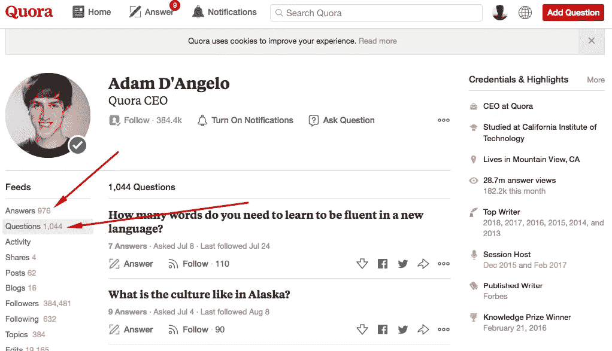
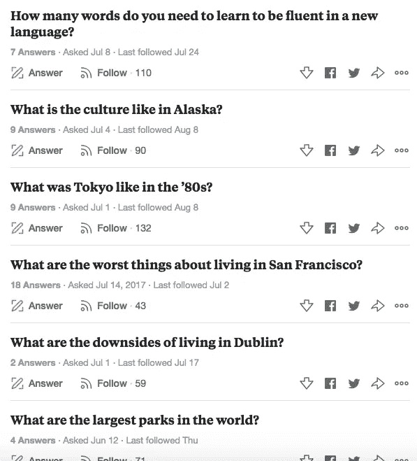
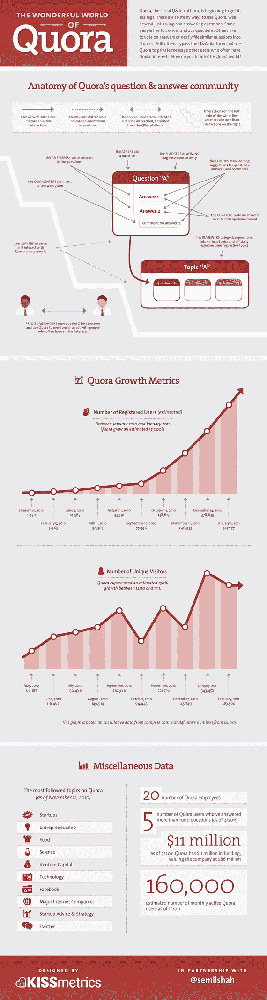

# 企业家永远不会停止努力，他也不能停止努力！

> 原文：<https://medium.com/hackernoon/entrepreneur-never-stops-hustling-and-he-mustnt-5b7ed9483b68>

## 不管是第一次创业，还是经验丰富的成功人士。


Thanks to pop-culture, whenever I think of a ghost-town, the image of a few tumbleweeds rolling in front of a tavern crops up in my head.

没人想去鬼城。满座的餐厅可能会让你咕哝和抱怨，但与你可以坐在任何一张桌子上的餐厅相比，你肯定更喜欢在那里用餐。然后，这不仅仅是关于客流量和流量，也是关于消费者对产品的感受。

所有企业都是如此。

*   你更有可能在亚马逊上购买一件评分很高的商品，即使评论是 4 分，相比之下，同一件商品有两个顾客的评分是 5 分。
*   优步将评分高的车手与自己评分高的车手配对。事实上，从司机自己承认的情况来看，如果他们的评级是好的，那么“*空闲时间*往往是在范围的低端。
*   你会从评级为 2/5 的餐厅点餐吗？

但是，我们超越了自己。当我们开展业务时，我们没有收视率，没有订单。见鬼，我们既没有供应商也没有客户。那我们该怎么办？

> “建设，他们会来”可能在某个时候是正确的，但它肯定在一段时间前就过时了。

这就是企业家努力工作的能力发挥作用的地方。众所周知，企业家总是忙忙碌碌。如果你读过任何一家*【现在众所周知】*公司是如何获得最初的关注的，你会发现一些惊人的故事。

# Reddit

reddit 的人并没有特别使用你可能称之为“道德”的东西。就像许多人会做的那样，他们创建虚假的个人资料，并使用这些个人资料来发布内容，以便给人留下一个发布大量内容的社区的印象。所以，任何路过的人都不会觉得这些都是由同一伙人发布的。史蒂夫·霍夫曼甚至承认，在社区接管之前的几个月里，他们不得不继续自己播种内容(*只是为了给主页看起来新鲜的印象*)。

# Quora

Quora 做了一些类似的事情，尽管有点不同。他们知道他们不能建立一个看起来像幽灵网站的问答系统，所以 [Adam D'Angelo](https://medium.com/u/5863e30c2943?source=post_page-----5b7ed9483b68--------------------------------) ，其他人都拉起袜子，开始自己添加问题和答案。正如德鲁·休斯顿利用 digg 推广 Dropbox 一样，Quora 的人利用 reddit 和其他资源试图让用户注意到他们正在构建的这个新平台。

# 爱彼迎

AirBnB 面临着不同的挑战。仅仅给人一种系统有内容的印象对他们的业务没有帮助。他们需要两者——供应商和消费者，虽然他们需要消费者使用他们的服务，但如果他们要继续使用服务，他们绝对需要帮助供应商赚钱。

因此，AirBnB 开始在 Craigslist 上寻找那些在平台上列出了他们的 n 床早餐的人。一旦这些人被识别出来，一封个性化的邮件就会发送给他们——从个人电子邮件 id 发送到*——向他们推荐一个令人惊叹的新平台，让他们在上面列出自己的房产。现在，这些邮件的内容很明显是由公司的某个人发送的，但它仍然有效。胜利了一半；现在剩下的就是联系平台上预订这些房产的人。*

# Dropbox

Dropbox 有一个完全不同的问题。Dropbox 通过搜索广告以大约 300 美元的价格获得新客户，其产品定价为 99 美元。自然，单位经济学对他们没有任何意义，所以他们需要采取不同的方法。现在，他们做了一些不同的事情:

1.  在 digg 上分享了一段视频，向观众解释 Dropbox 的好处。*这本身就为他们赢得了相当数量的新用户。*
2.  向任何帮助他们在社交媒体上传播 Dropbox 的人提供 150 MB 以上的额外空间。
3.  为现有用户提供越来越多的空间邀请他们的朋友使用 Dropbox。

如今，这家公司的市值超过 100 亿美元，我认为可以公平地说，德鲁公司没有做错决定。

我见过有些企业家不太愿意自己动手。他们宁愿雇佣员工或实习生来做这些繁重的工作，也不愿自己动手。虽然我不反对委派工作，但在公司的最初阶段，我总是觉得这是一种矫枉过正。在这么早期的阶段，肯定是创始人干这个的。

为什么？

1.  他们有足够的带宽自己做。
2.  他们更多地了解目标受众对其产品/服务的反馈。

但是，不要相信我。相信亚当·安吉洛。这个家伙不仅仅是最初的骗子，甚至今天还在骗人。这是亚当在 Quora 上的两张截图。



On the right you can see some of the questions Adam has asked in the past few weeks.

现在，可以提出一个论点，其中一些问题的答案可以通过快速的谷歌搜索找到，但这些问题被提出的事实表明了一些事情:

1.  这位创始人坚定而热情地相信他的平台正在为用户的生活增加价值。如果他没有，他就不会问问题，回答问题等等。至少不再是了。他处于一个非常便利的位置，拥有一个庞大的内容僵尸团队，他们会非常乐意接手这个工作。事实上，他很可能已经有了这样一个团队。
2.  他仍在用脑海中出现的问题为平台播种。我不确定它们是否总是与他的生活直接相关。但他提出这些问题是为了让 Quora 的可信观众来回答。*以这两个问题为例——“80 年代的东京是什么样子”和“在都柏林生活有什么不好的地方”。现在，虽然你在谷歌上找到的结果可能是由媒体公司和博客的内容作者创建的，但回答这些问题最相关的人应该是 80 年代在东京生活过的人，以及在都柏林生活过至少几周/几个月的人。这就是 Quora 提供的价值。大多数时候，回答问题的人是那些对所提问题有直接背景的人。*

这是一些非常古老的 Quora 统计数据的概述。



我想我的问题是:

> 如果一家公司的创始人兼首席执行官做得如此之好，却仍然在做他创业时所做的事情，那么是什么阻止了你去做你的企业需要你做的事情呢？

# 今天到此为止。明天见！


```
[**Twitter**](http://twitter.com/@abyshake) **|** [**Facebook**](http://facebook.com/abyshake) **|** [**Quora**](http://bit.ly/abyshake) **|** [**LinkedIn**](http://in.linkedin.com/in/abyshake) **|** [**E-mail**](mailto:mail@abyshake.com)
```

[](https://upscri.be/a5ccb9/)

Click here to join the mailing list