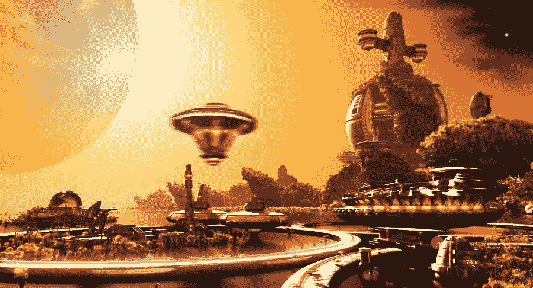

# 想象 2118 年:什么不可能的现实会变成现实？

> 原文：<https://medium.com/hackernoon/envision-the-year-2118-what-will-impossible-reality-will-become-reality-8d0a08360b29>

> “如果人工智能需要 200 年才能实现，然后最终有一本教科书解释它是如何实现的，那么这本教科书最难写的部分将是解释为什么 200 年前人们没有想到它的部分。”~约翰·麦卡锡

Futuristic enough? Image Source: [Deviantart](https://www.deviantart.com/jedgraph/art/Jupiter-colony-321556321)

> 论文的主题是“展望 2118 年:什么会成为今天不可能的现实？”是 [Mindfire Mission-2](http://www.mindfire.global) 应用的一部分。
> 这篇文章的字数限制在 1000 字以内。
> 
> 社区面临的公开挑战是展示您的版本。会很好玩的！
> 
> *以下是我的版本。*

这是一本名为“ *Cypher* ”的个人日志中典型一天的视频节选，由一位名叫[约翰·提托](http://johntitor.com/Pages/Story.html)的先生传给我。这个故事是我通过查阅他所有的笔记和日记中描述的他的人生旅程来讲述的。我选择了这个特殊的日子来讲述他的故事。

**2188 年 9 月 30 日(土卫二，土星的一颗卫星)**

(*突然一个声音响起*)你好，塞弗，我注意到你的心率出现了不寻常的峰值。塞弗被声音惊醒，走向镜子。感应到他的动作，一道引导光将 Cypher 引向镜子。他站在全身检查镜前，命令道。这个声音立刻回应道:人工心脏已经寿终正寝了，老板，是时候更换了。塞弗取出了他的人造心脏，换上了新的。镜面屏幕显示距离下一次更换大约 50 年的时间，所有功能器官的详细报告，可能发生的潜在疾病，通过体内循环的分子"*智能炸弹*采取的预防措施，纳米粒子，分子的大小，在癌细胞成为问题前几年找到并摧毁它们。所有的数据在他面前闪闪发光。他所有的静脉、动脉、整个身体，所有的一切都被扫描并绘制在一个可探索的全息模型中，以便从任何角度进行检查。

找到一种解脱，Cypher 走下楼走向厨房告诉星期五(*他的个人智能和自觉的助理*)准备早餐。老样子，他说，但是星期五准备了一些特别的东西。塞弗质疑从发现他的"*麦卡伦 65* "饮料查询周五是什么特殊场合？

**Friday……….** Image Source: [Marvel Wiki](http://marvel.wikia.com/wiki/File:Friday_(Earth-616)_from_Invincible_Iron_Man_Vol_3_1_001.jpg)

星期五回复，“*老板 124 岁生日快乐”*。塞弗意识到他在一大早引起的混乱中忘记了这件事，看着他不老的身体想知道 100 年前是什么样子，我们已经走了多远，笑着看着坐在他面前的星期五的想象(*但现实*)全息图像。星期五插播一条爆炸性新闻，“老板，第一个殖民地已经在'*比邻星 b'* 建立。这是一个了不起的成就！完全逆向工程改造大脑后最重要的”，并继续说，我已经感谢了所有的愿望，并给他们每人发了一本你最喜欢的小说“*银河系漫游指南*”，这是你今天的日程安排。塞弗为这一成就欢欣鼓舞，他想到了自己的清单，“加来道雄的*类文明”，第二类，接下来是第三类(*控制着整个星系的力量*)，心想我们真的走了很长的路！*

瞥了一眼坐在他面前的星期五的投影，他从全息显示器上大声读出了行程，“地球之旅(太空电梯)，测试原型，从事代号为‘企业号’的秘密项目，去格斗场观看最受欢迎的机器人虚拟格斗，celebrat。”，星期五打断了警告 Cypher，自动驾驶飞行出租车很快就会来这里带他去詹姆斯·柯克上尉基站。注意到迟到的惯常模式，机器人管家收拾好必需品，Cypher 赶紧上车，仍然想知道这些机器人的意识如何，以及对人工超级智能在不久的将来的可能性的恐惧。他想起了他的朋友，他是 50 年前派出的探索外星人信号的搜索队的一员。(*还是，还没收到那方面的消息。星期五告诉我有关他下落的任何消息。*

完成了所有的例行检查并为旅程扫清障碍后，塞弗想到了他在地球上的时光，这个曾经美丽的星球被它自己的人民的贪婪所毁灭。地球现在已经变得非常不适合生物生存，全球变暖，生物袭击，但幸运的是，一些不可思议的头脑，我们已经开始寻找和行动的机会，使我们的物种成为星际物种，今天可能是星际物种。这里的任务是让地球再次变得美丽和适宜居住。最大限度地利用可再生资源的最终秘密终于被破译了，如果这个秘密在几十年前被破译，就可以避免这样一场灾难性的灾难。

在到达地球并采取预防措施，以避免致命的紫外线照射，由于臭氧消耗和可居住的空气的生物恐怖分子，Cypher 走进远程办公室。他仍然对机器人和人类的串联感到惊讶，并真正欣赏“*智能增强*”，并肩工作。如果没有这些机器人的帮助，他无法想象任何人能够建造如此高的建筑，并使火星、木星的卫星和土星成为一个可居住的地方。Cypher 连接了超快速互联网络，从隐形眼镜、耳机等，无处不在。他认为一个世纪前，大公司使用高速计算机来训练深度[学习](https://hackernoon.com/tagged/learning)模型，现在每个人都有自己的超级计算机，存储容量比当年的典型数据中心大小多几个数量级。回想他在地球上的时光，很多事情都变了，而且变得越来越好。今天，我们拥有一切更酷的东西，飞行出租车，隐形眼镜互联网，人工器官，DNA 提取器，人工有机体，自我意识机器人，不老的身体，太空电梯，运行所有这些天文时间任务的量子计算机超快，芯片比周围的整个数据中心都快，家用机器人，让人们想起阿波罗任务的时代的 III 型文明，互联网，专家系统，人工智能，机器人，深度学习，第一个人工器官，星际探索，今天一切都在一块玻璃(屏幕)上。所有这些幻想都在逐渐变成现实。的确，很多事情已经发生了变化，而且在未来几代人的时间里还会继续变化。

> ***谓想象力比知识更重要。因为知识是有限的，而想象力包容了整个世界，刺激了进步，催生了进化。***
> 
> (星期五补充:显然她是粉丝！​ )

> 正如布鲁诺·贝特尔海姆在《论魅力的用途》中所观察到的，“如果我们希望不只是从一个时刻到另一个时刻生活，而是真正意识到我们的存在，那么我们最大的需要和最困难的成就就是找到我们生活的意义。”
> 
> 经过漫长而疲惫的一天，他的大脑而不是身体感到疲惫，他想知道他生活的真正目的是什么。
> 
> *生日快乐！~从周五*

(这标志着我的一天结束了，同样的想法在我的脑海中流动，这个日记是在星期五的帮助下记录我的想法的方式，星期五通过将这些想法写在日记中来完成所有繁重的工作。)

**启发这个故事的事情:**加来道雄《2030 年的世界》，雷·库兹韦尔预言，罗德尼·布鲁克斯预言，托尼·斯塔克，深度学习，人工智能，AGI，ASI，机器人，人造器官，生物技术，纳米技术，她的电影，星际迷航，杰克·克拉克从时事通讯中导入人工智能的故事，摩尔定律，埃隆·马斯克，马克斯·泰格马克生命 3.0，尼克·博斯特罗姆超级智能，脑机接口，量子计算机，星际旅行。

如果你喜欢我的文章，**请砸了👏下面你喜欢多少次文章** ( *剧透* *预警:50 是*极限，我试过了！所以其他人会在媒体上看到这个。

如果你有任何想法，意见，问题，欢迎在下面评论。另外，别忘了贴上你文章的链接，我很乐意阅读。