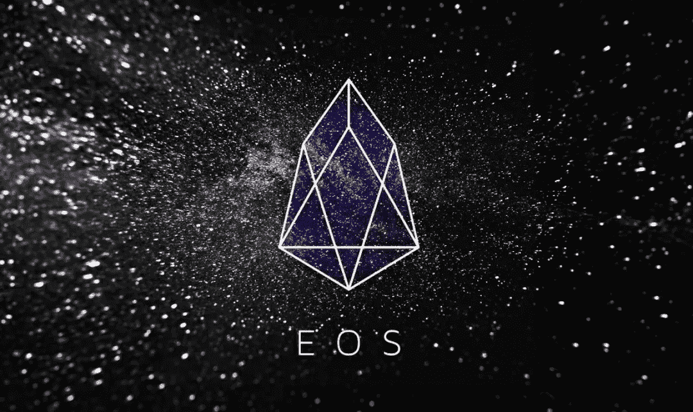
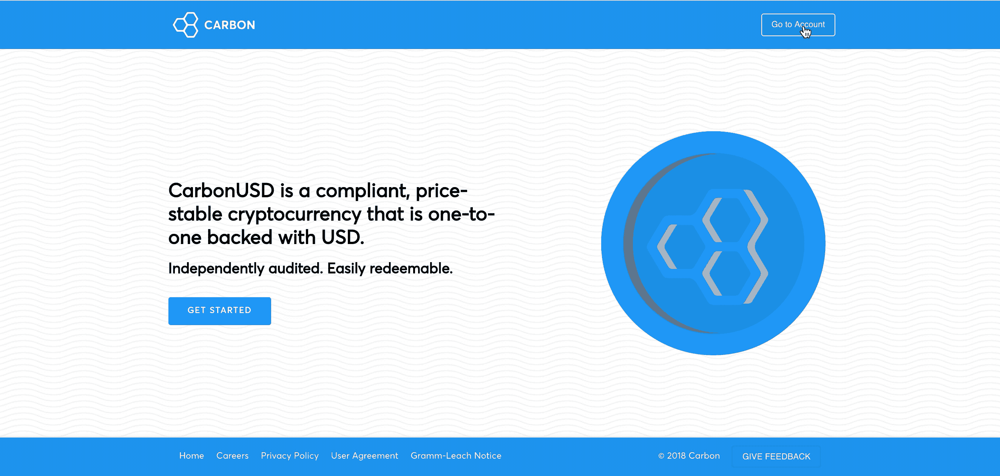

# EOS 开发启动指南

> 原文：<https://medium.com/hackernoon/eos-development-startup-guide-2cc079d941c6>

## 我为碳 12 实验室设计了分布式账本产品，在过去的一个月里，我有幸与常驻的碳黑客们一起构建并部署了一个 EOS stablecoin。

让我们开门见山:我相信 [EOS](https://eos.io/) 是开发者的天堂🏝我想帮助其他开发人员和技术人员了解 EOS，以及为什么它是开发和部署分散式应用程序的绝佳环境。

保罗·格拉厄姆，一个演讲的魔术师和企业家的密语者，曾经说过:“*伟大的黑客倾向于聚集在一起*”和“*像所有的工匠一样，黑客喜欢好的工具。事实上，这是一个保守的说法。优秀的黑客发现使用糟糕的工具*是难以忍受的，我非常同意这一对说法。EOS 是像以太坊一样的分布式、信任最小化的计算机，但它在性能和定制方面为开发人员提供了出色的体验。如果开发人员的流动遵循一个向具有更好的“开发人员 UX”的工具的梯度，那么我预测 EOS 将继续积累来自其他平台的智能合同开发人员。

Real time footage of ETH devs migrating to EOS

**我写这篇指南的动机也就是一切都坏了，没有人能帮我:**

在构建我们的[以太坊入口智能合约](https://www.coindesk.com/carbon-becomes-latest-startup-to-launch-a-dollar-pegged-stablecoin)时，我忽略了同时编写入职指南。这让我在调试运行时问题时变得更加困难，因为我是唯一一个能够快速解决问题的人。没有快速的方法来教育另一个开发者以太坊智能合约是如何工作的，以及如何使用所有相关的工具。查看可靠性合同很容易，但是祝你好运，建立你的环境。

**问题:我们说的不是同一种语言！**

开发智能合约与构建“集中式”软件应用程序非常相似，但是需要了解一些新的强大功能。首先，什么是区块链，为什么我不能随时更新我的代码？为什么我需要一个帐户来与合同进行交互？MetaMask 到底是什么？

就个人而言，我发现以下主题对于传统开发人员来说是新的:

*   "**智能合约** ": *不可变的软件，存储在分布式分类帐中。契约做它们的代码告诉它们去做的事情。*
*   "**契约不变性** ": *不容易(或者免费！)在部署后更改代码*
*   **分布式账本** : *没有人拥有，任何人都可以访问的数据库。可能基于区块链或达格(达格是一个完全不同的兔子洞，你应该掉下去*🐰 *)*
*   **“分布式信任最小化计算平台**”:*像一台计算机，但建立在分布式账本上。*
*   "**可升级性** ": *在部署之前，需要考虑升级已部署合同的策略，否则您会烧光$$*
*   "**帐户、地址、公钥、私钥** ": *您需要帐户来与智能合约进行交互*
*   "**交易** ": *要“调用”一个智能合约功能，你需要写并签署一个交易，证明你是发送方——就像蜗牛邮件一样！通常，您需要在数据包中包含一些$$来促使邮件发送得更快；)*

…这个清单实际上很长，我花了相当长的时间才直观地理解以太坊是如何工作的。此外，这个领域发展非常快，即使有丰富的以太坊经验，学习在 EOS 上开发也很有挑战性。

因此，本指南的目标是成为一个一站式、开源的指南，学习 EOS 如何工作以及如何在其上建立合同。至少，我希望在浏览完本指南后，你能够提出关于堆栈溢出或 Reddit :D 的更好的调试问题

**“EOS 启动指南”涵盖的内容:**

1.  什么是“分散式”信任最小化计算机？
2.  EOS 的目标是什么？
3.  EOS 帐户、权限和密钥
4.  EOS 网络资源:CPU、RAM、网络
5.  从源头安装和构建
6.  EOS CLI 工具:cleos、nodeos、keosd
7.  EOS 智能合约:从 C++到 WASM 再到 ABI
8.  EOS 智能合同架构模式
9.  部署:本地节点、测试网络和主网络
10.  有用的开发工具:块浏览器、钱包、资源计算器
11.  EOS dApps: eosJS +散点
12.  测试
13.  可升级性
14.  安全性
15.  团体

**我第一次搭建部署后的 EOS 论文:**

我看好 EOS，因为网络速度快，应用程序可以按需购买计算资源。代替交易费，应用程序以股份 EOS 的形式缴税。税收模式与收费模式相比，为开发人员提供了更好的管理应用费用的控制，并且使 mainnet 合同的测试免费:)。需要处理更多交易？把 EOS 押在 CPU 上。需要处理较大的交易？网上赌注。需要更多内存？买 Ram。Eos 比以太坊有更好的“开发者 UX ”,从历史上看，“跟随开发者”是个好主意。

二。EOS 将以非线性的方式吸引最优秀的黑客:“伴随着有趣的问题，优秀的黑客喜欢的是其他优秀的黑客。伟大的黑客倾向于聚集在一起。所以你不会吸引优秀的黑客与你为他们创造的环境有多好成线性比例。聚集的趋势意味着它更像是环境的正方形。所以赢家通吃。在任何时候，黑客最想去的地方都只有 10 到 20 个，如果你不在其中，伟大的黑客就不只是少了，而是一个都没有。”[“伟大的黑客”——保罗·格拉厄姆](http://www.paulgraham.com/gh.html)

三。**你不能叉社区**。EOS 社区充满热情，非常乐于助人，欢迎新来者。我参加了最近在旧金山举行的 EOS 黑客马拉松，简而言之，这是一场狂欢。

 [## EOS SF 黑客马拉松–2018 年 11 月

### 作为这次黑客马拉松的导师是我的荣幸。在旧金山是一个提醒，旧金山是国王…

medium.com](/@bensig/eos-sf-hackathon-november-2018-f9d9be253edb) 

# [**🔮链接到此处**](https://docs.google.com/document/d/1VUiMieQjdZlQlgqNbDjrTeqpdotdxED_N7GGMy6gLQs/edit?usp=sharing) **🏂**

我写这个指南的时候正在构建我们的 [EOS 智能合同](https://www.coindesk.com/carbons-stablecoin-can-now-be-swapped-between-eos-and-ethereum-blockchains)，我们刚刚**在本周**发布了这个合同！在 [fiat.carbon.money](http://fiat.carbon.money) 和我们的 [live token](https://bloks.io/account/stablecarbon) 查看我们的新多币种钱包

Connect to EOS, buy CUSD-EOS, trade it, redeem it

**特别感谢以下 EOS 社区成员对您的指导:**

*   萨姆·卡泽米安、马赫博德·莫格达姆和其他 Everipedia 团队成员
*   理查德·迪尤恩(又名:里克托巴克)
*   NSJames 和分散小组