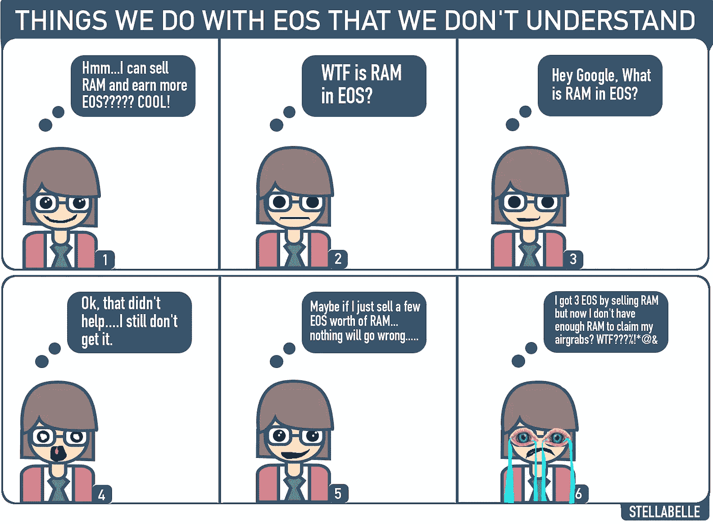

# 白痴的 EOS:BancorX

> 原文：<https://medium.com/hackernoon/eos-for-idiots-bancorx-e9504759ec60>

# 欢迎阅读名为《白痴的 EOS》的全新系列的第一篇文章。

这个系列的目标是让 EOS 真正容易理解。我想让每个人都能理解 EOS 是如何工作的。

这种格式可以根据 EOS 新手的反馈进行改进，但是现在，每篇文章将在最开始包含一个简单的摘要。这将确保即使是最浅显的读者也能很快抓住主题的要点。

这个系列的另一个小目标是在不引起偏头痛的情况下给出关于 EOS 的信息。大多数关于 EOS 的文章最终只给了人们两件事:困惑和偏头痛。

EOS 是复杂的，白痴 EOS 系列早就该推出了。在这个系列中，像算法这样的词，会像瘟疫一样被避免。99%的人都不知道什么是算法，所以我会用数学这个词来代替算法(只要有可能)。此外，您将永远看不到本系列中包含的任何计算机代码。

当我发现一个解释概念做得更好的视频时，它将被链接到文章的开头，就在摘要之后。为(希望)没有偏头痛的 EOS 文章的未来干杯，感谢您阅读*白痴 EOS*系列的第一篇文章。

# BancorX

网址:[https://EOS . bancor . network/](https://eos.bancor.network/)
电报:[https://t.me/bancor](https://t.me/bancor)

## 如何使用 BancorX:

1.  得到散点桌面:[https://get-scatter.com/](https://get-scatter.com/)
2.  前往[https://EOS . bancor . network/](https://eos.bancor.network/)
3.  决定你想出售和购买哪些代币。
4.  按下一步和继续按钮进行交易。
5.  按下分散中的接受按钮，您就完成了！

## BancorX 上有哪些 EOS 令牌可以兑换？

CET，HORUS，DEOS，IQ，LUME，MEETONE，MBC，COAT，PGL，HVT，KARMA，FBX，EPRA，DICE，BLACK

## BancorX 解决什么问题？

[BancorX](https://eos.bancor.network/) 解决了人们无法在 EOS 上即时买卖较小代币的问题。BancorX 之所以能够做到这一点，是因为它不依赖于买家和卖家。相反，math 用于使任何令牌销售者能够在 EOS 生态系统中立即将一个令牌转换为另一个令牌。

较小的代币和交易所缺乏买家和卖家。因为交易所必须匹配想要从卖方购买特定代币的确切数量的买方，这导致代币不太具有流动性。流动性只是指代币快速买卖的能力。如果卖家必须等上三天才有买家出现，那么代币的用处就降低了。

## BancorX 能够解决这个问题，让买家不再需要与卖家匹配。

在 Bancor，没有匹配的人。Bancor 使用智能合约和数学来创建一个将一个令牌转换为另一个令牌的公式。我不打算深究这个复杂的过程是如何完成的，因为这不符合*白痴 EOS*的精神。如果你想更深入地了解 Bancor 的数学是如何工作的，你可以深入研究。据我所知，BancorX 上的令牌转换是通过智能合约和中继实现的。

***“等一下。这篇文章的标题是 BancorX，但你一直提到 Bancor…..Bancor 和 BancorX 有什么区别？”***

Bancor 目前正在以太坊网络上创建 ERC-20 代币之间的转换。BancorX 现在在 EOS 网络上运行，加上跨链转换现在是可能的。这意味着您可以将 ERC-20 令牌转换为 EOS 基本令牌。BancorX 是兼容 EOS 的代币交易所，例如，您可以将您的黑色代币立即转换为 KARMA 代币。

## 关于 Bancor 的更多信息:

## 现在是漫画:

## 关于我们

Stellabelle 最近加入了 GenerEOS 团队。 [GenerEOS](https://www.genereos.io/) 是一家社会企业砌块生产候选企业，其使命是促进和支持可扩展且高度可靠的砌块生产，同时回馈社会事业。

GenerEOS 总部位于澳大利亚悉尼，由一群志同道合的区块链爱好者组成，他们有着不同的背景，热衷于改变世界，并通过回馈培养慷慨的精神。

订阅[GenerEOS 媒体出版物](https://medium.com/genereos)以阅读更多关于*白痴 EOS*系列的内容，并随时了解 EOS 的最新动态。

**给予的未来**

[**网站**](https://www.genereos.io)[**Twitter**](https://twitter.com/GenerEOSAus)[**Steem**](https://steemit.com/@genereos)[**电报**](https://t.me/generEOS)[**Reddit**](https://www.reddit.com/user/GenerEOS)[**Github**](https://github.com/generEOS)