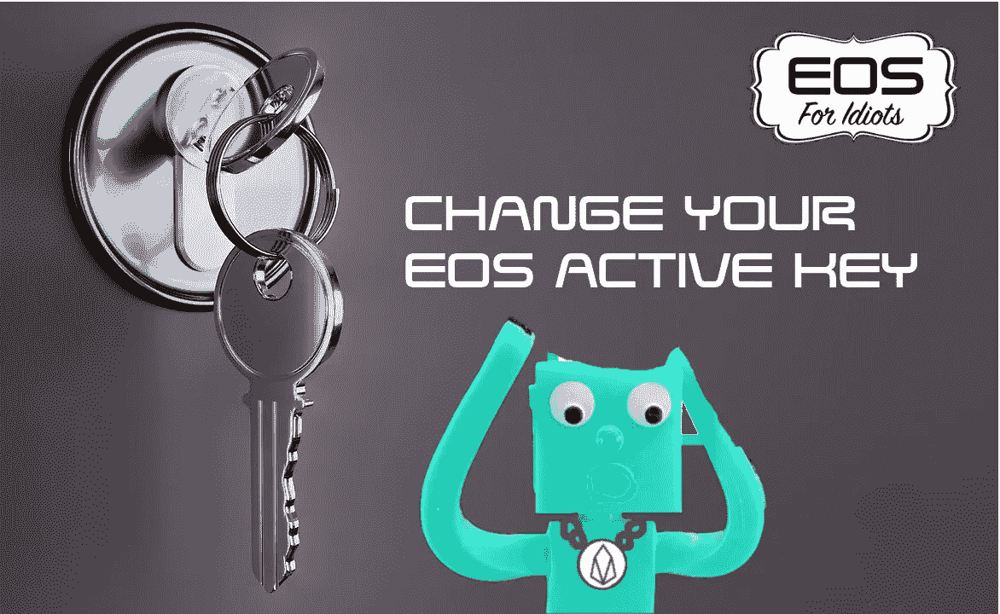
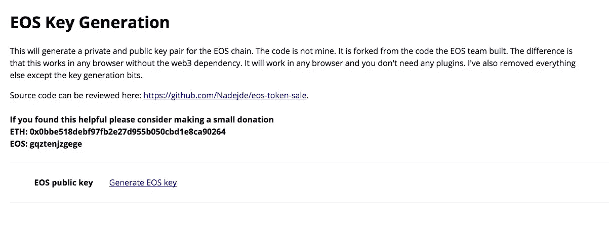
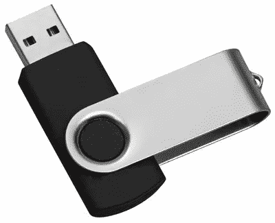
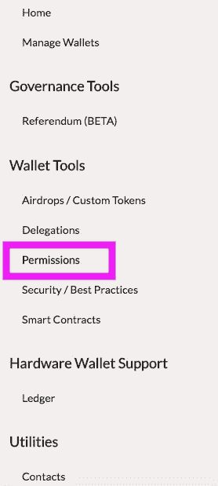
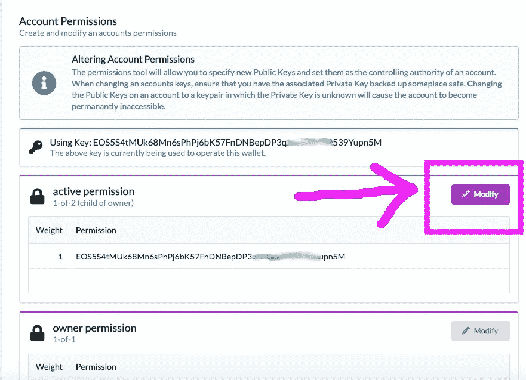
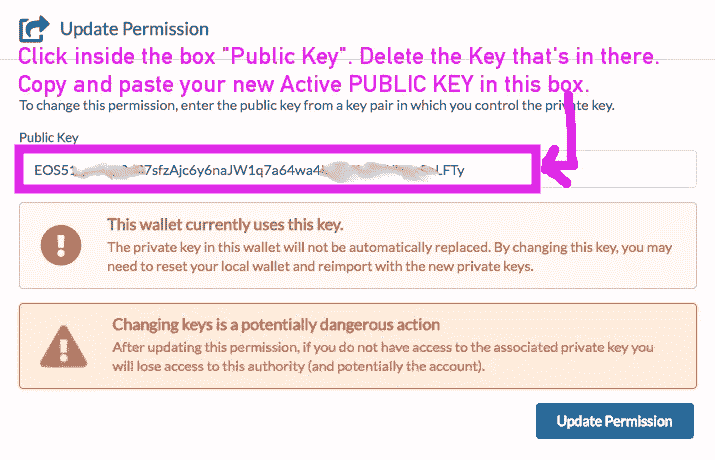

# 白痴的 EOS:如何使用 Greymass 改变你的 EOS 激活键

> 原文：<https://medium.com/hackernoon/eos-for-idiots-how-to-change-your-eos-active-key-using-greymass-38760d3282b9>

## 你们很多人都在同一条船上:你有一个 EOS genesis 快照帐户，这意味着你的所有者密钥与你的活动密钥相同。您现在已经了解到这是一个漏洞。

我使用下面的步骤成功地更改了我的活动密钥，现在许多人都在询问这个信息。

现在你想要安全，你想要一个新的活动密钥。本教程将向您展示如何创建一个新的活动密钥对，并使用 Greymass wallet 更新它。您的所有者密钥保持不变。我们所做的就是添加一个新的活动密钥，这样你的帐户就有两个不同的密钥:一个用于你的所有者密钥，另一个用于你的活动密钥。

## 第一步:生成新的活动密钥对

通过这里生成一个新的密钥对:[https://nadejde.github.io/eos-token-sale/](https://nadejde.github.io/eos-token-sale/)
这将创建一个新的公钥和私钥对。这将是您新的活动密钥对。当您创建新的密钥对时，您可以在访问本网站后，通过关闭您的互联网连接来离线完成。即使不在线，它也会生成密钥对。这样更安全。

## 第二步:保存新的活动密钥对

您新的活动密钥对由一个公钥(以‘EOS’开头)和一个私钥组成。

将这两份文件保存在 u 盘(usb)上的文本文件中，并打印一份。如果可能的话，在几个闪存驱动器上保存。别弄丢了。

## 第三步:更改 Greymass 钱包中的活动密钥

现在，您已经准备好使用 Greymass 钱包更改您的有效密钥:[https://github.com/greymass/eos-voter](https://github.com/greymass/eos-voter)

A.打开你的名为 EOS Voter 的 Greymass 钱包，解锁你的钱包。
B .点击顶部的工具按钮。
C .点击钱包工具部分的权限。

单击活动权限下的修改。

在“公钥”框中，单击那里。删除现有的密钥，然后复制并粘贴您刚刚生成的新的活动公钥。你的公钥放在那个盒子里。不是你的私人钥匙！重复:将新生成的活动公钥粘贴到该框中，而不是您的私钥。

在确保安全地存储了生成的公钥和私钥对之后，可以单击更新权限。这一步是不可逆的，所以在执行这一步之前，请确保您已经保存了活动密钥对。

这将发送更新的活动密钥许可到 EOS 区块链，它现在已经改变。在区块链上检查以确保它在那里。现在，您的帐户将拥有与您的所有者密钥不同的活动密钥。您的所有者密钥保持不变，您没有更改它。你所做的唯一一件事就是把你的激活键换成了另一个。因此，在做这些之前，您必须确保您已经安全地保存了您的所有者公钥和私钥。

## 确保您的帐户可以使用您刚刚更改的新激活密钥。

将新的活动密钥加载到 Scatter 或其他一些移动 EOS 钱包中。使用一个 Dapp 与您的活动密钥，只是为了确保它都工作。请确保您已经保存了您帐户的所有者和有效密钥。现在你有两个不同的密钥对，一组是你的所有者密钥，另一组是你的激活密钥。你总共有 4 把钥匙。确保你把这些都存在 u 盘里。

您需要所有者密钥和活动密钥不同的原因是，如果有人窃取了您的活动密钥(您经常使用)，您可以将此密钥更改为不同的密钥，并保留您的资金。如果有人偷了你的钥匙，你就完了。

因此，一旦您确认您的活动密钥适用于您的帐户，并且确保您拥有自己的所有者密钥(公共和私人)和活动密钥(公共和私人)，您就可以开始仅使用您的活动密钥加载钱包，并保持您的所有者密钥离线存储。只有在需要再次更改当前密钥时，才需要使用所有者密钥。

这段视频中有很多对本文有用的 noob 建议:[https://youtu.be/Yx_YduAgmY0](https://youtu.be/Yx_YduAgmY0)

## 关于我们

GenerEOS 是一个社会企业砌块生产候选人，其使命是促进和支持可扩展和高度可靠的砌块生产，同时回馈社会事业。
GenerEOS 总部位于澳大利亚悉尼，由一群志同道合的区块链爱好者组成，他们有着不同的背景，热衷于改变世界，并通过回馈培养慷慨的精神。

订阅[GenerEOS 媒体出版物](https://medium.com/genereos)，了解 EOS 的最新动态。

请记得投票给 aus1genereos，这样我们可以继续努力为 eos 社区增加价值。谢谢大家！

**给予的未来**

[**网站**](https://www.genereos.io)[**Twitter**](https://twitter.com/GenerEOSAus)[**Steem**](https://steemit.com/@genereos)[**电报**](https://t.me/generEOS)[**Reddit**](https://www.reddit.com/user/GenerEOS)[**Github**](https://github.com/generEOS)