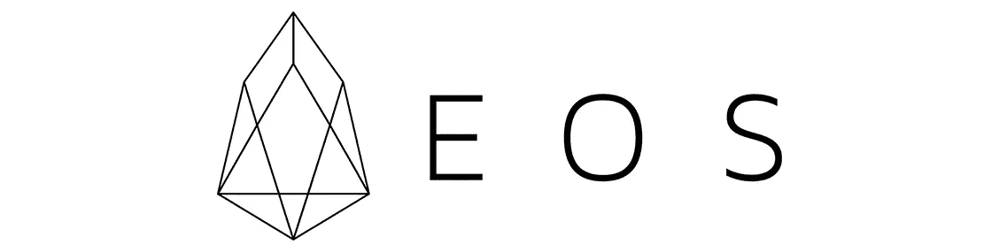

# EOS —基础分析和 Mainnet 发布

> 原文：<https://medium.com/hackernoon/eos-fundamental-analysis-mainnet-release-f1d7661e8baf>

我们离 EOS ICO 发布日期已经接近 12 个月了，而 EOS 的 mainnet 发布也只有 10 天了。许多人吹捧该协议具有巨大的潜力，可以成为去中心化应用和[智能合约](https://lunardigitalassets.com/insights/2018/analysis-smart-contract-platforms-part-1/)的首要区块链 3.0 平台。它是一个去中心化的自治公司，建立它们，托管它们，并管理它们。据它的共同创始人丹·拉里默说，与许多其他区块链 3.0 协议一样，它是从头开始构建的，考虑到了可扩展性和每秒处理数百万次交易的能力。EOS 是 2017 年众多 ico 中的一员，当[在时代广场](https://steemit.com/eos/@matt-a/eos-billboard-is-live-in-times-square-in-new-york)做广告时，它当然试图发表声明。

发布名称分别为黎明 1.0(2017 年 9 月 14 日)、黎明 2.0(2017 年 12 月 4 日)和黎明 3.0(2017 年 4 月 5 日)，可以肯定的是，该团队以希腊泰坦巨人和黎明女神[命名，她每天早上从俄刻阿诺斯边缘的家中醒来。](https://en.wikipedia.org/wiki/Eos)不过，根据官方 EOS [FAQ](https://eos.io/faq) 显示，这个名字并没有官方的起源故事。

Eos by Evelyn De Morgan

根据 blockgeeks.com 的说法，两个“真正抓住了公众的想象力”的主要说法是该协议完全取消交易费的能力(这由 dapp 开发者决定)，以及每秒能够进行数百万次交易。根据 Coin Central 的说法，[另一个巨大的价值主张将是其 dapp 开发套件，即类似操作系统的服务套件。这两者都有助于开发人员的采用，从而有望导致用户的采用。](https://coincentral.com/what-is-eos/)

协议是什么时候发布的？让 EOS 独一无二的一句台词是什么？处于发展的哪个阶段？与其它区块链 3.0 协议相比，它目前处于什么地位？

EOS 背后的一个关键概念是它支持分散式应用程序和促进 dapps 开发的能力。EOS 网络与以太坊网络的不同之处在于，开发者可以用更多的语言来构建 dapps。根据 boxmining 的说法，它还为用户提供数据库管理或账户管理工具，而在以太坊，开发者必须从头开始创建这些应用。

EOS 目前在 CoinMarketCap 上的总市值(98.4 亿美元)排名第五。它的交易价格为 11.24 美元，相比之下， [ADA(以 0.21 美元排名第七)和 NEO(以 54.21 美元排名第十一)。](https://lunardigitalassets.com/insights/2018/cardano-fundamental-analysis-and-overview/)

# EOS 背后的哲学是什么？

EOS 围绕可伸缩性而不是分散化。这是一个相当集中的区块链协议，EOS VC 和 Block.one 是两个面向业务和监管的实体。然而，更重要的是 EOS 如何将自己定位为对开发者友好的首要区块链协议。Dan Larimer 称，EOS 的与众不同之处在于其类似操作系统的工具套件，该套件将鼓励开发者创建用户友好的分散式应用程序。

# EOS 有哪些独特的技术方面？

## **委托股权证明**

EOS。IO 软件利用 EOS 首席技术官丹·拉里默发明的[委托利益证明(DPOS)](https://hackernoon.com/explain-delegated-proof-of-stake-like-im-5-888b2a74897d) 共识算法。根据 DPOS 算法，“那些在采用 EOS 的区块链上持有代币的人。IO 软件可以通过连续批准投票系统选择区块生产商。”根据官方 EOS 的说法，几乎任何 EOS 网络的参与者都可以从其他 EOS 令牌所有者那里争夺选票，希望成为 block producer (BP)。IO 技术白皮书 v2 。

## **最近的发展**

随着 Dawn 3.0 的发布，Dan Larimer“相信这个平台已经足够稳定，可以让严肃的应用开发者开始构建他们的应用了。”在 6 月份公共 mainnet 发布之前，将有一个最终确定的系统合同，该合同将实现赌注、投票和治理机制。有趣的是，EOS 库是 2018 年 3 月 Github 所有 C++库的前 10 名之一。

# EOS 试图解决的主要问题是什么？

[凯尔·萨马尼](https://www.forbes.com/sites/ksamani/2018/04/25/the-bull-and-bear-cases-for-eos/#11b8b96b42c0)来自福布斯，**将这 8 个问题**浓缩为**三大类**:

1.  可扩展性和性能
2.  关注消费者可用性
3.  走向市场的重点。

## 1.可扩展性和性能

Kyle Samani 还补充说，以太坊基金会以牺牲可伸缩性为代价优先考虑去中心化，而 Block.one 优先考虑**可伸缩性**而不是去中心化，这是一个“基本的意识形态决定”，将揭示长期的影响。

优先考虑可伸缩性会导致较高的 TPS 速率(大约每秒 1000)。阻止。有人指出 EOS 区块链将如何扩展到超过 10，000 TPS。

这也意味着交易将对所有用户免费。用户(取决于他们拥有多少 EOS 令牌)可以与区块链交互并执行数十次功能，这对一些特定的分散式应用程序至关重要。这样做的好处是带来更大的“消费者可用性”

**数据存储和托管**的可扩展性将通过直接从 EOS 向开发人员提供存储和带宽使用分析来解决。EOS 令牌利益相关方将为开发人员所需的确切存储规格付费。

关于**性能**，EOS 系统将每个块构建成循环，以减少延迟并最大化性能。周期变成了在周期内并行运行的线程(有点类似于卡尔达诺的区块链中的纪元和槽)。

## 2.消费者可用性

如果像 Steemit 这样的去中心化应用程序以今天的规模运行，如果每个用户都必须为每篇文章提交、每篇*像*一样、每篇*分享*等等付费，那就不可能了。

**协议层帐户恢复**缓解了常见的用户问题，即潜在的“丢失密码”原生协议层帐户恢复确保用户的钱包可以恢复。另一个协议层确保人类可读的地址。Samani 说

> “EOS 将允许用户建立..EOS 地址看起来像: [Kyle Samani](https://medium.com/u/2e8de4ec5cc0?source=post_page-----f1d7661e8baf--------------------------------) ，而不是 0x DBD 838 AE 88d 71 bbd 465d 8 f 7 ddf 6 b0c 9156002 d7e "

账户和用户名——在传统计算世界中，这两个都是必要的和主要的特征。考虑到帐户，每个帐户至少有两个权限级别:“所有者”和“活动”所有者权限级别可以在活动密钥丢失或被盗的任何时候重置活动权限。在这种模式下，由一个或多个硬件钱包控制的帐户所有者权限将免受黑客攻击和设备故障的影响。

然而，从根本上说，为了创建优秀的用户友好的应用程序，需要优秀的开发人员团队。以太坊在网络上有大约 2000-3000 万参与者，它的网络效应在那里要强得多。EOS 是否会提供一个对开发者友好的平台，并创建一个像以太坊一样强大的社区，还有待观察。

## 3.走向市场重点

大约 10 亿美元用于支持与其他主要风险投资者的合作。

最近，EOS [于 2018 年 4 月 6 日与专注于亚洲的 EOSIO 生态系统](https://block.one/news/block-one-signs-200m-joint-venture-partnership-to-accelerate-asia-focused-eosio-ecosystem-development/)合作，成立了一个名为 EOS Global 的合资基金。该 2 亿美元的合资基金将利用 EOSIO 对以亚洲为重点的项目进行战略投资。

Block.one 已经与关键行业的各种机构建立了合作关系。五月十八日，[封锁。一家承诺向弗吉尼亚理工大学投资 300 万美元](https://dailyhodl.com/2018/05/22/eos-mainnet-countdown-1-billion-vc-giveaway-collaboration-with-virginia-tech/),通过参与现场课堂、研讨会和座谈会来教育其工程和计算机科学学院的学生。

> “区块链有可能对人类产生巨大影响”——弗吉尼亚理工大学工程学院院长 Julia M. Ross、Paul 和 Dorothea Togersen

阻止。其中一家还在 2018 年 3 月 21 日与 FinLab AG 建立了 1 亿美元的联合基金。该基金由 Finlab 管理，将在整个欧洲进行战略投资，就像专注于亚洲的合资基金一样，将利用 EOSIO 开源区块链软件。

EOS 的另一个值得注意的合资项目是与谷歌执行董事长埃里克·施密特(Eric Schmidt)创建的早期创业风险投资公司 TomorrowVentures。TomorrowVentures 和 Block.one 创建了一个名为明日区块链机遇的合资基金

(TomorrowBC)，[据美通社报道。](https://www.prnewswire.com/news-releases/blockone-and-tomorrow-blockchain-opportunities-announce-formation-of-eosio-blockchain-focused-fund-300584152.html)

阻止。一个是在世界各地建立合资风险资本基金，帮助亚洲和欧洲的本地企业家在 EOS 上快速起步。木卫一的 mainnet 启动。

# 公司结构是怎样的？

Block.one 是 EOSIO 区块链协议背后的大人物。据其网站介绍，这是一家“专注于高性能区块链技术”的开源软件发行商。2017 年 12 月，Block.one 推出了 EOS VC，这是一个针对全球利用 EOS 平台的企业和倡议的投资工具。

# Block.one 和 EOS 团队中有谁？

Brendan Blumer — CEO of Block.one and EOS.IO

**布伦丹·布鲁默 EOS 的首席执行官**

作为 Block 的联合创始人。2016 年与丹·拉里默(Dan Larimer)的一次，布鲁默担任 Block 的首席执行官。一，EOS.IO 的母实体。

> “如果互联网是大规模、可扩展、不安全的数据传输，那么区块链就代表了大规模、安全的数据传输以及随之而来的一切。”

在成立 EOS 之前。在 IO，Blumer 参与了多个创业公司，最著名的是 Accounts.net，它出售游戏中的化身，每月收入超过 100 万美元。

Dan Larimer — CTO of Block.one, EOS.IO

**丹·拉里默 EOS 的首席技术官**

目前担任 EOS 首席技术官的拉里默还于 2014 年创立了加密货币平台 Bitshares，并于 2016 年创立了社交媒体平台 Steemit。他被认为发明了委托股权证明(DPOS)算法。区块链社区中的一些人称赞拉里默在创建长期持续区块链协议方面的专业知识，而一些人认为他是一个抽水和倾倒的阴谋家。只有时间能证明一切。

Rob Jesudason — Group President and COO of Block.one

**抢 Block.one 的杰苏达森—首席运营官**

Jesudason 曾是澳大利亚联邦银行的首席财务官，负责监管集团财务、审计、国库、安全以及财产和投资者关系。作为 Block.one 董事会的成员，Jesudason 还将负责扩大集团的全球业务。还应该指出的是，他曾是瑞士瑞信银行全球新兴市场的负责人，之前曾在摩根大通、巴克莱、通用金融和麦肯锡公司工作。

General Counsel of Block.one

**Lee a . Schneider——block . one 的总法律顾问**

施耐德曾在两家大型国际公司领导过区块链实践，最近一次是在麦克德莫特威尔埃默里公司。他也是比特币基地“区块链代币证券法框架”的撰稿人之一作为总法律顾问，施耐德将全面负责 Block。法律事务，并参与监管和合规计划。

# ICO + Tokenomics

EOS 代币销售的独特之处在于，这是一次为期一年多的 ERC20 代币销售，作为防止价格大幅波动的一项措施。代币销售于 2017 年 6 月 26 日开始，首先在 5 天内分发了 2 亿枚代币。接下来的 7 亿美元将从 2017 年 7 月 1 日开始，在 350 个连续的 23 小时内发放。将为 Block.one 保留 1 亿个令牌。根据 [TrustNodes 的说法，](https://www.trustnodes.com/2018/05/23/year-long-eos-ico-finally-end-mainnet-launch-next-week)由于监管复杂，美国人或中国人不能参与 ICO，尽管他们可以在大多数主要交易所进行交易。

在 6 月 1 日 mainnet 发布时，许多 EOS 令牌持有者将把他们的 ERC-20 令牌换成官方 EOS 令牌。以下是在[币安](https://support.binance.com/hc/en-us/articles/360001649171)、[北海巨妖、](https://support.kraken.com/hc/en-us/articles/360000751903-EOS-MainNet-Token-Swap)和 [Bitfinex](http://blog.bitfinex.com/announcements/eos-mainnet-token-swap/) 上注册 EOS 代币的官方新闻稿。当前乙醚到 EOS 的转换如下:a*(b/c)

a =授权采购贡献的总 ETH

b =该期间可供分发的 EOS 令牌总数

c =所有授权购买者在此期间贡献的总 ETH

EOS:流通供应量为 8.7526 亿代币，最多有 10 亿的供应量。截至太平洋时间 5 月 23 日晚上 11:01，EOS 在 CoinMarketCap 的交易价格为 11.24 美元。

**免责声明:** *我们与 EOS 团队没有任何关系。这也不意味着是财务建议。接下来的内容只是反映了我们对这个项目的理解，以及我们对其前景的个人看法。这里是他们官方* [*白皮书*](https://eoscollective.org/) *的链接。*

如果你喜欢这个内容，请在这里订阅[我们的邮件列表。您将获得 Lunar Labs 的早期测试版，这是一套优化您的加密货币交易体验的工具，以及直接发送到您电子邮件的最新加密新闻和市场更新。你也可以点击](http://bit.ly/2ozZ20H)[这里](http://bit.ly/2GUSqRl)来访问我们的网站，了解更多关于我们所做的事情！

*原载于 2018 年 5 月 28 日*[*【lunardigitalassets.com】*](https://lunardigitalassets.com/insights/2018/eos-a-fundamental-token-analysis/)*。*