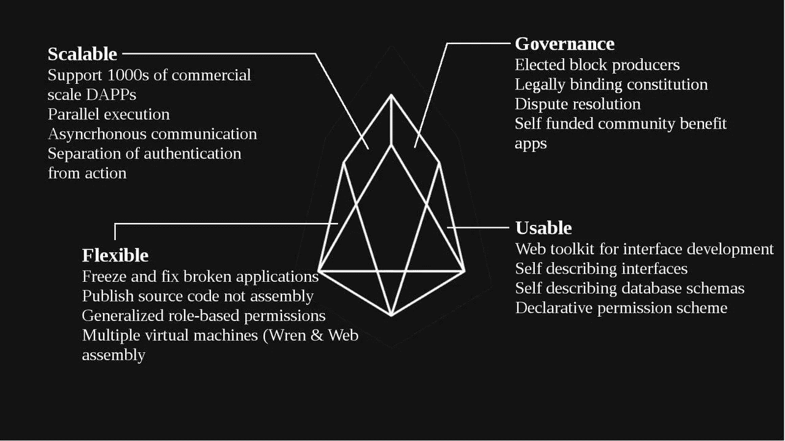
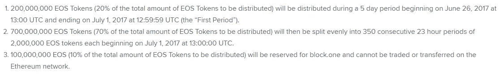

# EOS:了解可扩展的区块链平台

> 原文：<https://medium.com/hackernoon/eos-meet-the-scalable-blockchain-platform-c29f4a4f3112>

区块链产业始于 2008 年，现已稳步发展成为全球最大的市场之一。2018 年 1 月，[总市值](https://coinmarketcap.com/currencies/eos/)达到 8000 亿美元，对于几年前还相对不为人知的市场来说，这是一个令人印象深刻的壮举。

然而，随着它的崛起，它也面临着相当多的问题。占主导地位的区块链比特币和以太坊无法处理网络正在接收的大量交易。因此，用户不得不支付更高的费用，并不得不等待更长时间才能接受他们的交易。

对于一个不断增长的市场来说，这种障碍可能会损害其声誉，并赶走潜在投资者。谁知道有多少潜在投资者因为第一次在比特币和以太坊上的糟糕经历而远离了区块链？

缓慢的交易受理和较高的费用不仅损害了投资者的利益，也降低了整个系统的实用性。试想一下，你用比特币支付咖啡，需要 20 分钟才能让交易被接受。你不可能为了买一杯咖啡而排 20 分钟的队。这是不切实际的。

为了解决这些问题，EOS。正在 Block.one 的支持下开发 IO。该平台将有能力满足用户的日常需求以及大型机构和公司的需求。

尽管还处于发展阶段，测试网已经显示了区块链的潜力。EOS。IO 的内部测试显示，区块链每秒可以支持数千个事务。这明显优于比特币和以太坊，后者每秒只能分别支持 9 和 30 笔交易。

# 站台

让我们来讨论平台如何计划实现他们的宏伟目标。EOS。IO 软件旨在支持分散应用的纵向和横向扩展。该项目已经能够通过设计他们的软件来实现这一点，就像一个操作系统，应用程序是在这个基础上构建的。

这里需要澄清的一点是，该软件没有发布任何区块链。相反，他们正在开发一个系统，确保使用他们系统的区块链的可扩展性。该项目的团队成员解释说，在 EOS 的帮助下建设区块链确实取决于社区。IO 软件，该公司只是专注于开发这一系统。

EOS。IO 在与系统相连的不同 CPU 内核之间提供帐户、数据库、身份验证、异步通信和应用程序调度。通过这种方式，该系统就像一个区块链系统一样工作，但是没有以前工作的限制。该系统将有能力扩展到每秒数百万次交易，免除用户费用，并为更容易部署分散应用程序铺平道路。

通过支持大量交易，该平台将消除与系统交互收费的要求。如果一个区块链项目想真正接触大众，并获得最高的用户基础，那么系统需要自由地与他们的区块链互动。这就是 EOS。木卫一计划生产。

此外，为确保完全去中心化，该软件将使用委托利益证明(DPOS)共识算法。该算法规定使用 EOS 的区块链上的代币持有者。IO 软件将能够通过批准投票系统选择区块生产商。任何人都可以参与积木的制作，前提是他们能说服代币持有者为其投票。

基于 EOS 的交易。IO 软件从广播开始平均 2.5 秒后得到确认。该项目还支持异步拜占庭容错(aBFT)算法，以实现更快的不可逆性。该算法在 1 秒钟内提供了 100%的不可逆性确认。

还有许多其他的技术方面，你可以阅读和理解，但不会涵盖在这篇评论。你可以访问他们的技术白皮书来阅读更多关于他们的软件，以及它如何为用户提供最佳体验。

EOS。IO Dawn 4.0 于 2018 年 5 月初发布，并根据用户的反馈对软件进行了改进。EOS 内部测试网络。IO 的节点遍布欧洲、亚洲和美国。这些节点一直在运行，没有出现任何重大问题。

EOS。IO 1.0 将于六月的第一周[发布](/eosio/eosio-dawn-4-0-release-b25661a49ac2)，初始版本将包含任何人创建自己的 EOS 所需的一切。基于 IO 的区块链。

EOS Platform (source: EOS sub-reddit)

# 令牌和分发

可以有两种令牌。一个是在 EOS.IO 令牌销售中使用的 ERC-20 令牌。另一个令牌将在基于 EOS 的区块链中使用。IO 平台。后者将有各种各样的配置和 EOS 提出的限制。IO 平台，以确保区块链不被滥用。

以前的 EOS 令牌是根据相关的 ERC-20 智能合同在区块链以太坊上分发的 ERC-20 兼容令牌。EOS 令牌在 EOS 平台上不具有任何权利、用途、目的、属性、功能或特性。

EOS 令牌分发将于 2017 年 6 月 26 日开始，历时 341 天，总共将分发 10 亿个 EOS 令牌。EOS 正在使用以下分发技术。IO 在分发期间分发令牌:

EOS Token distribution

令牌将在每 5 天结束后和 23 小时结束时分发。该平台正在使用这种奇怪的令牌分配方案，因为他们认为这将为人们提供足够的时间来熟悉项目，并在他们感兴趣时进行投资。

# 团队

EOS 背后的团队。IO 在区块链开发领域经验丰富，拥有两个著名项目。Steemit 和 Bitshare 项目是由 EOS 上的一些团队成员开发的。IO 团队。Bitshare 是一个分散的交易所，每天处理 80 万笔交易，这比比特币和以太坊的总和还要多。

EOS。IO 是根据这两个项目的经验开发的，团队计划在这个项目中取得同样的成功。以下是 EOS 的主要团队成员。IO 项目:

布伦丹[布鲁默](https://www.linkedin.com/in/brendanblumer/):首席执行官，丹尼尔[拉里默](https://www.linkedin.com/in/daniel-larimer-0a367089/):首席技术官，伊恩[格里格](https://www.linkedin.com/in/ian-grigg-0379/):合伙人，布洛克[皮尔斯](https://www.linkedin.com/in/brockpierce/):合伙人。

# EOS 对其未来的一些担忧

然而，尽管该项目表现出色，但仍存在一些疑问。以太坊声称 EOS 是完全集中的，这是一个问题，因为 EOS 是基于区块链的。

从理论上讲，EOS 应该是完全分散的，但是平台使用委托利益证明(dPOS ),这使得系统在某种程度上是集中的。在比特币和以太坊中，成千上万的节点竞争执行必要的计算以带来价值，但在 EOS 中，这一过程仅由 21 个节点执行。从千到 21，可以看出以太坊为什么喜欢叫 EOS 集中式。随着网络的发展，更多的超级成员被选中，这个问题可能会自行解决。

# 有关 EOS 的更多信息

要了解有关该项目的更多信息，您可以访问以下链接:

[网站](https://eos.io/) | [白皮书](https://github.com/EOSIO/Documentation/blob/master/TechnicalWhitePaper.md) | [电报](https://eos.io/chat)

*原载于 2018 年 6 月 4 日*[*cryptopotato.com*](https://cryptopotato.com/eos-meet-the-scalable-blockchain-platform/)*。*