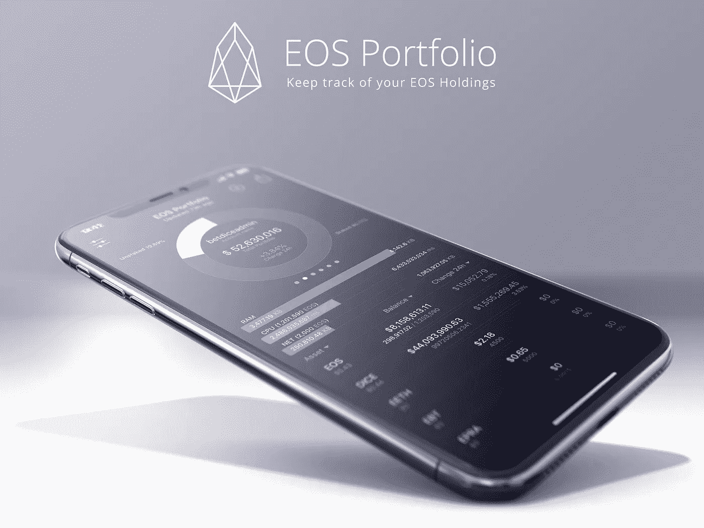

# EOS 投资组合跟踪应用程序。随时随地管理您的代币

> 原文：<https://medium.com/hackernoon/eos-portfolio-tracker-app-manage-your-tokens-anywhere-anytime-ed914691ca3>

## EOS Portfolio 提供了一种快速、简单、有趣的方式来跟踪 EOS 令牌和空投。用户可以在一个地方控制和管理所有帐户。该应用程序是绝对免费和安全的。

[Designed by EOS portfolio](https://eosportfolio.io/)

10 月 22 日在 App Store 发布的新 EOS Portfolio Tracker 应用程序让[加密货币的](https://hackernoon.com/tagged/cryptocurrencys)持有者的生活变得更加轻松。EOS Portfolio Tracker 可在 iOS 和 Google Play 上使用，允许用户从智能手机上舒适地管理和跟踪他们的加密货币资产。

虽然市场上有许多投资组合应用程序允许加密投资者监控他们的持股，但 EOS Portfolio 是迄今为止功能最丰富的完全专注于 EOS 资产的选项。用户以前可能需要使用 2 或 3 个应用程序，现在他们可以将这些功能整合到一个保护伞下。根据 App Store 的描述，EOS Portfolio 的广泛功能包括:多 EOS 帐户支持，24 小时变化跟踪，空投通知，以及在不输入私钥的情况下使用应用程序的能力——这一安全功能将特别吸引在 2018 年早些时候遭受钱包[钓鱼](http://fortune.com/2018/05/31/cryptocurrency-eos-ico-scam/)骗局的用户社区。

用户可以用美元、[、比特币](https://hackernoon.com/tagged/bitcoin)或以太坊来追踪他们投资组合的总价值。代币数据库包括 EOS，PUB，IQ，BLACK，KARMA，CHL，CET，HORUS，WECASH，EDNA，ADD，EOSDAC，ATD，BOID，EETH，IPOS，DICE，EOX，DAB，SEVEN，EPRA，WIZZ，SHAPE，COA，TRYBE，LUCK，BT，WIZBOX，FAKE，POOR，ITECOIN，CAT，BET，MEETONE，ROY，EBT，FAID，ESB，LUCKY 等众多。

过去一年，全球对 EOS 的兴趣越来越大，包括来自亿万富翁彼得·泰尔和迈克·诺沃格拉茨的 7 位数投资，这款应用也随之发布。token 在所有主要交易所上市，目前在 Coinranking.com 排名第五，市值接近 50 亿美元。

EOS Portfolio Tracker 是开普勒科技公司和 Kattana 的最新成果，开普勒科技公司是 LUKRUM portfolio tracker 的开发商，Kattana 是一流的专业加密交易终端。

点击了解更多详情[。](https://eosportfolio.io/)

我们很高兴听到您的任何反馈或意见，以改善应用程序，让您的生活更轻松。因此，请随时通过以下任何渠道联系，包括[电报](https://t.me/EOS_portfolio)、[推特](https://twitter.com/EoSportfolio) & [Reddit](https://www.reddit.com/r/EOSportfolio/) 。

