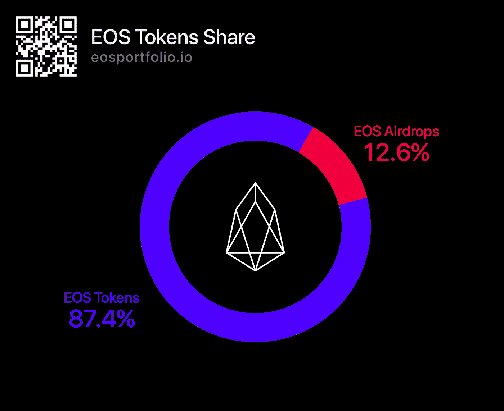
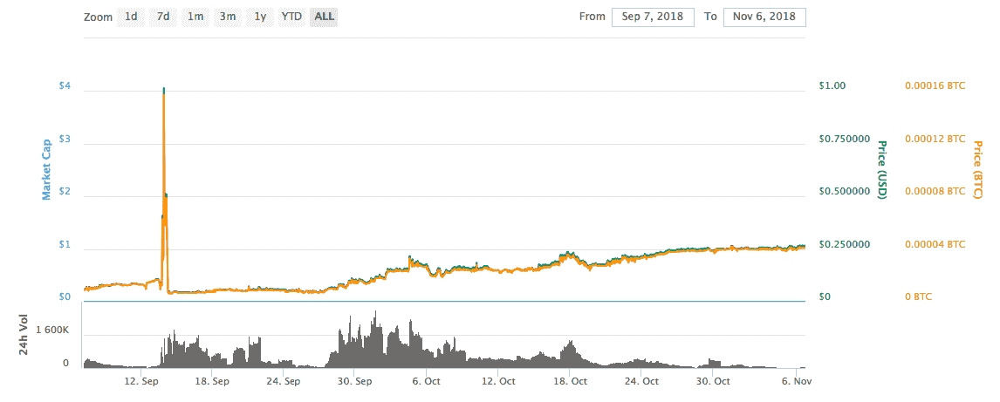
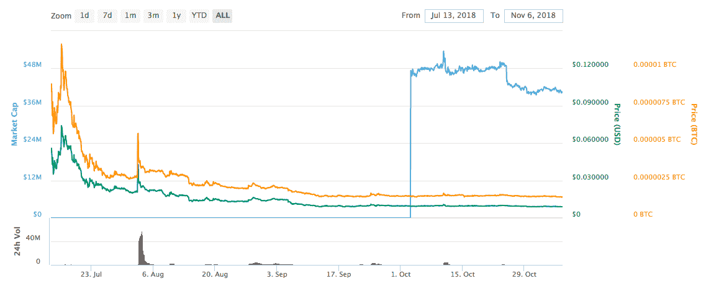
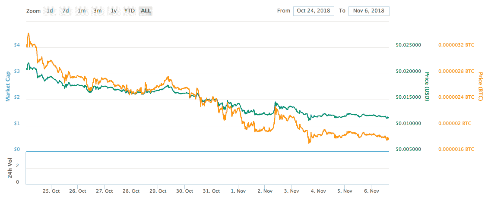
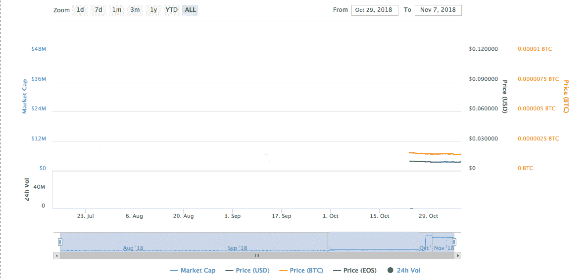
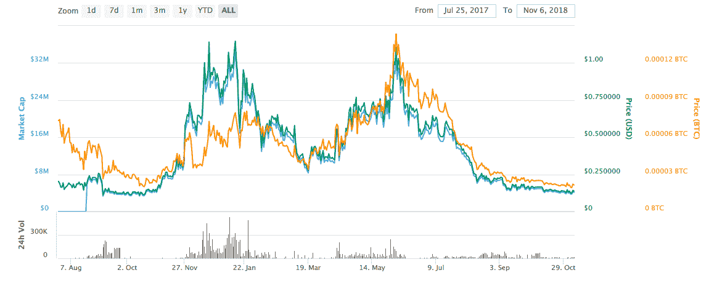
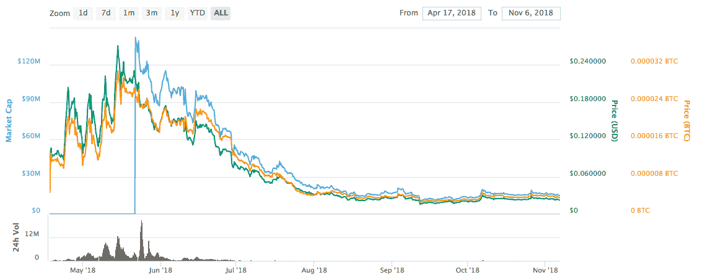
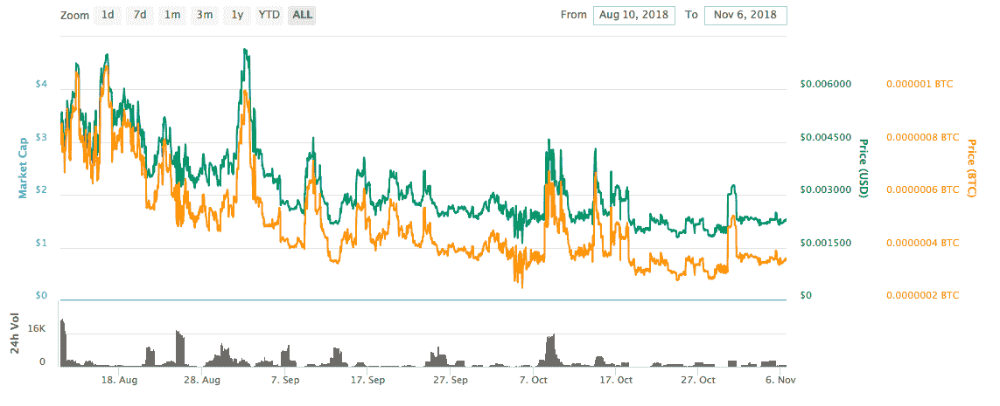
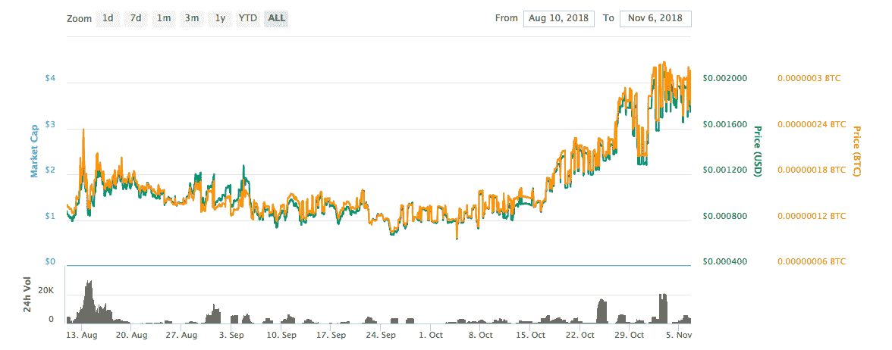
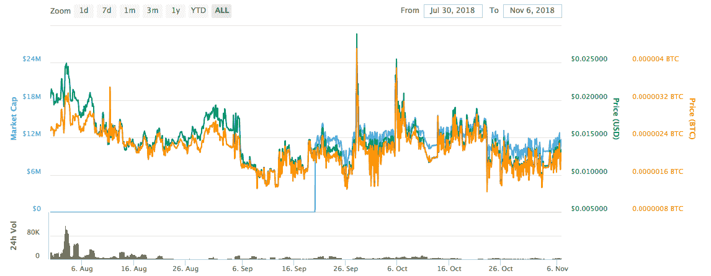

# EOS 代币达到 EOS 市值的 12.6%

> 原文：<https://medium.com/hackernoon/eos-tokens-reach-12-6-of-eoss-market-cap-db2c6a16b225>

## EOS 的市值分析。EOS 代币占 EOS 市场的 12.6%，并继续增长。

根据 2018 年 11 月公共 [EOS Block Explorer](https://eosflare.io/) 的数据，所有 [EOS](https://hackernoon.com/tagged/eos) 令牌的总市值现已升至 7.76 亿美元。所有基于 EOS 的代币的[总市值](https://coinmarketcap.com/)现在是 61.8 亿美元。

> 但为什么 EOS 会出现如此动态的增长，与比特币和以太坊继续遭遇熊市形成鲜明对比？

这一增长在很大程度上是由最近十大 EOS 令牌的高表现推动的，这十大 EOS 令牌占 EOS 总市值的 12.6%。

那么十大 EOS 令牌是什么呢？让我们把它们分解开来。

## [**EOS 黑**](https://eospark.com/MainNet/tokens) 投放时间:2018 年 7 月 20 日

市值:2.42 亿美元

在过去的两个月里，EOS Block 持有人显著增加，目前总数为 170，000 人。该代币自 2018 年 9 月 7 日起在交易所上市。EOS 黑色的总供应量目前为 953，712，111.54，占 EOS token 市场份额的 31%。这种代币的价值在 9 月份飙升，达到 1.01 美元的历史高点，但此后跌至 0.50 美元左右。

[Chart link](https://coinmarketcap.com/)

## [**智商令牌**](https://eospark.com/MainNet/tokens) 投放时间:2018 年 8 月 9 日

市值:90，983，882 美元

智商令牌是 Everpedia 的官方令牌，ever pedia 是维基百科联合创始人拉里·桑格的新区块链百科项目。目前有 169，781 名持有人，总供应量为 9，998，228，815.37 英镑。该令牌占 EOS 令牌市值的 11.7%。推出后价格大幅下跌，但在 10 月份飙升至近 1.00 美元，目前约为 0.90 美元。

[Chart link](https://coinmarketcap.com/)

## [**CET**](https://eospark.com/MainNet/tokens) 投放时间:2017 年 12 月 26 日

市值:3900 万.0

CET 代币有 165，484 个持有者，供应量为 20 亿。CET 已于 2018 年 10 月 24 日在交易所上市。价格目前约为 0.11 美元。该令牌占据了 EOS 令牌市值的 5%。

[Chart link](https://coinmarketcap.com/)

## [**骰子**](https://eospark.com/MainNet/tokens) 投放时间:2017 年 5 月 17 日

市值:37034146.00 美元

价格:0.0018740 美元

在过去两周内，EOS 大宗商品持有人数量大幅增加，目前总数为 24，836 人。该令牌自 2018 年 10 月 29 日起在交易所上市。骰子的总供应量目前为 3，817，952，206.55，占 EOS 令牌市场份额的 4.8%。10 月份在纽交所上市期间，代币价格飙升，达到 0.01 荷兰盾的历史最高水平，但此后跌至 0.0017 美元左右。

[Chart link](https://coinmarketcap.com/)

## [**OCT**](https://eospark.com/MainNet/tokens)

市值:25，520，000.00 美元
推出时间:2017 年 7 月 25 日。

尽管 OCT 在 6 月份表现良好，但此后其价格大幅下跌至 0.13 美元左右。华侨城的总供应量为 200，000，000，7985 名持有人，占 EOS token 市值的 3.3%。

[Chart link](https://coinmarketcap.com/)

## [**EOSDAC**](https://eospark.com/MainNet/tokens)

市值:20，196，373.00 美元
上市时间:2018 年 4 月 17 日

EOSDAC 的供应量为 994895，254.98，90571 持有人，占 EOS 令牌市值的 2.6%，价格为 0.022828 美元。

[Chart link](https://coinmarketcap.com/)

## [**MEETONE**](https://eospark.com/MainNet/tokens)

市值:18，000，000.00 美元
发布时间:2018 年 8 月 10 日

自推出以来的几个月里，Meetone 经历了一段疯狂的旅程。价格在 9 月份达到 0.0073 美元的峰值，此后稳定在 0.00146 美元。代币供应量为 2，000，000，000 股，持有人数为 10，917 人，占 EOS 代币市值的 2.2%。

[Chart link](https://coinmarketcap.com/)

## [**因果报应**](https://eospark.com/MainNet/tokens)

发布时间:2018 年 8 月 10 日。市值:263.6922 万美元

对于 Karma 来说，这是一个很好的几个月，自 9 月以来一直处于上升趋势。该硬币的供应量目前为 30 亿。有 166，555 个持有者，价格为 0.001479 美元。Karma 占 EOS 令牌市值的 2.2%。

[Chart link](https://coinmarketcap.com/)

## [**荷鲁斯**](https://eospark.com/MainNet/tokens)

市值:10987153 美元
推出时间:2018 年 7 月 30 日。

在过去的几个月里，荷鲁斯经历了一些大起大落。10 月份达到峰值 0.028921 美元，目前价格在 0.011 美元左右。持有人 171900 人，供应量 12 亿。Horus 拥有 EOS token 的市场份额。

[Chart link](https://coinmarketcap.com/)

加密投资者可能也有兴趣知道 EOS 令牌的 EOS 空投数量每个月都在增长，这些数字令牌的积极趋势似乎没有放缓。这可能是一个不错的时机添加一些到您的加密钱包。

> 你已经追踪你的 EOS 代币了吗？
> 
> EOS 区块链令牌跟踪器提供了一个快速，简单，有趣的方式来跟踪 EOS 令牌和空投。用户可以在一个地方控制和管理所有帐户。该应用程序是绝对免费和安全的。随时随地将您的投资组合跟踪器放在口袋里。
> 
> 获取您的区块链代币追踪器应用程序— [点击此处](https://eosportfolio.io/)

> 我们很高兴听到您的任何反馈或意见，以改善应用程序，让您的生活更轻松。因此，请随时通过以下任何渠道联系，包括[电报](https://t.me/EOS_portfolio)、[推特](https://twitter.com/EoSportfolio) & [Reddit](https://www.reddit.com/r/EOSportfolio/) 。

