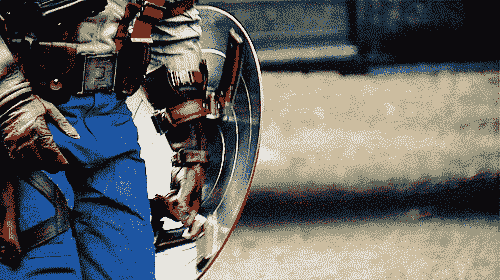
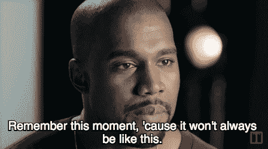
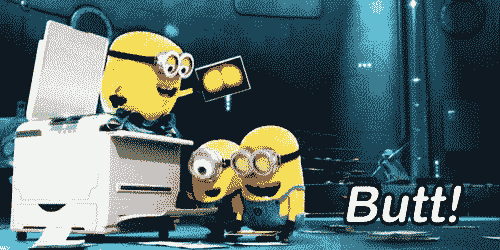
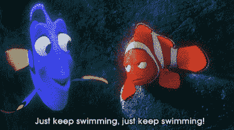

# 第 45 集:我给去创客学院的人的十条建议。

> 原文：<https://medium.com/hackernoon/episode-45-ten-things-i-would-advise-for-anyone-going-to-makers-academy-a70f50b18050>

你点击这篇文章可能有三个原因。首先是因为你即将开始创客学院之旅。第二个原因是，你正出于了解科技世界的热情，考虑进行一些自发的旅行。第三，你想知道，什么是创客学院。鉴于还有更多要解释的，我就倒着说。

[http://www.makersacademy.com/](http://www.makersacademy.com/)

Makers Academy 是位于伦敦商业街的欧洲最好的编码训练营之一。这是一个最时髦的地区之一(这并不奇怪，因为伦敦的任何新的、奇怪的或潮流的东西都会在这个地区出现)，这是一个人的[生活](https://hackernoon.com/tagged/life)的支点，成为一名开发者和伦敦科技产业的一部分。它持续了大约三到四个月，包括预备课程，在课程结束时，你提交一个最终项目，你毕业了，你实际上成为了一个完全合格的程序员和乒乓球运动员。

这绝对是一次自发的旅程，需要你投入很多，但回报是值得的。伟大的朋友，伟大的教练，伟大的[学习](https://hackernoon.com/tagged/learning)和一个伟大的环境。在你成长和学习新事物的这段时间里，你还能要求什么呢？

如果你已经决定踏上这个自发的旅程，并选择了创客学院，那么**我欢迎你并祝贺你**。这不是一个容易进入的地方，因为由于需求高，他们很有选择性。

我会知道。我来这里的部分障碍是我必须做至少四次面试。一次书面报告、一次 Skype 聊天和两次或者三次编码面试。是的，我是一个敏锐的灵魂。

你将经历一场你甚至无法想象的过山车，只要你对技术有热情或者对成长有热情，你的投资将是值得的。

紧张是正常的，有些害怕也是正常的，如果你很兴奋，迫不及待地想开始，那就太好了，最重要的是，**不知道你到底在注册什么也是正常的。因为真的，从来没有人这样做过，我相信大多数人也没有抱任何期望。**

不过，我在这里告诉你(或我第一天的自己)一些事情，可以让那些感觉或紧张稍微平静下来，因为我也曾经像你一样。

一个乐观而充满活力的人，他有些兴奋和紧张，但并不知道我报名参加的是什么。没想到我对创造者的看法是对的，在我来这里的五月里，我有幸得到了如此闪亮的惊喜。所以，我在这里给你 10 件事，这些事我会告诉有一天的我和你，如果我能再经历一次，我会注意的。

注意:不是我所有的评论或技巧都会在这里，因为我已经把这篇文章留到了以后。然而，这些只是我会在第一天告诉自己的建议，这样我就不会破坏给过去的自己的任何惊喜。

## 01.你比你想象的更有能力

如果你曾经参加过一个制造商的毕业典礼，你会意识到“前辈们”用他们三个月的经验创造出了令人惊叹的产品。如果你有，你可能会问“这到底是怎么做到的”，而现在，如果你要开始问“我到底要怎么做？”

有这些感觉是正常的，但是很难想象在接下来的三个月里，有一天你会有同样的感觉。如果我必须给我的第一天的自己提些建议，我会建议的第一件事是把我对自己的任何想法、对自己的任何怀疑以及对人和代码的任何看法都丢在门外。

像其他有这种经历的人一样，你和其他人一样有能力和潜力找到工作。

自从我在第 12 周站在这里，意识到我已经克服了许多障碍，学会了许多技术，学会了更多我开始时认为我可以做到的语言，这个建议适用于每个人，包括你。

## 02.花时间去发现自己

我从来没有想到，为期三个月的紧张的编码训练营会像一个“寻找自我”的假期。你知道，那些假期，人们冒险去巴厘岛，泰国或一些热带岛屿远离一切和人。这就是为什么一些岛屿有这些巨大的别墅，你可以以合理的价格租用三个月，以**“与自己联系”**

虽然我同意编码训练营不是一个假期，但它是一个你将花很多时间和自己在一起的经历。如果我能想到类似的经历，这就像我们的学习时代(学院，大学，硕士)，我们被给予绝对的自由和独立来充分利用这些经历。

即使 Makers 在其安全的环境中培养这种成长心态，这种意图也不仅仅是让你学习代码。**创客是教你如何学习，告诉你如何每天成长为一个更好的人。即使与大学相比，像创客这样的环境也是非常独特的，因为它让你感到成长是“安全的”。**

所以，为什么不尝试一些新的东西呢，比如冥想、瑜伽、乒乓球或者一个团队成员创造的活动？为什么不去和 Joy 首席执行官一起参加咨询会议，来清除你头脑或生活中的混乱呢？为什么不在研讨会上大胆发言或提问来克服恐惧呢？为什么不请你同事中那个令人生畏的人喝杯咖啡呢？

在很短的一段时间里，我所说的大部分内容都是包容的，也是安全的，我鼓励你，每天你去创客，醒来，照照镜子，问问自己**“我能做些什么来成为一个比昨天更好的人”**不管你的答案是什么，去尝试一下。

## 03.对变化保持开放的态度，如果没有做好抵抗的准备

从一个相当顽固的人的角度来说，我可以承认，当我经历一些改变时，我有相当一部分经历过“抗拒”。无论是适应控制我的压力水平，还是无法获取信息或练习停止以我的旧方式思考，我都需要时间来认识到，要克服改变的障碍，**一个人必须允许改变发生。**

我得出这个结论是因为在第四周，我完全疯了，在紧张的一周后，我把自己的头发拔了出来。我再也无法承受这种重量和压力，想尽一切办法摆脱它。改变可能很难接受，这是正常的，但在你无法承受课程强度之外的任何负担的情况下，你可能会发现允许自己改变是值得的。

**然而，我还想提到的是，我对变化的“抵制”可能来自编码之外的其他东西**。是的，当我说要接受改变时，要接受任何可能发生并影响你生活任何部分的改变。创客是一个有影响力的环境，在这个意义上，它会让你不断超越自我，不断成长。

因此，允许你自己意识到并注意到这些变化，但是如果你曾经决定反对它们，为即将降临在你肩膀上的重量做好准备。

## 04.今天才是最重要的

第二周是我设法与一对搭档完成材料的第一周。我们都充满了喜悦，因为它在我们的眼中点燃了希望，如果我们努力工作，我们可以浏览所有的材料(尽管我在这里写道，意识到这是我唯一一次设法完成一周的材料)。

我记得我庆祝并沉浸在那一刻，没有去想我必须做的周末挑战，也没有去担心我需要做或必须反思的事情。从那天起，我开始认真对待 Maker 的名言“你是不是比昨天更好的开发人员？”

随着时间一周周过去，时间开始走下坡路，帮助我走出低谷的一件事就是思考今天的问题和我已经取得的成就。在第 12 周，你必须考虑工作、期末项目、面试和未来，这是一个很好的工具，只考虑现在，因为这会让你更有效率地完成事情，而不是过多地考虑所有你必须完成的事情。

## 05.朋友很重要

现在，我不是告诉你让“网络”成为你在这篇文章之后来到创客的核心原因。毕竟，就像任何关系一样，它是通过行动而不是语言突然繁荣起来的。然而，我相信我会鼓励你去登记入住，打一场乒乓球或者说一句简单的“你好吗？”给你的同伴，因为…

朋友们很适合谈论你无法解决的编码问题，决定下一个最好的编码迷因是什么，或者当你的整个电脑在运行 Rack-up 之前关闭时开怀大笑

朋友让你接触新事物，比如每周五让你尝试不同形式的素食，带你去尝试新的酒吧，这样你就可以玩令人不安但又奇怪的游戏，或者如何跳梅伦格舞。

朋友可以让你照顾好自己，只要和你一起出去散步呼吸新鲜空气，花时间盯着窗外，每隔 20 分钟就随意聊一聊动车组，放松编码的眼睛，或者玩一场有趣的乒乓球扣杀游戏，让你的身体舒展一下。

朋友可以在你不知道如何处理的情况下给你建议，告诉你他们自己的故事，告诉你你所面临的事情不是你一个人面对的，在你需要的时候给你一个拥抱，或者在你惊恐发作的时候给你一只友善的手，告诉你“你过得很好”。

当你在一次紧张的瑜伽练习后需要有人来接你，当你需要有人帮助你搬到下一个 AIRBNB，或者当你需要更多的认可或 LinkedIn 页面上的联系时，朋友会非常有用。

最重要的是，

朋友是你能从经历中得到的最好礼物之一。他们是快乐的束，会让你在最黑暗的时候开怀大笑，他们是充实的礼物，充满了你可以了解的故事和才能，他们是你已经联系了足够长时间的人，可以把他们算作一些永远的好朋友。

总之，朋友很重要。

## 06.允许自己有“感觉”

这篇文章谈论了同一个主题的两件不同的事情，所以我会尽量简短。第一，创客们会变得紧张，因为你将不得不适应很多变化。在接下来的几周里，你会经历低谷和高涨的情绪，就像任何疯狂的过山车一样，如果你是第一次乘坐，一开始会感觉不舒服。所以，对自己放松一点，让自己感受一下自己的感受。相信我，它会比憋在肚子里更快让你解脱。

另一方面，创客是一个很有影响力的环境，从这个意义上说，你将会和一群人一起度过很长一段时间，每天三个月。你会和他们一起做各种各样的活动，最终会有一种感觉，你会觉得你已经认识他们很多年了，尽管你只认识了他们两个星期。此外，进入一个大多数人都长得好看或迷人的群体，只会给已经沸腾的情绪火上浇油。

引用一句话，“在每个群体中都会发生这种事”，所以如果你发现你的群体中有人很有魅力，这很正常。

## 07.做你的阅读

在最初的几周，你会低估自述文件的影响和力量。自述文件可能看起来只是一个解释您的项目的一堆乱码的文本文件。哦，你错了，我的朋友。

自述文件就像是礼物的生日贺卡。这是令人兴奋的宜家包装说明手册。这些都是我们低估的东西，但如果做得好，它们在让接收者更好地理解和体验产品时发挥了很大的作用。

因此，我强烈建议你在每个周末花点时间做你的自述，或者至少花一个小时清理你的 Github。你宁愿花半天时间学习代码，或者和朋友们休息一会儿，也不愿在第四周后重写一半的阅读材料。一个自述文件需要时间、关心和关注来很好地设计，并且有一个要求列表来与用户交流你的产品是关于什么的以及你是如何制作它的。

下面，我链接了一个简单表，以及我认为应该放在你的自述文件中的内容。写一张生日卡没什么大不了的，但是要花一些时间和精力去写。走吧。

[https://github . com/Adam-p/Markdown-here/wiki/Markdown-cheat sheet](https://github.com/adam-p/markdown-here/wiki/Markdown-Cheatsheet)

自述清单:

*   它是如何工作的
*   方法(你如何处理这个问题)
*   反思(你会做些什么来让它变得更好)
*   解决问题的进展(用户故事、表格)
*   (产品的)图片
*   (文件/进度的)图像
*   团队成员，如果有的话。

## 08.当你陷入困境时，给它 30 分钟，然后再寻求帮助。

在创客，你需要训练自己解决问题和 bug 的耐力和能力。几个星期后，你可能会开始就某个问题去找教练，并意识到有时你得到的回应是“去研究一下”，这可能有些有效或没有进步。

在这 12 周中，虽然你至少要写 300 个小时的代码，但是开始训练自己找出问题是有好处的。从 15 分钟开始，然后 20 分钟，我会说直到 30 分钟。如果你没有更进一步，那就试着问问朋友，然后是教练。我们不希望你永远困在一成不变的生活中。

通过这种方式，你将作为一名开发人员训练你的“谷歌搜索”技能和“解决问题的方法”技能。这样做是至关重要的，因为这是开发人员工作的一半:搜索、学习和解决。

## 09.中学生和高年级学生，我们都一样。

虽然我会说这是针对初中和初中，我会通知每个人，包括老年人。当你第一次进入创客，你可能会认为中级和高级知道一切，因为他们已经通过了几个星期的课程。哈哈，恕我不敢苟同。

我记得我的学生和一个低年级学生走过来问我“如何为 Ruby 做一份双份”，我完全愣住了。鉴于我在过去的五周里用 Javascript 指定了我要成为的前端开发人员，我的 Ruby 技能已经飞出了窗外。我真正聪明的同伴，更熟悉 Ruby 的 Robert，必须帮助我。

所以，伙计们，这是一个重要的注意事项:仅仅因为他们是中学生或高年级学生，并不意味着他们什么都知道，这意味着在整个星期里，你也不必什么都学！很多时候，我们中的许多人只选择我们能选择的或者基于我们兴趣的东西。

编码是一项永无止境的考古挖掘，你不可能在三个月内完成，对每个人来说都是如此，不管他们经历了多少周。

## 10.不管怎样，所有的事情，锻炼

在第 11 周的最后一天，我开始担心我们永远不会冻结这个特性了。特性冻结是指我们停止实现任何新特性，并花时间清理代码、设计风格和改进它。

然而，现在我们已经在一天之内完成了一半我认为我们无法完成的功能。现在我想起来，在团队项目最艰难的时候(从第 8 周开始)，我从来不认为这是世界末日，因为在周五，项目(通过努力工作)会自己完成。在你甚至认为至关重要的时刻，在你认为一切都是一团糟的时候，凭借纯粹的工作和决心，情况似乎会变得最好。

此外，在为期三个月的紧张的编码训练营中，你将逐渐了解到不值得紧张，因为你只能尽力而为，现在你知道了，

…最终一切都会好的。

你可能现在还不明白，但是等到你被太多事情压垮的时候，也许，你会明白的。

# 今日趣事:

今天这个团队的词是“super ”,因为我们在所有的编码示例中都使用了这个词，并在周一一直重复这个词来激励我们。因此，我要说，在我们的最后一周，我们将有一个“超级”的一天，我希望有了这些建议，你将在 Makers 有一个“超级”的体验，或者现在有一个“超级”的决定去进行这个“超级”的冒险。