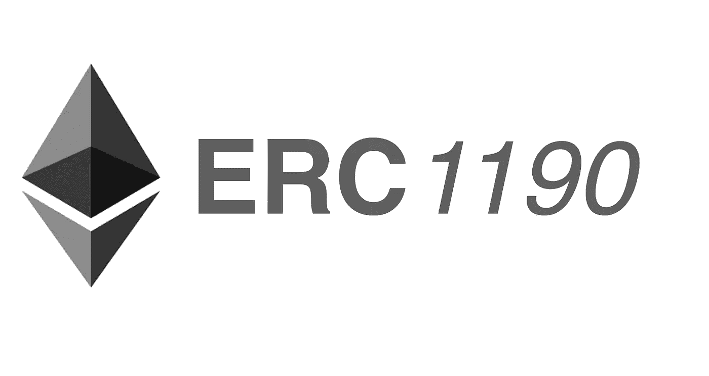
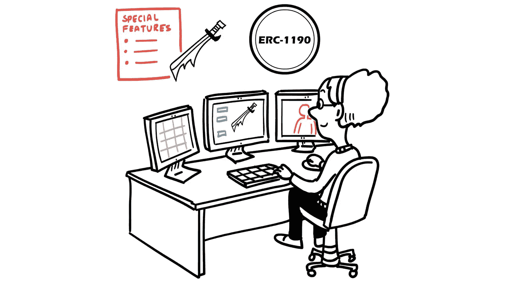
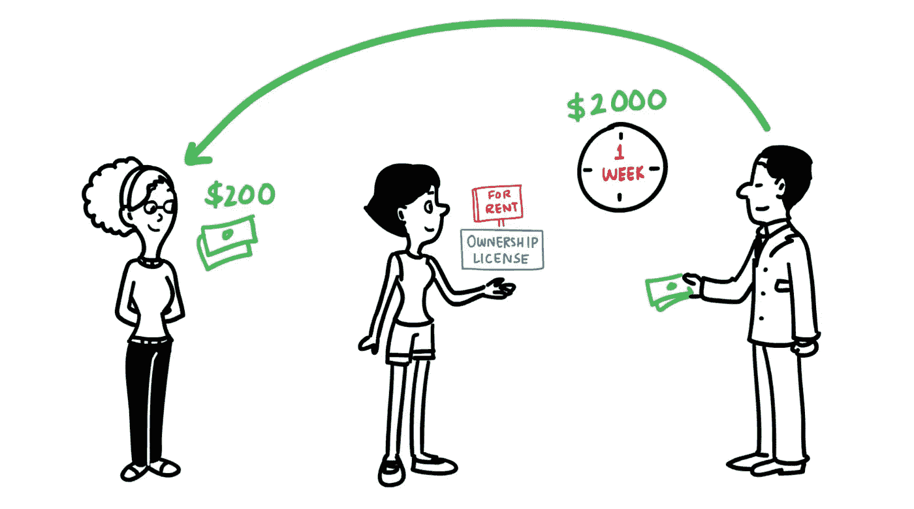

# ERC-1190 和艺术市场

> 原文：<https://medium.com/hackernoon/erc-1190-and-the-art-market-be73d7faa402>

如果被采用，被提议的 ERC-1190 以太坊标准可能对创造性权利和数字资产有重要的应用。

**艺术世界不可替代的象征**

ERC-1190 是不可替代的版税支付标志。不可替换性意味着每个令牌代表某种独特的东西，比如一幅图像或一首歌曲。(参见 Github 上的[代码](https://github.com/ethereum/EIPs/issues/1190))。

想象创建一个雕塑或游戏对象，你现在想与世界分享。拟议中的代币将允许你分享艺术品，并通过轻松跟踪从中产生的任何收入来从中获利。具体来说，一个 ERC-1190 令牌将允许你出售艺术的创作许可证，出售其所有权许可证，或在一段固定的时间内将其出租给第三方。

本文将概述拟议的 ERC-1190 令牌标准如何帮助艺术家专注于创作艺术，同时被动地收获他们的艺术作品的经济利益。

Artists and programmers can create digital objects and embed them into an ERC-1190 token.

**艺术品交易和艺术家收入的防篡改记录**

把自己放在一个新兴画家的位置上。你可以在每年数以千计的世界艺术展中展示你的作品。凭借天赋和一些运气，你的画作可以在一个独家艺术博览会上展出，比如私人所有的巴塞尔艺术展，它保持着出色的地区和全球形象，展示知名和新兴艺术家的作品。你想把你的一幅画卖给出价最高的人。

在 ERC-1190 条款中，您拥有该资产的创作许可和所有权许可，并且您希望出售其所有权许可，同时保留创作许可。所有权许可证的购买者将有权拥有这幅画以及未来销售的大部分收入。但是，您保留的创意许可将确保您从未来销售中获得固定比例的收入(对于手头的示例，假设创意许可授权您从任何未来销售中获得 10%的收入)。

The Creator keeps the creative license and sells the ownership license.

使用 ERC-1190 交易不一定会绕过传统的销售艺术品的方法。对于一个新兴的艺术家来说，买家可能想在购买之前先看看一件艺术品。一个更有名望的艺术家也许能够独自在区块链举办一场拍卖。

比方说，你在一个传统艺术博览会上把你的画卖给了出价最高的人，但通过转让一个代表艺术品的 ERC-1190 代币记录了这次销售。你现在可以在区块链上很容易地找到这件艺术品的销售记录、未来的动向记录以及从中获得的任何收入。

现在，让我们假设你的画的买家以加价的方式卖给一家国际营销机构。作为创意许可证持有者，您有权获得 10%的收入。如果向营销机构的销售是在区块链上进行的，您将无缝地收到资金(甚至不知道销售)。如果销售以传统方式进行，但在区块链上记录，您将在区块链上得到通知，并有权向接收者索取 10%的收入。因此，使用 ERC-1190 将消除信息不对称和收缩摩擦，使艺术家受益。

**租房**

国际营销机构现在把你的画租给一家活动公司，为期一周。活动公司将在多边政治活动中展示。与 ERC-1190 令牌相关联的租赁许可证将显示此租赁、其时间段和价格。所有权持有人将获得大部分租金收入。但是，作为创意许可证的持有者，您也将获得一定比例的租金收入。

The Creator gets rental revenue from the ownership license holder.

**对于知名艺术家来说，销售可以完全在区块链上进行**

知名艺术家的作品往往会随着时间的推移而升值。艺术收藏家和艺术投资公司通常持有艺术品作为投资。这种艺术不是挂在墙上或展示出来的。相反，它存储在一个安全的位置。有时，即使艺术品被出售，唯一易手的是所有权文件，艺术品仍然存放在同一地点。

在这些情况下，使用 ERC-1190 可以通过完全在区块链进行销售，向任何人开放这个市场，减少私人拍卖行和口碑销售的作用。这将有利于艺术收藏家(通过给他们一个更具流动性的销售市场)、艺术爱好者(通过允许他们更容易地购买艺术品)和艺术家(如果他们持有创作许可证，他们将有权从未来的销售中获得收入)。

**出售、赠与或遗赠创意许可怎么样？**

到目前为止，本文只考虑了艺术家持有创作许可证的情况。艺术家也可以选择出售创作许可证。一旦创意许可证被出售，创意许可证的新持有人将收到所有未来销售或租赁收入的分成。

由于艺术界的分散性，有才华的艺术家往往需要几十年才能出名。事实上，当今几位最著名的艺术家在他们的时代并不被欣赏。例如，文森特·梵高活着的时候很穷，几乎不为人知。直到他死后，他的作品才被广泛关注和欣赏。直到他死后，人们才开始欣赏他的作品。去年，梵高的一幅画[卖到了 8130 万美元](https://www.bloomberg.com/news/articles/2017-11-14/van-gogh-s-insane-asylum-view-sells-for-81-3-million-at-auction)。

使用 ERC-1190 令牌，艺术家可以将他们的创作许可证遗留给后代，即使他们已经出售了所有权许可证(因此不再拥有潜在的艺术作品)。如果梵高的家庭或城镇中有人持有他的一幅画的创作许可，那么每当这幅画被出售或出租时，他们都会获得可观的收入。

**改变艺术市场**

ERC-1190 可以让艺术家专注于艺术创作，同时知道他们的经济利益受到保护。那些收藏、交易、营销、展示或欣赏艺术品的人也可以专注于他们最擅长的领域，并从安全的交易记录和更容易进入的流动性市场中受益。

***

点击[此处](https://github.com/ethereum/EIPs/issues/1190)查看代码。

点击[此处](http://lansaar.com/2018/07/proposed-erc-1190-tokens/)阅读另一篇讲解文章。

点击[此处](https://www.youtube.com/watch?v=bGBTAOY62mY)观看简短的讲解视频。

ERC-1190 令牌标准已经由[阿里姆汗](https://twitter.com/aalim_hk) & [沙恩雷](https://twitter.com/ShaanRay)提出。

—

[陕雷](http://www.shaanray.com)

关注 [Lansaar Research](https://medium.com/lansaar) 关于媒体的最新新兴技术和新商业模式。