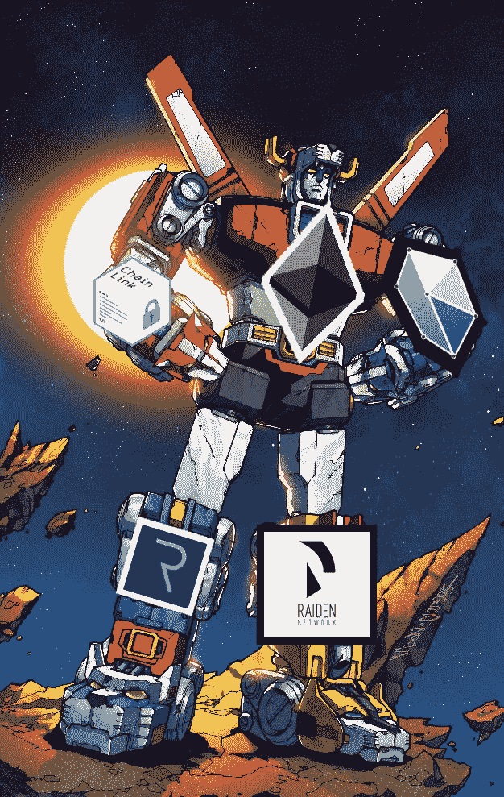
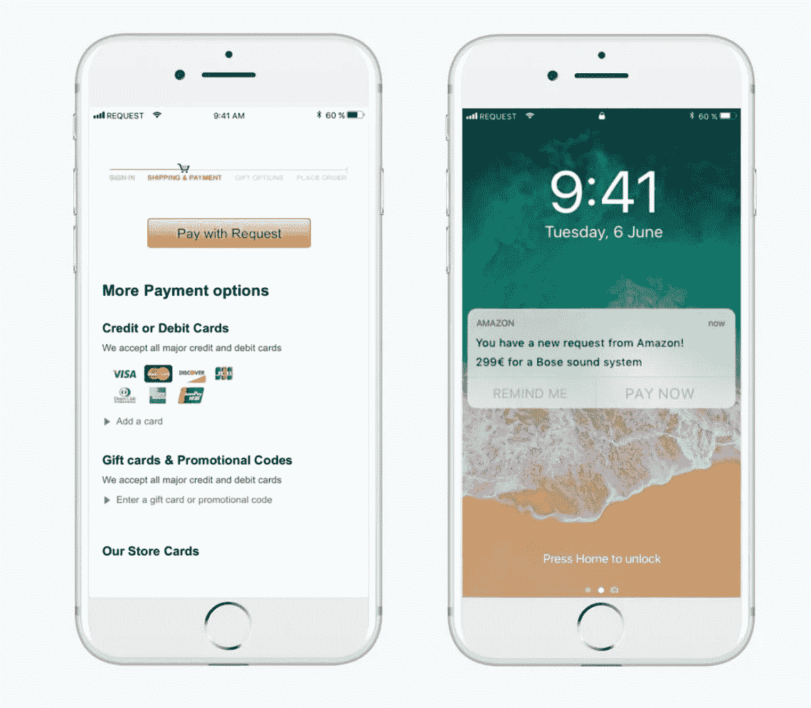

# ERC-20 和伏特隆:将使以太坊永生(并让你的口袋更鼓)的四个肢体

> 原文：<https://medium.com/hackernoon/erc-20-and-voltron-the-4-limbs-that-will-make-ethereum-live-forever-and-make-your-pockets-fatter-699a19b65c7a>

你们还记得伏特隆吧。

让我们直奔主题，以太坊和其他 ERC 20 代币既不充足也不可持续。您已经知道以太坊是当今市场上使用最广泛的数字资产，为数字艺术、ICO、猫游戏、赌博和其他任何可能在您当地高中看台下制作的东西提供动力。这不是一件坏事。在这篇文章中，我们将看看 ERC 的 4 个问题-20 个代币(如以太坊)和资产，如果成功，会让你非常富有。

# 四肢:交易时间、法定关口、流动性和智能合约

> 我们所知道的: ERC-20 代币还没有准备好大规模采用
> 
> **如何获利:**购买任何能让 ERC-20 代币被大规模采用的东西

# 交易时间

以太坊目前的交易速率上限为每秒 14 次交易。平均值大约是这个数字的一半。我认为，至少每秒 100，000 次交易的速度应该是任何寻求全球采用的最低要求，考虑到机器对机器的微交易可能会成倍增加网络所需的吞吐量，这可能还是太保守了。

以太坊目前的扩展选项包括 [**分片、雷电、等离子、**](https://blog.rexmls.com/sharding-raiden-plasma-the-scaling-solutions-that-will-unchain-ethereum-c590e994523b) 三种不同的细分以太坊网络事务处理工作的方法。

**分片:**以太坊网络分群，分工。这不是你可以投资的东西，除了简单地投资以太坊。

**Raiden:** Raiden 使用状态通道技术处理交易，而无需主以太坊链手动授权交易。这对于物联网和机器对机器的交易特别有用，最近，以太坊 Mainnet 上激活了这种扩展解决方案的简化版本，称为 Raiden。

**等离子:**[ERC-20 令牌 OMG 目前正在开发一种被称为 OMG 网络](https://blog.omisego.network/construction-of-a-plasma-chain-0x1-614f6ebd1612)的支持等离子的交易所，据 Omise Go 团队称，这种分散式交易所[可以同时支持世界上所有的货币以及> 1B 用户的加密。](https://www.reddit.com/r/omise_go/comments/7dmoky/clarification_on_plasma_and_omg/)“这项技术依赖于分片，在以太坊的“Casper”更新上线之前无法实现。

现在，您已经了解了三个扩展选项，让我们来看看如何赚钱吧！选项一和三，碎片和等离子，将在任何 ERC-20 代币上工作。因此，在这些网站上赚钱的方法是投资像 Omise Go 和以太坊这样的项目。

雷电解决方案作为资产“**雷电网络**”存在。雷电可能已经跌出了前 100 名市值资产，也许 IOTA 更有希望用于机器对机器的交易…但如果 ERC-20 仍然是事实上的标准，我们有机会看到卷土重来。

# 平面网关

人们想买比特币！我奶奶 6 年前想买比特币，当时我还在上高中。她说:“告诉我怎么买，我有兴趣。”

*“嗯，你必须连接你的银行账户，进行电汇，下载钱包，别忘了保管好你的私人钥匙，要非常小心……”*

人不能这样！不能指望我奶奶能跟上一个 14 集的 YouTube 教程！人们需要做简单事情的简单按钮。

**请求网络**是“商业的未来”、“Paypal 2.0”，也是 crypto 获得快速采用的最有前途的方式之一。想法很简单，做一个快速简单地将密码转换成现金的工具。很容易**不能被低估。通过开发由团队的社区中心资助的外部应用程序，你可以期待 Request 被个人、小企业甚至帝国所实现。如果你还不明白，看看这个:**

****

**如果你对“按需付费”功能感到心动，你并不孤单。**

**Y-Combinator 支持的团队拥有完成这个项目的资源和动力，毫无疑问他们会成功。被描述为[“一个有潜力成为发票、会计、审计以及加密货币和法定资产支付标准的金融平台”，](https://blog.request.network/introducing-continuous-payments-a61132332984)这是一个非常有前途的项目。通过允许商人和个人在没有任何技术知识的情况下接受密码**，** request 在成为自由密码贸易的入口方面处于有利地位。**

*****该团队对 Q1 2018 年的目标如下:*****

*   ****请求的第一个版本**在主网上使用以太坊**
*   **根据请求部署加密货币管理(ERC20 令牌)**
*   **概念验证:请求核心使用比特币 Oracle**
*   ****与会计、支付和审计公司合作****
*   ****启动请求支付项目**:一个在线按钮，为传统的贝宝支付和信用卡支付提供了一个替代方案**
*   **请求合同的外部审计**

**这里要购买的资产是 **Request Network Token，**目前交易价格约为 0.50 美元，从约 1.20 美元的历史高点回落。**

# ****流动性****

**这与网关问题密切相关。很难转移资金。除了交易对和转换率的问题，你还需要对资产交换的速度、安全性和可靠性感到满意。 [Request 与**Kyber Network**](https://blog.kyber.network/kyber-network-partners-with-request-network-to-benefit-consumers-and-merchants-618524b271bd)**合作，这是一个分散的交易所，将允许 Request 将其平台整合到来自活跃市场的高流动性中。****

****从上面的链接:****

****“通过此次合作，Kyber Network 将成为 Request Network 上用户和商家的一个支付选项。利用 Request Network 的商家将能够轻松利用 Kyber Network，以不同于发送或接收货币的所需货币发送或接收付款，为消费者提供无缝的用户体验。****

****整合后，Kyber 网络也将用于 REQ 令牌的刻录。通过设计，Request Network 允许人们在以太中付费，在燃烧以太之前，合同会自动将以太转换为相应数量的 REQ 令牌。利用 Kyber 网络，请求网络可以以以太网接收请求的付款，然后指定付款的一个百分比作为费用发送给 Kyber 合同，用于转换成请求令牌。在此之后，REQ 令牌将被转发到一个目的地址，该地址烧录它接收到的所有内容，从而简化并消除烧录过程中的重复。"****

****这里要买的资产是 **Kyber 网络水晶**。除了从请求网的高交易量中赚钱，[下面是一些买入 Kyber 的理由:](/cryptobro/so-how-much-is-kyber-really-worth-should-you-buy-knc-now-953dd5b49e97)****

*   ****KNC 被要求作为储备经理使用 Kyber 平台的费用****
*   ****费用减去运营费用后的收益将用于从公开市场回购 KNC(基本上是一种股票回购计划)****

****根据同一篇文章，假设 Kyber 在(竞争非常激烈的)加密交易所领域仅占 5%的主导地位，那么 Kyber 的市值将轻松达到 12 亿美元，约为目前市值的 2.4 倍。这意味着你可以期待 Kyber 的价格从目前的 3.72 美元上涨到健康的 8.90 美元。这也是一个相当安全的赌注。mainnet 启动 Q1 2018。****

# ****智能合同****

****好吧，对于你们这些非技术人员来说，**你们必须和我呆在一起**。这是我能塞给你的关于区块链科技的最重要的有用信息，所以听好了:区块链很烂，区块链很蠢，他们比世界上最古老、最垃圾的计算器还糟糕。他们不擅长转移资金，他们很大程度上未经测试，完全不受监管；我们将不得不放弃开发中的几乎所有区块链，并从我们的错误中吸取教训。****

****就像那些蹩脚的计算器一样糟糕，甚至可以说比手工解决问题还要糟糕，它们将发展到覆盖世界上的每一种贸易，覆盖我们的家庭、金融市场、工厂和农场。加密货币将用于投票和法律事务以及生日，加密货币将用于人类殖民太空的时候，加密货币将比今天任何活着的人或组织存在的时间都长，在未来几十万年。****

****任何类型的有用的区块链应用程序都从智能合约开始。****

> ****智能合约是存储在区块链上的一段代码，由区块链交易触发，读取和写入区块链数据库中的数据。就是这样。真的。”****

****智能合约将加密货币从简单的点对点资产交换系统(目前就是这样)转变为下一个谷歌、facebook 或优步。智能合约给了加密货币不可想象的可能性。这就像加密货币是一台台电脑，智能合约将它们连接在一起，创造了互联网。****

> ****[对智能合同最大的误解是:联系外部服务的能力。](https://www.coindesk.com/three-smart-contract-misconceptions/)****

****你们中的“技术人员”对使用 API 连接[在此插入区块链]和[在此输入令人兴奋的外部资源]的想法垂涎三尺。**你做不到。**以太坊的网络在决策时无法检索任何类型的外部信息。以太坊的所有编程必须是确定性的，这意味着在评估决策时，只有先前存储在区块链中的信息才可以使用。****

****对于其他人来说，你需要知道的是，如果没有 **Chainlink，加密货币将永远不会达到世界经济的 1%。******

********

****This man will make you rich****

> ******智能合约连接性问题**是智能合约无法与任何外部数据馈送或在执行智能合约本身的节点网络之外运行的其他资源进行交互。****

*****解决方案如下:*****

****最后，购买 Chainlink。求你了。我感谢你，社区感谢你，你孙子的孙子会感谢你支持 3D AR 视频游戏或区块链到那时将做的任何事情。可能是你不赞同的事情。****

## ****只是为了好玩，让我们看看我今天列出的资产的当前价格，以及我希望到 2018 年底它们的价值。****

****这并不科学，只是基于我的乐观。****

****以太坊$ 1060-> $ 17200(是的，我明白这不现实)****

****Omise Go $17.19 -> $140****

****雷电＄4.63->＄7****

****请求网络令牌$0.48 -> $8****

****凯伯网络晶体$3.67 -> $12****

****Chainlink $0.88 -> $400(或者每令牌 100 万亿，我甚至不知道如何计算这个。)****

*******编辑自 2019 年 4 月:这一点都没撑起来！哈哈哈！*******

# ****感谢阅读！拍手！****