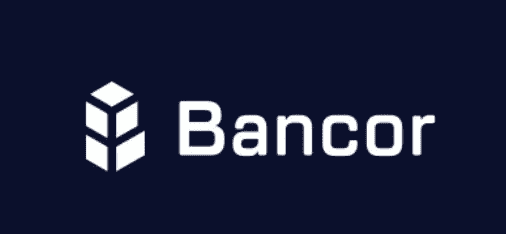
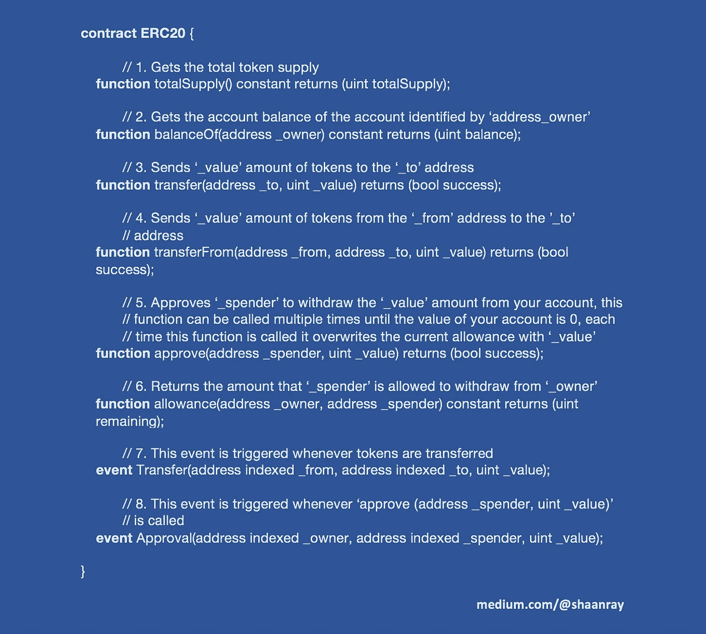

# ERC20 代币

> 原文：<https://medium.com/hackernoon/erc20-tokens-b3b50c95ad08>

Popular ERC-20 tokens today.

**加密货币 vs 代币**

加密货币和代币是相关但独立的概念。加密货币和代币这两个术语不能互换使用。

加密货币是最新的，也是迄今为止最成功的数字货币形式。它们是数字化的货币，通过[密码术](https://hackernoon.com/cryptographic-hashing-c25da23609c3)加密。他们的分类账副本以分散的形式存在于世界各地的区块链。加密货币运行在自己的区块链上。

代币代表一种资产或工具，存在于区块链之上。它们是可交易的商品，可以代表硬币、忠诚度积分、游戏内资产等等。它们甚至可以兑换成发行者日后提供的服务。代币可以在区块链上发行，像以太坊和波浪。使用最广泛的令牌标准是以太坊的 ERC20。以太坊最近还提出了另外两个标准:ERC223 和 ERC721。

ERC-20 is a technical standard issued by Ethereum.

**ERC20 代币**

2015 年，以太坊发布了以太坊区块链上代币的技术规范。符合这些规范的令牌称为 ERC20 令牌。(ERC 代表以太坊征求意见。)

本质上，ERC20 令牌是在以太坊区块链上运行的智能合约。虽然 ERC20 令牌在以太坊团队设定的框架内运行，但该框架足够宽泛，同时允许开发人员在令牌的设计和功能方面拥有相当大的灵活性。通过以太坊上的 ICOs 创建的大多数令牌都符合 ERC20。

ERC20 标准有 6 个功能和 2 个事件。创建该标准是为了实现应用程序、交换和接口之间的互操作性。这些函数描述了如何传输令牌以及如何访问与令牌相关的数据。这些事件为转移和批准制定了格式指南。以太坊上的智能合约，包括所有的 ERC20 合约，都是用 Solidity 写的。

My description of the 8 various components that make up the ERC-20 token smart contract. Each contract includes 6 functions and 2 events.

**工具和测试**

为了更好地理解 ERC20 框架，以及它如何适应各种用途和策略，通过创建和测试具有不同属性的令牌在测试网上进行实验是有帮助的。一个很好的起点是 Etherescan.io，它允许用户直观地了解以太坊的区块链，并查看各种 ERC20 令牌。以太扫描用户可以在三个测试网之一上创建自己的令牌:Ropsten、Kovan 或 Rinkeby。

在我的实验中，我使用 Rinkeby 创建了一个名为 Raycoin 的 ERC20 令牌——请看这里的**。**

****

**The RayCoin ERC-20 Token I created in the Rinkeby Testnet.**

****定制****

**可以自定义 ERC20 令牌以启用以下功能:**

**1.自动买卖:你可以将代币的价值与另一种代币或货币的价值挂钩，建立一个自动买卖代币的基金来维持平衡。**

**2.自动充值:以太坊区块链的交易需要用“汽油”支付给矿工。你可以设置你的代币，一旦低于某一水平，就为将来的交易自动加油。**

**3.添加一个可以改变流通中的代币数量的中央铸币厂:如果你的代币是政府货币的镜像或模拟，这可能会很有用。**

**4.冻结令牌:如果监管机构要求这样做，您可以冻结该用户拥有的令牌，并在需要时解冻它们。**

**5.工作证明(Proof of of work):你可以通过与以太坊签订“合并采矿”的合同，将你的代币供应与以太供应联系起来。一个矿工在以太坊找到一个方块，然后也可以得到预定数量的你的代币作为方块奖励。**

****ERC 223 和 ERC721 提案****

**在某些情况下，ERC20 令牌可能会给用户带来困难。例如，有人使用 ERC20 令牌向与 ERC20 不兼容的合同发送 5 ETH，该交易不会被拒绝，因为该合同不会识别传入的交易。因此，ETH 可能会停滞不前，并且基本上被用户丢失。**

**一种新的令牌标准(提议的 ERC223)通过拒绝与 ERC 不兼容的交易来解决这个问题。**

**符合另一个新令牌标准(提议的 ERC721)的令牌将是不可替换的:唯一的，并且在使用和交换期间不可互换。(例如，巧克力棒和比萨饼是不可替代的，因为它们不同的特性导致它们各自具有不同的价值。)ERC721 代币因其独特性和稀有品质而具有价值(想想乔丹亲笔签名的限量版棒球手套)。**

****结果****

**随着人们对首次发行硬币的兴趣增加，以太坊发布了 ERC20 代币指南。ERC20 令牌的主要优势是与以太坊上其他兼容令牌和分散应用程序的互操作性。ERC20 代币也可以在所有支持以太坊标准的平台上交易。一些流行的 ERC20 令牌是占卜，Bancor 网络，公民，灵知，和假人。鉴于以太坊上的大多数 ico 都符合 ERC20，区块链领域的思想领袖和企业家应该努力了解 ERC20 和其他以太坊令牌标准。**

**—**

**接下来:了解一下 [**ERC-1190 代币**](https://codeburst.io/erc-1190-tokens-fd8dd68b1cfb) 是什么！**

**[陕雷](http://www.shaanray.com/)**

**关注媒体上的 [Lansaar Research](https://medium.com/lansaar) ,了解最新的新兴技术和新的商业模式。**