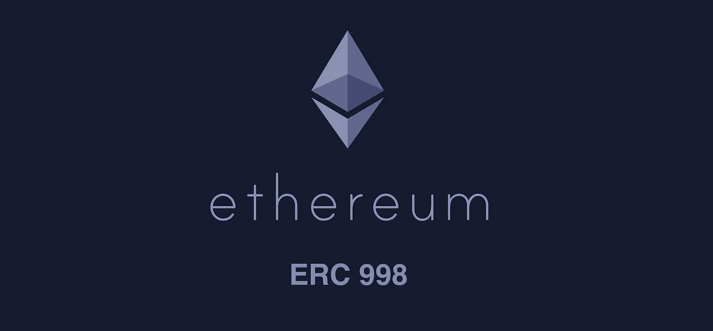
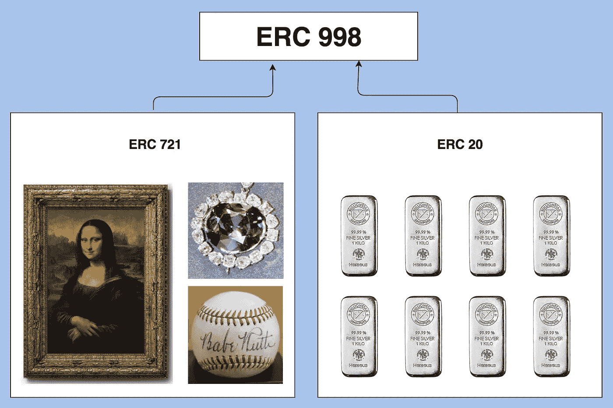
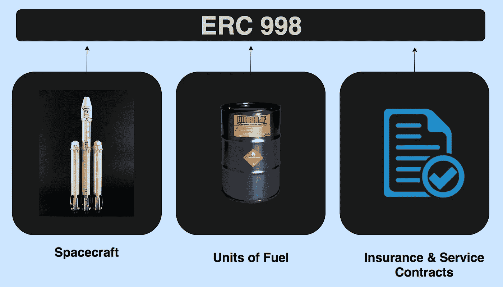

# ERC998 代币

> 原文：<https://medium.com/hackernoon/erc998-tokens-5e2544d874fa>

Matt Lockyer 提出了一种新的以太坊令牌标准，称为 ERC998。

[**ERC20**](https://medium.com/m/global-identity?redirectUrl=https%3A%2F%2Fhackernoon.com%2Ferc20-tokens-b3b50c95ad08%3Fsource%3Duser_profile---------20-------------------) 令牌是使用最广泛的以太坊令牌。这些令牌是可替换的，这意味着每个令牌都是统一的，并且具有相同的值。

**ERC721** 代币是不可替换的代币:每个代币都是唯一的，因此可以独立定价。因此，独特的数字资产，如游戏 CryptoKitties 上的猫，可以存储在这样的令牌上。

ERC998 令牌与 ERC721 令牌相似，都是不可替换的。ERC998 代币也是“**可组合的**”，这意味着代币内的资产可以组合或组织成复杂的头寸，并通过一次所有权转让进行交易。

An ERC998 Token can hold both, the unique and Non-Fungible ERC721 Tokens and the uniform Fungible ERC20 tokens. The ERC998 token can then be valued and traded.

由于 ERC998 令牌可以拥有自己独特的一组数字资产，因此可以将其视为一个资产组合或一家多元化资产的控股公司。

**假设的用例**

ERC998 令牌标准将支持一系列新的使用案例。举个简单的例子，电话和预付费通话时间单位可以捆绑在一起成为一个 ERC998 令牌。

ERC998 can create a lot of value by holding a number of assets which complement and enhance each other’s value.

举一个更复杂的假设用例，航天器的所有权可以用 ERC721 令牌来表示。在两个目的地之间往返 100 次所需的火箭燃料可以用另一个符号来表示。保险和服务合同可以用第三种方式持有。这三个令牌资产可以由一个 ERC998 令牌拥有，该令牌可以拍卖给太空旅行公司。

ERC998 令牌是对现有标准的宝贵补充，将支持一系列全新的使用情形。

—

[陕雷](http://www.shaanray.com/)

关注 [Lansaar Research](https://medium.com/lansaar) 关于媒体的最新新兴技术和新商业模式。