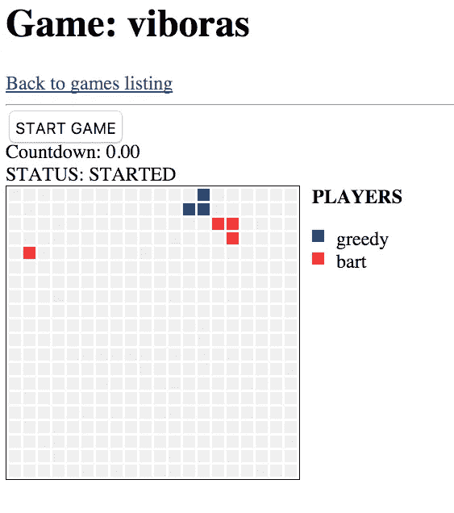
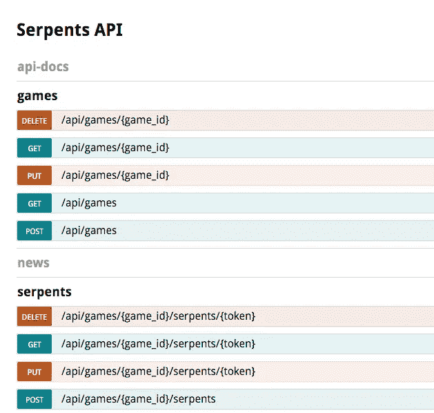

# 二郎大蛇

> 原文：<https://medium.com/hackernoon/erlang-serpents-3eca35bf7c6d>

由布鲁约·贝纳维德斯


# 放弃

**做好准备……一封长信就要来了。**

我花了很长时间写这篇博文，主要原因是它包含了许多不同的主题。这将是一篇关于

*   黑客马拉松
*   TimeDivisionDuplex 时分双工
*   游戏开发
*   函数式语言中的数据类型抽象
*   占线小时
*   位串语法
*   RESTful APIs
*   多种工具，如牛仔，混合器，步道，招摇，lasse 等。

# 历史

很久以前，当我还是个孩子的时候，我开始用 [QBasic](https://en.wikipedia.org/wiki/QBasic) 编程，正如你们很多人可能知道的，QBasic 附带了两个小游戏。其中一个是小点心


快进 25 年……你会发现我在 Erlang Solutions，在 Roberto Romero 和 Hernán Rivas Acosta 的帮助下，试图为我们的下一次**黑客马拉松**提出主题。我们想要一个可以在一个屏幕上观看的多人游戏。*当然*我们想出了 [**大蛇**](https://github.com/inaka/serpents) ！

# 黑客马拉松

每年在 Erlang Solutions，我们都会从项目中抽出一天时间，一起庆祝我们最喜欢的事情:*编程*。2014 年，我们举办了一场*“仅在一天内构建您的应用”*竞赛，结果令人惊叹。对于 2015 年版，我们决定推出一款多人游戏，组织者设置服务器，团队开发客户端。我将在这篇博文的其余部分展示的代码，都来自 Hernán、Roberto 和我自己开发的游戏服务器。

# 目标

蛇的主要目标当然是用于黑客马拉松。但我对此也有一个隐藏的议程:由于这个项目将在 github 上开源，我想用它作为一个案例来展示我们是如何工作的。我希望能够让人们在 IRC、erlang-questions、reddit、stackoverflow 等网站上交流。会问类似“嘿！如何在 Erlang 中构建 web 服务器？”告诉他们“看这里。你就是这么干的！”。考虑到这一点，我们把这个项目当作一个客户项目来面对，结果，我们的*客户*(我们的开发伙伴)实际上是我们曾经面对过的最难对付的客户之一。

# 体系结构

那么，我们如何为一个大蛇的游戏建立一个多人游戏服务器呢？我们首先将其分为 3 个主要部分:

*   显示游戏进程的网页。
*   一个网络服务器，为网页提供服务，并为其提供 RESTful API，以便在*实时更新*。
*   为客户端提供连接方式的游戏服务器。

对于网页，我们使用了普通的 HTML 和一些 Javascript(你至少可以看出我对此并不感兴趣:P)。**有趣的是**的实时*部分。我们在 [SSE](http://www.w3.org/TR/eventsource/) 上实现了那个(就像我们通常做的那样)。在一场比赛中，网站看起来是这样的:*



从服务器的角度来看，我们使用 [cowboy](https://github.com/ninenines/cowboy) 在 [trails](https://github.com/inaka/cowboy-trails) 上实现了 RESTful API，并用 [swagger](https://github.com/inaka/cowboy-swagger) 对其进行了记录。结果是这样的:



另一方面，我们决定给客户端 devs 2 选项。他们可以使用相同的 RESTful API 和 SSE 连接与服务器通信，或者他们可以使用我们的 [HDP](https://github.com/inaka/serpents/blob/master/HDP.md) 协议。

HDP 是一种运行在 UDP 上的速度惊人的协议。它是由埃尔南开发的，并以*卡夫卡风格*记录下来，供所有人使用。它是专门为 serpents 开发的，但是可以很容易地在其他项目中复制。

# 内部架构

在内部，正如你在 github 上看到的，代码被分成多个文件夹和多个模块，我们可以单独测试。

一方面，我们有游戏的基本构建模块:规则(在`spts_core`中)被实现为每个游戏的`gen_fsm`及其实体(表示为*数据类型*或*模型*，每个都有自己的模块和不透明类型)。你可以在`spts_serpents`看到我们的方法:

```
%%% @doc Serpent model
-module(spts_serpents).
-author('elbrujohalcon@inaka.net').

-type status() :: alive | dead.
-type name() :: binary().
-opaque serpent() ::
    #{ name       => name()
     , numeric_id => pos_integer()
     , token      => binary()
     , body       => [spts_games:position()]
     , direction  => spts_games:direction()
     , food       => pos_integer()
     , status     => status()
     }.
-export_type([serpent/0, status/0, name/0]).

-export([new/6]).
-export([ name/1
        , numeric_id/1
        , direction/1
        , direction/2
        , to_json/1
        , to_json/2
        , to_binary/2
        % ...
        ]).

-spec name(serpent()) -> name().
name(#{name := Name}) -> Name.

-spec direction(
        serpent(), spts_games:direction()) ->
        serpent().
direction(Serpent, Direction) ->
    Serpent#{direction := Direction}.

% ...
```

我们还为 API 的不同端点提供了多个牛仔处理程序。它们都是使用*混音器*从`spts_base_handler`中“继承”功能而构建的。

```
%%% @doc /games/:game_id/serpents handler
-module(spts_serpents_handler).
-author('elbrujohalcon@inaka.net').

-include_lib("mixer/include/mixer.hrl").
-mixin([{ spts_base_handler
        , [ init/3
          , rest_init/2
          , allowed_methods/2
          , content_types_accepted/2
          , content_types_provided/2
          , resource_exists/2
          ]
        }]).

-export([ handle_post/2
        , trails/0
        ]).

-type state() :: spts_base_handler:state().

-behaviour(trails_handler).

-spec trails() -> trails:trails().
trails() ->
  Metadata =
    #{ post =>
       #{ tags => ["serpents"]
        , description =>
            "Adds a serpent to a game"
        , consumes => ["application/json"]
        , produces => ["application/json"]
        , parameters =>
            [ spts_web:param(request_body)
            , spts_web:param(game_id)
            ]
        }
     },
  Path = "/api/games/:game_id/serpents",
  Opts = #{path => Path},
  [trails:trail(Path, ?MODULE, Opts, Metadata)].

% ...
```

为了从核心向 SSE 或 HDP 客户端报告事件，我们使用了`gen_event`，但是为了方便起见，我们实现了一个简单的`gen_event`处理程序，反过来，只需要在您的客户端中实现一个函数:`notify(pid(), event())`。我们称之为`[spts_gen_event_handler](https://github.com/inaka/serpents/blob/master/src/spts_gen_event_handler.erl)`。我们使用相同的处理程序为核心编写测试，而不依赖于任何类型的客户端。

对于 HDP，我们编写了一个异步 UDP 监听器，它为每个*连接*的客户端启动一个`gen_server`(UDP 中没有实际的连接)。简单的原因在于我们将所有的协议解析/验证逻辑抽象到它自己的模块:`spts_hdp`。这个模块本身就是 Erlang 的[位语法](http://www.erlang.org/documentation/doc-5.6/doc/programming_examples/bit_syntax.html)的一个很好的例子。它展示了列表理解，结合了二进制理解和许多惊人的二进制模式匹配表达式。我最喜欢的:

```
%% @doc Parses a list of serpent diffs.
%%      Each one includes the serpent id and the
%%      length of its body, followed by each of
%%      the body cells.
parse_diff_serpents(0, Next, Acc) ->
  {lists:reverse(Acc), Next};
parse_diff_serpents(
  N,
  << SerpentId:?UINT
   , BodyLength:?USHORT
   , Body1:BodyLength/binary
   , Body2:BodyLength/binary
   , Next/binary
   >>,
  Acc) ->
  Body = <<Body1/binary, Body2/binary>>,
  Serpent =
    #{ id => SerpentId
     , body =>
         [ {Row, Col}
         || <<Row:?UCHAR, Col:?UCHAR>> <= Body]
     },
  parse_diff_serpents(N-1, Next, [Serpent|Acc]).
```

# 开发方法学

为了创建所有这些，我们使用了我们通常的方法: **TDD** 。为此我们与`common_test`一起工作，你可以在这里看到我们实现的[的测试套件列表。我们已经写了很多关于 TDD、代码覆盖甚至元测试的博文，所以我在这里不再赘述。请记住，如果你需要这些东西的例子，这里有很多。](https://github.com/inaka/serpents/tree/master/test)

# 客户

如果你问自己*有没有客户的例子？*没错，就是这里的。这些都是我自己开发的，你可以从头开始或者使用 [spts_cli](https://github.com/inaka/serpents/blob/master/src/spts_cli.erl) 来创建你自己的。

# 结果

# 结论

我们最终实现了我的两个目标。一方面，我可以说我们举办了一次非同寻常的黑客马拉松，很多人一边编码一边开心地玩。另一方面，现在我们有了一个很好的例子来展示我们如何在 Erlang Solutions 中构建东西。你也可以享受它！只是做…

```
$ git clone https://github.com/inaka/serpents.git
$ cd serpents
$ make
$ _rel/serpents/bin/serpents start
```

…并在浏览器中打开 [http://localhost:8585](http://localhost:8585/) 开始播放！

当然，正如我小时候对小零食所做的那样，最有趣的部分开始于你开始修改代码，让大蛇变得更胖、更瘦，在吃了一个有毒的水果后随机喝醉

哦，天啊！我*有*去实现那个！再见，9 岁的我有重要的事情要做…

*原载于 2018 年 4 月 26 日*[*www.erlang-solutions.com*](http://www2.erlang-solutions.com/l/23452/2018-04-26/5g8gvr)*。*

***这篇博文最初是在 2015 年 11 月 13 日写给 inaka.net 的。***