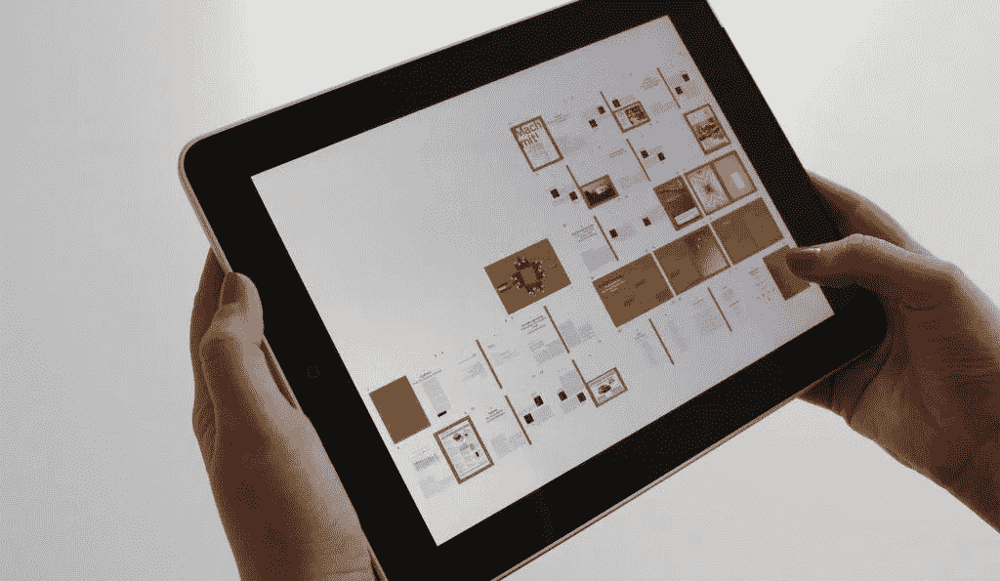
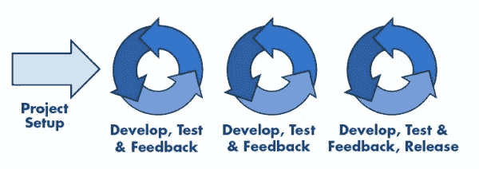

# ERP 软件:为什么要开发

> 原文：<https://medium.com/hackernoon/erp-software-why-develop-f834ed5e0871>

在过去二十年中，企业资源规划系统(ERP)已经变得不可替代。截至 2017 年， [81%的组织](https://diginomica.com/2017/01/25/cloud-erp-adoption-eric-kimberling-reveals-surprising-data-and-misconceptions/)正在实施 ERP 软件或已完成实施。但是由于技术的快速变化，这个问题对许多公司来说仍然悬而未决。随着升级的不可避免性，您可能仍然会犹豫是建立自己的 ERP 系统还是购买预打包的解决方案。

# 为什么公司对他们的 ERP 软件不满意

技术进步和经济变革影响着公司对其 ERP 系统效率的评估方式。而这些估计往往不利于后者。

失望的第一个原因是期望和现实之间的差距。夸大的市场承诺变成了实施积压、不合适的软件、支持滞后和员工不满。

老式的 ERP 相当死板，需要重组整个工作流程以适应 T2 软件。这让定制变得很痛苦，因为每个[企业](https://hackernoon.com/tagged/business)都有其独特的逻辑——而这种逻辑需要具有灵活性和适应性。

向新技术的转变让老牌 ERP 供应商心力交瘁。通常，他们在产品旧版本的支持和维护上投入了大量的精力，并且没有准备好重新搭建平台和重新创建软件来适应新的数字领域。

它为较小和较新的供应商，以及面向新客户需求的 ERP 开发团队提供了优势。

# ERP 解决方案:新需求

为了具有竞争力，现代企业资源规划系统不能没有新技术，这些新技术正在迅速接管所有行业。这些创新的实施带来了巨大的优势。那些较早开始的人比那些仍然坚持过去的人领先一步。同时，由于这些新奇事物本身仍在发展中，这意味着您的企业系统应该非常灵活且独立，以便快速做出反应。这些新的 ERP 要素包括:

**基于云的平台**。基于云的解决方案有助于节省额外的 IT 人员和硬件。它使 ERP 软件更加经济实惠，甚至对中小企业部门也是如此。它还允许任何员工从任何设备访问系统。在公司发展的情况下，这种解决方案很容易扩展。

**物联网特性**。有了物联网，设备的工作通过互联网连接完全或部分自动化。它确保设备之间更好的交互。从任何连接的设备都可以轻松访问所有数据。它改善了沟通，加快了决策过程。

**大数据处理和数据库整合**。随着数据量的增加及其对业务绩效的影响越来越大，将公司的所有数据整合到一个数据库中，供所有用户使用并易于访问和分析，这一点非常重要。

**与 AI 融合**。人工智能推动大数据处理和预测分析。它有助于通过分析组织成员之间的日常互动来优化工作流程。它还可用于监控员工绩效和数字辅助。

切换到这个新的领域，再一次引起了一个两难的选择:寻找新的现成选项还是选择定制开发的解决方案？

# ERP 构建与购买:如何做出正确的选择

那么，如何做出正确的决定呢？IDG 撰稿人网络顾问克里斯·多伊格(Chris Doig)建议从建立一份全面的需求清单[开始，评估公司对软件的需求，并对其重要性进行评级。有一些技术，比如逆向工程，有助于发现甚至是隐藏的需求(无论你决定购买还是建造，这都是有用的)。](https://cio.com/article/2905354/enterprise-software/reverse-engineering-the-most-powerful-requirements-gathering-technique-of-all.html)

分析供应商的选择，检查他们是否符合你公司的要求。如果符合率低于 80%，或者缺少任何重要的特性，那么，最好考虑定制 ERP 开发。

让我们来看看在内部和现成的 ERP 选项之间做出选择时应该考虑的一些一般性问题。

# 现成的 ERP 软件:优势和陷阱

当开始调查 ERP 软件选项时，您会立即遇到几十个 ERP 供应商，从 SAP 和 Oracle 这样的巨头到专门从事您的特定领域的小公司。有了如此多的选择和看似快速的解决问题，很容易做出情绪化的决定，选择一个固定的解决方案。在某些情况下，这样的决定将是唯一正确的，甚至是唯一可能的。但并不总是如此。

通常不在表面上的是实施和定制的持续时间和成本。[首席信息官们经常提到](https://www.proformative.com/questions/erp-vs-custom-development)在根据业务的实际需求定制购买的 ERP 时，最大的困难和突发事件让他们措手不及。没有现成的 ERP 解决方案适合任何组织，即使是在一个领域。

另一个问题领域在面对未来时显露出来。如果你的公司是一个动态的、不断发展的公司，你会希望你的软件能够适应并随着你的业务发展。而且，正如我们已经提到的，预装 ERP 软件的一个显著弱点是它的僵化。大多数固定的 ERP 产品不允许有意义的修改。考虑到这些天我们在这里和那里处理的技术高峰，它可能导致在大约 5-7 年内从零开始。这将进一步减少开支和工作延误。

# 何时构建自己的 ERP 系统更好

尽管构建定制 ERP 解决方案的成本更高、更繁琐，但随着时间的推移，它可以带来很多好处，并提供很高的投资回报率。

定制 ERP 软件旨在适应您的工作流程，而不是试图将您的业务流程融入 ERP 功能。它还减轻了员工的培训，因为设计适合他们的实际情况。因此，如果您对自己的业务逻辑完全满意，并且不想为了一个现成的解决方案而改变它，那么它肯定会更适合您。

内部解决方案是独一无二的，绝不会附带不必要的功能。而大多数 ERP 供应商将多达 40 个应用程序捆绑到他们的产品中。考虑到许多公司[从来不会使用他们 60%到 70 %的现成 ERP 系统，为一套你永远不会需要的预定功能付费是一种巨大的浪费。](https://intersog.com/blog/enterprise-resource-planning-erp-solutions-to-customize-or-to-build-from-scratch/)

另一方面，将您的定制解决方案与您真正需要和使用的更广泛的应用程序和数据库相集成更容易。如今的公司复杂多变。您公司内的不同部门可能有不同的计划需求，并以不同的方式提交报告。因此，他们可能需要不同的 ERP 技术。构建自己的 ERP 允许创建一个全面的平台，而不是使用多个程序和平台来满足各种需求。由于将所有数据存储在一个地方，它带来了更高的效率。

实际上，如果选择了正确的开发方法，您可以在开发定制 ERP 时节省成本。

# 如何从定制 ERP 开发中获益

许多关于定制软件开发的负面陈述都来自于以前糟糕的经历。主要的问题是当开发团队不了解业务的需求时。这就是为什么要建立一个伟大的 ERP 系统，你需要一个熟练的开发团队准备钻研你的工作流程的特殊性。一个好的团队甚至可以帮助你改变最初的想法，达到更好的表现。

你肯定会赢得的是[迭代开发](https://searchsoftwarequality.techtarget.com/definition/iterative-development)。也就是说，您可以从小处着手，在迭代中部署 ERT 的各个部分，测试每个部分，并在过程中进行必要的修改。它降低了直接成本，因为您的付款也将在迭代中发生。它将允许您更早地开始使用系统的独立模块(例如，会计)，并更早地获得投资回报。

与远程开发团队打交道的另一个重要问题是代码和文档的质量。它为扩展您的解决方案或集成新模块和功能提供了更多机会。它让你在未来可以自由地与任何开发团队合作(甚至引入一个内部开发部门),而没有从头开始的风险，因为没有人可以处理代码。

# 结论

软件产业正面临着快速的革新。它影响了 ERP 解决方案，这些解决方案目前正在经历巨大的变化，试图符合新的业务逻辑和技术进步。对于许多公司来说，这意味着他们的旧 ERP 不符合新的要求，应该被取代。

尽管最初的成本，开发定制的 ERP 系统是非常值得的时间和金钱，如果你想建立一个有意义的规模灵活和创新的业务。根据您公司的需求量身定制的 ERP 有助于避免大量的变通方法，并为新的业务机会敞开大门。

处理定制软件的积极体验取决于开发公司的正确选择。对开发人员的主要要求在于愿意理解您的业务逻辑、代码质量、迭代开发实践以及准备好使用前沿技术。

【stfalcon.com】最初发表于**。**