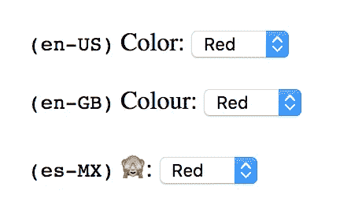

# ES6 代理和本地化

> 原文：<https://medium.com/hackernoon/es6-proxy-and-localization-c1269bbc0a26>

也许你听说过 JavaScript 代理，并认为，“嘿，这很酷，但我应该用它来做什么呢？”别担心，我也是这么想的，直到最近我需要一个包罗万象的解决方案。看哪，间接中介只知道“代理”从灰烬中升起，点燃了整个已知宇宙的所有文本编辑器。

在我的用例中，我希望传回一个对象(更像一个字典)，该对象包含应用程序中每个本地化字符串的键/值对。但是这里的神奇之处在于，任何丢失的字符串都应该返回一个看不见邪恶的猴子表情符号(🙈)因为这意味着开发人员打错了一个字母，或者字符串根本没有翻译！猴子不会评判你。

让我们看一些 JSON 的例子，当一个来自大洋彼岸的好人访问我们的应用程序时(有人使用了`en-GB`)。

```
{
  "color": "Colour",
  "elevator": "Lift",
  "pants": "Trousers"
}
```

起初，您可能认为 [ES5 Getter](https://developer.mozilla.org/en-US/docs/Web/JavaScript/Reference/Functions/get) 可以解决我们的问题，因为您可以覆盖一个属性(比如`elevator`)并检查是否没有定义值。但是你不知道的钥匙呢？你不知道你不知道什么。

进入[代理](https://developer.mozilla.org/en-US/docs/Web/JavaScript/Reference/Global_Objects/Proxy)，李小龙在其中扮演一名网络开发人员，决心帮助捕获导致他妹妹死亡的失踪钥匙。

```
let obj = JSON.parse(json);
let l10n = new Proxy(obj, {
  get(target, name) {
    if (typeof target[name] === 'undefined') {
      console.error(`Localized string is missing: ${name}`);
      return '🙈';
    }
    return target[name];
  }
});
```

我们称本地化对象为`l10n`,因为我们很懒，根据[维基百科](https://en.wikipedia.org/wiki/Internationalization_and_localization#Naming)和其他懒惰开发者的说法，这个缩写是常用的。没人有时间打字。我为什么要写这篇文章？

现在回到代理使用的话题…我们来谈谈 React。

React 很棒，你应该使用它，因为互联网是这么告诉你的，一个博客作者在他们的博客上写了关于它的博客，所以不要挑战这个博客。拥抱博客世界。

```
const SelectAColor = (props) => (<div>
  <label>{props.l10n.color}:</label>
  <select>{props.colors.map(c =>
    <option value={c}>
      {c}
    </option>)}
  </select>
</div>);
```

现在我们有了一个 React 组件，让我们看看它如何为来自不同国家的用户呈现。



美国看起来不错！大不列颠看起来很棒！墨西哥是啊，卡兰巴！我们忘记翻译成西班牙语了！猴子不会说谎，但猴子是宽容的。

同样的情况也会发生，如果你拼错了`props.l10n.color`，例如`props.l10n.colr`，在这种情况下，猴子会再次拜访你，对你的无能睁一只眼闭一只眼。

如果你想看演示，请访问 [CodeSandbox](https://codesandbox.io/s/48lknyyo47) 查看运行中的代码，并见证壮观的猴子疯狂！

*原载于 2018 年 1 月 1 日*[*【www.ceriously.com】*](https://www.ceriously.com/blog/post.php?id=2018-01-01-es6-proxy-localization.md)*。*