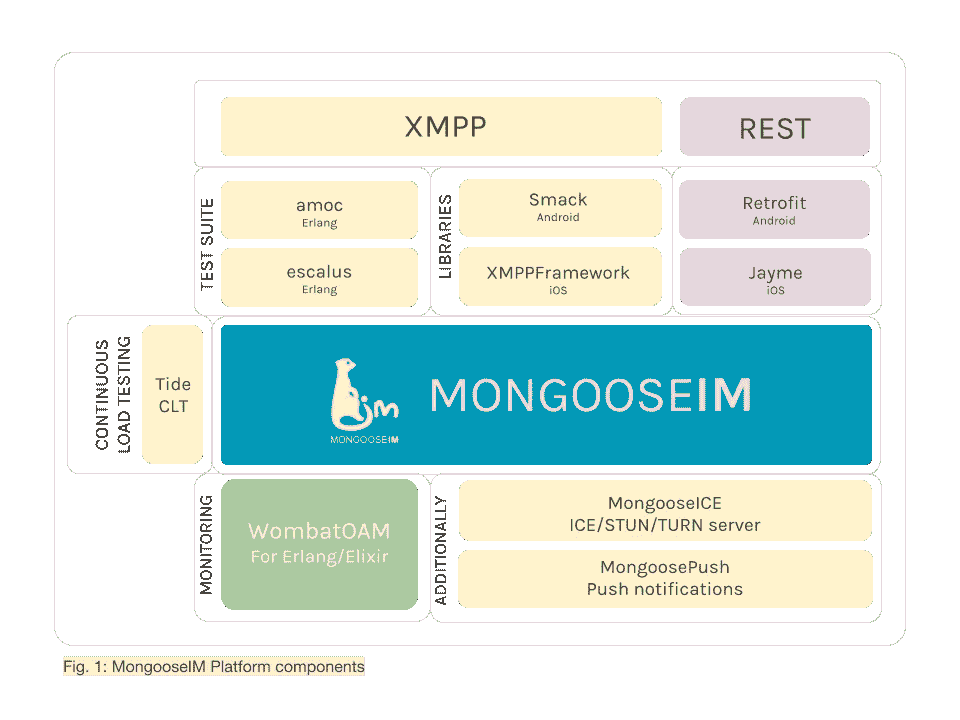

# Escalus 4.0.0:更快更广泛的 XMPP 测试

> 原文：<https://medium.com/hackernoon/escalus-4-0-0-faster-and-more-extensive-xmpp-testing-9e52614b5abd>

康拉德·泽梅克

Escalus 4.0.0 是我们为 Erlang 开发的 XMPP 客户端库的最新版本，是我们的[mongoseem 平台](http://www2.erlang-solutions.com/l/23452/2018-05-24/5hyrc5)的工具和服务的一个组件。它是为方便测试 XMPP 服务器而创建的工具，也可以用作独立的 Erlang 应用程序。与其他 XMPP 客户端相比，Escalus 提供了丰富的测试 API(断言、节构建…)和高度的灵活性，允许完全重新定义其行为。

Erlang Solutions 使用它对[mongoseem XMPP 服务器](http://www2.erlang-solutions.com/l/23452/2018-05-24/5hyrc5)进行集成、负载和压力测试。

最新版本 Escalus 4.0.0 现在支持 Erlang 20，并提供了以下特性和改进:

# 新的基于快速 XML 的 XML 解析器

Escalus 4.0.0 包含了我们的 [exml](https://github.com/esl/exml) Erlang XML 解析器的新版本！解析器的处理层从头开始重写，进行了广泛的剖析和优化；因此，在编码和解码 XML 元素时，新的解析器平均比以前快 5 倍。

# 包含的 XML 查看器

包含被跟踪的 XMPP 节的文件现在包括 Sergey Chikuyonok 开发的[强大的 XML 查看器。查看器以可读的方式显示元素，并支持折叠、按名称搜索、XPath 支持等等。检查您的 XMPP 流量从未如此简单！](https://github.com/sergeche/xmlview)

# 消息流水线

新的 XML 解析器还支持消息管道，这意味着客户机可以一次安全地发送和接收多个节。这可以极大地提高许多用例的效率，并且在未来将用于将 Escalus 的 XMPP 连接时间加快一个数量级。

# 节的传输级元数据

用于接收和交付 XMPP 节的传输过程现在可以传递元数据，这些元数据将包含在交付给 Escalus 客户端的元素中。目前，由现有传输实现设置的元数据仅限于接收时间戳，但是可以很容易地被定制的解决方案覆盖和扩展。

# 其他改进

TCP 连接现在设置了一个`nodelay`选项，减少了 Escalus 和 XMPP 服务器之间的通信延迟。如果你不喜欢这种变化，Escalus 4.0.0 还支持轻松覆盖 TCP 选项，允许你禁用它，以及更多-包括缓冲区大小或 ToS 标志的具体设置。

大量的重构更改、细微的 API 改进、错误修复、性能增强，以及越来越多的用于检查和构造节的有用函数，都会在测试所有最重要的特性时带来更流畅的体验。

# 在 Escalus 4.0.0 上测试我们的工作并分享您的反馈

在 GitHub 上查看我们关于 Escalus 4.0.0 & 3.1.0 的[完整发布说明。尽情发挥，让我们知道你的想法！](https://github.com/esl/escalus/releases)

帮助我们改进 MongooseIM 平台:

1.  开始我们的回购: [esl/escalus](https://github.com/esl/escalus/)
2.  报告问题:[ESL/mongoseem/issues](https://github.com/esl/MongooseIM/issues)
3.  通过推特分享你的想法:twitter.com/MongooseIM
4.  下载新版本的 [Docker 图像](https://hub.docker.com/r/mongooseim/mongooseim/)
5.  注册我们的专用[邮件列表](http://www2.erlang-solutions.com/l/23452/2018-05-24/5hyrc7)，了解关于 MongooseIM、消息传递创新和行业新闻的最新消息。
6.  查看我们的[mongoseem 产品页面](http://www2.erlang-solutions.com/l/23452/2018-05-24/5hyrc5)了解更多关于 mongoseem 平台的信息。

*原载于*[*www.erlang-solutions.com*](http://www2.erlang-solutions.com/l/23452/2018-05-24/5hyrcr)*。*