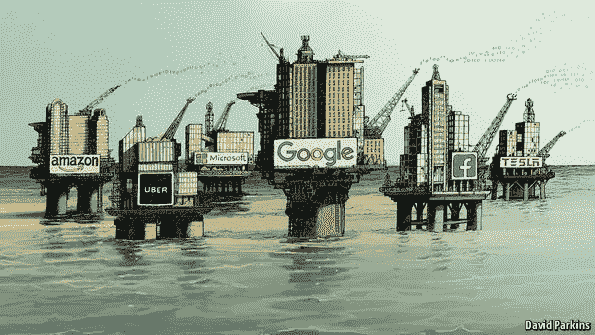
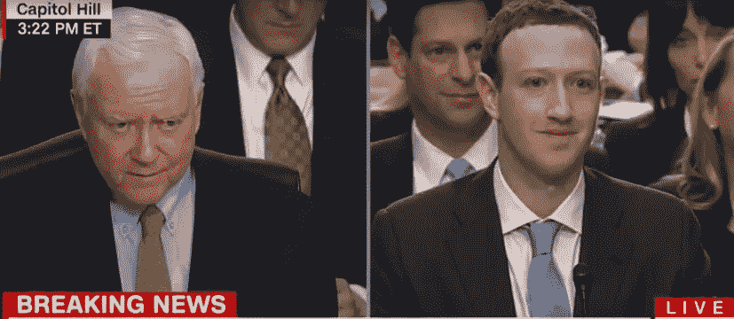
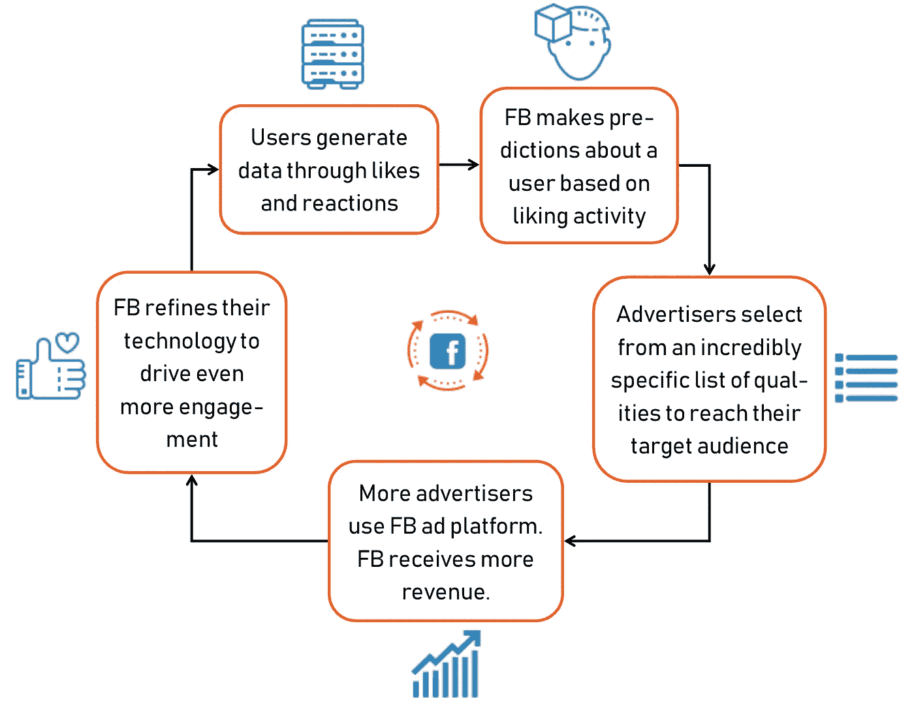
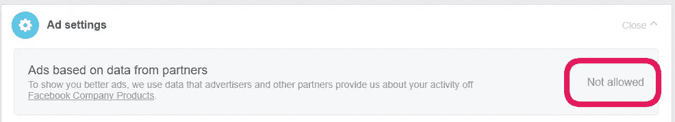
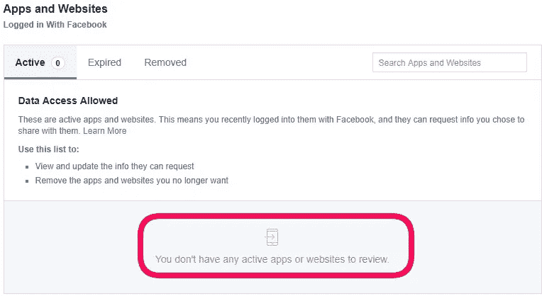
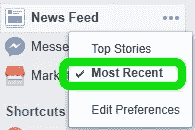

# 逃离网络泥淖

> 原文：<https://medium.com/hackernoon/escaping-from-cyber-slobdom-3333f83bcc18>

## 在一个数据开发和误导的时代，如何保持健康的社交媒体卫生

如果你使用互联网(如果你正在阅读这篇文章，我假设你会使用)，你可能在过去一周内收到了至少十封电子邮件，内容是关于你所使用的应用和服务的最新隐私政策。这是对欧盟最近修订的 [GDPR](https://www.eugdpr.org/gdpr-faqs.html) (一般数据隐私条例)的回应，该条例于 5 月 25 日生效，限制了企业可以收集的数据量以及如何使用这些数据。但是，尽管数据隐私的风险因高调事件而渗透到[公司](https://newsroom.fb.com/news/2018/01/news-feed-fyi-bringing-people-closer-together/)政府的意识中，包括 2016 年美国大选期间的[假新闻争议](https://www.washingtonpost.com/business/economy/russian-propaganda-effort-helped-spread-fake-news-during-election-experts-say/2016/11/24/793903b6-8a40-4ca9-b712-716af66098fe_story.html?noredirect=on&utm_term=.39e8a7a3cdaa)和最近的[剑桥分析公司丑闻](https://www.politico.eu/article/a-time-of-reckoning-for-facebook-and-politics-online/)，但似乎公众尚未消化这些风险，也没有消化这些风险与我们*比其他任何人*更相关的事实。这就是为什么我想把话题转移到我们作为用户可以做些什么来改变我们的数字行为，并适应不断增长的数据经济和与之相关的风险。

## **消费者责任主张**

当然，虽然我们应该向脸书和其他社交媒体平台施加压力，让他们改变政策，遵守更严格的标准，但我认为责任至少部分在于我们——用户——负责任地做出回应，改变我们的行为，以反映数字世界正在发生的变化。虽然有些人已经采取了完全停用或删除他们的脸书账户的措施，但大多数用户还是继续使用，就像什么都没发生过一样。这两种方法都不理想。让我们看一个简单的类比:

如果你的钱包被偷了，你会怎么做？

A)完全不要带钱包

期待钱包制造商开始销售防盗钱包

*C)向政府施压，对偷钱包的人施以更重的惩罚*

*D)以上都不是*

最有可能的是，你的答案会是 D，然后你就会开始把钱包放在前面的口袋里。同样，作为这些数据驱动平台的频繁用户，我们不能完全依靠那些使用或监管我们数据使用的机构来彻底解决问题。

Some say data is the new oil, so it’s no wonder tech companies want as much of it as possible.

因此，我为我们这些选择保持联系的人提出了一套指导方针——这仍然有许多好的理由——以便我们可以负责任地适应不断变化的数字环境。因为随着数据价格的上涨，与处理和提供数据相关的风险也在增加。

你如何维持一种用户不为你的服务付费的商业模式？

首先，我认为应该做一些澄清。脸书的商业模式到底是什么？他们不会像许多人倾向于相信的那样出售你的数据。然而，他们确实出售用户定位服务，这种服务利用你的数据，让广告商更好地接触到他们的目标受众。

Facebook’s business model is entirely ad driven, as made clear by founder Mark Zuckerberg in his recent [supreme court hearing](https://www.wsj.com/video/mark-zuckerbergs-five-hour-face-off-with-congress-in-five-minutes/5C7E88ED-A058-4C2F-873D-34E5EFB817F6.html) regarding the Cambridge Analytica scandal.

随着对脸书如何使用我们的数据有了更好的了解，我相信我们可以更好地决定如何防止它被以不良的方式使用。我为您的简单理解创建了一个方便的流程图，并在下面详细概述了各个步骤，通过每个步骤，我们将注意到数据流是一个基本主题，它是贯穿当今社交媒体行业的血脉，也是对广告商如此宝贵的资产:

1.  **通过活动产生数据:**用户参与脸书，喜欢帖子和页面，根据这些用户的兴趣产生数据。
2.  **数据聚集和简档:**脸书将“喜好数据”聚集成一组概括简档，将对特定主题(人物、地点、电影等)的喜好关联起来。等等)与用户的个人信息(年龄、性别、性取向等等。).然后，他们可以使用这些配置文件来“预测”用户尚未明确说明的特征(政治意识形态、宗教，甚至智力水平)。*旁注:我鼓励我所有的读者尝试一下这个* [*工具*](https://applymagicsauce.com/) *，看看你的喜好是如何准确地告知一个总体概况的(不要担心，结果不会被存储，只用于***以提供信息)。**
3.  ***使用简介进行** [**定向广告**](https://www.facebook.com/about/basics/advertising/on-facebook) **:** 脸书使用这些简介为广告商提供选择，以选择其目标受众的[难以置信的特定品质](https://www.washingtonpost.com/news/the-intersect/wp/2016/08/19/98-personal-data-points-that-facebook-uses-to-target-ads-to-you/?utm_term=.15405677e11e)，确保广告到达最有可能*购买其产品或服务的*人群，或者至少点击一下。*
4.  ***脸书从广告商那里获得越来越多的收入，他们认识到这是投资回报的最佳广告平台。更多的广告客户加入这个平台，脸书可以提高广告价格。***
5.  ***更多用户→更多数据。随着脸书收入的增加，他们可以增加营销、产品开发和研发的预算，所有这些都有助于获得新用户，并为现有用户创造更具“粘性”的体验，从而确保产生越来越多的新数据。***

**

*Facebook’s cycle of data gathering and use for targeted advertising.*

*请注意，在这个过程中，广告客户没有得到*访问*你的——用户的——数据。他们没有办法将你的名字与你的个人资料(爱好和兴趣)联系起来，因此，当数据在合适的人手中时，你的个人隐私是相对安全的。但是，我们会错误地认为那些*右手*是如此熟练，以避免任何或所有的摸索，或者他们没有自己的议程。因此，尽管未来发生违规的可能性相对较低，但我相信每个人都应该了解我们数据使用的几个相关方面:*

1.  ***腐败的政治** [**国难当头**](https://www.nytimes.com/2016/11/15/opinion/mark-zuckerberg-is-in-denial.html?rref=collection%2Fcolumn%2Fzeynep-tufekci) **和廉洁的政治** [**民主**](https://www.washingtonpost.com/news/the-switch/wp/2018/01/22/facebook-admits-it-sometimes-harms-democracy/?utm_term=.7e177cd06fe6) **。**这个问题是众所周知的，在俄罗斯干涉 2016 年美国总统选举的问题上已经被没完没了地报道了，所以我将对问题 2、3 和 4 进行更多的阐述。*
2.  ***通过关联对剖析求幂。**脸书还能够根据*你的*活动(即给定用户的朋友群的活动和由此产生的档案)为你的朋友建立档案。简称 [*酷似者*](https://www.facebook.com/business/help/164749007013531) *瞄准*，这种方法究竟是什么给广告主产生了如此不可思议的价值；他们可以准确地锁定那些可能没有明确表达过兴趣(通过喜欢)的人，而只是与表达过兴趣的人有联系。因此，通过按关联生成这些简介，脸书广告可以触及更广泛的受众。然而，这对用户来说意味着，你的喜好会影响你朋友看到的广告，反之亦然。*
3.  ***来自任何地方的数据，来自任何地方的数据。**脸书的数据收集不仅限于平台本身的活动，而是遍布整个网络。从选择加入脸书观众网络的第三方网站(“ [*《脸书广告的力量》，关闭脸书*](https://www.facebook.com/business/news/audience-network) ”)，到与你在脸书的个人资料相链接的应用程序，你的数据正从你的手机(或浏览器)进入脸书的手中，使得定位更加准确。在脸书上发起广告活动后，企业还可以在自己的网站上跟踪用户的活动，然后根据这些活动定制未来的广告。除了产生更相关的广告之外，这些操作还代表了一种严重的隐私威胁，如果受到威胁，可能会泄露个人甚至家庭的最隐私的细节。*
4.  *脸书算法反馈产生的回音室效应，向用户展示他们想让 T2 看到的东西。随着脸书的 newsfeed 算法了解你的观点和兴趣，它将开始向你展示一系列旨在确保最高参与可能性(即喜欢)的内容。这意味着你最终只会看到反映你已经拥有的观点的故事和内容，导致一个被称为[回音室效应](https://en.wikipedia.org/wiki/Echo_chamber_(media))的信念强化循环。从长远来看，这导致了极端的两极分化——让自由派更自由，保守派更保守——导致数字生态系统中更多的冲突、愤怒和误解。*

*更不用说脸书在精神健康领域带来的其他与数据无关的风险了。*

# ***什么是社交媒体卫生？***

*虽然我们可以无休止地谈论数据开发的潜力和人工智能开辟的未来可能性，但我最不想做的事情就是引发任何恐慌或偏执。这当然不是一个注定要失败的事业，我也不是要谴责脸书是“邪恶的”，我也不会责骂我的读者彻底删除他们的社交媒体账户(2018 年 12 月更新:我的立场已经改变，我认为[脸书是邪恶的](/swlh/the-real-reason-facebook-is-evil-584a40a74483)，并从此删除了我的账户。但对于那些不愿意走这么远的人，请继续读下去)。相反，我会提供一些非常简单的建议，让我们充分利用我们的数字体验，而不会牺牲我们数据的完整性、我们的隐私和我们看到的内容的质量。这就是我所说的实践良好的“社交媒体卫生”。*

## *加强对隐私的控制*

*也许让它自己沮丧的是，脸书确实提供了工具来配置从哪里收集和使用你的数据。选择退出一些更具剥削性的操作是很简单的——也就是说，如果你知道去哪里寻找。因此，我想鼓励我的读者对我们选择启用的设置采取警惕的态度，例如退出由第三方[网站](https://www.facebook.com/ads/preferences/)和[应用](https://www.facebook.com/settings?tab=applications)的数据驱动的广告:*

**

*Go to “Settings” “Ads” and “Ad settings” to opt out of data sharing from third party websites.*

**

*Go to “Settings” and “Apps and Websites” to opt out of data access from third party applications.*

## ***点赞少，评论多***

*喜欢，以及最近的“[反应](https://newsroom.fb.com/news/2016/02/reactions-now-available-globally/)”，是脸书衡量用户兴趣的一个非常简单的工具。因此，通过喜欢(或回应)更少的帖子，我们将为脸书提供更少的数据来描述我们——以及我们的朋友——留下另一个可能更具建设性的参与选项——评论。*

*通过打开双向交流的大门，评论可以在你和他人之间建立更有意义的联系。与从预设列表中选择不同，评论让我们的反应更具创造性，例如，在上传的照片中指出构图的复杂性，或者在“签到”帖子上告诉朋友你在共同地点的经历。评论也打开了学习新事物的可能性。问问题，质疑观点(健康的辩论不会伤害任何人)，提供提示、建议和经验。通过在个人层面上分享我们的知识和经验，而不是被动地让人们的生活在我们眼前滚动，我们可以选择最大化我们使用社交媒体的收益——利用个性，而不是共性，为了相互理解，而不是为了地位或自我满足。*

## *避免脸书头条新闻算法的扭曲现实*

*如果没有人喜欢它,《脸书邮报》还会存在吗？由于分享的内容越来越多，为了最大限度地提高用户参与度，脸书改变了向用户展示信息的方式，在 2011 年[推出了“头条新闻”。Top Stories 向用户展示它“认为”他们会喜欢、赞同和参与的内容。](http://techland.time.com/2011/09/21/facebook-redesigns-home-page-news-feed/)*

> *热门新闻故事由社交网络系统基于排名算法来选择，该排名算法结合了基于用户交互对社交网络系统中的兴趣、用户和实体的密切关系的分析。*

*(引用自脸书公司的专利申请:[在社交网络系统上选择性地提供内容](https://patents.google.com/patent/US20130246521A1/en?q=newsfeed&assignee=facebook&scholar&page=4))*

*正如我们所看到的，提要中内容的这种选择性可能会导致一些意想不到的负面后果(即回音室效应)。但是撇开心理影响不谈，当我们只接触到*头条*新闻时，我们看到的只是在我们的社区和朋友网络中真实发生的事情的表面。我们错过了表面之下的一切，那些可能很少用户喜欢，但却很有见地或发人深省、鼓舞人心或有趣的东西——一个笑话或一个观察，一张日落照片或一个关于最近科学突破的故事。*

**

*The **“Most Recent”** option can be found by clicking the three dots next to “**News Feed**”*

*社交媒体通过照片和视频让我们身处世界任何地方成为可能；与不同地点、不同文化、背景和世界观迥异的人接触，所有这些都是实时的，所有这些都是通过手指触摸来实现的，如果我们透过表面来看，所有这些都是可以体验的。为此，我们只需切换到新闻提要上的“最近”选项。*

## *断绝关系*

*不是来自你的朋友，不是来自马克·扎克伯格，而是来自你自己——也就是你自己在社交媒体上的表现。通过将你在社交媒体上的名字改成在法律协议、身份证和政府文件上找不到的*，你将能够将你的现实生活活动与虚拟活动区分开来。换句话说，无论你在现实世界中有什么记录(购物、合同、邮件列表等)，都不会归因于你在脸书的个人资料，反之亦然，如果任何一方违规。**

*还有其他几个在社交媒体上改名的好理由，我将在以后的文章中讨论。*

## *明智地选择你追随的人*

*鉴于如今任何人都可以创建一个公共的脸书页面，涉及任何感兴趣的话题，任何亚文化，世界观或信仰，除了为公众人物(无论是默默无闻还是知名人士)提供的大量页面，很容易理解有许多质量不达标的页面，其中一些页面的意图不太纯粹——是否传播虚假信息，影响观点，或者只是获得不应有的人气。*

*为了过滤掉那些质量差的内容，让你的 feed 变得新鲜、有趣、有信息，我提出了三点建议，来帮助指导我们接下来的决定。*

*第一:关注那些鲜为人知的人物和组织，以产生更大的影响。关注一个页面，尤其是一个高调主题的页面，并不一定会给相关人员或组织带来荣誉，因为这些页面通常是由公关机构、粉丝或不相关方运营的。正如我们已经了解到的，你的喜欢可能会比你想象的向广告商透露更多关于你的信息。*

***第二:关注你能证明的个人和组织*脸书***的，不仅仅是因为他们已经有了一大批追随者。病毒式传播并不能证明一贯的质量。*

*第三:尽量少发布新闻。虽然许多新闻媒体可能是合法的，但有些是彻头彻尾的假新闻(请注意:不要发布真实的新闻)，而另一些只是有一个极端偏见的议程。在社交媒体上，通常很难区分这三者，导致用户相信虚假信息或采取片面观点。现在，最好从其他地方获取新闻(比如时事通讯)。*

*现在，随着对脸书的目标、算法和我们参与的意义有了新的理解，让我们以全新的态度和清晰的视角继续前进，进入社交网络的数字乌托邦。让我们摆脱旧的、不经意的喜欢追随的方式，让自己免受误导内容的风险。这样做，我们将加强我们的联系，更真实地表达自己，并从我们的社交媒体体验中获得最大的满足感，同时对我们虚拟行为的完整性以及它们对我们自己、我们的朋友和社会的影响充满信心。*

**免责声明:虽然脸书经常被提及，但上述原则可以很容易地适用于大多数其他社交媒体平台，包括 Instagram、Twitter，甚至 LinkedIn。**