# 在 iOS 11.4 上使用回调逃离沙盒

> 原文：<https://medium.com/hackernoon/escaping-sandbox-using-callbacks-on-ios-11-4-73fb1b818f35>

## *阿里巴巴技术团队的操作系统越狱内幕*

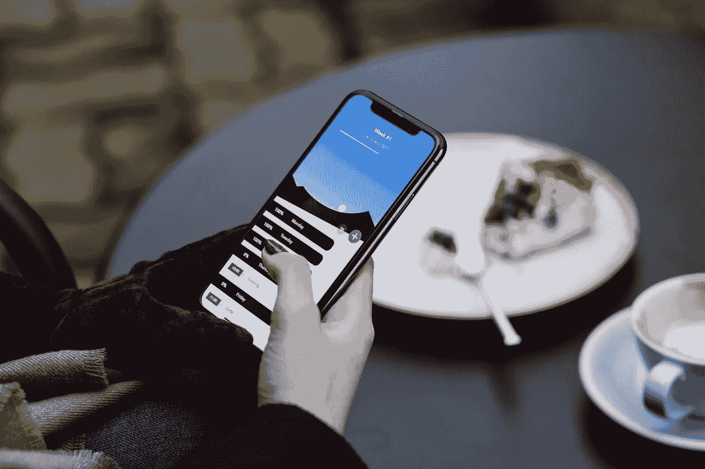

(Article by Zheng Min 郑旻 and Bai Xiaolong 白小龙 from the **Alibaba Security Lab**)

# 沙箱

苹果的沙盒在 macOS 10.5 中被称为“安全带”，这是 MACF 政策的第一次全面实施。苹果在 macOS 上试用成功后，将沙盒机制应用到了 iOS 6 上。在实施过程中，该政策与数十项业务挂钩。当新的系统调用或新发现的威胁出现时，挂钩的数量一直在稳步增长。下表显示了不同 XNU 版本中沙盒的挂钩计数:

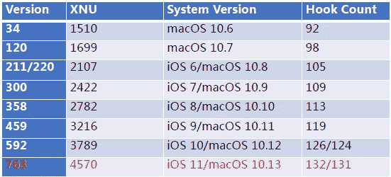

From *OS internals

最初，苹果的沙盒使用黑名单方法，这意味着苹果最初集中于已知的危险 API 并阻止它们，默认情况下允许所有其他 API。然而，随着苹果沙盒的发展，它采用了白名单方法，拒绝所有 API，只允许苹果信任的安全 API。

在 macOS 中，描述文件是可见的，并储存在/System/Library/Sandbox/Profiles 中。在 iOS 中，概要文件被硬编译到/usr/libexec/sandboxd 中。我们很难解码沙盒配置文件，但我们可以遍历所有 Mach 服务，根据返回值获得 mach-lookup 列表(例如，通过 JL 的 sbtool)。

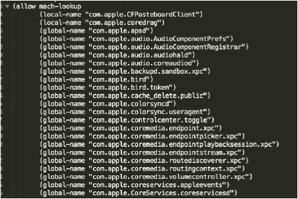

为了发现漏洞，我们需要分解和分析包含相关 Mach 服务的处理函数的二进制文件。幸运的是，/System/Library/LaunchDaemons 包含了大多数 Mach 服务的配置列表。在 plist 文件中，“ProgramArguments”显示二进制文件的路径，“MachServices”显示相关的 Mach 服务。因此，通过将 LaunchDaemons plist 文件与 mach-lookup 列表相结合，我们可以获得所有可以在沙箱内部访问的 mach 服务和相关二进制文件。

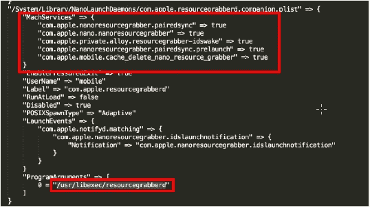

# iOS IPC:马赫、XPC 和 NSXPC

iOS 上有一组丰富的 IPC 机制(例如 URL 方案、Mach、管道),其中大多数可供第三方应用程序使用。在本文中，我们主要关注 Mach IPC，它提供了一个面向消息和基于能力的 IPC 工具。Mach IPC 代表了其前身(即 Accent 和 RIG)使用的类似方法的演变。Mach 的低级 IPC 实现利用 VM 子系统，在写入时复制优化的帮助下高效地传输大量数据。此外，Mach 消息包含类型化数据，其中可能包含端口权限和对大内存区域的引用。

基于 Mach message，Apple 开发了 XPC，这是一个轻量级机制，用于集成 GCD 和 launchd 的基本进程间通信。与原始马赫消息相比，XPC 更安全，更易于使用。但是，XPC 服务维护的成本很高。NSXPC 消息建立在 XPC 消息的基础上，允许抽象 XPC 连接和远程对象。通过马赫消息、XPC 消息和 NSXPC 消息，沙盒应用可以与未沙盒的马赫服务、XPC 服务和 NSXPC 服务进行通信。因此，如果服务没有以预期的方式处理消息，它们可能会被沙盒应用程序损坏。

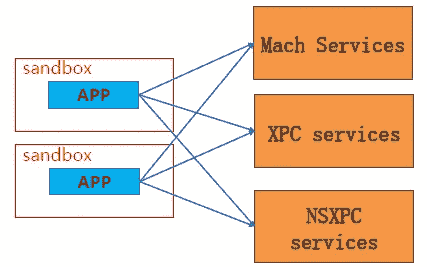

# 从老虫子到 0 天虫子

在 iOS 11.2.5 中，苹果修复了 bluetooth d(CVE-2018–4087 作者@raniXCH)中的一个会话劫持漏洞。bluetoothd 的“com . apple . server . bluetooth”Mach 服务中有 132 个功能。并且漏洞存在于 BTLocalDeviceAddCallbacks()函数中。沙盒应用可以使用 BTSessionAttach 为 bluetoothd 创建一个 session_token，然后使用 BTLocalDeviceAddCallbacks()为事件通知注册一个回调。

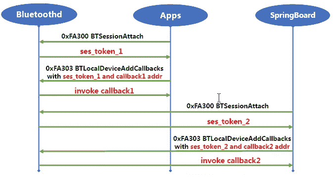

然而，Bluetoothd 仅使用会话令牌来识别进程，这意味着我们可以使用沙盒应用程序通过会话令牌劫持 bluetoothd 和未沙盒进程之间的通信，然后控制未沙盒进程的 PC 指针。

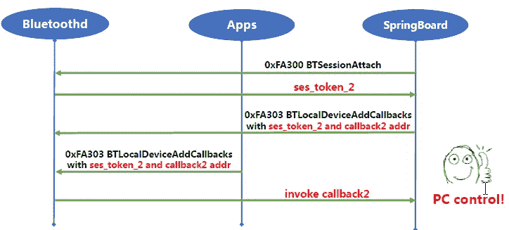

此外，会话令牌太容易被暴力破解，因为它只有 0x10000 (0x0000 -0xFFFF)个可能值。在 iOS 11.2.5 中，苹果通过在每个会话中添加一个 user_id (=arc4random())修复了这个问题。只有进程知道 user_id，bluetoothd 将使用 user_id 检查 ses_token 的映射。

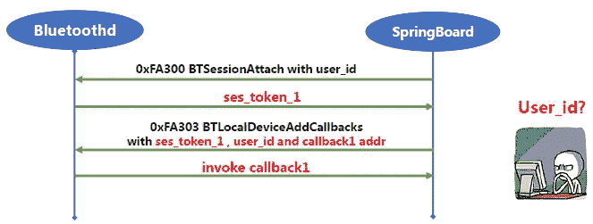

然而，在分析了其他函数后，我们发现了两个新的零日 bug。第一个 bug 存在于 BTAccessoryManagerAddCallbacks()中。与 BTLocalDeviceAddCallbacks()相同，BTAccessoryManagerAddCallbacks()将为 BTAccessoryManger 注册一个回调，但攻击者不需要提供 user_id。但是，只有当 iOS 设备连接到新设备时，才能触发回调事件。这意味着我们需要手动点击设置中的蓝牙设备来触发回调事件。

幸运的是，我们发现了蓝牙发现代理中存在的另一个 bug。沙盒应用程序可以使用 BTDiscoveryAgentCreate()为其他进程创建发现代理回调，然后使用 BTDiscoveryAgentStartScan()触发回调事件，而无需手动单击。

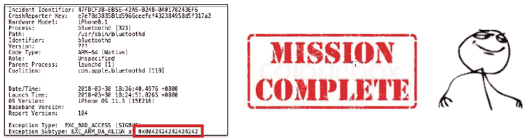

***更新:6 月 7 日向苹果报告了这两个“零日”漏洞，苹果在 iOS 11.4.1 以及 CVE-2018–4330 和 CVE-2018–4327 的 iOS 12 beta 中修复了它们。请将您的 iOS 更新到最新的 iOS 11.4.1，以防御潜在的攻击。***

# 从 PC 控制到 ROP

我们利用的目标是不仅控制 PC 指针，而且控制整个过程。所以我们需要创建一个 ROP 链，为目标进程做一个堆喷。在这种情况下，我们使用 MACH_MSGH_BITS_COMPLEX Mach msg 和 MACH_MSG_OOL_DESCRIPTOR 内存来进行堆喷射。如果我们向目标进程发送这种消息，而没有收到消息，ROP 链将持久地停留在目标的内存空间中。此外，我们可以使用一个神奇的地址(0x105400000)来设置回调地址，以便 PC 跳转。

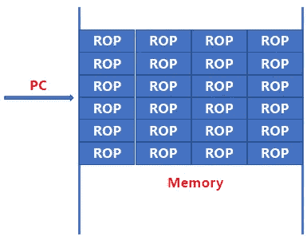

为了方便地控制程序流程，我们需要控制堆栈寄存器。因此，我们需要找到一个小工具来做堆栈透视。

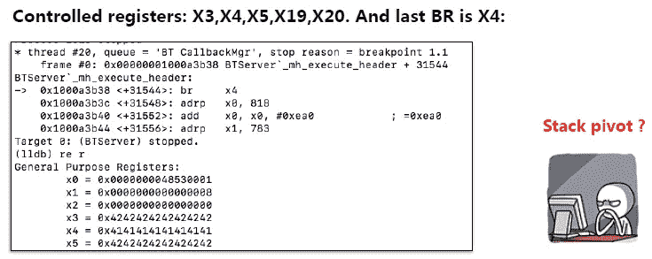

可以在 libsystem_platform.dylib 找到一个很棒的 stack pivot 小工具，通过使用这个小工具，我们可以通过 X0 寄存器来控制 SP 寄存器。之后，我们可以设置 X30 寄存器，然后使用“ret”小工具来执行任意的 ROP 链。

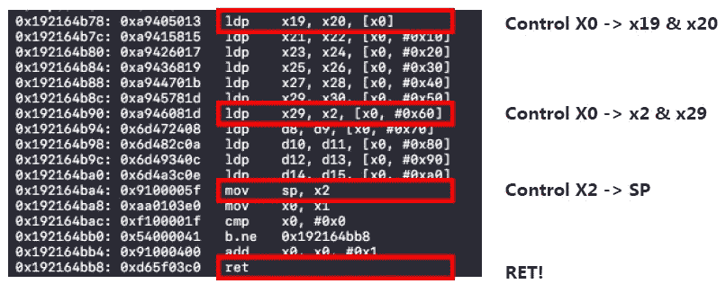

# 从 ROP 到任务端口

在 iOS/macOS 中，端口为 IPC 提供端点。消息可以发送到端口或从端口接收。此外，端口可以包含权限，并且端口权限可以在消息中传递。一个进程最重要的端口是它的任务端口，可以通过 mach_task_self()获得。你可以通过任务端口控制一个进程的内存和所有寄存器。例如，mach _ VM _ allocate(target _ task _ port，&remote_addr，remote_size，1)可用于在远程进程中分配内存，mach_vm_write(target_task_port，remote_address，local_address，length)可用于将数据复制到远程进程中。因此，如果我们能够获得一个进程的任务端口，就可以很容易地通过 Mach msg 控制整个进程。

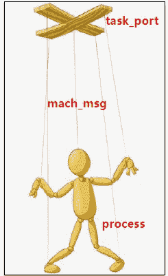

从 Mach_portal 学到的一些技巧:一种用户态利用技术是在远程进程中执行 ROP，并将远程进程的任务端口发回攻击 app。首先，我们使用 mach_port_allocate()在攻击应用程序中分配 0x1000 个端口，然后使用 mach_port_insert_right()向这些端口插入一个发送权限。之后，我们可以通过 MACH_MSG_PORT_DESCRIPTOR 类型的 OOL Mach 消息将这些端口发送给远程进程。下一步是进行堆喷射，以便将 ROP 链发送到远程进程，然后使用 bluetoothd bug 来控制 PC。为了通过 ROP 链将任务端口发送回我们的攻击 app，我们需要知道我们的攻击 app 的端口号。然而，我们不能使用 launchd 来帮助我们。幸运的是，端口号可以靠蛮力猜出来(0x103+0x100*N)。这就是为什么我们给远程进程发送 0x1000 个端口(为了增加成功率)，用 ROP 链调用 mach_msg() 0x100 次来猜测端口号。

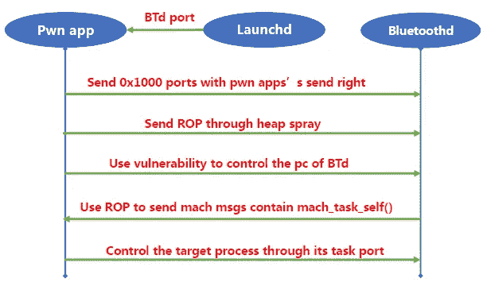

得到 unsandboxed 进程的任务端口后，我们就可以完全控制它了。然而，iOS 11(不在 macOS10.13 中)将限制扩展到沙盒应用程序进程的所有任务端口的使用，我们无法使用之前的方法获得任务端口:

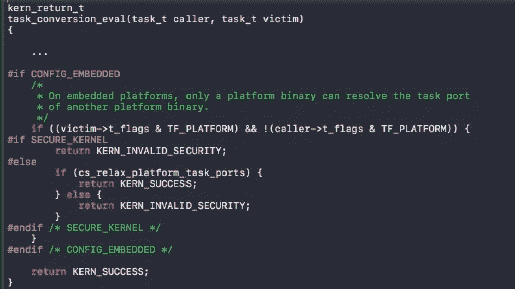

# B 计划

即使我们不能获得任务端口，我们仍然可以使用 ROP。可以在 CoreFoundation 中找到用于带有任意参数的函数调用的通用原语:

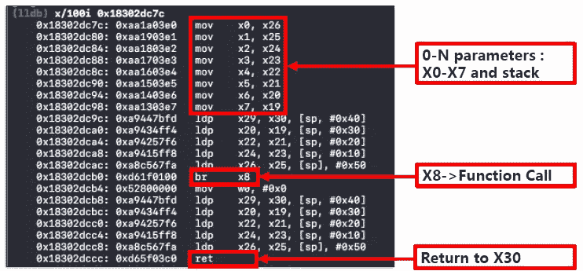

通过使用这些 ROP 小工具，我们可以控制未打包的系统服务，并通过更多的攻击面进一步攻击内核。

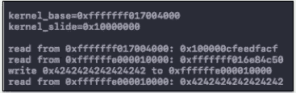

# **参考文献**

1.MacOS 和*OS 内部【http://newosxbook.com/ T2

2.盘古 9 内件[https://www . black hat . com/docs/us-16/materials/us-16-Wang-Pangu-9-Internals . pdf](https://www.blackhat.com/docs/us-16/materials/us-16-Wang-Pangu-9-Internals.pdf)

3.三重 _ 获取[https://bugs.chromium.org/p/project-zero/issues/detail?id=1247](https://bugs.chromium.org/p/project-zero/issues/detail?id=1247)

4.[https://blog . zimperium . com/CVE-2018-4087-POC-逃避-沙盒-误导-蓝牙 d/](https://blog.zimperium.com/cve-2018-4087-poc-escaping-sandbox-misleading-bluetoothd/)

5.马赫门户[https://bugs.chromium.org/p/project-zero/issues/detail?id=965](https://bugs.chromium.org/p/project-zero/issues/detail?id=965)

# 更新

***这两个“零日”bug 在 6 月 7 日被报告给了苹果，苹果在 iOS 11.4.1 以及 iOS 12 beta 中修复了它们，CVE-2018–4330 和 CVE-2018–4327。请将您的 iOS 更新到最新的 iOS 11.4.1，以防御潜在的攻击。***

# 阿里巴巴科技

关于阿里巴巴最新技术的第一手深度资料→脸书: [**《阿里巴巴技术》**](http://www.facebook.com/AlibabaTechnology) 。推特:[**【AlibabaTech】**](https://twitter.com/AliTech2017)。