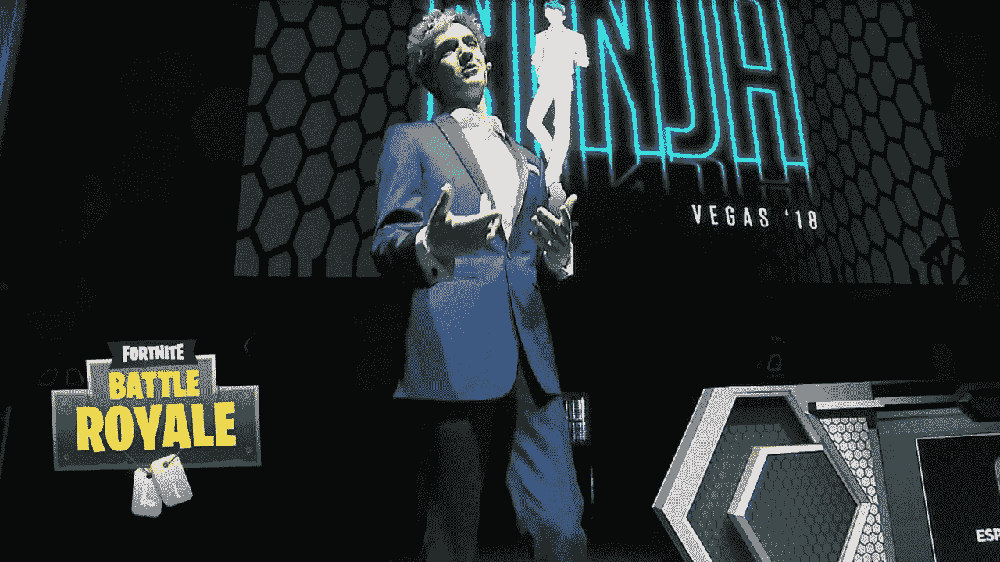

# 电子竞技:娱乐的未来

> 原文：<https://medium.com/hackernoon/esports-the-future-of-entertainment-28642fa17959>

周六晚上由[忍者](https://www.twitch.tv/ninja)在卢克索举办的[堡垒之夜](https://www.epicgames.com/fortnite/en-US/buy-now/battle-royale)比赛在 Twitch 上吸引了[创纪录的同时观看人数，并展示了现场](https://www.forbes.com/sites/insertcoin/2018/04/22/ninjas-fortnite-battle-royale-vegas-event-shatters-his-old-twitch-record/#18f843135850)[娱乐](https://hackernoon.com/tagged/entertainment)的[未来](https://hackernoon.com/tagged/future)将会是什么样子。

Ninja addresses the crowd at the Fortnite event in Las Vegas 4/21/18

昨晚，我听到了关于游戏明星的讨论，比如 Ninja 将成为未来的“维加斯赛道”，举办赛事并吸引大批观众(传统艺人和运动员迄今为止就是这样做的)。

昨晚向我展示了娱乐的未来。游戏节目在 20 世纪中期突然出现后吸引我们几十年的方式，就是游戏比赛现在吸引人们的方式。

**为什么？订婚。真实性。可及性。**粉丝可以直接联系，定期通过 Twitch、Twitter 和其他平台联系。球迷们也可以玩这个游戏，并有机会成为和他们最喜欢的球员一样优秀的球员。你的肤色、性别、身高、胖瘦都无关紧要。和其他人一样，你也有成为下一个忍者的潜力。

我怎么知道是这样的呢？[看看忍者对这个孩子的影响，他说知道他每天可以从学校回家对他来说有多重要，看看忍者之流:视频 via Bleacher 报告 Twitter](https://twitter.com/twitter/statuses/987878293612326912)

这个年轻人不是唯一有这种感觉的人。我不断看到人们给[不尊重博士](https://www.twitch.tv/drdisrespectlive)、[忍者](https://www.twitch.tv/ninja)和其他横幅(在他们的 Twitch 流中捐款旁边的消息)留言，谈论这条流如何帮助他们度过一天，或者如何期待每天的互动是他们忍受艰难时期的亮点。这种参与和粉丝被这些明星感动的方式是有形的。

这些赛事在电子竞技领域中处于什么位置？目前电子竞技市场提供的内容存在缺口。有一些大型特许游戏拥有巨大的收视率，这很好。然后是每天的 Twitch stream，它也吸引了大量观众。在这两种形式之间，是举办特殊活动的机会，就像我们昨晚看到的那样。这些活动将社区聚集在一起，它们鼓舞人心，它们参与其中。对于电子竞技行业来说，最重要的是，他们创造内容，并允许多渠道分发这些内容。这就是机会所在。

这是娱乐的未来。这是新的真人秀。这是人们渴望的竞争环境。这感动了人们，这鼓舞了人们，这是相互联系的，这是有个性的，它就在这里，现在，赢得了巨大的市场份额。

[Stephen Hays](http://deepspacevc.com/team/) 是 [Deep Space Ventures](http://deepspacevc.com/) 的管理合伙人，这家风险投资公司位于德克萨斯州的达拉斯，投资游戏和电子竞技业务。

[点击这里在 Twitter 上关注斯蒂芬](https://twitter.com/hazesyah)

[点击这里阅读更多关于深空探测的信息](http://deepspacevc.com/)