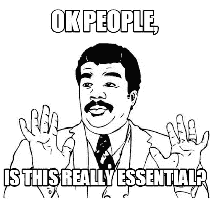

# 基本颤振技能

> 原文：<https://medium.com/hackernoon/essential-flutter-skills-2466d91d3926>

**更新**:我的颤振课程现已上线！**查看**[**【fluttercrashcourse.com】**](http://fluttercrashcourse.com)**🚀**

**—**

**纵观这一年来 [**的爆**](https://twitter.com/timsneath/status/1024684022574669824) **的火爆** [**的飘起**](https://flutter.io)**我看到了很多新鲜的移动开发新人。参与指导他人，确保来自世界各地的开发人员高效且有效地学习 Flutter，这真的很令人兴奋，也很有收获。这就是为什么我要在这个月推出我自己的[课程](https://fluttercrashcourse.com)。****

****因此，在这一点上，**我想提供一些关于学习风格的想法，我认为什么是有效的**，最后，Flutter 工程师需要什么样的**核心技能来成功编写优秀的移动应用**。****

********

# ****你到底是怎么学的？****

****所以我见过两种类型的开发者。一种类型的开发人员会从官方文档中快速开始，然后尝试玩一些随机的例子，之后**严重依赖堆栈溢出答案**。这里有一个问题:a)到处玩都很好，但是如果你在玩你不会很快需要的特性，**你没有有效地利用你的时间**和 b)堆栈溢出答案很容易包括**质量差的代码示例**。我听起来像是在做一个概括，但根据我的经验，对于初级开发人员来说，我经常看到事情是这样的。****

****然而，另一种类型的开发人员会**制定他们需要学习的内容的计划**，**编写几个简单的示例应用**，最重要的是找到从第一天开始就要适当学习的**优质内容**。就我个人而言，我总是喜欢先通读一本合适的书，沉浸其中，然后尝试自己编写一个应用程序。****

****因此，在本文的其余部分，我将关注我上面提到的后一种开发人员，他们通过关注**来有效地学习成为一名合格的移动开发人员所需要学习的东西。******

# ****基本的高级技能****

****我在 90%的应用中看到了许多重复出现的模式。这些模式可以分为两个主要区域，屏幕和小部件。你可以将以下内容设定为个人学习目标。如果你正在编写例子，**能够从这些例子中创建一个例子将是你的一个重要里程碑:******

## ****里程碑# **1:产品详情或用户资料页面******

****在这种情况下，在顶部有一个好看的图像或头像，风格化的文本，包含一些文本的部分列表，真的是它的大部分。****

## ****里程碑#2: **列表******

****想象一个新闻提要，它垂直滚动(不一定是无限的)并由某处的某个数据源支持。每一项都是用一种干净的“干”的方法实现的。****

## ****里程碑#3:表单****

****这可以是登录或注册表单或编辑表单。表单是移动应用程序的核心，设计出好看又好用的表单是一件值得骄傲的事情。****

# ****新人必备小工具****

****我将用一个 Flutter 特定小部件的列表来补充上面的列表，至少对我来说，这些小部件是达到 Flutter 开发技能自信水平的基础。****

****注意，有很多小部件，关键是先关注基本的**。这里有一个附带小部件的初级技能列表，我建议初学者学习:******

*   ****使用 MaterialApp、Scaffold 和 AppBar 渲染屏幕的基础知识。****
*   ****使用列和行的**布局**的基础。****
*   ****使用容器**对内容**的**区域进行分组**和装饰**的基础。******
*   ******文本**和**图像**小部件，具体使用**资产估计**和**网络图像**。****
*   ****使用**手势检测器**创建灵活的定制按钮。****
*   ****使用字体、文本样式和颜色自定义您的应用程序。****
*   ******使用 Dart 和 JSON 处理 API**。****

****我知道你在说什么，这是一个非常基本的列表，但是你会惊讶于你仅仅用这个就能实现什么。我总是说，在过度使用比这更多的小工具之前，先用你所拥有的基本技能专注于编写死气沉沉的简单应用。不用提交，给朋友家人看看就行了。关键是，你编写的端到端应用比你认为从这个过程中学到的要多得多。**简而言之，边做边学！******

****你可以**看看我的免费视频课程**、[、【fluttercrashcourse.com】、](https://fluttercrashcourse.com)，它涵盖了所有这些基础知识，当然还有更多。此外，请随时关注我的 [Twitter](https://twitter.com/seenickcode) 获取常规的颤振技巧。****

****快乐飘动，****

****缺口****