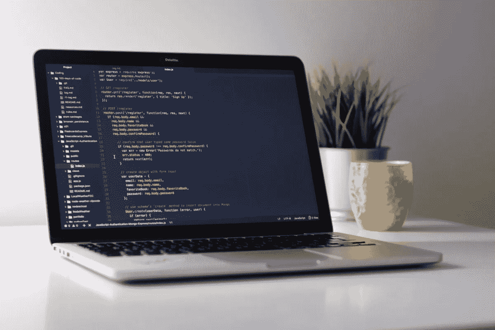
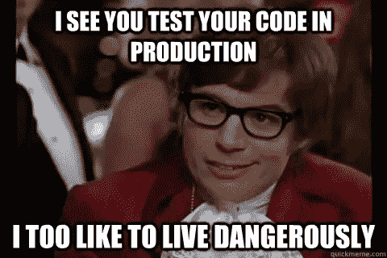

# 每个 Javascript 开发人员都应该掌握的基本技能和工具

> 原文：<https://medium.com/hackernoon/essential-skills-and-tools-every-javascript-developer-should-master-6c80b876a4c>

这是一个关于一些基本技能和工具的简单指南，如果掌握了这些技能和工具，将会提高您的开发水平。

# 硬币指示器 （coin-levelindicator 的缩写）命令行界面（Command Line Interface for batch scripting）

无论您是在 Linux/Mac/Windows 上工作，如果您想加快开发流程，您都需要学习基本的 CLI 命令。

CLI 应该成为仅次于文本编辑器的第二大应用。

我建议设置 [oh my zsh](https://ohmyz.sh/) ，这将扩展你的 CLI 功能，并为你的 CLI 添加一些看起来很酷的主题和有用的插件。

# 饭桶

到目前为止，当今世界上使用最广泛的现代版本控制系统是 Git。

[Git 书籍](https://git-scm.com/book/en/v2)是掌握 Git 的一个很好的综合资源，还有[这个官方的 Bitbucket 教程](https://www.atlassian.com/git/tutorials/what-is-git)。

下面是您应该理解的概念列表:

Git 非常简单，你不需要花很多时间去学习高级的 git 功能，因为很可能你根本不会用到它。

# 掌握你的文本编辑器

通过简单了解编辑器的快捷方式和功能，如多行编辑、项目中的搜索和替换以及快速文件切换，加快开发速度。

[Atom](https://atom.io/) 、 [Sublime Text](https://www.sublimetext.com/) 或 [Visual Studio Code](https://code.visualstudio.com/) 都是很棒的文本编辑器，你可以轻松地用插件赋予它们。

上面提到的所有编辑器都有特定于框架的插件，这些插件将为您提供代码片段和功能，从而加速您的开发。

我个人使用 Visual Studio 代码，它是一个非常棒的编辑器。此外，我还使用了几个插件，比如 Git 函数插件和自动代码格式化插件。

# 测试

测试您的代码。从简单开始，然后扩展。你以后会感谢我的。

尽管这可能是一个高级话题，但我相信每个 Javascript 开发者都应该为他们的代码编写测试。

测试代码有很多好处，你应该从任何类型的测试开始。从编写简单的单元测试开始，或者从端到端测试开始，但只是开始测试。

关于 JavaScript 测试入门的一些文章:
[2018 年 Javascript 测试概述](/welldone-software/an-overview-of-javascript-testing-in-2018-f68950900bc3)
[JavaScript —使用 Mocha 和 Chai 的单元测试](https://codeburst.io/javascript-unit-testing-using-mocha-and-chai-1d97d9f18e71)
[Javascript 中的单元测试](https://www.taniarascia.com/unit-testing-in-javascript/)

# 使用棉绒

代码林挺是提高代码质量的一种方式。

上面提到的所有文本编辑器都有在文件保存时运行的自动林挺和格式化插件。

使用[这个简单的教程](https://eslint.org/docs/user-guide/getting-started)让你开始使用 [ESLint](https://eslint.org/) 。

还有，我会建议使用 [Airbnb Javascript 风格指南](https://github.com/airbnb/javascript)。有一些很棒的风格指南，Airbnb 的风格指南是我个人最喜欢的。

# 保持冷静，继续编码

我提到的所有工具和技能不会提高你的编码技能，但总体来说，它们会让你成为一名更好的开发人员。

如果您喜欢这篇文章，请分享它和/或 [**单击此处**](http://eepurl.com/bicFSn) 订阅时事通讯，并提前获得一本关于如何开发我正在编写的真实世界 fullstack Javascript 应用程序的**书籍。**

*原载于 2018 年 8 月 24 日*[*www.thecalmcoder.com*](http://www.thecalmcoder.com/general-developer-skills/essential-skills-and-tools-every-javascript-developer-should-master/)*。*