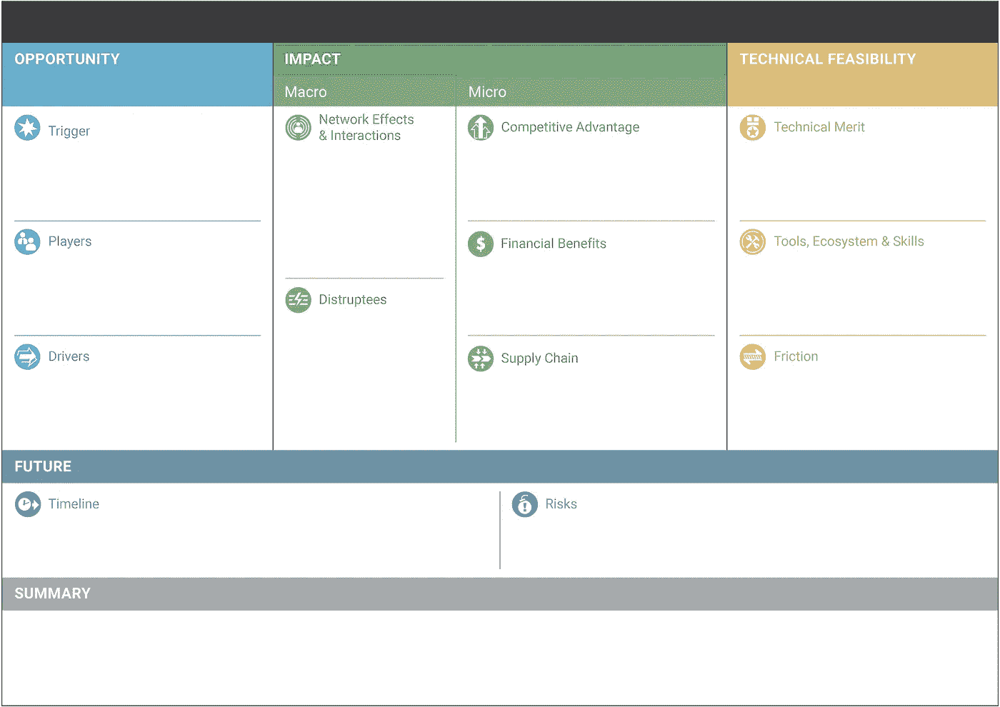
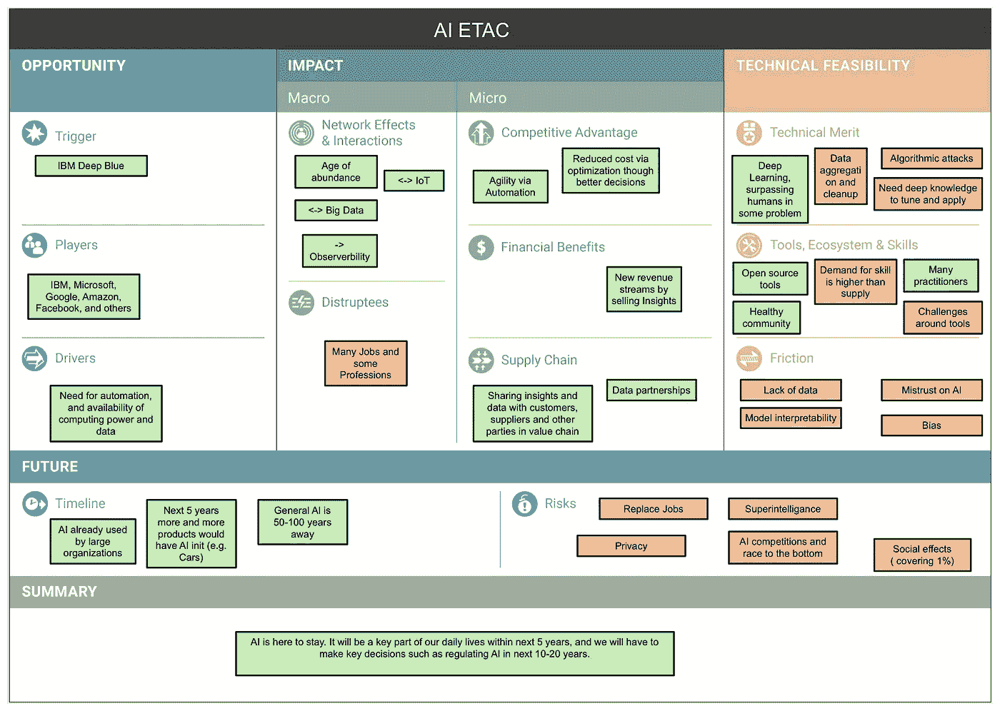
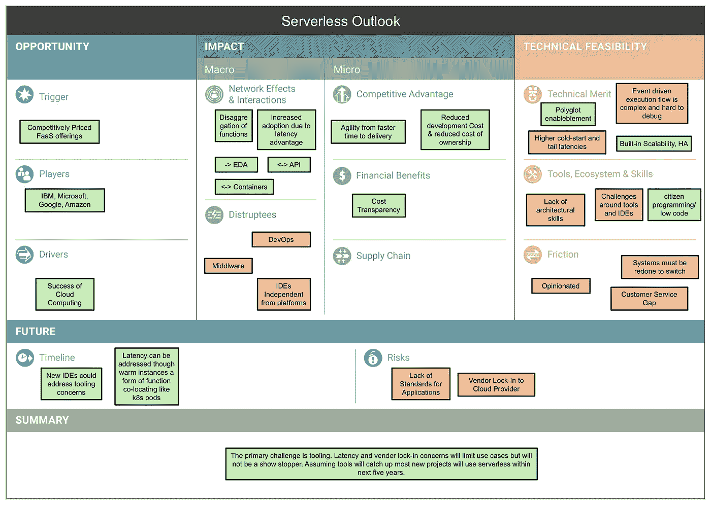
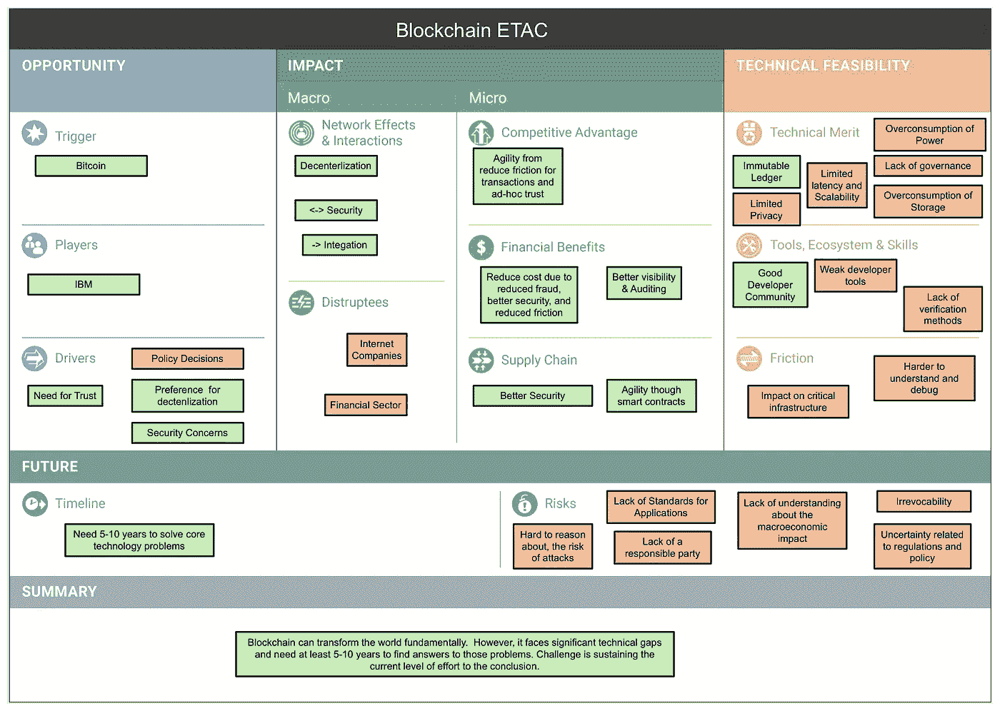

# 如何用 ETAC 判断区块链、AI、无服务器这样的新 Techs？方法论

> 原文：<https://medium.com/hackernoon/etac-a-visual-canvas-for-assessing-technologies-e73b7f5c3990>

## 视觉技术评估画布

# 介绍

> 雷·库兹韦尔(Ray Kurzweil)在他的“*加速回报定律”*中声称，“对技术历史的分析表明，技术变革是指数级的”。

换句话说，久而久之，技术变化更快。我确实提出了同样的看法，我相信你也会同意。

为了在这个快速变化的世界中生存，组织和从业者都必须了解当前的技术状况以及它的兴衰。在一个不断变化的世界里，优势转瞬即逝。能够掌握变革和驾驭技术浪潮的组织拥有未来。

新兴技术导致了技术领域的大部分变化。他们创造新的细分市场，如自动驾驶汽车，摧毁现有的细分市场，如 GPS 追踪器，并改造一些细分市场，如汽车。正如我们从柯达、诺基亚、百科全书布列塔尼卡和 Sun 等公司的命运中所学到的那样，关键的新兴技术可以成就组织，也可以毁灭组织。为了生存，组织需要识别、利用、有时塑造新兴技术。

# 驾驭技术浪潮

新兴技术公司高调亮相，这是个好消息。每一个都伴随着大肆宣传，承诺改变世界，承诺巨大的财富，承诺解决世界饥饿。所以它们很难被错过。

然而，所有这些炒作都没有影响。并非所有新兴技术都兑现了它们的承诺。有些不相关；有些人已经死亡，有些人仅仅幸存下来。然而，有些人已经很好地融入了当今世界，以至于我们甚至没有注意到他们。所以组织和从业者一定要慎重选择。

组织和从业者都需要评估新兴技术的相关性、影响和成功的可能性。他们需要决定是忽视还是拥抱。拥抱意味着投资、利用甚至塑造技术本身。如果选择错误，任何一种选择都可能代价高昂。

每年，作为年度计划的一部分，大多数组织都会做出这些决定。他们测量；他们分析，他们计划。高层管理人员经常会纠结于这个选择。这种困境不仅适用于大型组织，也适用于初创公司，即使在很短的任期内，初创公司也会看到一些新兴技术，并不得不做出相同的决定。

尽管这是一个常规决策，许多组织每年都必须做出这个决策，但是还没有一个被广泛接受的评估新兴技术的框架。

这样的框架，如果可用的话，提供了几个优点。

*   这样可以更容易地决定包括哪些方面和省略哪些方面。
*   有了一个共同理解的框架，与他人讨论技术分析就更容易了，尤其是客户和合作伙伴。
*   有了一个框架作为共享的理解，就更容易与他人交流并教育他人关于技术的知识，也更容易从他人那里学习技术。
*   不同的小组可以互相学习对新兴技术的分析。
*   框架本身可以通过收集从业者的意见而不断改进。

这种框架的最好例子是 Alexander Osterwalder 的[商业模型画布](https://strategyzer.com/canvas/business-model-canvas)。它是一组问题和叙述，旨在批判性地分析组织的商业模式的不同方面:价值主张、客户群、渠道和收入与活动和成本的对比。它通常用于启动计划，也是交流商业模式的有用工具。

# 新兴技术分析画布

我们提出了[新兴技术分析画布(ETAC)](https://github.com/wso2/ETAC/blob/master/ETAC.md) ，这是一个旨在解决上述评估新兴技术需求的框架。受业务模型画布的启发，它在单个页面上直观地呈现了技术的不同方面。

ETAC 是基于一系列围绕逻辑叙述的问题，他们探索技术。基于我们对新兴技术的丰富经验，我们认为新兴技术必须满足以下四个条件才能成功。

1.  问题的识别和解决问题的相关创新，我们称之为触发器。(我们认为问题和创新必须同时出现，因为创新通常会改变我们对问题的看法)。
2.  该技术需要有重大的潜在影响。通常，影响可能会超出最初的问题。
3.  考虑到可用的资源，技术必须是可行的。
4.  该技术必须规避与技术开发和采用相关的风险。例如，技术的发展和采用必须足够快，以证明任何投资都是合理的。

如下图所示，ETAC 在一页纸上形象地表达了上述四个问题。这种表示简洁、紧凑，一目了然。

Emerging Technology Analysis Canvas

以下仅提供理解的概要。 [ETAC 规范](https://github.com/wso2/ETAC/blob/master/ETAC.md)通过例子更加详细地讨论了画布，并描述了方法。

让我们详细探索画布中的每个部分。

***机遇***

*   *触发:*一个问题和一个解决方案获得了更广泛的想象力，后来发展成为一种更广泛的技术，有望解决更广泛的问题。
*   *参与者* —积极改进或使用技术解决问题的组织或个人。
*   *驱动因素:*对技术产生积极影响的外部力量，如立法。

**冲击**

值得注意的是，影响是针对潜在的未来进行分析的，而不仅限于技术的当前状态。

ETAC 考虑两种类型的影响:宏观和微观。宏观影响反映了技术对整个世界的影响。微观影响捕捉了作为供应链一部分的单个组织所看到的影响。

宏观影响

*   *网络效应和互动:*如果一项技术的采用增加了该技术对现有用户的价值，从而创造了一个正反馈循环，那么这项技术就具有网络效应。
*   *受影响者:* —新兴技术会影响哪些技术或行业？

*微冲击*

*   *竞争优势*:新兴技术如何影响组织间的竞争？
*   *财务收益:*技术如何影响组织的底线。
*   *供应链:*这代表从原材料和技能开始，直到产品或服务交付给最终用户并被最终用户消费的活动。本节讨论了技术如何影响供应链。

**可行性**

我们观察到，技术在成长的同时，也为其潜在用户创造了希望。我们认为这一承诺既包括潜在的使用案例，也包括所提议技术的好处。

*   *可行性*——ETAC 的可行性评估承诺在技术上的可能性。
*   *技术优点* —讨论该技术取得的技术突破以及任何技术限制。
*   *工具、生态系统、&技能* —讨论所需技能、工具和最佳实践以及社区的可用性。
*   *摩擦* —新兴技术在部署中会面临什么样的摩擦？这里我们只考虑技术摩擦，非技术因素在风险下讨论。

**未来**

*   *时间表:*技术发展的关键里程碑可能是什么？
*   *风险:*可能会限制技术部署的风险有哪些？这也包括非技术风险。我们可以认为这些是驱动程序的反义词。

**总结**

总结部分讨论了可能的技术开发和部署方案，同时权衡了 ETAC 的其他部分。

# 例子

以下三个例子展示了 ETAC 应用于新兴技术:人工智能和无服务器。你可以从 [ETAC 规范](https://github.com/wso2/ETAC/blob/master/ETAC.md)中找到每种 ETAC 的详细讨论。

Artificial Intelligence ETAC

Serverless ETAC

Blockchain ETAC

# 结论

新兴技术塑造了快速发展的技术格局。组织通过选择和投资将塑造其行业和市场的技术来发展和保障其未来。组织每年都会评估新兴技术并考虑投资，作为其规划流程的一部分。

然而，没有评估新兴技术的共享框架。这使得组织的分析是临时性的，使得更广泛的讨论变得困难，并且共享和重用知识几乎是不可能的。

我们提出了“新兴技术分析画布”(ETAC)，一个框架来评估一个单独的新兴技术作为这个问题的解决方案。受业务模型画布的启发，它在单个页面上直观地呈现了技术的不同方面。这种方法包括围绕逻辑叙述安排的一系列探究技术的问题。视觉表现简洁、紧凑，一目了然。

它提供了

*   评估新兴技术的逻辑框架
*   一个教授、学习和讨论技术不同方面的框架
*   试图理解新兴技术时的头脑风暴工具。

你可以从 [ETAC 规格](https://github.com/wso2/ETAC/blob/master/ETAC.md)中找到更多细节。我们已经使用 ETAC 创建了[区块链未来展望](https://peerj.com/preprints/27529/)和[无服务器未来展望](https://github.com/wso2/ETAC/blob/master/outlooks/serverless_outlook.md)。请检查一下。

你可以从[中找到幻灯片，这是一个用于判断新技术的可视画布](https://www.slideshare.net/hemapani/a-visual-canvas-for-judging-new-technologies)。

我们欢迎并感谢对画布的任何反馈、更改或贡献。请发送一个拉请求，创建一个 GitHub 问题，或者发送一封邮件到[srinath@wso2.com](mailto:srinath@wso2.com)。

希望你对此感兴趣。要获得 ETAC 和 ETAC 新兴技术分析的更新，请订阅我们的[全球技术展望更新简讯](https://wso2.com/subscribe/global-technology-outlook-update)。