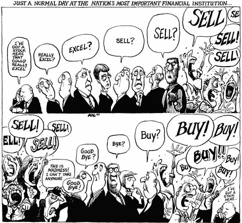
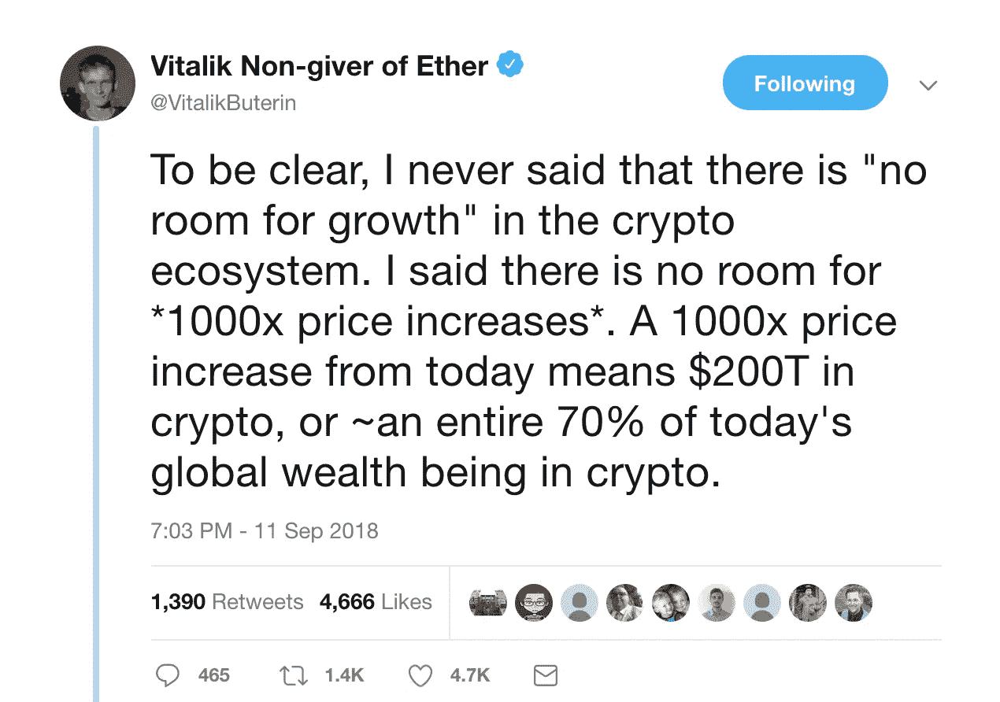
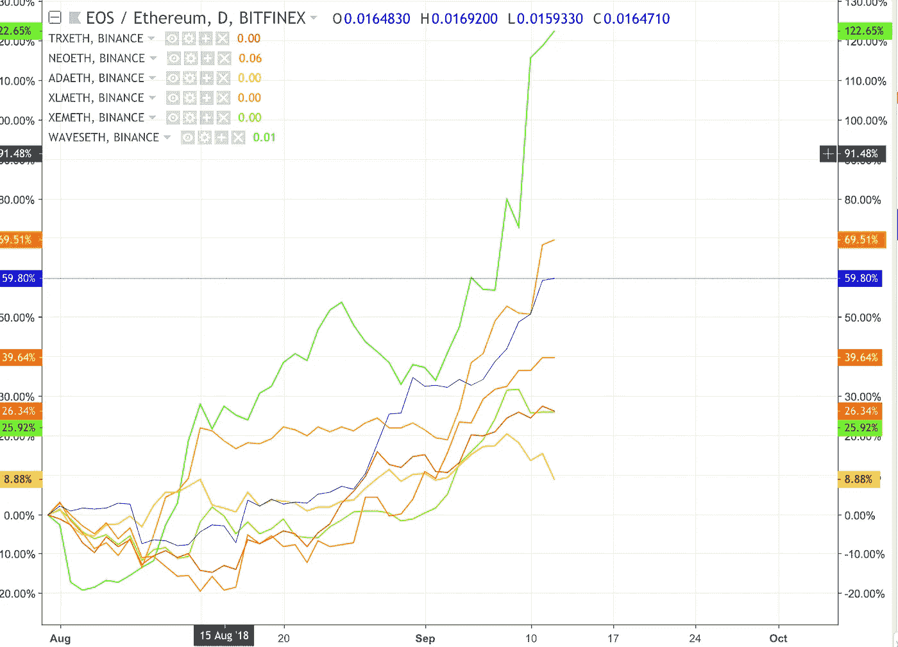
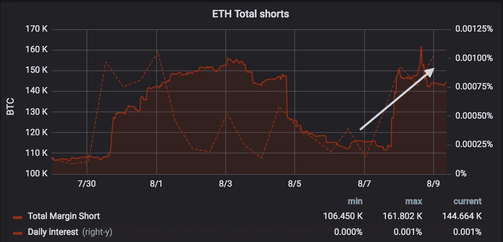
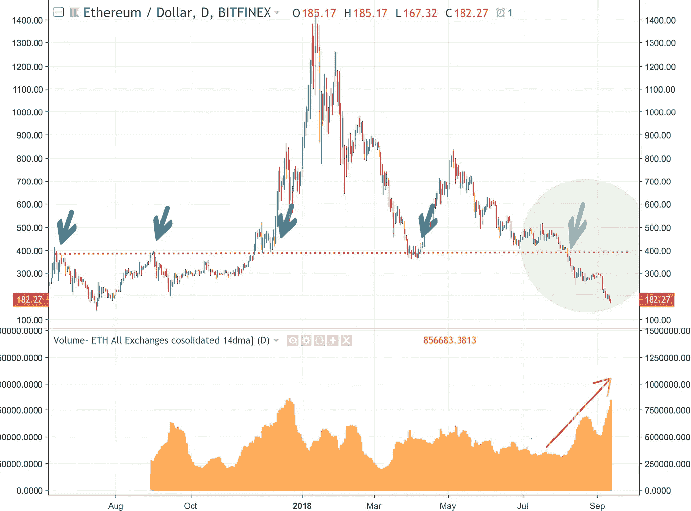

# ETH:该买了？

> 原文：<https://medium.com/hackernoon/eth-time-to-buy-284222c6b29f>

## 恐慌、被迫的卖家是一个很有吸引力的切入点

ETH 目前的交易价格为 180 美元。拆除 ETH bull 营地是残酷的:

>在过去的 30 天里，ETH 对美元和 BTC 都下跌了 45%，在 onchainfx.com 的前 100 种货币中排名第五。

(比以太网差的 4 种硬币很小，总市值只有 5 亿美元，而以太坊目前的市值为 250 亿美元，2050 年的市值)

>[以太坊](https://hackernoon.com/tagged/ethereum)从市值排名第二跌至第四，被恒星和瑞波超越(基于 2050 年总供应量，见 [onchainfx)](http://www.onchainfx.com)

一名美国法官[裁定](https://www.bloomberg.com/news/articles/2018-09-11/u-s-judge-says-initial-coin-offering-covered-by-securities-law)一个特定的 [ICO](https://hackernoon.com/tagged/ico) 违反了证券法。

>甚至连救世主维塔利克可靠的理性思考也开始听起来有些悲观了！)

Vitalik: from smart contracts to investment advice. What can’t he do?!

是什么推动了这次抛售？市场是否突然改变了对以太坊提议的“去中心化”和智能合约的看法？现在每个人都转向比特币最大化“稳健货币”的观点了吗？

**不是。我认为瑞士联邦银行经历了流动性和头寸驱动的“技术性”抛售。**

**此外，我估计这种情况可能即将结束。**

## **基本原理:**

## **1) ETH 的表现一直不如其他智能合约平台令牌**

以太坊可以被认为是最高质量的智能合约平台(基于年龄、开发者生态系统、市值、哈希能力)。这是一个客观的陈述，不同于关于以太坊是否会成为“最佳”平台或在广泛采用去中心化应用的乐观场景中提供最高投资者回报的辩论。

如果是这样的话，鉴于 crypto 自 2018 年初以来一直处于恶性熊市，我们可以预计更高质量的项目将在低迷时期表现出色。尚未退出该资产类别的资本可能会“隐藏”在更安全的项目中，等待更好的时机重新分配给更活跃、风险更高的项目，这些项目可能会带来更高的回报和更大胆的想法。

然而，今年夏天的情况并非如此。自 7 月底以来，ETH 的表现明显落后于主要的智能合同竞争对手(EOS、Stellar、NEO、Cardano、NEM)。这种表现不佳的范围从 10-125%见下图。

*All smart contract platforms significantly outperform ETH since end of July*

奇怪的是，瑞士联邦理工学院的这种戏剧性的不佳表现令人放心。据说这是一个 ETH 的具体问题，而不是对智能合同价值主张或更广泛的加密资产类别的更广泛的幻灭。

***理论 1:这是一个 ETH 特定问题，而不是加密/智能合约/分散化重新评估***

**2) ICO 国债正在推动抛售**

只有以太坊进行了大量的 ico 交易(100 亿美元，而且还在增加)。虽然这证明了其生态系统的实力，但这也是一个需要处理的短期流动性问题，因为这些 ETH 基金被转换为项目团队的美元跑道。

这些基金的清算一直是一个非常常见和重要的讨论点，但往往被误解。有现成的数据可以跟踪 ICO 国库钱包的进展，因为他们将自己的 ETH 转换成美元，为他们的跑道提供资金。见[此处](https://diar.co/ico-treasury-balances/)或[此处](http://www.dappcapitulation.com/)。

在大约 990 万 ETH 的 ICO 总筹资额中，估计已售出 620 万(62%)。

然而，这些项目中的许多都是小团队，他们将很难花费巨额的 ICO 资金。在许多情况下，坊间估计的 1000 万美元可能足够维持 1-2 年。拥有 1000 万美元(USD！)或更多，项目财务人员在盲目将其剩余的 ETH 转换为美元之前可能会三思。

为此调整 ICO 国债，似乎 80%的所需 ETH 销售已经完成。

这一分析中所要求的假设是，从国库主钱包中转出的资金被转移到交易所(待出售)，而不是在不同钱包之间重新分配资金。如果你没有这方面的准确数据，请联系我们！(h/t [Sid Shekhar](https://medium.com/u/6962290f7a17?source=post_page-----284222c6b29f--------------------------------)

更重要的是，每个人都知道这些国债是被迫出售的。根据我作为交易者的经验，知道有一个被迫的卖家(或买家)是一个非常有利可图的信息。当 ICO 财务主管持有太多 ETH 时，他们一定会感到恐慌，因为他们一开始就可能筹集了太多的资金，之前一直对获得更好的销售价格充满信心……这很容易想象。当他们看到 ETH 跌破 400 美元时，这种恐慌是显而易见的。其他交易者甚至可能倾向于利用这种恐慌，通过做空 ETH 来做空这些国债。这类似于交易员如何从著名对冲基金 [LTCM](https://en.wikipedia.org/wiki/Long-Term_Capital_Management) 的崩盘中获利。

*Sharks in the water: shorts have climbed in ETH whilst its price continues to fall*

在股票交易中，有一个处理不成比例的大交易的经验法则，如配股，大宗配售，指数重新加权。例如，如果有大量股票要出售，并且该事件是已知的，那么当所有需要的数量都被交易时，股票价格将已经恢复正常。买家会很乐意以折扣价从卖家手中买下最后的 x%,因为“(出售的)结束指日可待”。

有趣的是，市场会等到 2/3 的成交量被消化。如果市场更有信心，时间可能会更早，如果没有信心，时间可能会更晚。

以上数据表明，ETH 已经到了这个阶段。或者更远，取决于你对跑道要求的假设。

***理论二:市场可能不会等到 100%的 ETH 被清算。足够的 ICO 国债抛售可能已经发生，市场可能会忽略其余的。***

**3) ETH 跌破 400 美元后表现加速**

将上述两种观点联系在一起的是这样一个事实，即瑞士联邦理工学院的表现不佳是在 7 月底开始的。与此同时，ETH 在 400 美元的关键心理支撑位上失败了。这是一个在过去一年中已经测试过几次的水平，并且总是导致巨大的交易量。

在 ETH 突破 400 美元的同时，这种表现不佳的情况加剧，这并非巧合。相反，这很可能是恐慌的 ICO 司库抛售的直接影响。

当我们通过交易量的巨大增长突破 400 美元时，我们可以非常清楚地看到这种恐慌(见下图)。ETH 的交易量最近飙升至历史最高水平。ICO 的财务人员正在拉弹射绳。

*ETH testing the crucial $400 level and recently failing. Volume (and panic) spiking accordingly*

为了支持这种司库推动价格叙事的理论，我之前(正确地)预测了一个小的“燃烧的人反弹”，见附件中的早期电子邮件。我提出，ICO 的财务主管们将暂停他们无情的抛售，去 Playa 寻找更有成就感的追求；).回来后，我预计这种抛售将会继续，尽管不会像现在这样激进！

***理论三:国债恐慌性抛售非常明显。恐慌通常预示着某个动作即将结束。***

## **结论**

联邦理工学院在智能合同和“稳健货币”项目上都表现不佳。这并不是因为以太坊或其生态系统的前景发生了转变。相反，这是其生态系统内的项目成功筹集 ICO 资本的直接结果。对 ETH 剩余国债持有量的估计表明，末日即将来临。此外，当我们突破 400 美元的价格水平时，有非常明显的恐慌迹象。

上述流动性组合驱动了“技术性”抛售压力；对终点线在望的销售的可信解释；可见的恐慌和绝望；所有这些都是收购 ETH 的诱人切入点。

怎么办？以下不是投资建议，而只是我将如何定位自己的投资组合。

**低风险:**卖出并做多其他智能合约平台的持仓，转而做多 ETH。其他智能合约令牌的表现优于 ETH，如果抛售实际上是因为没有人再喜欢 crypto，这些质量较低的项目也不会幸免。

**中等风险:**新开空头智能合约 token vs long ETH。

**高风险**:用新鲜菲亚特买 ETH。或者甚至是 BTC。

在 twitter 上关注我，了解更多交易见解@cryptobonsai