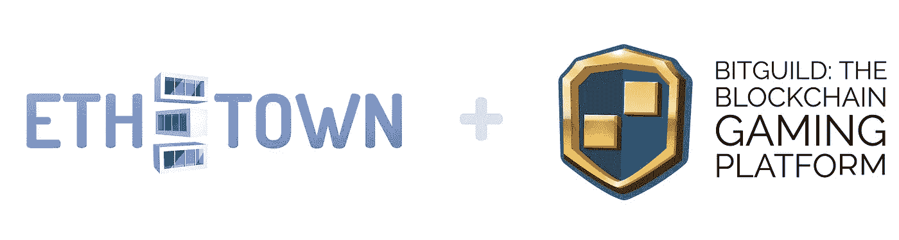

# ETH。镇:3 件大事！

> 原文：<https://medium.com/hackernoon/eth-town-3-big-things-56f4ddb07f1>

# 测试版发布！

[你可能已经知道了](/@ethtown/eth-town-beta-launch-2e00b2ca5609)我们已经在本周初选出了第一批测试版玩家。名单可以在这里找到。被选中的玩家将通过电子邮件收到测试邀请。我们想请所有参与者用他们的 Discord 名称返回给我们，这样我们就可以为他们添加一个特殊的[BETA]角色，并将他们添加到 Discord 的封闭 BETA 频道中！

我们承诺本周发布测试版，现在终于发布了！测试版现已上线，面向有限的观众开放。
坦率地说，我们没有完成所有计划，所以到处都有“很快就会到来”的消息，因为测试版中会有一些东西，只是不是今天。

测试版的计划是测试我们提供的机制，测试英雄战斗和装备的初始平衡，奖励机制，和其他一些地面机制。成绩，盘点，投资人角等等！

下周我们将推出另一款迷你游戏，并在考虑到测试者的反馈后宣布我们的“前进”计划。

# ETH。城镇作为平台和开发套件！

[ETH。城镇](https://eth.town)将作为一套小而酷的游戏发布。有些是我们做的，有些是我们合作的团队做的。但是为什么不生产更多的呢？小镇变得不仅仅是游戏而是平台？密码塔里有足够的空间容纳所有人！

我们欢迎 DAPP 开发者加入 ETH。小镇！

是的，我们已经有了一个 DevKit，我们正在邀请开发人员联合起来，共同取得成功！

如果你有一个游戏并且想要合作，请[写信给我们](mailto:together@eth.town)！如果你有一个游戏的想法，也请写下来！

现在的加密玩家社区相当小，很多人同时玩所有的游戏！那么，为什么不在有意义的项目之间增加更多的协同作用，一起为社区创造更多新的酷游戏呢？耶！

# 新伙伴关系！BitGuild！

[ETH。小镇](https://eth.town)和[比特公会](https://bitguild.io)联手发展壮大，共同提升！

两个团队在这笔交易上合作得非常紧密，我们很自豪地宣布。城镇被选为 [BitGuild](https://hackernoon.com/tagged/bitguild) 门户的发布合作伙伴！很快，你就可以在 www.bitguild.com[的平台上玩我们的游戏了](http://www.bitguild.com.)

BitGuild 的使命是通过创建一个在区块链上运行的全新游戏平台来彻底改变全球游戏行业。

越来越大了！

# 炒作？…炒作！！！

请过一个愉快的周末！

干杯，
ETH。镇队！

网址:[https://eth.town/](https://eth.town/)
博客:[https://medium.com/@ethtown](/@ethtown)
Btt 安:[https://bitcointalk.org/index.php?topic=3062760](https://bitcointalk.org/index.php?topic=3062760)
脸书:[https://fb.me/eth.town](https://fb.me/eth.town)
推特:[https://twitter.com/eth_town](https://twitter.com/eth_town)
insta gram:[https://instagram.com/eth.town](https://instagram.com/eth.town)
电报:[https://t.me/Ethertown](https://t.me/Ethertown)
媒体:[https://medium.com/@ethtown](/@ethtown)
不和谐:[https://不和谐](https://discord.gg/vzZjpFV)