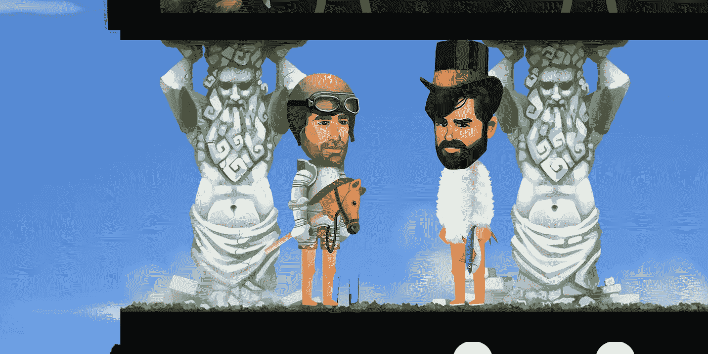

# ETH。城镇文摘

> 原文：<https://medium.com/hackernoon/eth-town-digest-afa4f6f045ba>

朋友们，

由于我们正在努力完成我们的[迷你游戏](https://hackernoon.com/tagged/mini-games)，我们想分享一些关于游戏中到底会出现哪些游戏的更多细节。

到目前为止，如果你关注我们的博客，你会知道我们至少会有骰子地板(被推到后测试)，大锅地板(已经可用)，和[以太股票地板](/@ethtown/eth-town-partnership-with-etherstocks-ada80f4c7642)，这是我们最近写的。

今天，我们想向您展示我们正在建造的另一层楼。这是一个你的英雄将能够穿着超级花哨的战斗服装进行比赛的地方！**请见泰坦竞技场！**

你可以把你的英雄送到竞技场，这样他们就可以和其他人竞争了。当你的英雄获胜时，你可以得到一些很酷的东西，但实际上失败有时也能得到东西。这个游戏不需要以太或 [ETIT](https://hackernoon.com/tagged/etit) 来玩，但是赢得战斗就赢得以太。是不是很酷？

整体战斗机制的细节将会很快公布。现在(作为开发状态更新的一部分),我们可以说游戏的智能合约已经准备好并经过测试，图形几乎完成，我们正在制作最终的动画。

# 测试版访问！

下周，我们将挑选参与者提前进入封闭测试版！我们将从申请测试的人中随机挑选 50-100 人，然后在预售中购买英雄的人中再挑选 25-50 人。所选媒体将获得高于配额的优先访问权。

祝你周末愉快！

Note: not all custom heroes are shown here!

网址:[https://eth.town/](https://eth.town/)
博客:[https://medium.com/@ethtown](/@ethtown)
Btt 安:[https://bitcointalk.org/index.php?topic=3062760](https://bitcointalk.org/index.php?topic=3062760)
脸书:[https://fb.me/eth.town](https://fb.me/eth.town)
推特:[https://twitter.com/eth_town](https://twitter.com/eth_town)
insta gram:[https://instagram.com/eth.town](https://instagram.com/eth.town)
电报:[https://t.me/Ethertown](https://t.me/Ethertown)
媒体:[https://medium.com/@ethtown](/@ethtown)
不和谐:[https://不和谐](https://discord.gg/vzZjpFV)