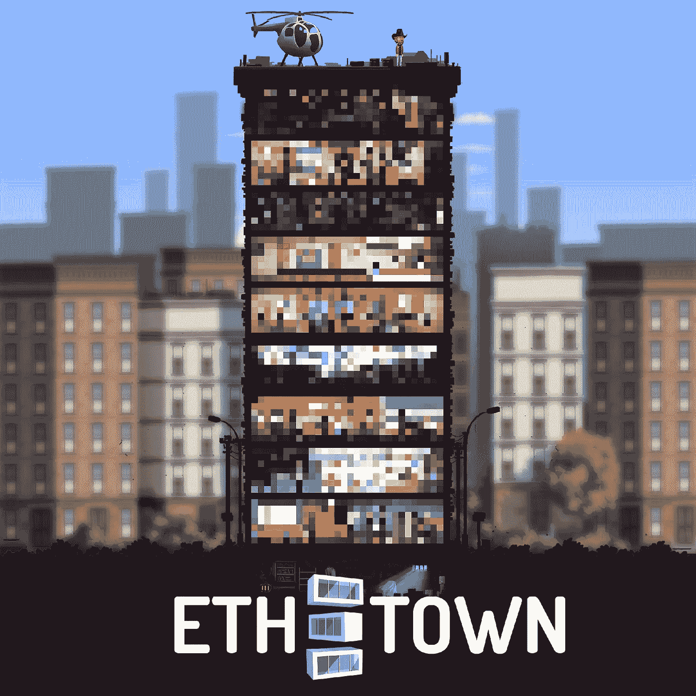
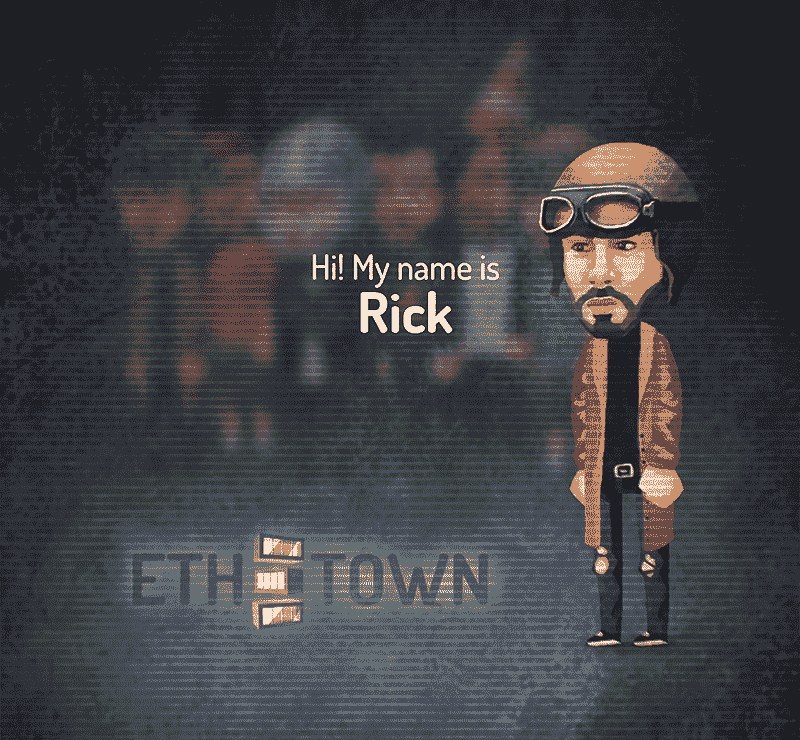
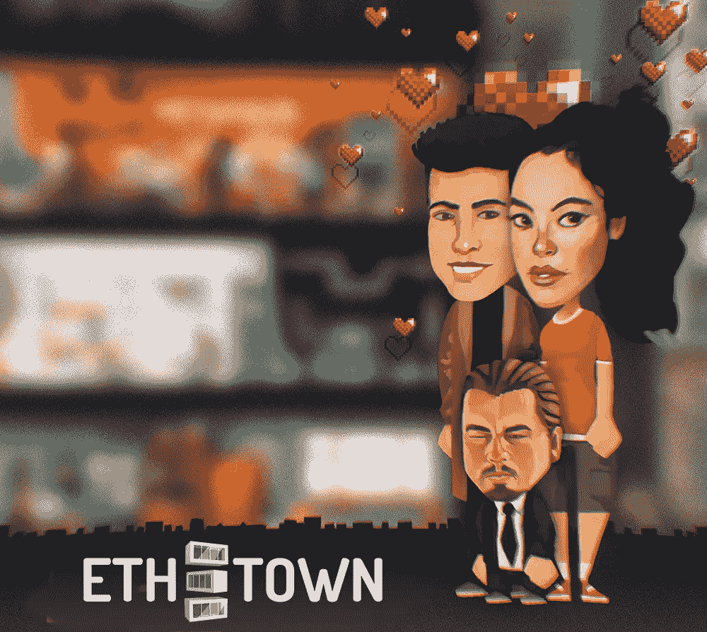
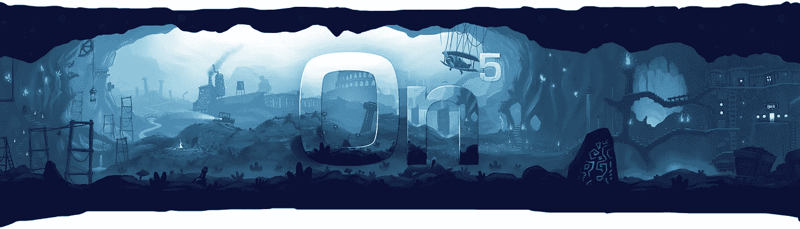
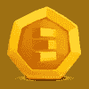
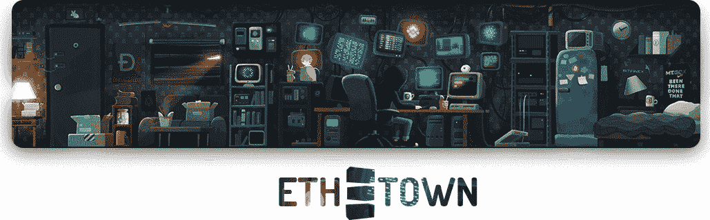

# ETH。镇:楼层，英雄，团队，预售！

> 原文：<https://medium.com/hackernoon/eth-town-floors-heroes-team-pre-sale-c52fa5579012>

## 嘿秘密忍者！

前阵子我们对我们酷社区说了第一个 [**HELLO WORLD**](/@ethtown/eth-town-hello-world-ab418071c185) ！感谢你们所有的掌声！你们的支持让我们更有动力为你们提供又酷又有趣的内容。

几天前，我们发布了我们平台中投资者代币功能的一些重要细节。请在这里阅读文章**。**

**简单地说， [ETH。以太坊将会是一个非常酷的游戏！](https://eth.town/)**

**今天，我们希望透露更多关于我们项目的特点，并宣布预售活动。**

****

**你现在已经知道了。TOWN (i)是某种交易游戏，(ii)拥有由我们的创意设计师绘制的令人敬畏的角色，(iii)融入了与核心游戏相关的有趣的元游戏，以及(iv)引导玩家走上他们的个人道路，获得源源不断的利润(*激发你的活力*)。**

**但是，我们的团队并不擅长把酷/有趣的东西都留给自己。让我们告诉你们更多关于我们一直努力构建到游戏中的特性。**

**今天我们想介绍几个重要的特性:**

****

# **1) **密码塔****

**由特殊办公室和公寓组成的百分之百[秘密附属](https://hackernoon.com/tagged/crypto-affiliated)塔。有些是不错的老生意，有些完全是疯狂的东西。**

**每个楼层都有自己的规则、利润结构、奖金等。，通常会加入一些有趣的花样。随着时间的推移，更多的细节将会揭晓。**

**有着很酷的手工动画的楼层也会根据玩家的活动改变它们在塔中的顺序。某些特殊的楼层会有非常不同的迷你游戏。我们将推出一些迷你游戏，并会随着时间的推移增加更多。还会有活动楼层。其中的第一个将是 POWH 楼层，由此产生的所有利润将归在 POWH 中遭受损失的社区成员所有。**

**而且我们会有史诗般的楼层，其中一层会在预售期间售出！**

**收藏在 [ETH 也是一件大事。小镇](https://eth.town/)。每当你得到一个新的楼层或以其他方式参与其中(秘密，到目前为止的秘密)，你就在你的收藏中添加了一个特殊的成就。拥有很多这样的东西会给你的[事业带来特殊的好处。小镇](https://eth.town/)之旅。年轻的战士，前进吧，愿原力与你同在。)**

****

# **2) **英雄****

**英雄是游戏中非常非常重要的一部分。他们将帮助你最大限度地从地板上获得收入，也可以自己为你创造收入——例如，你可以购买一些非常便宜的 0 级球员，花一些时间和精力来修补他们，并在以后获得巨大的收益。**

**听起来好得难以置信？嗯，即使在现实生活中，一张随机的邮票可能只值一美元，但是全部收集 20 张邮票可能要花很多钱。资产的价值总是来源于它们对其他市场参与者的价值。**

**所有的英雄从 0 级开始，并且会有一系列的初始属性。在某个时间点，你可以选择带上你的 0 级泰山和 0 级简(*名字纯粹是为了说明的目的*)，开始一段帮助他们“理解生命意义”的旅程，瞧，一个 1 级英雄诞生了！有时，在大约 20%的情况下，你甚至可以从合并/分娩过程中获得 2 个孩子。然而可悲的是，父母会在孩子出生后很快自毁。他们的牺牲和对游戏的贡献将永远铭刻在我们的记忆中。**

****

**0 级角色是自动生成的，并在公开拍卖平台上出售——如果你想购买角色，放一些你的 [ETH。城镇投资者代币(ETIT)](/@ethtown/eth-town-investor-tokens-f294de8b6f0b) 放入底池，如果没有其他人添加更多的 ETIT，你赢得拍卖并获得 0 级角色。这是一个开放的市场。**

**此外，每个角色的起始费用会随着英雄数量的增加而增加。**

**如果你不是 ETIT 持有者，购买英雄的唯一途径是从其他玩家那里(包括 ETH)。**

**15 级英雄是明星英雄。还是那句话，这里就不赘述了，但都是最厉害的。等级越高，角色就越稀有，越贵。这是我们能够控制经济并为代币提供足够的汇的方法之一。**

**将会有购买低级英雄的能力。更高级别的英雄只能从其他英雄中产生。还是预售活动期间买的。每一个属于高等级一代的角色比低等级的角色需要更长的时间来“出生”，但是拍卖规则保持不变。**

**角色将成为游戏中互动的一部分，你可以和他们一起玩，有些角色会和某些楼层有特殊的关系。我们可能不会在最初的 alpha 版本中包含英雄的全部功能，但是会在发布时添加。我们宁愿在最终版本准备好的时候展示它，而不是让人们在一个半生不熟的解决方案中花费代币。更多的角色互动机制将在游戏上线后作为游戏更新加入。**

****

# **3) **团队****

**该游戏由 On5 游戏开发工作室开发。工作室通常专注于手机游戏，但创新很酷，以太坊平台是尝试制作真实游戏的好地方。**

**工作室有很多游戏开发的经验。它曾与三星、雅达利和艺电等公司合作过。一个才华横溢的开发人员和艺术家团队正在为 [ETH 夜以继日地工作。现在的小镇](https://eth.town/)。**

****

# **4) **更上代币****

**第 [ETH。城镇代币](/@ethtown/eth-town-investor-tokens-f294de8b6f0b)，或者投资者代币，是 [ETH 中的游戏货币。镇](https://eth.town/)，他们是一个 ERC-20 兼容令牌。游戏会根据游戏规则自动向代币持有者支付奖励，代币可用于购买只能用代币购买的游戏内物品。用于购买物品的代币不再流通。**

**代币不能直接从游戏或游戏组织者处购买，只能奖励给游戏中的特定动作，以及作为预售期间购买游戏内物品的额外奖励。然而，玩家可以自由地相互交换代币，例如通过在以太网上交易代币。**

**在游戏活跃一段时间后，会不断有新的代币发行，代币会随着花费在物品上而不断被销毁。然而，在早期阶段，不会有很多新的代币产生，所以它们的价值会很高，预售和奖励计划的参与者将持有总供应量的大部分。**

****

# **5) **预售****

**我们下周要进行预售！**

**我们将要预售的产品包括:**

*   **史诗地板**
*   **几个明星英雄**
*   **出生前的高级角色**
*   **独特的定制内容创建服务**
*   **预售参与者将获得 ETH。每次购买之外的城镇代币**

**我们将很快公布更多细节。**

****

## **总结:**

*   **如上所述，我们的秘密但不再秘密的目标是在平台发布的第一周打破记录并实现 10 万 ETH 的营业额。​**
*   **游戏由经验丰富的游戏开发团队制作。**
*   **角色是游戏中很重要的一部分，他们有各种形状和层次。**
*   **投资者代币太棒了。**
*   **我们将举行预售。**

## **在我们努力工作的时候，祝你周末愉快！:)**

 **干杯， [ETH。镇](https://eth.town/)队**

**网址:[https://eth.town/](https://eth.town/)
Btt 安:[https://bitcointalk.org/index.php?topic=3062760](https://bitcointalk.org/index.php?topic=3062760)
Btt 赏金:[https://bitcointalk.org/index.php?topic=3028492](https://bitcointalk.org/index.php?topic=3028492)
脸书:[https://fb.me/eth.town](https://fb.me/eth.town)
推特:[https://twitter.com/eth_town](https://twitter.com/eth_town)
insta gram:[https://instagram.com/eth.town](https://instagram.com/eth.town)
电报:[https://t.me/Ethertown](https://t.me/Ethertown)
中:[https://medium.com/@ethtown](/@ethtown)
不和:[https://Discord . gg/网](https://discord.gg/vzZjpFV)**