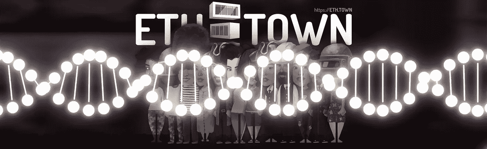
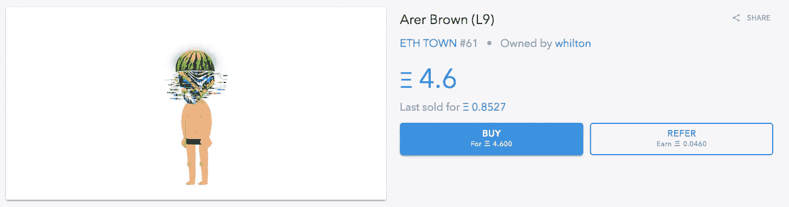

# ETH。小镇基因，英雄交易

> 原文：<https://medium.com/hackernoon/eth-town-genes-heroes-trading-ef3ed4905a27>

## 朋友们，

今天我们将谈论 4 件事:
1)骰子基因抽奖！2)游戏基因
3)交易英雄
4)自定义角色的快速更新

骰子基因抽奖！

4 月 24 日星期二，我们发布了一个脚本的源代码，该脚本依赖于未来块#5503650(将在 25 日星期三挖掘)的散列来确定 Dice 基因的接收者。

这是最透明的抽签方式，因为根本没有人，甚至我们，知道谁会是赢家。挖掘了块#5503650，确定了它的散列，脚本确定了 dice 基因的接收者！

幸运中奖者有:
0x4c 608 a 1377611879 ce 4f 6562 b 584 a 4 e 02 c 9127 CB
0x 976 b 7 b 7 e 25 e 70 c 569915738d 58450092 bfad 5 af 7
0x ea 0987 ad 748 c 033d 01d 71 DD 87 e 2d 5 e 1 FD 80 e 52

他们选择的角色(顺便说一句，他们都是自定义绘制的角色)已经获得了极其罕见的基因。恭喜你！

# 游戏基因

上周，当部署 ERC-721 合同和交付英雄时，为了让它更有趣并感谢玩家的耐心，我们平均随机给 3 个角色中的 1 个赋予了额外的基因，有些人甚至得到了两个。但是这些基因是什么呢？

这些基因将帮助英雄在游戏和一般进展中表现更好。让我们看看他们到底是怎么做的:

**即时合并。**合并英雄升级的时候，为什么还要等？即刻获得新英雄！
**快速合并。**好吧，不是马上就有这个基因。但是比平时快多了！
**快速冷却。**玩迷你游戏，英雄会累。然而，这种基因的携带者比一般人恢复得更快。
**有可能是双胞胎。**合并角色总有机会得到双胞胎。有了这个基因，这种可能性就增加了。
**天生投资。**投资者力量由英雄等级决定，但是这个基因让有效力量高出 5%。
**坚韧。即使他们狠狠地打击你，也不能对你造成多大伤害。在被东西击中的游戏中，受到的伤害会减少。
**暴击威力。**有时会失手，有时会命中，有时会暴击。有这种基因的英雄在游戏中用东西打别人时需要较低的暴击骰。**

# 交易英雄:与 OpenSea.io 的合作

你们很多人已经知道 [OpenSea](https://opensea.io/category/ethtown) 向 [ETH 敞开了大门。小镇](https://hackernoon.com/tagged/eth.town) ERC-721 英雄！OpenSea 团队很快就做好了一切，和专业人士一起工作是一种享受。

这意味着任何人都可以使用 [OpenSea](https://opensea.io/category/ethtown) 市场来买卖英雄！[看看这个！](https://opensea.io/category/ethtown)

我们已经进行了一些采购。迄今为止最有趣的一次是以 0.827 [ETH](https://hackernoon.com/tagged/eth) (现在的价格是 4.6 ETH)出售一个故障家伙。呜！

Note: not all custom heroes are shown here!

# **快速更新自定义角色**

是的，这一个将会很快:绝对大部分完成了，最后！

**很快**我们计划宣布更多了不起的合作伙伴关系，它们都将带来 [ETH。镇](https://eth.town)转为其他项目，其他项目转为 [ETH。TOWN](https://eth.town) ，也许(也许)甚至列出所有来 [ETH 的迷你游戏。小镇](https://eth.town)！

**敬请关注！**

网址:[https://eth.town/](https://eth.town/)
博客:[https://medium.com/@ethtown](/@ethtown)
Btt 安:[https://bitcointalk.org/index.php?topic=3062760](https://bitcointalk.org/index.php?topic=3062760)
Btt 赏金:[https://bitcointalk.org/index.php?topic=3028492](https://bitcointalk.org/index.php?topic=3028492)
脸书:[https://fb.me/eth.town](https://fb.me/eth.town)
推特:[https://twitter.com/eth_town](https://twitter.com/eth_town)
insta gram:[https://instagram.com/eth.town](https://instagram.com/eth.town)
电报:[https://t.me/Ethertown](https://t.me/Ethertown)
媒体: [https:/](/@ethtown)