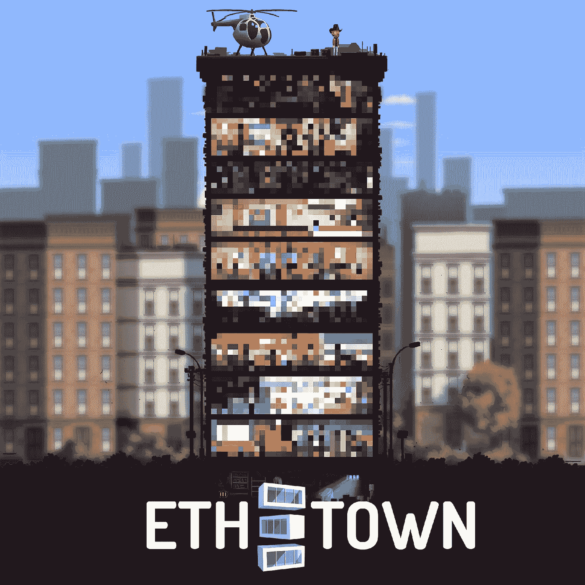
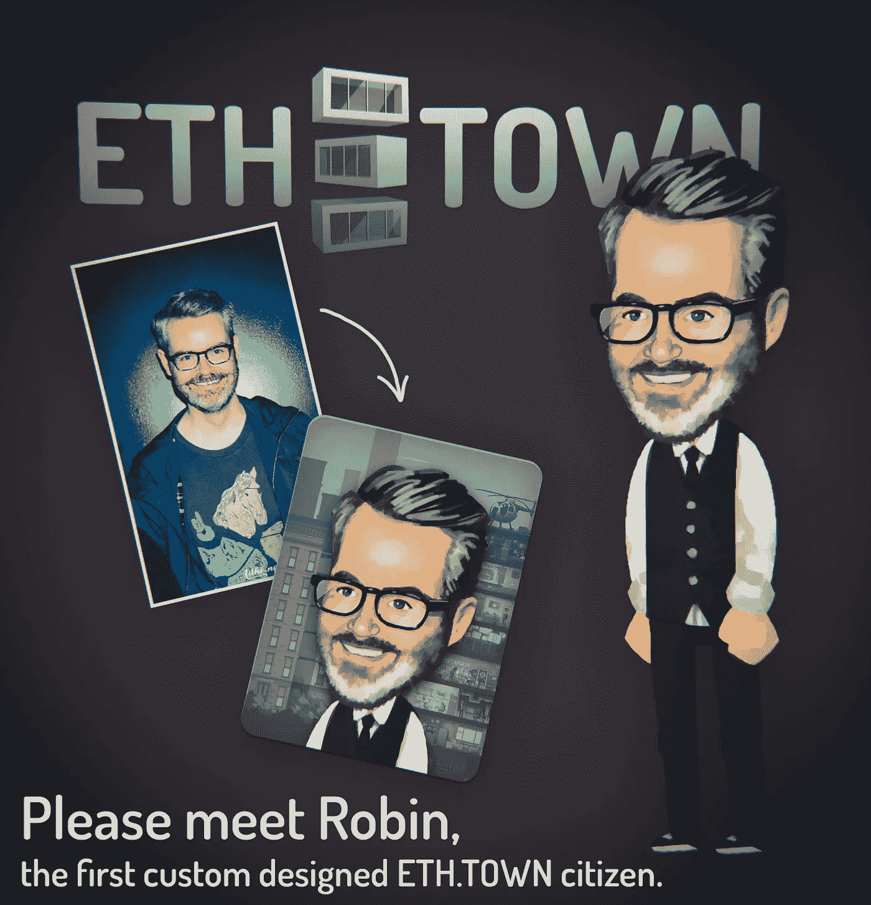
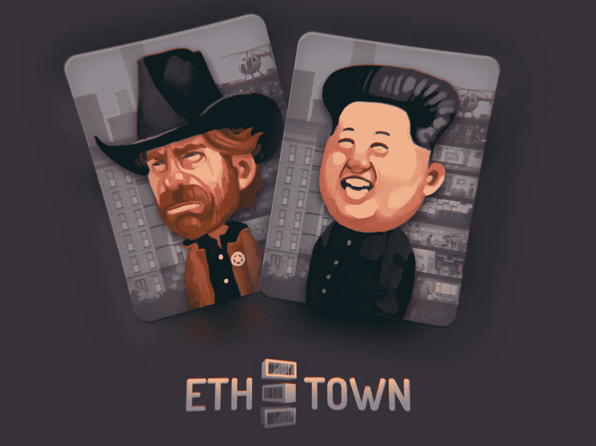

# ETH。镇预售是活的！

> 原文：<https://medium.com/hackernoon/eth-town-presale-is-live-ff952d102df8>

按照计划和承诺，我们今天已经开始预售了！每个人都可以低价购买游戏中的物品，并在游戏结束时得到补充。

让我们从头开始…

在 ETH。你是一名房地产投资者，在[密码](https://hackernoon.com/tagged/crypto)大楼工作。低买高卖，获得奖金，增加你在整个加密企业中的份额。机智过人！出局！超越战略！

正如你可能已经知道的，游戏中的三大组成部分是投资者代币、加密塔楼层和英雄。

加密塔是一个 100%加密附属塔，由加密办公室和公寓组成。有些是不错的老生意，有些完全是疯狂的东西。每个楼层都有自己的规则、利润结构、奖金等。，通常会加入一些有趣的花样。

房地产交易是严肃的业务，需要大量的工作，没有熟练的助手，你不会有很大的利润。这就是我们(或者确切地说，你的)英雄来帮忙的地方。他们每个人都有技能，这些技能定义了他们擅长什么。他们在各种情况下提供各种各样的奖金，包括成交时增加的利润(投资者权力)。

所以今天我们启动了预售。我们社区的热情给我们留下了深刻的印象。一开始有一些小问题，但总的来说销售开始得很好。截至目前，我们已经售出 345 个 9 级英雄。以下是一些今天找到雇主的幸运儿。

我们还收到了很多(真的很多，没想到这个选项会这么受欢迎)定制角色的请求，这太神奇了！由于我们的艺术家将分别绘制它们，这自然需要时间，但第一个已经准备好了！

我们赠送的另一个奖励是骰子基因。如果你购买了 3 个或更多的角色，你参加一次抽奖，以获得其中一个角色的骰子基因。这种基因非常罕见:只有 3 个角色会获得这种基因，第四个基因携带者是中本聪。拥有这种基因的角色的主人将从骰子迷你游戏中获得一部分收入。

现在还有两个超级英雄(15 级，最高的可能属性)在拍卖中:魔术师查克和金·点加密。到目前为止，查克的最高出价是 1.6 T4 ETH T5，而金的价值是 2.1 ETH。

事实上，任何人都可以自己创造一个超级英雄(或者明星英雄)。然而，这需要 64 个 9 级英雄和一些时间。我们会看看拍卖进行的如何，也许下周会有一场快闪拍卖，持续一两个小时。

我们还有一个道黑客的地板众筹。我们对它设定了严格的限制(一个人不超过 1 ETH ),但令我们惊讶的是，我们在第一个小时内就卖出了 25%。肯定用不了多久就会完全售罄。我们将进一步降低每个参与者的限制，到每人 0.5 ETH，因为我们想要更多的参与者。

预售期间的每一笔购买都会为买家赢得 ETH。城镇投资者代币(每次消费 200 个代币)。获得代币的可能性很大，因为游戏不会直接出售代币，奖励的数量也少得多。代币允许持有者从游戏中完成的所有交易中获得收入，也将是某些游戏内物品的唯一支付方式。

在预售进行的同时，团队继续致力于游戏本身，以尽快准备好有限访问版本。该项目的目标保持不变:在公开发布后的第一周就实现 10 万的 ETH 营业额，并打破所有游戏记录！

已经有一些常见问题，所以我们想在这里回答它们:

**问:我买了 3 个英雄，但只买了 2 个**

答:首先，智能合约的设计是，如果你发送更多，就会退还多余的部分，所以它实际上只花了 2 英镑，并退还了其余部分。角色的价格会随着购买的每个角色而增加，所以如果有很多未完成的交易，价格可能会增加很多，以至于在你的交易被挖掘时，你的付款还不够支付 3 个角色。我们的系统会自动提供多发送一点的信息来解决这个问题，但是在最开始的时候有大量的交易，多发送一点是不够的。

**问:所以我买了 2 个而不是 3 个(或者 4 个而不是 5 个)。我会得到骰子基因(或者自定义角色)的机会吗？**

答:只需购买剩余数量的字符，你会的。我们将检查拥有的字符总数，而不是每个交易的字符数。

**问:我如何检查我是否获得了 Dice 基因？**

答:骰子基因非常罕见，只有 3 个字符会得到它。但既然稀有，那就珍贵。预售结束后会添加基因，如果有就能看到。预售结束后，整个页面看起来会有所不同。当然，当游戏运行时，你也可以看到游戏中的所有基因。

干杯， [ETH。镇](https://eth.town/)队。

博文:
[你好世界！](/@ethtown/eth-town-hello-world-ab418071c185)
[投资者代币？](/@ethtown/eth-town-investor-tokens-f294de8b6f0b)
[楼层、英雄、团队、预售！](https://hackernoon.com/eth-town-floors-heroes-team-pre-sale-c52fa5579012)
[预售公告](https://hackernoon.com/eth-town-presale-roadmap-team-3ee730acaf23)

网址:[https://eth.town/](https://eth.town/)
博客:[https://medium.com/@ethtown](/@ethtown)
Btt 安:[https://bitcointalk.org/index.php?topic=3062760](https://bitcointalk.org/index.php?topic=3062760)
Btt 赏金:[https://bitcointalk.org/index.php?topic=3028492](https://bitcointalk.org/index.php?topic=3028492)
脸书:[https://fb.me/eth.town](https://fb.me/eth.town)
推特:[https://twitter.com/eth_town](https://twitter.com/eth_town)
insta gram:[https://instagram.com/eth.town](https://instagram.com/eth.town)
电报:[https://t.me/Ethertown](https://t.me/Ethertown)
媒体: [https:/](/@ethtown)