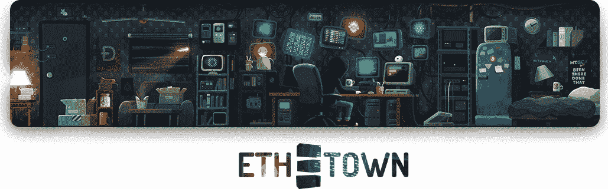
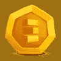
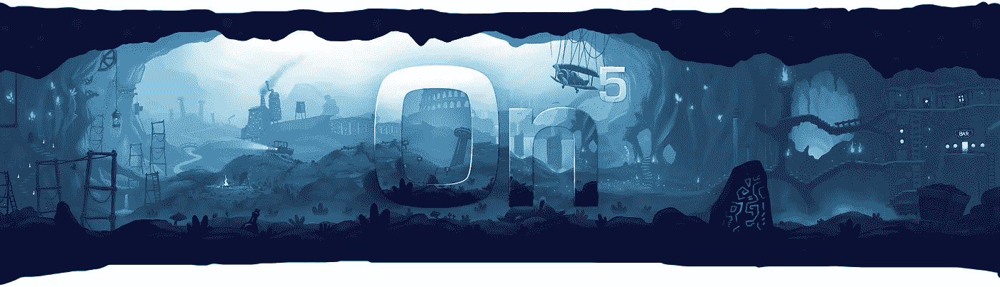

# ETH。城镇:售前、路线图、团队。

> 原文：<https://medium.com/hackernoon/eth-town-presale-roadmap-team-3ee730acaf23>

正如我们在之前发布的[，我们本周将举行预售活动。现在是时候揭开它到底会是什么样子了。](https://hackernoon.com/eth-town-floors-heroes-team-pre-sale-c52fa5579012)

我们出售**三种**主流商品，**两种**特别定制商品。

# 1)15 级星际英雄

镇上的大多数人都是 0 级农民，但这些人都是 15 级国王。此外，他们是独一无二的:没有其他角色会有同样的外观。这些都是可收集的和独一无二的，他们当然有最大的统计数据。

没有人确切知道它有多大。镇将，所以这样的人物价格是不可预测的。因此，我们只是在公开拍卖中把它们卖给出价最高的人。当然，拍卖是由一份[以太坊](https://hackernoon.com/tagged/ethereum)智能合约驱动的。

每次拍卖的获胜者还将获得与最终价格成比例的投资者代币奖金。

# 2)场内众筹

这座秘密的塔有很多层。每一件都是独一无二的，由我们才华横溢的艺术家手工制作，具有独特的功能。道黑客地板现已发售。

每层楼都有主人。在预售的这一部分，每个人都有能力预购一块道黑客的地板，并在游戏发布时拥有它。地板所有权带有地板规则的所有常规津贴(抱歉，在发布前不会透露)，我们独特的游戏机制确保您将获得利润回报。

不过有个问题:你不能放超过 1 个 ETH。这应该是一次大众销售，而不是一两个人买下整层楼，那样就没什么意思了。

这里也一样，地板的每个部分都有投资者代币的奖励，比你在游戏中得到的多得多。

# 3)7 级人物。

这些不像星星那么酷，但是你可以在此时此地拥有它们。我们将以游戏中有效价格的 40%到 80%来出售这些东西。为什么是“有效价格”？因为您实际上不能购买以太网或使用以太网升级，所以此选项仅在售前提供。价格将从最低价格开始，随着每个角色的售出而上涨。

这些并不像星星一样独特，它们仍然很难得到。在游戏中，你需要赢得拍卖，然后花费投资者代币和时间来筹集一个类似的。在这里，他们是来玩的。

如果你买了 3 个或更多的角色，你会被加到一个抽奖中，3 个骰子基因会被分配。这意味着其中一个角色可以获得“骰子基因”。拥有这种基因的角色将从骰子迷你游戏中获得收入。

每次购买都包括通常的投资者代币奖励。

# 4)特别优惠:自定义角色

不满足于只有一个随机的角色？我们可以塑造你独特的性格。可以是你，你的朋友，你的老板，你的妈妈。不可能是名人(除非你就是那个名人)。购买至少 5 个 7 级角色，我们将为您制作一个！要使用此优惠，请将图片和交易 ID 发送至 face@eth.town。

# 5)更特别的优惠:定制地板

通常是由我们来决定塔里的楼层是什么样子，谁住在里面。然而，有一个位置是留给那些想展示他们公司的人的！如果你想在游戏中拥有自己的地盘，请通过 omg@eth.town 联系我们以获取报价。这将是一场私人拍卖。

# **代币奖金**

对于每一个选项，当你购买时，你将获得该物品和一定数量的(**每花费**以太 200 代币)的投资者代币。这将是你目前唯一可以通过支付乙醚获得代币的途径，尽管是间接的。

代币非常酷，尤其是在游戏的早期阶段，因为游戏的工作方式，**你永远不可能只买它们**，而且在推出后**也不可能得到很多。代币持有者自动从每笔成交交易中获得一份**收入分成**，并可以使用代币支付商品，这些代币不以任何其他货币出售。例如，角色:你不能用乙醚购买或升级它们，只能作为代币。**

假设我们在第 1 周实现了 10 万的 ETH 营业额。假设投资者获得 2%的份额(大多数情况下更多)，将有 2K ETH 投资者利润池进行分配。如果在预售期间，我们出售了价值 400 ETH 的物品，这将意味着在游戏的第一周结束时，每 200 个代币(当你花费 1 ETH 时得到的)将产生大约 5 ETH。我们知道这听起来很疯狂，但是加密领域有什么新的东西吗？

购买的物品将在游戏启动时交付，代币将立即自动发送。你可以马上开始在以太三角洲交易。

# **为什么要预售**

我们相信早期采用者会是好玩家，而且他们会得到所有酷的物品，所以为什么要让他们辛苦呢？当游戏不是从一个干净的状态开始，而是一些人已经拥有物品时，它会更有趣。这也确保了我们建立一个更忠诚、联系更紧密的社区。

预售所得将用于项目发布时的广告宣传。我们的目的是让游戏变得庞大，我们需要一个预算。最终所有的玩家，尤其是早期用户，都会从这个巨大的游戏中受益！

我们的最终目标是在以太坊平台上做出最好的游戏，不妥协。

# **ETH。城镇路线图**

我们希望这个游戏又大又长。我们对此有很多想法和计划。它被设计成不仅仅是我们在某个时候发布的成品，而是不断进化和扩展的。我们将分享刚刚开始。

项目路线图如下:

*   **预售开始时间:3 月 15 日星期四**
*   可在以太网上交易的令牌
*   受限访问 alpha(申请表在 [https://eth.town):](https://eth.town):) 三月底前
*   4 月:全面启动
*   四月:POWH 事件
*   4 月:增加 2 款迷你游戏
*   5 月:CryptoKitties 事件
*   阿美:英雄小游戏
*   六月:神秘国度活动
*   6 月:手机版
*   夏季:代币可在更多交易所交易

# **团队**

该游戏由 On5 游戏开发工作室开发。工作室通常专注于手机游戏，但创新很酷，以太坊平台是尝试制作真实游戏的好地方。

工作室有很多游戏开发的经验。它曾与三星、雅达利和艺电等公司合作过。一个由开发人员和艺术家组成的天才团队正在夜以继日地为 ETH 工作。现在的小镇。

博文:
[你好世界！](/@ethtown/eth-town-hello-world-ab418071c185)
[投资者代币？](/@ethtown/eth-town-investor-tokens-f294de8b6f0b)
[楼层、英雄、团队、预售！](https://hackernoon.com/eth-town-floors-heroes-team-pre-sale-c52fa5579012)

网站: [https://eth.town/](https://eth.town/)
Btt Ann:[https://bitcointalk.org/index.php?topic=3062760](https://bitcointalk.org/index.php?topic=3062760)
Btt Bounty: [https://bitcointalk.org/index.php?topics=3028492](https://bitcointalk.org/index.php?topic=3028492)
Facebook: [https://fb.me/eth.town](https://fb.me/eth.town)
Twitter: [https://twitter.com/eth_town](https://twitter.com/eth_town)
Instagram: [https://instagram.com/eth.town](https://instagram.com/eth.town)
Telegram: [https://instagram.com/eth.town](https://t.me/Ethertown)
Medium: [https://medium.com/@ethtown](/@ethtown)
Discord: [https://discord.gg/vzZjpFV](https://discord.gg/vzZjpFV)