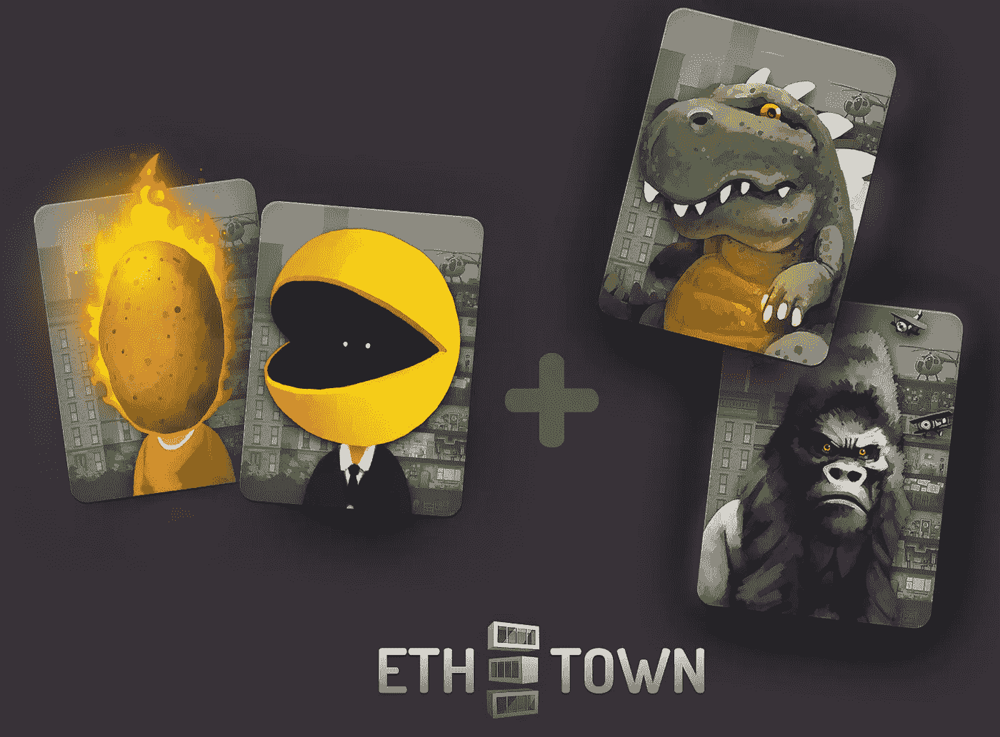
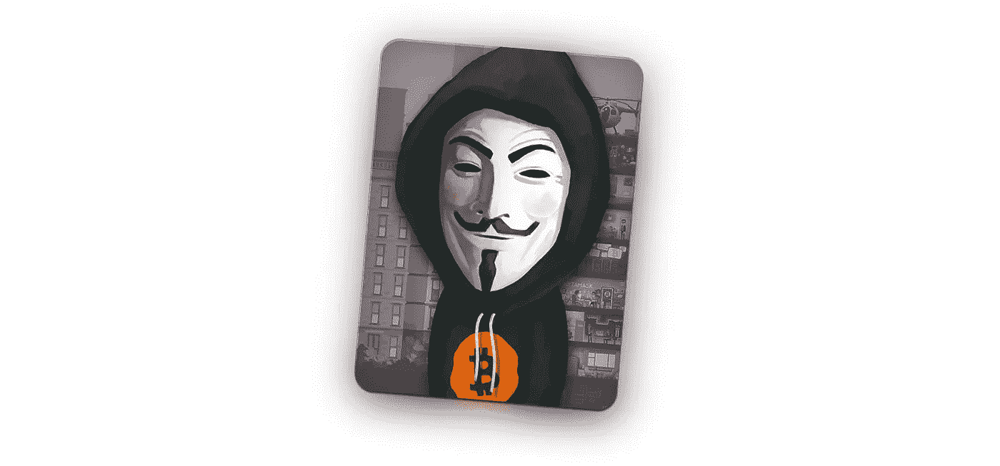
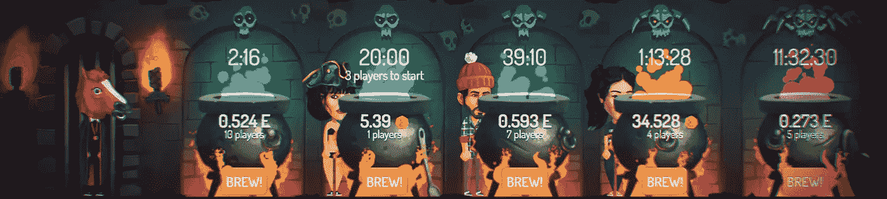

# ETH。城镇更新

> 原文：<https://medium.com/hackernoon/eth-town-update-6f4e2cd59f2b>

ETH。镇团队在这里，我们想分享有关该项目的最新消息和想法！

首先，请让我们感谢我们伟大的社区！我们没想到会得到这么多支持，这种支持很棒。我们得到了大量的反馈，这让我们可以随时调整项目。

ETH。我们现在正在准备的早期发布的城镇与我们在 11 月份预想的完全不同。当然，核心概念保持不变，但与我们新粉丝群的交流让我们塑造了其他非常不同的东西。

## 时间表。

最初的计划是在三月底发布一个封闭的 alpha 版本，但是由于各种原因，我们已经把它改到了四月初。现在，在看到期望有多高之后，我们不能发布任何低于标准的东西，即使是对 alpha。

最初的计划是在没有英雄的主要逻辑的情况下继续推出 alpha，然后我们决定至少包括基本部分。现在，在看到来自大锅迷你游戏的反馈后，我们决定将核心英雄逻辑纳入发行版。这是完全不可替代的令牌实现，能够转移和管理英雄，等等。

总之，这意味着我们再次需要推迟推出，甚至对封闭的观众。我们知道不按时完成可能会损害您对我们的信任，但是不展示我们想要展示的内容，即使是对有限的观众，也不是一个选择。第一印象对我们来说很重要，我们相信等待是值得的。这里有更多信息。

我们会在预计日期继续发布更新，但我们会尽一切努力让它尽早发生。

从好的方面来看，在测试版中加入更多的项目可以缩小测试版和全球发行版之间的差距。

## 超级英雄回顾。

今天 Hotzilla 以令人难以置信的 23.4 [ETH](https://hackernoon.com/tagged/eth) 的价格被卖掉，而孔王子以 22.5 ETH 的价格去了它的主人那里！拥有《吃豆人》和《烫手山芋英雄》的同一个人在拍卖结束前狙击了 HotZilla 和 Kong 王子！

只是提醒你，这两个是“烫手山芋”式的拍卖，参与其中的人获得了一些利润。这两个“烫手山芋”还包括一个额外的转折:其中一个的最高出价者还可以获得另一个出价的 0.5%。

此外，今天我们出售预售的最后一个超级英雄:它是众所周知的(和不为人知的)聪。在网站上查看:链接。

## 大锅迷你游戏。

我们收到了很多反馈。有些人喜欢按你投入的比例(概率)分享底池的想法。其他一些人(显然是那些不喜欢彩票之类的东西的人)发现这一点也不酷。

我们想向你保证，并不是所有的小型游戏。城镇会涉及风险。但是这个反馈实际上促使我们重新思考和重塑测试版到底应该包含什么，并改变优先级。我们每天都在了解我们的观众，我们希望确保在我们推出游戏时，大多数人都喜欢这个游戏。

顺便说一下，大锅已经在 ETIT 持有者池中产生了 2.5 个 ETH。只是一个小游戏，只有几天，但已经有一些真正的 ETH 分裂。关于这个迷你游戏的更多信息将会很快公布。

## 自定义英雄。

你可能知道，我们已经收到了大量的英雄定制请求。等待的队伍变得如此之大，以至于我们首先决定要求购买 10 个 9 级英雄才有资格进行角色定制，但随后不得不完全取消这一选项，只需支付 10 ETH 的固定费用。在我们创造出所有待定的角色后，我们要么降低价格，要么完全停止接受进一步的请求，还没有决定。

目前，我们已经完成了大约 50%的未决画像，也许是时候与你分享其中的一些了！

请查看我们博客中的这篇专题文章:[https://medium . com/@ eth town/custom-heroes-in-the-区块链-game-eth-town-694773111e3c](/@ethtown/custom-heroes-in-the-blockchain-game-eth-town-694773111e3c)

ETH。镇队。

网址:[https://eth.town/](https://eth.town/)
博客:[https://medium.com/@ethtown](/@ethtown)
Btt 安:[https://bitcointalk.org/index.php?topic=3062760](https://bitcointalk.org/index.php?topic=3062760)
Btt 赏金:[https://bitcointalk.org/index.php?topic=3028492](https://bitcointalk.org/index.php?topic=3028492)
脸书:[https://fb.me/eth.town](https://fb.me/eth.town)
推特:[https://twitter.com/eth_town](https://twitter.com/eth_town)
insta gram:[https://instagram.com/eth.town](https://instagram.com/eth.town)
电报:[https://t.me/Ethertown](https://t.me/Ethertown)
媒体:[https://Medium . com/@媒体](/@ethtown)