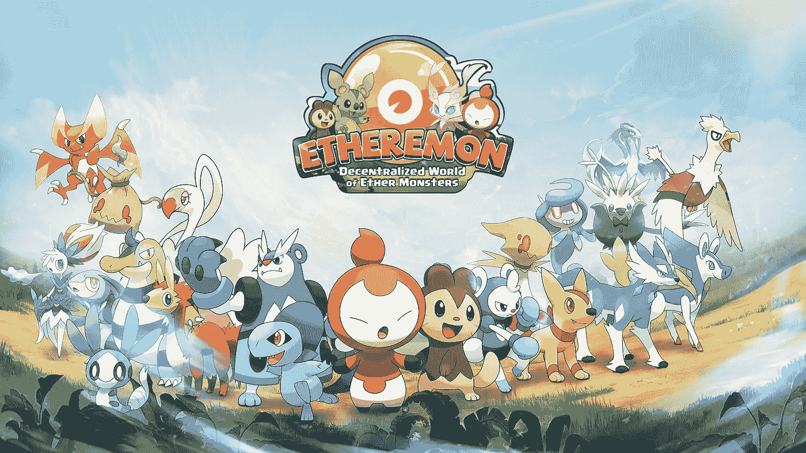

# Etheremon 与 Kyber 合作解决分散应用的支付问题

> 原文：<https://medium.com/hackernoon/etheremon-integrates-with-kybers-on-chain-liquidity-protocol-a-new-payment-solution-for-ccbb36dfd595>

[*Etheremon*](https://www.etheremon.com/) *与 Kyber 合作，并集成了* [*Kyber*](https://kyber.network/) *的链上流动性协议，允许多令牌购买，为 DApp 用户带来全新体验。*

# **分散式应用中的支付问题**

当区块链科技被比作 80 年代的互联网时，一些人也说它离下一个网络泡沫不远了。在所有行业中，游戏已经利用这一新生技术崛起为区块链技术的早期采用者。

快速浏览一下[*DappRadar.com*](https://dappradar.com/)，这是一个针对分散式应用(DApps)的列表和分析平台，展示了游戏在区块链的延伸。游戏是 DApps 中最受欢迎的类别之一。目前，已经有 350 款游戏被开发出来。这证明了游戏开发社区对区块链的参与度在飙升。

不幸的是，随着越来越多的 DApps 被开发，越来越多的加密货币被创造出来，导致了一个支离破碎的令牌化世界。虽然代币对于游戏内经济是必不可少的，但许多代币的诞生在某种程度上阻碍了用户对 DApps 的采用。如今，加密货币持有者不仅持有比特币和以太等流行的代币，还可能拥有 5、10 或 20 种不同的代币，甚至更多。同时，像 Etheremon 这样的游戏通常只接受 1 到 2 个代币，一个是以太，另一个是自己的加密货币。

这意味着玩家每次想玩游戏时都需要将他们持有的代币兑换成以太或游戏的代币。这不是一个简单的过程，通常需要一些等待时间，这不利地影响了玩家的体验。相比之下，玩家对整个游戏体验的期望，包括支付，应该是非常简单直观的。

# Kyber 的链上流动性协议为 DApps 提供了无缝支付解决方案

Kyber 允许用户使用 ERC20 代币支付，这使得他们可以非常方便地访问游戏 DApps 上的服务。作为第一个与 Kyber 的链上流动性协议集成的 DApp，Etheremon 现在允许其玩家使用任何支持的 ERC20 令牌支付，包括一些流行的令牌，如 Zilliqa (ZIL)和基本注意力令牌(BAT)。

与流动性协议的整合简单、直接且无需许可，因为 Kyber 完全在链上运行。这是 DApp 和智能合约集成的一个基本功能，因为智能合约只与其他智能合约交互。完全在链上还支持原子和即时结算，以及涉及 ERC20 令牌的完全透明和可验证的支付流程。

Kyber 的这款新产品不仅将用户的支付流程简化为单一的支付步骤，还将推动整个 DApps 生态系统的采用。Etheremon 和 Kyber 的合作为区块链游戏和其他 DApps 设立了新的支付标准。

# **关于凯博网络**

Kyber 的链上流动性协议支持应用程序和生态系统之间的分散原子交换和交易。通过允许令牌持有者公开贡献流动性，以及 DApps 和项目简单集成以访问贡献的流动性，Kyber 实现了一个更加互联的令牌化世界，任何令牌都可以在任何地方使用。

# 关于以太精灵

结合区块链和虚拟现实技术，Etheremon 为[游戏 3.0](/etheremon/etheremon-building-the-foundation-of-game-3-0-with-blockchain-899ed5673e21) 时代奠定了基础，在这个时代，沉浸式游戏体验得到了增强，因为玩家完全拥有他们在游戏中的数字资产，没有人可以操纵或窃取它们。玩家创造的一切价值都属于玩家。以太梦已经发展成为最受欢迎的 DApp 游戏之一，有超过 38，000 个怪物被抓，300，000 场战斗被玩。