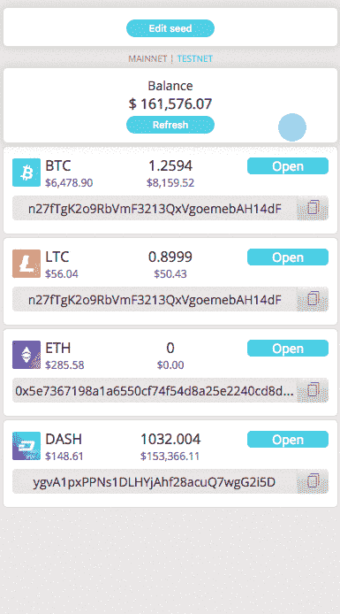
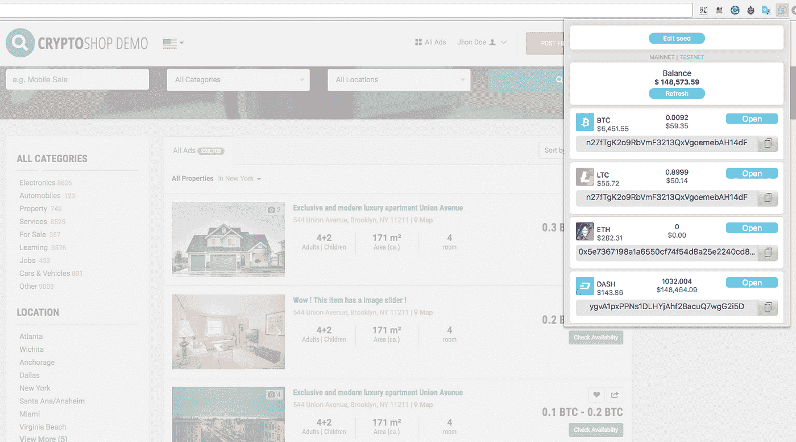
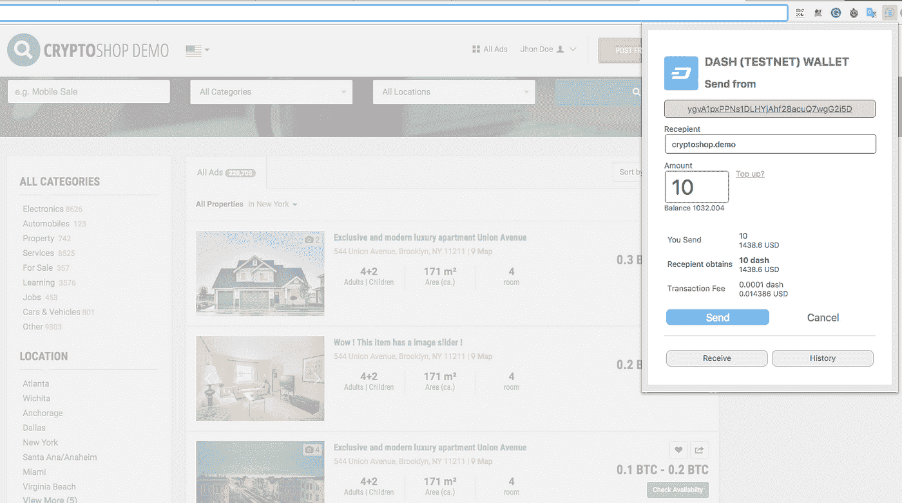

# 以太坊地址别名

> 原文：<https://medium.com/hackernoon/ethereum-address-alias-5cb01fcd8308>

让我们来看看那些为了确保人们不写 IP 地址 172.217.16.14 而创建的域名，因为记住 google.com 的名字要容易得多。现在我们来看看以太坊地址。比如 0x 0472 EC 0185 ebb 8202 F3 D4 DDB 022699889663 cf 2——看起来比 IP 地址还要难。ethnamed.io 项目的目标是为以太坊地址实现命名别名。

Name Registration Process

安装:[https://chrome.google.com/webstore/search/ethnamed](https://chrome.google.com/webstore/search/ethnamed)

github:【https://github.com/ethnamed 

https://www.reddit.com/r/ethnamed[Reddit](https://www.reddit.com/r/ethnamed)

https://www.facebook.com/ethnamed:[脸书](https://www.facebook.com/ethnamed)

网址: [https://ethnamed.io](https://ethnamed.io)

Name Registration Process

我们的主要目标之一是创建一个通用的支付解决方案，可以选择只知道发送者的电子邮件或昵称就发送资金。在某种程度上，我们融合了 [Metamask](https://ens.domains/) ETH-wallet 和 [Ethereum 名称服务](https://ens.domains/) DNS 的基本原则，并将整个想法扩展到使用电子邮件和昵称，以消除使用复杂十六进制地址的需要。例如，一个常规的以太坊地址看起来像这样:0x 89205 a3 a3 B2 a 69 de 6 DBF 7 f 01 ed 13 b 2108 b 2c 43 e 7，大多数加密钱包都是这样工作的。不出所料，这样的地址很容易拼错，也很难记住，不像简单的昵称或像 johndoe@test.com 这样的电子邮件。此外，Ethnamed 允许用户将不同区块链网络的几个钱包链接到一个电子邮件或昵称。

Integration with website

Ethnamed 的另一个重要功能是计划中的[系统](https://github.com/ethnamed/web3t)，用于将新的加密货币添加到您钱包中现有的投资组合中。现在，为了与加密货币进行交互，人们必须下载并熟悉一种为加密设计的特定钱包软件。通过 Ethnamed，我们正在为使用某些加密货币所需的代码片段建立一个开放的存储库。我们通过将一个 web 页面与类似于 ETH 使用的系统 Metamask 的 **WEB3T** 接口集成在一起，实现了自动发票创建。

> web3t——类似于以太坊的 web 3，但适用于所有加密货币
> 
> Javascript 示例:
> 
> web3t。 **btc** 。sendTransaction({to: …，value: …}，CB)；
> 
> web3t。 **eth** 。sendTransaction({to: …，value: …}，CB)；
> 
> web3t。**【任意币】**。sendTransaction({to: …，value: …}，CB)；

因此，任何人都可以在我们的 [Github](https://github.com/ethnamed/web3t) 上通过简单的拉请求将他们想要的加密货币添加到[开源库 **WEB3T**](https://github.com/ethnamed/web3t) 。

> 在创建存储库的过程中，来自 [advance.fund](https://advance.fund/) 的团队将积极参与。他们认为自己的使命是开发区块链技术，开展自己的几个项目，并愿意为合作提供经验和资源。

The result ofweb3.dash.sendTransaction(…)

对于未来的发展，我们也有很大的计划。路线图包括实现我们的钱包与交易所整合的技术手段(fiat -> crypto，crypto-> fiat)；以太坊和以太坊经典、比特币、莱特币、Dash 等的原子互换；iOS 和 Android 的桌面版和移动应用；火狐插件；以及用于加密货币标准化和集成的开源库。

请分享您的反馈，以帮助我们构建更好的产品，并实现 Ethnamed 推动加密和区块链技术在全球范围内大规模采用的潜力。

安装:[https://chrome.google.com/webstore/search/ethnamed](https://chrome.google.com/webstore/search/ethnamed)

github:[https://github.com/ethnamed](https://github.com/ethnamed)

https://www.reddit.com/r/ethnamed

https://www.facebook.com/ethnamed

网址: [https://ethnamed.io](https://ethnamed.io)