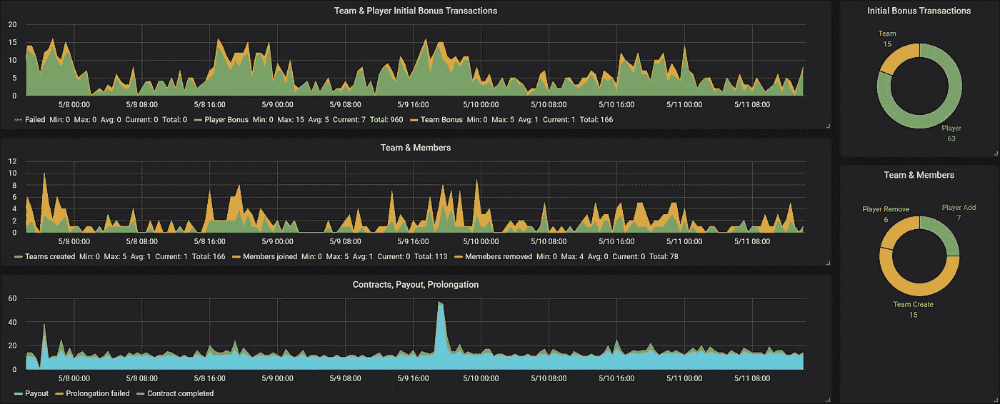
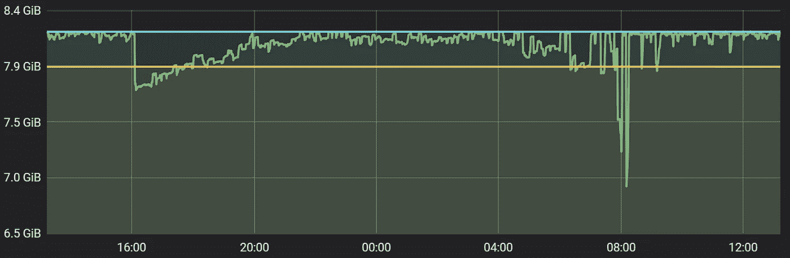
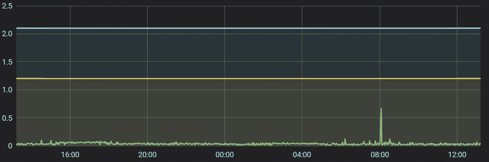
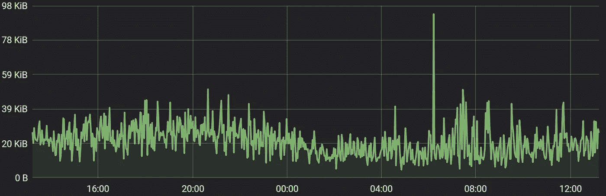
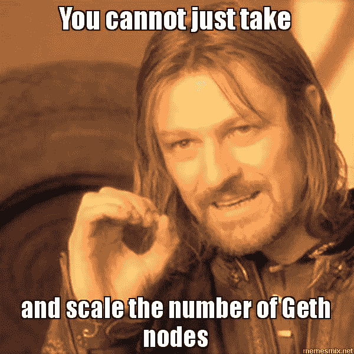

# 拥有 50 万+用户的真实项目中的以太坊区块链

> 原文：<https://medium.com/hackernoon/ethereum-blockchain-in-a-real-project-with-500k-users-f85ee4821b12>

这个信息丰富的技术故事讲述了关于以太坊的一切及其陷阱，我们在将[以太坊](https://ethereum.org)区块链与我们的产品[梦之队](https://dreamteam.gg/)绑定时[遇到了这些陷阱，这是第一个电子竞技和游戏招聘和管理网络。在撰写本文时，我们平台的注册用户总数已经超过 500，000。](https://medium.com/dreamteam-gg)

在我们的平台上，区块链处理所有与支付有关的操作。所有“与金钱相关的”操作都使用以太坊智能合约进行处理。当用户创建团队、添加或删除球员、接受补偿、相互交易等时，需要智能合约。区块链和智能合同被用于这种情况下，以保证支付和避免欺诈，不幸的是，这在电子竞技中相当常见。

# 数字

3 月 30 日星期五，我们在以太坊测试网络上为我们的用户开放了我们的区块链解决方案。到目前为止，在发布后的大约 45 天，我们已经从我们的主账户中挖掘了 50，000 笔交易，该账户管理我们平台上的团队和支出。这大约是每小时 42 次交易，或总以太网容量的 0.25%(考虑到消耗的气体)，当考虑到时间框架时，这是相当可观的。

Blockchain transactions on DreamTeam with 30 minute interval

一旦我们迁移到实时以太网(mainnet ),这些数字将会改变，因为大多数交易不会在那里发生。这背后有几个原因:

1.  目前大多数交易只是球员和球队一旦“激活”他们的区块链钱包后获得的初始奖金。我们不会在实时网络上发放奖金，因此交易数量在开始时会大幅减少(目前超过 63%的交易是初始奖金)。
2.  在我们的平台上，只有一定比例的用户预计会使用“区块链”团队和支付方式，一旦这种方式转变为真实货币，交易数量也会再次减少。

考虑到这两点，我们预计只有大约 10%的交易发生在真正的以太坊网络上，如果不是更少的话，导致以太坊网络总容量的 0.025%理论上被我们的业务占用，大约每小时发生 4 次交易。

然而，这一统计数据没有考虑到几乎 80%的交易发生在高峰期(见上图)，这使得:

A)在高峰时期，在合理的时间内挖掘以太坊交易的高价(约 0.25 美元+每笔代币转账交易的费用)；
b)便宜交易的确认等待时间长(约 0.15 美元费用的交易超过 10 小时)。

这就是当前“传统”区块链解决方案背后的真相——它们不像常规数据平台那样可扩展。一旦区块链变得流行，它最终会变得昂贵。因此以太坊，作为最受欢迎的公共交易分类账，现在相当昂贵。而在我们的情况下，以及在其他业务的情况下，不断增长的用户数量和即将推出的功能肯定会使以太坊的交易率更高，这可能会推动以太坊只是我们“代币经济”的短期解决方案。

我们知道以太坊区块链还不可扩展，我在我的上一篇文章中提到过。以太坊即将推出的[分片功能](https://cryptoslate.com/ethereum-founder-vitalik-buterin-sharding-is-coming/)可能会极大地提高网络吞吐量，但是，如果为时已晚，我们可能会决定转移到另一个区块链平台。外面有很多。然而，还没有哪一个像以太坊一样受欢迎和可靠。

所以，这篇文章讲的都是以太坊！

# 以太坊集成和后端架构

一旦我们开始处理真正的价值，事情总是变得有点复杂。关于区块链，重要的是要建立一个系统，确保交易在通往以太网的途中不会丢失。我想分享一些我们在项目开发过程中遇到的陷阱。

## 技术栈

我们将微服务架构与持续集成结合使用，其中区块链解决方案由四个逻辑部分组成:

*   [使用](https://en.wikipedia.org/wiki/Solidity) [Truffle 框架](http://truffleframework.com)开发和部署以太坊智能合约的可靠性。
*   区块链客户端节点。
*   [NodeJS](https://nodejs.org) 后端带 [MongoDB](https://www.mongodb.com) 。
*   所有区块链交易的消息代理。

让我们简单地浏览一下所有的技术细节，并讨论为什么我们决定以这种方式构建平台。

## 后端

> **注**:截至 2019 年，请阅读我最新的文章，了解如何为你的 DApp 设计和构建后端:[分散化应用架构:后端、安全和设计模式](https://medium.freecodecamp.org/how-to-design-a-secure-backend-for-your-decentralized-application-9541b5d8bddb)。下面提供的关于后端的信息对于我们的情况来说有点过时，但是对于一般的使用仍然有效。

以太坊是为去中心化的 web 开发的，这个平台的主要工具都是用 JavaScript 编写的。因此，关于后端最直接的决定是 NodeJS。我们还决定使用 MongoDB，这是一个用于 NodeJS 的“传统的”面向文档的数据库，它与 JavaScript 无缝集成。

我们后端架构最重要的部分之一是使用 [RabbitMQ](https://www.rabbitmq.com) 消息代理。不熟悉 RabbitMQ 的朋友，推荐你看[这个](https://www.rabbitmq.com/features.html)或者[这个](https://www.cloudamqp.com/blog/2015-05-18-part1-rabbitmq-for-beginners-what-is-rabbitmq.html)。简而言之，RabbitMQ 是一个专用服务，其他服务(如我们的区块链服务)向其推送“消息”，然后这些“消息”被其他(或相同)服务消费。

使用 RabbitMQ 有很多好处。但是具体来说，在我们向网络发布事务之前，我们首先向消息代理发送一个“事务发布请求消息”,然后由实际向以太网发布事务的工作人员接收该消息。这允许我们实现以下技巧:

1.  消息在被处理之前一直位于 message broker 队列中，这将事务由于各种原因(网络故障、中断、人为错误等)而无法发布的风险降至最低。).
2.  将事务发布到队列允许我们轻松地暂时停止处理区块链事务(临时杀死消息消费者)，进行一些维护，然后恢复事务处理(将消费者带回来)。所有消息将简单地堆积在队列中，直到它们在任何平台定期维护后都被释放和处理。

我们的一个智能合同是可升级的，我们成功地使用#2 在生产环境中升级合同，没有任何可观察到的停机时间。

## 以太坊的松露框架

在撰写本文时，Truffle 是以太坊开发中最流行的框架。它有一个很好的 API，将开发者从底层以太坊的东西中抽象出来(比如组装和签署原始交易，编译可靠性代码，使用智能契约 [ABIs](https://solidity.readthedocs.io/en/develop/abi-spec.html) 等)。)，但也引入了一些模式，这些模式可能适合也可能不适合某些项目的工作流。

在 Truffle 中，为了将智能合约部署到网络上(或者进行与智能合约相关的任何初始设置)，您应该用 JavaScript 编写迁移脚本，其中每个迁移只运行一次，对于每个网络设置，一个接一个地按顺序运行。根据这个概念，第一次迁移向网络部署一个小的智能契约( *Migrations.sol* )，然后 Truffle 使用它来跟踪哪些迁移已经在网络上运行。一旦部署了这个智能契约，它的地址就会被记录到一个工件文件中( *Migrations.json* )。Truffle 读取该文件，以便了解哪些迁移已经运行，哪些没有运行。

现在，假设您想要部署一个新的智能合约，然后(可能稍后)在其中调用一些“初始化”方法，您需要编写三个迁移脚本，它们将:

1.  部署迁移智能合同。
2.  部署您的智能合同。
3.  调用智能合约中的初始化函数。

请注意，最后两个操作可以合并到一个迁移脚本中；我使用了 3 个脚本来演示迁移是原子操作，您可以一个接一个地开发，然后一个接一个地运行。

这些迁移脚本一旦由 Truffle 运行，就会在网络上产生以下事务:

1.  迁移智能合约部署。
2.  将迁移 1 保存到网络(Truffle 将调用迁移智能合同)。
3.  智能合约部署。
4.  将迁移 2 保存到网络。
5.  智能合约函数调用。
6.  将迁移 3 保存到网络。

如您所见，为了在网络上进行 2 次交易，Truffle 还需要 4 次交易，因此网络上总共进行了 6 次交易。

因此，如果您的目标只是在网络上部署一个简单的智能合同，您可能希望避免使用 Truffle 迁移工作流。使用 Truffle 实现这一点的方法之一(比如，手动部署智能合约)是使用单个迁移脚本或围绕 Truffle 迁移脚本的一些手动自动化。在任何场景中，您都可以使用 *truffle migrate - reset* 按顺序运行 *migrations* 目录中的所有脚本(这也不要求 *Migrations.sol* 存在)。

## Geth 节点同步

Geth 客户端节点只有在正确设置后才能正常运行，不幸的是，这不是一个快速的过程。今天(**2018 年 5 月 18 日**)运行 Geth 节点需要:

1.  testnet 最少 66 Gb 的 SSD 磁盘空间，mainnet 最少 92 Gb(一些志愿者将统计数据[贴在](https://github.com/ethereum/go-ethereum/issues/15616)你可以跟踪的地方)。
2.  最低 8.3 Gb 内存。
3.  良好的启动带宽，但它使用的互联网流量非常少(平均 25 kb/min)。
4.  同步时的平均处理能力。
5.  磁盘 I/O 越好，Geth node 同步状态就越快。

同步 testnet 的节点大约需要 0.5-2 天，而同步 mainnet 的节点则需要 1-3 天。

如果您尝试过同步 Geth node，您可能会奇怪为什么 Geth 同步会停留在最后 100-200 块，同时继续下载“已知状态”。我建议你阅读[这篇很棒的帖子](https://github.com/ethereum/go-ethereum/issues/15001#issuecomment-370732526)，了解为什么会发生这种情况的详细解释，但简而言之，为了“同步”，你的节点需要在准备好处理你的所有请求之前下载所有状态条目。外面有超过[1.4 亿](https://github.com/ethereum/go-ethereum/issues/15616#issuecomment-387304618)，如上所述下载需要 1-3 天(取决于磁盘 I/O、网络和处理器)。

以下是我们显示器上的一些 Geth 相关图表(绘图间隔= 1 分钟):

Geth node daily memory usage (after sync)

Geth node CPU usage (after sync)

Geth node network usage (after sync)

## 交易发布

以太坊中一个非常奇怪但却是必需的事情是，从一个特定账户发送的每笔交易必须有一个唯一的顺序整数，这被称为 *nonce* 。随机数在以太坊中用于防止[双重消费攻击](https://ethereum.stackexchange.com/questions/27432/what-is-nonce-in-ethereum-how-does-it-prevent-double-spending)。这个整数引入了两个重要的结果:

1.  **从一个账户提交的所有交易被连续处理(挖掘)。**例如，如果您向网络提交两个 nonce 整数分别等于 1 和 2 的事务(每个事务的连续唯一 nonce 整数是必须的)，则挖掘器甚至不会考虑第二个事务，直到处理(挖掘)第一个事务。但是，如果您一次向网络提交多个具有连续随机数的交易，这些交易中的一些(或全部)有可能会在同一个区块中被挖掘(如果您分别提供良好的天然气价格，但是否选择这些交易也取决于矿商)。
2.  你需要额外跟踪每个提交的*随机数*或者仅仅使用一个**单个** **节点** **来防止*随机数*冲突**。

如果您已经制定了这样一个许可智能契约，其中只有一个地址被授权“管理”某些东西，并且您需要频繁地“管理”这个智能契约，那么第一点尤其令人痛苦。通过设定较低或平均的天然气价格并进行大量交易，这可能会导致新交易的开采等待时间几乎无止境。

#1 的解决方案是简单地将交易发布到多个以太坊账户。然而，在这种情况下，您永远不会知道哪个事务将在哪个之前被挖掘。在[我们的智能合约](https://github.com/dreamteam-gg/smart-contracts)的情况下，我们甚至可以分配哪个*团队 ID* 对应哪个*账户*，以避免搞乱我们的团队管理智能合约。

## **随机数冲突**

Nonce 冲突是我们在尝试扩展 Geth 节点的数量以应对一个节点崩溃的情况时遇到的另一个神秘的事情。事实证明

You cannot just take and scale the number of Geth nodes, unfortunately.

我们在三个 Geth 节点之前使用了一个简单的负载平衡器，它将每个事务发送到三个节点中的一个。问题是，每次我们一次提交许多事务，其中一些事务就神秘地消失了。过了一两天，我们终于发现这是 nonce 碰撞的问题。

当你向网络提交[原始交易](/blockchain-musings/how-to-create-raw-transactions-in-ethereum-part-1-1df91abdba7c)时，你很好，因为你自己跟踪*随机数*。在这种情况下，您只需要一个节点向网络发布原始事务。但是，如果您使用的是内置于节点中的帐户解锁机制，并且在发布事务时没有指定 *nonce* (使用 web3 左右),则节点会尝试自己选择适当的 *nonce* 值，然后对事务进行签名。

由于网络延迟，在两个节点接收到相同的事务发布请求的情况下，它们可以生成相同的 *nonce* 值。在接收事务发布请求时，他们不知道他们都接收到了具有相同现时的事务。因此，当通过网络传播这些事务时，它们中的一个将最终被丢弃，因为它的“事务随机数太低”。

为了修复由于向系统添加负载平衡器而引入的随机数冲突，我们需要创建一种不同类型的负载平衡器。例如，负载平衡器总是使用一个特定的节点，并且仅当第一个节点关闭时才切换到另一个节点。

## **气体极限**

气体极限也是一个非常重要的数字。您可以通过两种方式提交气体限额交易:

1.  只需在你的代码中硬编码*gas limit*=*blockGasLimit*(或者你认为对你的交易足够的另一个数字)。
2.  通过使用类似[估算气体](https://web3js.readthedocs.io/en/1.0/web3-eth-contract.html#contract-estimategas)的东西来估算交易所需的*气体限制*。

我总是推荐使用选项#2，因为[它确实会影响事务挖掘时间](https://ethereum.stackexchange.com/questions/16428/does-gas-limit-have-any-bearing-on-transaction-mining-time)。在这种情况下，交易的处理时间会快得多。

此外，请注意，选项#2 只是对燃气使用量的**严格估计**，将通过在网络的当前状态下运行该事务**来使用。在您的交易被实际处理之前，网络**的状态可能会改变**，最终可能会导致汽油耗尽异常。我建议在天然气估计值的基础上增加 1-5%的天然气，并在将交易发布到网络之前，额外调查实际上如何以及什么会影响您的天然气估计值。**

# 结论

毫无疑问，以太坊是世界上最伟大的塑造未来的东西之一。但是在以太坊，以及其他任何“革命性”的东西，有许多不理想的地方，有待改进。如今，以太坊的类似物数量如此之多，以至于你很难选择哪一个( [EOS](https://eos.io/) 、 [Stellar](https://www.stellar.org/) 、 [Cardano](https://www.cardano.org) 、 [Lisk](https://lisk.io) 以及其他许多正在积极开发中的有前途的平台)。但以太坊仍然是一个领导者，因为社区和历史信任是这个平台的真正原因。

不久，我将发表一篇关于我们以太坊解决方案的技术文章，其中我们制定了一个令牌合同，不需要用户持有以太网来进行交易。订阅敬请关注；)