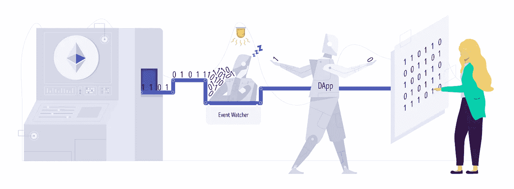
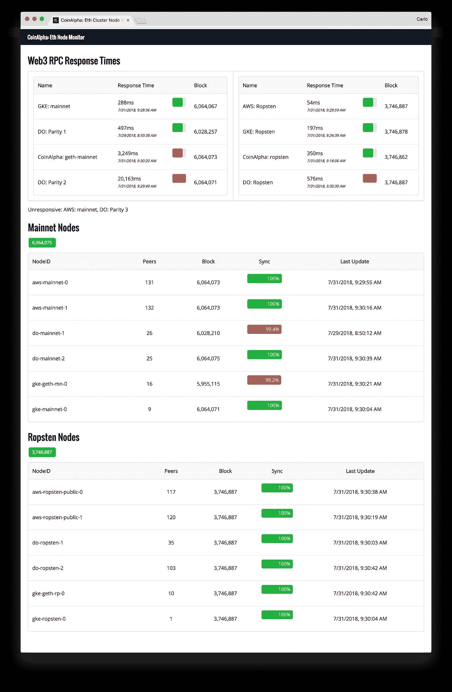
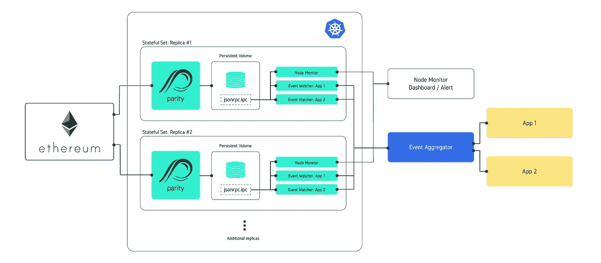

# DApp 基础设施设计(第一部分):使用 Kubernetes、Docker 和奇偶校验进行可靠的以太坊事件跟踪

> 原文：<https://medium.com/hackernoon/ethereum-dapp-infrastructure-2b4f1e6bfa38>

学习可靠性和编写智能合同相对容易，但我们发现更难的技术挑战是设计一个安全、可扩展、快速的后端基础设施[*【DApp】*](https://hackernoon.com/tagged/dapp)*。与传统应用不同，DApps 依赖于* [*区块链*](https://hackernoon.com/tagged/blockchain) *状态的固有概率性质，并利用相对较新且正在积极开发中的以太坊组件。这是关于架构模式和实践的系列文章的第一部分，我们学到的这些可能对其他 DApp 开发人员有益。*

对于任何在以太坊上开发 DApps 的人来说，最早的经验之一就是在智能合约中记录事件是一种报告状态变化和跟踪所执行操作的有效方式。由于事件在区块链上发出并可以重放，同时从技术上讲不会存储在昂贵的区块链状态(即内存或存储)中，因此它们是“存储”区块链数据的一种经济高效的变通方法。事件也是实时发出的，允许实时发现和报告操作。

> 事件听起来很棒！大家都要用事件！

等等，不要这么快…DApp 开发者的另一个早期的、可能是痛苦的教训是，事件观察是不可靠的:**只有当你的 DApp 在需要时检测到它，事件才是有用的**。如果您需要实时数据，但事件发现被延迟或事件被完全错过，这可能会导致用户体验不佳或完全 DApp 失败。

> 我们的解决方案:需要可靠事件跟踪的 DApp 开发者应该考虑将 Kubernetes/Docker 添加到他们的工具包中。虽然这些技术确实有一点学习曲线，但它们巧妙地解决了当前以太坊技术生态系统中非常具体的问题，主要源于可靠性。

# **当前以太坊基础设施技术的问题**

CoinAlpha Node Monitor

在 [CoinAlpha](https://coinalpha.com) ，我们已经对以太坊基础设施和可靠性进行了大量的实验和研究，以支持我们的产品。除了运行我们自己的本地节点之外，我们一直在使用不同的云提供商，如 AWS、Google Cloud 和 Digital Ocean 来托管节点。我们设置了节点监视器，允许我们跟踪节点性能和可靠性，如示例屏幕截图所示。

由于我们的项目需要尽可能接近实时的事件跟踪，我们不得不提出解决方案来解决以太坊基础设施的当前问题:

1.  **以太坊节点不断丢弃对等点**:由于多种原因，以太坊节点会周期性地出现故障；他们要么停止同步，要么落后，无法获得最新的区块链信息。造成这种情况的主要原因是对等点数量的**下降，这对任何节点来说都是死亡之吻。对等点数量随时可能下降，通常是因为节点卡在已经重组的“坏”块上，或者在侧链上结束。以太坊节点像流行的儿童桌一样工作；如果您的节点在一个坏块上结束，您的节点会被列入黑名单或被感染，所有对等节点都会试图丢弃它并阻止它重新连接。**
2.  **Infura websockets 不可靠**:几个月前， [Infura](https://infura.io/) 发布了支持事件跟踪的 websockets 连接能力。这为开发人员提供了跟踪事件的能力，而不必运行他们自己的节点。虽然这相对于完全不支持事件的[来说是一个实质性的改进，但它仍然不是一个完美的解决方案。Infura 的 web sockets 不能保持持续的连接，每隔几分钟就会掉线。任何使用过第一版](https://ethereum.stackexchange.com/questions/25451/infura-web3-provider-for-events-get-watch)[auger 桌面客户端](https://github.com/AugurProject/augur-app)的人都可能注意到了这种效果，该客户端使用 Infura 来构建和维护一个与 auger 相关的事件的数据库。
3.  **使用** `**watch()**` **观看实时事件可能会错过事件**:节点在同步时会定期落后几个块。其中一个主要原因是硬盘的读/写速度。支付高速 SSD 驱动器是一个可能的缓解措施，但随着当前以太坊 mainnet 数据库超过 100GB，云托管账单开始迅速滚雪球。此外，这仍然没有解决对等掉线问题。如果您的节点落后，然后进行同步追赶，我们发现现场活动可能会被错过。

# 解决方案:冗余和监控

容错以太坊事件监视系统可以检测故障，进行分类，并继续运行，就像什么都没发生一样。我们是这样设计的:

1.  **节点冗余**:我们运行多个以太坊节点，每个节点都连接有事件跟踪器，以便在单个或多个节点出现故障/延迟时提供冗余。
2.  **事件重放**:由于实时事件跟踪不可靠，我们循环我们的事件观察器来重放事件，并在节点之间错开重放时间。为了提高效率，我们菊花链重放；我们在每次重放时记下当前的块号，以便随后的重放将仅从先前的当前块号开始重放。
3.  **事件聚合器**:我们的事件观察器向集中的事件聚合器报告事件。我们的事件聚合器跟踪它已经看到的事件，并将新发现的独特事件分派给我们需要处理该事件的不同服务。

结果是我们有了一个如下所示的体系结构，下面是对组件的附加讨论:

Ethereum event watcher architecture with Kubernetes and Docker

> **下面是对我们一些架构选择的一些解释和讨论。**还有一些我们喜欢的 Kubernetes 很酷的地方。我知道有很多方法可以解决我提出的问题。如果您有任何意见、问题或建议，您可以通过我们的[密码电报组](https://t.me/cryptobaskets)或[发送电子邮件](mailto:dev@coinalpha.com)联系我们的团队。

## 为什么要 Dockerize？

对于我们的应用程序来说，使用 docker 的好处是，我们只需启动可以链接到我们的奇偶校验实例的新容器，就可以添加需要访问区块链的额外服务。每个容器独立运行，因此更改、添加和升级都可以在不中断任何其他现有运行容器/服务的情况下完成。

在上面的例子中，我们只有三个容器连接到奇偶校验数据:(1)节点监视器，(App 1 的事件监视器，以及(App 2 的事件监视器。但是当我们的需求改变时，我们可以很容易地添加更多的容器。

## 为什么是 Kubernetes？

管理多个节点集群(以太坊客户端和它们连接的服务)会变得非常复杂和混乱。不仅存在多个相互链接和依赖的服务，更新和维护配置以及管理机密(如 API 密钥)也需要协调，并且会产生潜在的安全漏洞。此外，在越来越大的系统中，监视服务器和服务的故障并重启故障容器会变得很有挑战性。这就是 Kubernetes 的用武之地；它处理所有这些问题。

以下是我们认为特别有用的一些功能:

*   **副本/扩展** : Kubernetes 非常适合冗余，因为它内置了可扩展性。默认情况下，您可以自动复制节点集群(以太坊客户端及其附属服务)，或者通过单个命令行指令进行复制。不需要单独配置每个集群。
*   **添加新服务**:通过向 Kubernetes 部署或有状态集添加容器，您可以简单地添加需要访问以太坊节点的新服务或跟踪器。
*   **具有状态集的持久卷** : Docker 容器本质上是短暂的。对于同步 Ethereum 节点，您并不真的希望每次节点出现故障并且必须重启时都同步 100GB 以上的数据库。Kubernetes 允许您创建持久卷，这是一个维护其数据和状态的独立数据存储。如果您的以太坊客户端重新启动，它将重新连接到永久卷，并从上次停止的地方恢复。
*   **安全性**:使用 Kubernetes 的秘密是存储 API 密匙和任何其他敏感数据的一种简洁方式。敏感数据仅在秘密创建时暴露；一旦它创造了一个秘密，它就被加密了。然后，可以将这些机密作为一个卷安装到任何需要访问它的容器中；不需要重新共享原始的未加密数据。
*   **IPC 连接用于增加安全性和访问控制**:通过将服务聚集在一起并提供对共享卷(如持久卷)的每次访问，需要连接到奇偶校验的服务可以通过集群的文件系统经由 IPC ( [进程间通信](https://en.wikipedia.org/wiki/Inter-process_communication))来访问它。这有助于防止对以太坊客户端的未授权访问，从而增加了安全性。默认情况下，大多数开发人员会通过互联网*使用 RPC ( [远程过程调用](https://en.wikipedia.org/wiki/Remote_procedure_call) ) http 连接 *web3.httpProvider()* 来连接 web3 提供者。*与通过 IPC 的连接不同，RPC 连接可能会对公众和互联网开放，从而产生未经授权的用户发现并连接到您的 RPC web3 提供程序的风险，并使您的客户端超载。最坏的情况是，通过 RPC web3 从 internet 连接的人将能够从任何可能被无意中解锁的帐户发送交易。
*   **活性和准备就绪探测器** : Kubernetes 允许您创建监视器，用于重启或使出现故障或尚未准备就绪的 pod 退出服务。例如，如果以太坊客户端尚未完全同步，您可以使用就绪探测器来阻止它接受任何传入的连接。
*   **实时、滚动更新/无停机时间**:当部署实时应用程序的更新时，kubernetes 在销毁旧的、现有的 pod 之前，巧妙地创建了新的**pod**。当新的吊舱正在被制造和准备时(等待*号准备就绪*号探测器)，现有的吊舱仍在服役。只有更新的吊舱准备好并投入使用，旧的吊舱才会被销毁。
*   **Nginx 入口控制器** : Kubernetes 允许在 Nginx 入口控制器上进行设置，将流量定向到集群上的不同服务，这些服务通过使用的 URL 地址进行路由。在您的域管理器中，您只需将所有子域定向到您的入口地址，这样您就不必在服务器的 IP 地址发生变化时单独管理每个子域。nginx 入口控制器还管理 https 路由和 TLS 证书。在 DApp 生态系统中，这也可以应用于为前端应用程序创建 web3 提供商。默认情况下，以太坊客户端只提供不安全的 http 连接。

## 奇偶校验与 Geth

尽管该公司之前有过失误([多签名黑客](https://paritytech.io/the-multi-sig-hack-a-postmortem/)、[库黑客](https://paritytech.io/a-postmortem-on-the-parity-multi-sig-library-self-destruct/))，但奇偶校验的一个优点是他们创造了一个可靠的以太坊客户端(好吧……让我们暂时忽略[共识漏洞](https://paritytech.io/parity-ethereum-client-issue-report/))。虽然大多数开发人员开始使用 Ethereum " [Geth](https://github.com/ethereum/go-ethereum/wiki/geth) "的 Go 实现，但快速的 google/stack exchange 搜索将揭示同步 Geth 的许多挫折和问题。我们发现，在实践中，Geth 节点需要更长的时间来同步，并且比奇偶校验节点更容易落后(您甚至可以在上面的节点监视器仪表板截图中看到这一点)。另一方面，我们发现奇偶校验节点将从头开始同步，并在几小时到一天内可供使用。

作为相对较新的技术，像奇偶校验和 Geth 这样的以太坊客户端一直在更新和改进，这就是为什么我们维护这两种类型的节点。

# 结论

分散式应用有一个光明的未来，但是考虑到对它们来说技术栈的不成熟，大量的后端工作是必要的，以使它们感觉像集中式 web 和移动应用一样响应迅速和可靠。幸运的是，我们发现一种谨慎、有意识的架构设计方法使这变得可行，我们将在未来发布关于其他重要方面的帖子，如安全性。