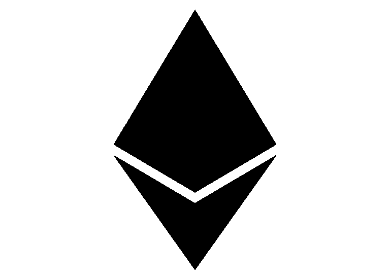
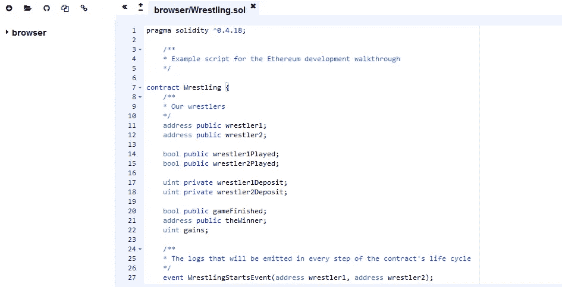

# 以太坊开发演练(第 1 部分:智能合约)

> 原文：<https://medium.com/hackernoon/ethereum-development-walkthrough-part-1-smart-contracts-b3979e6e573e>

智能合约，ICOs，Mist，Metamask，Remix，geth，web3..如果你花一点时间尝试进入以太坊发展的世界，你可能已经看到了这一切。

一些人将智能合约部署到测试网络，另一些人告诉你阅读黄皮书，还有一些人建议你使用 truffle 套件，因为它很棒。你在那里，不知道到底要做什么，也不知道所有的事情是如何一起工作的。

如果这是你阅读的第一篇关于以太坊或者区块链生态系统的文章，你会爱上它的！专家们在 twitter 上互相辱骂，不安全的标准和协议，未经测试和漏洞百出的开发工具。并不是所有的事情都想通了，每个人都在朝着不同的方向前进，还有很多事情要做。机构、银行和政府的未来由疯狂的开发商决定！太棒了。

无论如何，不要再担心了，我会试着在这个系列教程中为你把所有的点连接起来，带你穿过智能契约和 dapps 开发的宇宙，并向你展示一切是如何组合在一起的。

虽然我不会深入到每个细节，但我会链接一些材料来帮助您更好地理解一些概念，并且由您来研究它们并了解所有的小细节。本系列的目标是帮助您以最简单的方式更好地理解事物是如何协同工作的，就像朋友会向您解释一样。

# 我甚至不知道以太坊是什么

以太坊官网是这样告诉我们的:

> 以太坊是一个运行智能合同的**分散平台**:应用程序完全按照编程运行，没有任何停机、审查、欺诈或第三方干扰的可能性。

换句话说，它使用赋予我们区块链技术的能力来认证我们运行的代码的执行。

如果你不知道区块链、以太坊、比特币、加密货币或这些词的意思，我建议你听听这个精彩的播客，由 *Tim Ferriss* 制作，采访 *Nick Szabo 和 Naval Ravikant:* [加密货币的安静大师 Nick Szabo](https://tim.blog/2017/06/04/nick-szabo/)

# 什么是智能合约？

在以太坊上，*智能合约*是*可以*处理金钱的脚本。就这么简单。

这些合同由我们称之为矿商的各方执行和认证。矿工是添加交易(执行智能合同、支付加密货币等)的多台计算机。)到我们称之为块的公共分类账。多个块构成一个区块链。

我们用一种叫做天然气的东西来支付这些矿工，这是履行合同的成本。当你发布智能合约，或者执行智能合约的功能，或者向另一个账户转账时，你要支付一些乙醚，这些乙醚会转化为汽油。

如果还不清楚，或者你想知道更多细节，这里有一些有趣的链接:

*   [视频智能合约的不同介绍。](https://www.youtube.com/watch?v=w9WLo33KfCY)
*   [维基百科上的智能合约页面。](https://en.wikipedia.org/wiki/Smart_contract)
*   [更详细的解释*气*。](https://ethereum.stackexchange.com/questions/3/what-is-meant-by-the-term-gas/62#62)

# 在深入智能合约开发之前

在本教程中，我会假设你已经具备了一定的软件开发基础，并且具备了 Javascript 和 Node.JS 的基础知识，否则你会很快迷失。我们将用于开发的编程语言 Solidity 接近 Javascript 的语法，由于以太坊周围的许多开发工具都是基于 Javascript 和 NodeJS 的，如果您已经对这两者都很熟悉，那么您将更容易进入。这不是给初学者的教程，如果你不理解一些概念，我会给你链接一些替代教程，剩下的由你自己研究。

# 智能合同开发

现在，最后，我们开始有趣的部分，正如我所说的，Solidity 接近 Javascript，但它们不一样。关于可靠性，我很抱歉地告诉你，前端开发人员，你不能把 JQuery 放在一段代码上，然后希望它能工作，你不能忽视安全性，你不能黑进去。当我们讨论安全性、开发模式和代码防错时，我们会明白为什么。

现在，对于我们的第一个例子，我在想一个受到电影《时间*中*启发的剧本，在一个反乌托邦的未来，人们用他们剩余的时间去像钱一样生活。在电影中，他们有一种掰手腕的变体，涉及到玩时间，我们将这样做！用聪明的合同来赚钱。

别担心，我会为你提供我们将在 Github 上看到的所有脚本。

此外，如果这是你第一次处理智能合约，如果你现在不理解所有东西也没关系，这需要实践、阅读文档和一些研究来适应可靠性。

## 代码

现在，关于编码，首先，Solidity 脚本的基础是下面的代码片段， *pragma* 指令告诉编译器我们正在使用哪个版本的 Solidity，以及我们的契约的名称，类似于 Javascript 中的类的结构。这里是“摔跤”。

我们想要两个摔跤手，所以我们将添加两个变量来保存他们帐户的地址(他们钱包的公钥)。

在我们的小游戏中，在每一轮中，摔跤手可以投入一笔钱，如果一个人投入的钱是另一个人的两倍(总计)，他就赢了。

关于 public/private 关键字的一个重要的事情是，即使变量是私有的，这并不意味着有人不能读取它的内容，它只是意味着它只能在契约内访问，但在现实中，由于整个区块链存储在许多计算机上，存储在变量内的*信息*总是可以被其他人看到，这代表了您应该记住的第一个安全考虑。

另一方面，编译器自动为公共变量创建 getter 函数。为了使其他契约或用户能够更改公共变量的值，您需要创建一个 setter 函数。

现在我们将为游戏的每一步添加三个事件。开始时，摔跤手在比赛中为每一轮注册，结束时，摔跤手获胜。事件只是日志，它们可以用来在分布式应用程序(也称为 dapps)的用户界面中调用 JavaScript 回调。事件甚至可以在开发过程中用于调试目的，因为在 Solidity 上没有与 JavaScript 的“console.log()”函数等效的功能。

现在我们将添加构造函数，在 Solidity 中，它与我们的契约同名，并且在创建契约时只被调用一次。

在这里，第一个摔跤手将是创建合同的人。“msg.sender”是调用该函数的人的地址。

接下来，我们让另一个摔跤手用下面的函数注册:

require 函数是 Solidity 中一个特殊的错误处理函数，如果不满足某个条件，它将恢复更改。在我们的例子中，如果变量摔跤手 2 等于 0x0 地址(相当于地址 0)，我们可以继续，如果地址摔跤手 2 不同于 0x0 地址，这意味着一个玩家已经注册为对手，因此，我们将拒绝新的注册。

同样，“msg.sender”是调用该函数的帐户的地址，我们发出一个事件，表示比赛开始了。

现在，每个摔跤手都会调用一个函数，“摔跤()”，投入金钱。如果两人都玩了，我们就看其中一人是否赢了(我们的规则是其中一人必须投入另一人两倍的现金)。“payable”关键字意味着该函数可以接收金钱，如果没有设置，该函数将不接受以太。“msg.value”是发送给合同的乙醚量。

然后我们添加 endOfGame()和 endOfRound()函数。“internal”关键字与 private 相同，唯一的区别是内部函数可以被其他契约继承(因为 Solidity 类似于其他面向对象语言)，而私有函数不能被继承。

请注意，我们不直接将钱交付给获胜者，虽然在这种情况下这并不重要，因为获胜者将从该合同中拿走所有的钱，在其他情况下，当多个用户可以从一个合同中撤销 ether 时，使用撤销模式更安全，以避免再次进入。

它只是意味着，例如，如果多个用户可以从一个合同中取钱，一个人可以简单地一次多次调用取款函数，并多次得到付款。因此，我们需要以这样一种方式编写我们的取款函数，它将在向他付款之前取消他应该收到的金额。

看起来是这样的:

仅此而已。你可以在下面的[链接](https://github.com/devzl/ethereum-walkthrough-1/blob/master/Wrestling.sol)找到完整的片段:

 [## devzl/以太坊-漫游-1

### 以太坊-演练-1 -以太坊系列教程的第一部分“以太坊开发…

github.com](https://github.com/devzl/ethereum-walkthrough-1/blob/master/Wrestling.sol) 

## 使用 IDE

现在复制片段，并在浏览器的新标签中打开[混音 IDE](https://ethereum.github.io/browser-solidity/) :

你可以直接在你的浏览器上使用 [Remix](https://ethereum.github.io/browser-solidity/) ，它有很多有趣的功能，目前你很难在其他地方找到。

点击页面左上方的“+”按钮，创建一个名为“摔跤. sol”的新文件，然后点击上面链接的 [github repo](https://github.com/devzl/ethereum-walkthrough-1/blob/master/Wrestling.sol) 中的代码:

最后一些语法突出。Github 不支持 Solidity。sol 扩展还没有。

在页面的右侧，您可以找到多个有趣的选项卡，如“分析”选项卡，它将显示错误和建议。我让你更多地去发现这个工具。我想向您展示它，即使我们将在下一部分中使用其他工具，正如我之前所说，本系列教程的目标是为您将这些点连接起来，并向您展示事情是如何组合在一起的，并且由您来决定您是否能够轻松地在浏览器上使用 ide。如果有的话，邀请你阅读 Remix 的[文档。](http://remix.readthedocs.io/en/latest/)

或者，你应该通过阅读它的[文档](https://solidity.readthedocs.io/en/develop/)来开始熟悉 solidity。

在下一部分中，我们将看到如何将智能合约部署到两种测试网络，discover truffle、ganache 和 geth，以及它们如何能够组合在一起。

如果你喜欢这第一部分，你可以在推特上找到我 [@dev_zl](https://twitter.com/dev_zl) 。

第二部分可以在这里找到。