# 以太坊开发演练(第 2 部分:松露、加纳切、Geth 和 Mist)

> 原文：<https://medium.com/hackernoon/ethereum-development-walkthrough-part-2-truffle-ganache-geth-and-mist-8d6320e12269>


在本系列教程的第一部分中，我们已经看到了什么是智能合同，以及它是如何工作的。现在，我们将它部署到两种测试网络。

## 我们将使用的工具

目前最突出的工具是:

*   Truffle:一个用于[以太坊](https://hackernoon.com/tagged/ethereum)的开发环境、测试框架和资产管道。换句话说，它帮助你开发智能合约，发布它们，测试它们，等等。你可以阅读块菌套件的[文档了解更多信息。](http://truffleframework.com/docs/)
*   Ganache:它以前被称为 TestRPC，如果你读过几个月前的教程，他们可能会将 TestRPC 与 Truffle 一起使用，但它在 Truffle 套件中集成 TestRPC 后被重命名。Ganache 所做的很简单，它创建了一个虚拟以太坊[区块链](https://hackernoon.com/tagged/blockchain)，并生成一些我们将在开发过程中使用的假账户。
*   Mist:这是一款用于分散式网络应用的浏览器。它试图成为 Chrome 或 Firefox 的等价物，但不是 Dapps。它仍然是不安全的，你不应该使用它与不可信的 dapps。
*   以太坊钱包:它是 Mist 的一个版本，但只打开一个单一的 dapp，即[以太坊钱包](https://wallet.ethereum.org/)。Mist 和以太坊钱包只是 UI 前台。我们需要一个核心将我们连接到以太坊区块链(它可能是真正的以太坊区块链，或一个测试)。
*   Geth:是您计算机上的核心应用程序，它会将您连接到区块链。它也可以开始一个新的(在我们的例子中，我们将创建一个本地测试区块链)，创建合同，矿井以太网等。

我们将首先使用松露和加纳切，然后使用松露和 geth 和 Mist。

# 装置

本教程的要求是你知道什么是以及如何使用命令行工具，并且你对 [NPM](https://www.npmjs.com/) 有点熟悉。

## 松露

打开命令行，键入下一部分:

```
npm install -g truffle
```

如果出了问题，我建议你多读读松露的文件。

## 加纳切

然后，安装 Ganache 的命令行界面:

```
npm install -g ganache-cli
```

如果你对某些事情不确定，这里是 [Ganache 的 Github 页面](https://github.com/trufflesuite/ganache-cli)。

名词（noun 的缩写）b:Ganache 有一个 [GUI，但是因为我们是 haxors，所以我们将使用 CLI。](http://truffleframework.com/ganache/)

# 我们开始吧

首先，创建一个新文件夹，并键入下一行:

```
truffle init
```

它将初始化一个空的 truffle 项目。

然后将[上一个教程](/@dev_zl/ethereum-development-walkthrough-part-1-smart-contracts-b3979e6e573e)中的[摔跤. sol](https://github.com/devzl/ethereum-walkthrough-1/blob/master/Wrestling.sol) 文件复制到“合同”文件夹中。

接下来，打开文件夹“migrations”并创建一个名为“2_deploy_contracts.js”的新文件。迁移只是帮助我们将合同部署到区块链的脚本。

将下面的代码粘贴到里面，并保存。

第一行从“contracts”文件夹中导入“摔跤. sol”文件，第四行将它部署到区块链。

现在，回到根文件夹，你会看到两个文件，“truffle.js”和“truffle-config.js”。如果你在 Windows 上，去掉“truffle.js”，如果你在另一个系统上，去掉其中一个，或者两个都保留，都不重要。原因是，在 Windows 上有一个命名问题，当我们想要执行 Truffle 命令时，它会打开配置文件“truffle.js ”,而不是读取里面的内容。

我正在写这个关于 Windows 的教程，所以我将删除“truffle.js”文件。然后，我将把这段代码放在“truffle-config.js”中:

它基本上是说，当使用开发网络时，使用端口 7545 连接到位于“127.0.0.1”(本地主机)的主机。

现在我们准备在区块链上测试我们的代码！

## 测试我们的代码

在第一部分中，我们将使用 Ganache。

启动新的命令行并键入以下命令:

```
ganache-cli -p 7545
```

它告诉 ganache-cli 从端口 7545 开始。

Ganache 将为我们生成测试帐户，它们默认有 100 个以太，并且是解锁的，所以我们可以从它们那里自由发送以太。例如，第一个客户就是这里的这个人:

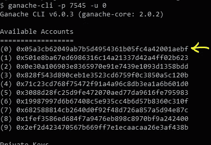

现在，回到我们的第一个命令行界面，我们执行两个命令:

```
truffle compile
truffle migrate --network development
```

*编译*将我们的 Solidity 代码编译成字节码(以太坊虚拟机(EVM)理解的代码)，在我们的例子中，Ganache 模拟了 EVM。

*Migrate* 将代码部署到区块链，在我们的例子中，区块链可以在我们之前设置的网络“开发”的“truffle-config.js”文件中找到。

现在，如果一切按预期进行，您应该会在终端上看到以下内容:

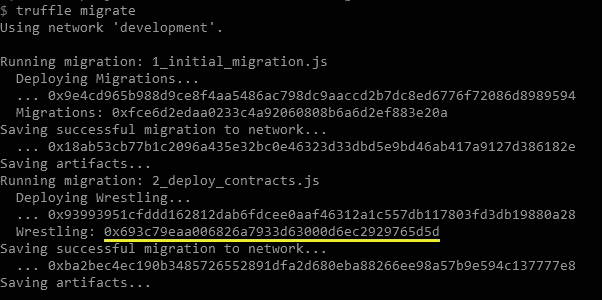

注意，它显示了实例化摔跤契约的地址。

在运行 ganache-cli 的命令行界面上，您可以看到正在执行的事务:

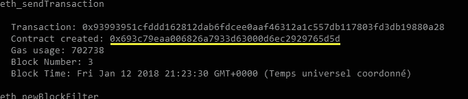

注意，它显示了实例化摔跤契约的地址。

现在输入下面的命令来启动 Truffle 的控制台。这将有助于我们与加纳切的区块链互动。

```
truffle console --network development
```

首先，我们将执行以下命令:

```
account0 = web3.eth.accounts[0]
account1 = web3.eth.accounts[1]
```

它将第一个帐户的地址分配给变量 account0，第二个分配给变量 account1。Web3 是一个 JavaScript API，它封装了 RPC 调用，帮助我们以一种简单的方式与区块链交互。

那我们就这样写:

```
Wrestling.deployed().then(inst => { WrestlingInstance = inst })
```

它将一个引用分配给 truffle 部署到变量“WrestlingInstance”的契约的实例。

执行下一行:

```
WrestlingInstance.wrestler1.call()
```

它将返回摔跤手 1 的地址，在我们的例子中，它是第一个帐户。松露，在迁移过程中，从 Ganache 那里拿起了默认账户，这是第一个账户，因为我们在迁移过程中没有指定[另一个账户地址](http://truffleframework.com/docs/getting_started/migrations#available-accounts)，或者松露的[配置文件中的另一个地址。](http://truffleframework.com/docs/advanced/configuration)

然后，我们将第二个帐户注册为对手:

```
WrestlingInstance.registerAsAnOpponent({from: account1})
```

这里,“from”指令告诉函数应该从哪个帐户触发事务。

在执行该行时，它应该返回类似如下的内容:

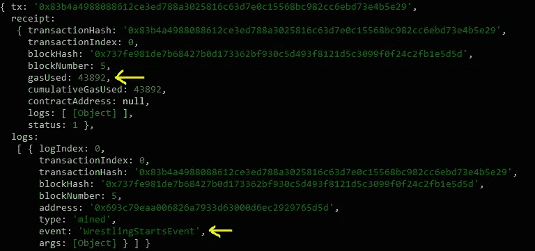

请注意，该事务使用了 Gas，并触发了事件“摔跤开始事件”。

您可以通过执行下面一行来检索第二个摔跤手的地址:

```
WrestlingInstance.wrestler2.call()
```

现在，玩家可以摔跤了:

```
WrestlingInstance.wrestle({from: account0, value: web3.toWei(2, "ether")})
WrestlingInstance.wrestle({from: account1, value: web3.toWei(3, "ether")})// End of the first roundWrestlingInstance.wrestle({from: account0, value: web3.toWei(5, "ether")})
WrestlingInstance.wrestle({from: account1, value: web3.toWei(20, "ether")})// End of the wrestling
```

“value”指令用于在交易中发送以太网。“web3.toWei(5，“ether”)”部分发送 5 个 ether，该值被转换为 [*Wei*](https://www.reddit.com/r/ethereum/comments/42jcee/what_is_a_wei_number/czatvsq/) *。*卫是乙醚的基本单位(最低面额)。更多信息可在此[链接](https://ethereum.stackexchange.com/questions/253/the-ether-denominations-are-called-finney-szabo-and-wei-what-who-are-these-na)找到。

在执行最后一行时，account1 将成为赢家，因为我们总共为它添加了 23 个以太，这比我们为 account0 添加的以太多一倍。

对你来说，一个小练习就是从合同中撤销乙醚。

现在，由您来研究如何使用 Truffle 和 Ganache 的高级功能。你可以从阅读[文档](http://truffleframework.com/docs/getting_started/contracts)开始，或者，如果你感到迷失或者想要巩固你对我们刚刚看到的知识，这里有一个[极好的松露介绍](http://truffleframework.com/tutorials/pet-shop)。

# geth 在图片中的位置

现在，如果我们使用 Ganache 进行开发，我们会希望使用更接近真实环境的东西，即使只是为了更熟悉它。

## 装置

从[下载 geth](https://geth.ethereum.org/downloads/) 开始。在 Windows 上，您可能需要将 geth 的安装文件夹添加到 PATH 变量中。

下载[迷雾或者以太坊钱包](https://github.com/ethereum/mist/releases)。对于我们的使用，两者都是一样的，所以你选择哪一个并不重要。

## 创建本地专用测试网络

在同一个根文件夹下，新建一个文件，命名为“genesis.json”。然后过去里面的以下内容。

文件“genesis.json”只是 geth 创建新区块链所需的配置文件。目前理解文件的内容并不重要。

如果在没有指定任何参数的情况下运行 geth，它将尝试连接到 mainnet。mainnet 是以太坊的主要网络，以太坊的真正区块链。

如果在没有指定任何参数的情况下运行 Mist，如果 geth 的实例正在运行，它将抛出一个错误。如果您告诉 Mist 连接到实际正在运行的 geth 实例(我们一会儿就要做的)，它会工作得很好。如果在没有 geth 实例运行的情况下运行 Mist，它将启动一个新的 geth 实例，并最终询问您应该从哪个区块链网络下载块。

有一个公共以太坊测试网络，但是我们将在本地创建自己的私有测试网络，使用我们之前创建的“genesis.json”文件。

启动另一个命令行界面，键入以下内容(确保在项目根文件夹中运行):

```
geth --datadir=./chaindata/ init ./genesis.json
```

我们启动 geth 并指定我们的区块链将存储在哪里，这里是“chaindata”文件夹(它将自动生成)，我们用我们的“genesis.json”配置文件初始化它。

然后，我们使用以下命令启动 geth:

```
geth --datadir=./chaindata/ --rpc
```

“- rpc”参数告诉 geth 接受 rpc 连接，这是必需的，以便 truffle 可以连接到 geth。

打开另一个命令行界面，使用相同的参数启动 Mist(或以太坊钱包):

```
mist –rpc [http://127.0.0.1:8545](http://127.0.0.1:8545)
```

“-rpc”告诉 Mist(或以太坊钱包)连接到我们启动的 geth 实例。

在钱包选项卡中，按添加帐户并创建新钱包:

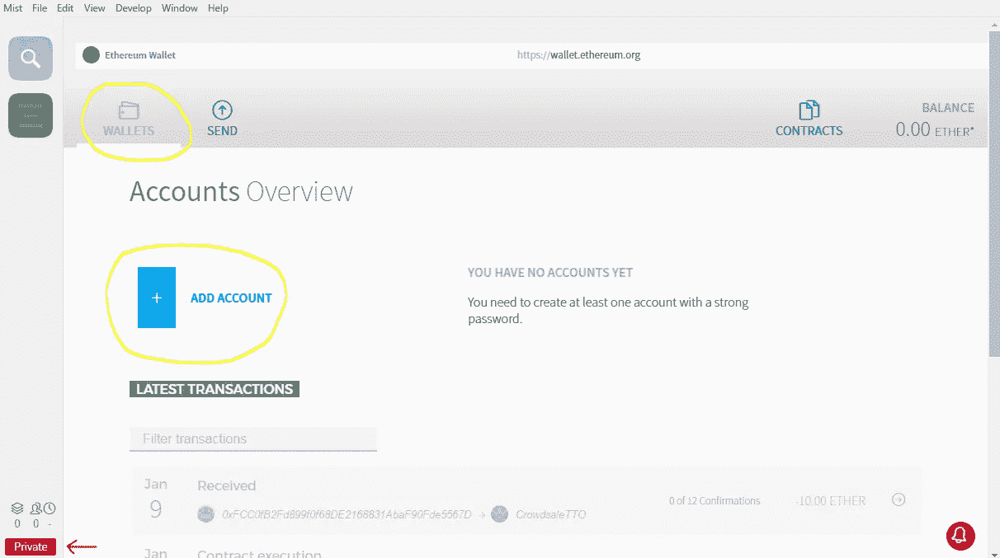

请注意，我们使用的是私有网络。**当心那个**，你不会想把你的以太网用于开发目的。

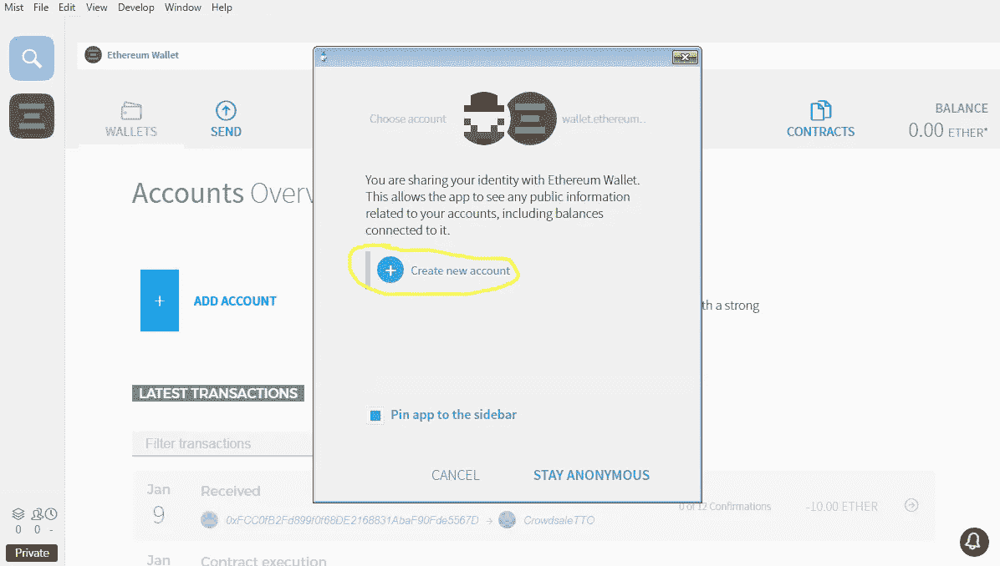

我将使用密码“123456789”创建一个帐户。在真实环境中，使用更强的密码。

打开一个新的命令行界面并运行以下命令:

```
geth attach
```

它将运行 geth 的控制台，我们现在可以与它进行交互。

在 Mist UI 上创建主帐户后，我们将在“geth attach”控制台中运行该命令:

```
miner.start()
```

它将启动一个 miner，该过程将确认交易，几秒钟或几分钟后(取决于您的计算机)，您应该开始看到乙醚被添加到您的余额(以及您的主帐户):

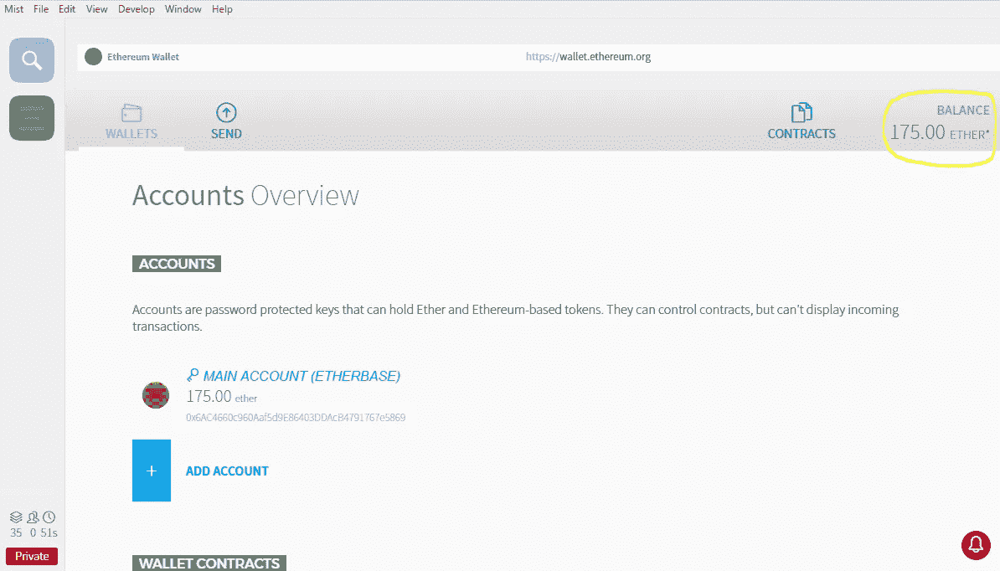

注意，如果你没有足够的内存可用，它可能根本不会开始挖掘。您可以使用命令“miner.stop()”停止挖掘。

现在，再次打开“truffle-config.js”文件，修改如下:

“ourTestNet”是连接到 geth 实例所必需的配置。默认情况下，Geth 在端口 8545 上启动。

在我们启动“geth attach”的命令行界面中，我们将解锁该帐户，以便我们可以使用它来从 Truffle 迁移智能合约，使用以下命令:

```
personal.unlockAccount('0x6AC4660c960Aaf5d9E86403DDAcB4791767e5869', '123456789')
```

在这里，我使用了我刚刚创建的帐户的地址，这将是一个不同的地址，我将在这些测试中使用密码“123456789”。请注意，密码是以明文显示的，您应该对一个真实的帐户使用不同的方法。

现在，回到我们之前启动 Truffle 的命令行界面，运行以下命令:

```
truffle migrate --network ourTestNet
```

它将开始把合同迁移到 geth 正在运行的区块链。如果您以前停止过 miner，请将其启动，否则将不会执行迁移。

如果迁移成功，您将看到如下输出:

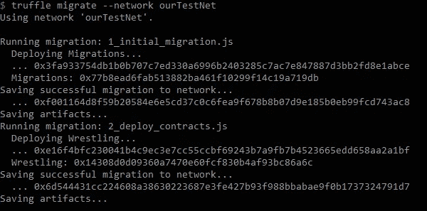

现在，运行以下命令启动 Truffle 的控制台:

```
truffle console --network ourTestNet
```

然后运行这两个命令:

```
Wrestling.address
JSON.stringify(Wrestling.abi)
```

您应该得到如下输出:

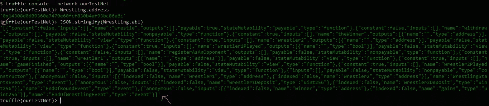

第一行返回已部署的 string contract 实例的地址。

第二条线，将还掉合同 [ABI](https://solidity.readthedocs.io/en/develop/abi-spec.html) 。 [ABI](https://solidity.readthedocs.io/en/develop/abi-spec.html) 基本上是对合同的描述。它包含一个函数和变量的列表。

*复制地址和 ABI 时，删除截图中用红色箭头突出显示的撇号。*

现在，回到 Mist，我们将打开“contracts”选项卡，并单击“watch contract”。

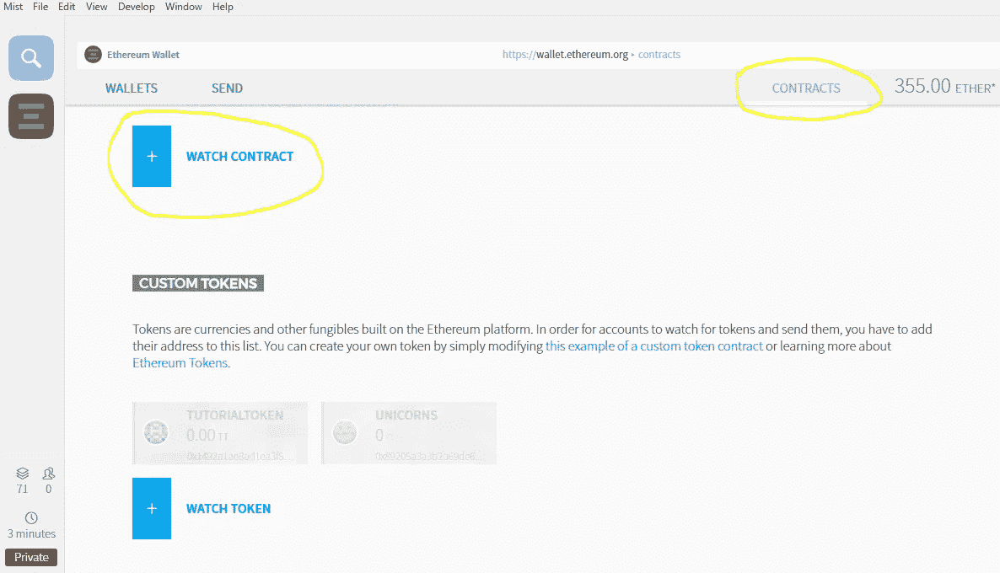

然后，我们将通过地址和我们部署的摔跤合同的 ABI:

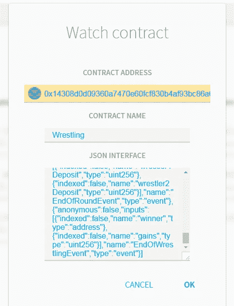

单击“确定”，它将显示在您关注的合同列表中。点击它，它将打开合同页面。如果您向下滚动，您会看到类似这样的内容:

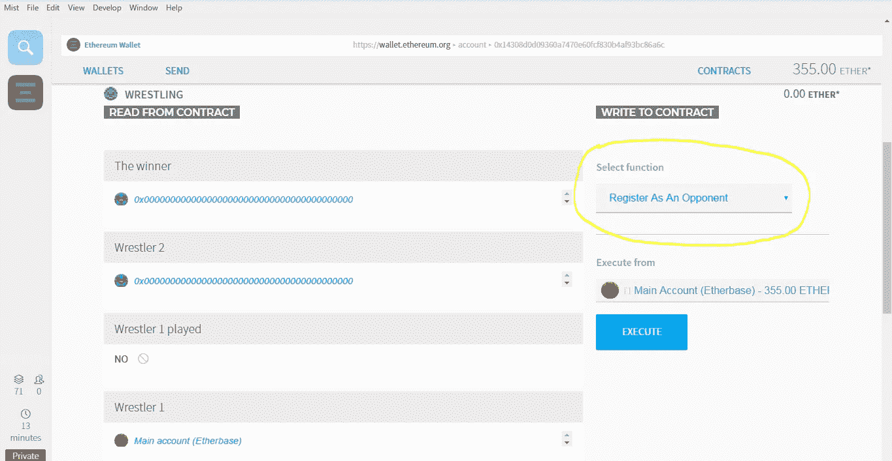

使用选择一个功能部件与合同进行交互。这和我们上面用松露的控制台做的一样。

就这样，我们看到了 Ganache 和 geth 是如何发挥作用的。当您想要将合同部署到真实的区块链时，您应该使用第二种方法，并将 geth 与 mainnet 连接起来。

名词（noun 的缩写）B: *你可以直接在 Mist 上部署合同，而不需要使用松露迁移系统*，[这里有一个该过程的示例视频](https://www.youtube.com/watch?v=TC-bDQZbXd0)。不过，在实际开发过程中使用 Truffle 更有趣，因为如果使用模块化方法开发智能合约，您将能够包含和导入多个其他智能合约和脚本。

名词（noun 的缩写）B.2:你总是可以在一个基本的 nodepad 应用程序上编写你的合同代码，并使用某个[信任的第三方](http://nakamotoinstitute.org/trusted-third-parties/)的门户将它部署到 mainnet，但是我建议你不要这样做。

本教程的存储库可以在以下位置找到:

[](https://github.com/devzl/ethereum-walkthrough-2) [## devzl/以太坊-漫游-2

### 以太坊-演练-2 -以太坊系列教程的第二部分“以太坊开发…

github.com](https://github.com/devzl/ethereum-walkthrough-2) 

# 最后

我们已经看到了开发和部署智能合同的 4 种方式:

*   第一种是用松露和 Ganache。由于我们复制了上一篇教程中的代码，我想告诉你，现在已经有了针对最流行的文本编辑器和 ide 的[插件。有些只提供语法突出显示，有些则在其他方面提供帮助。](https://solidity.readthedocs.io/en/develop/#available-solidity-integrations)
*   第二个是将代码从 Truffle 部署到 geth(以及 GUI 应用 Mist)。
*   第三，当你刚刚学习 Solidity 时，使用 Remix 来编写小而简单的契约，并在 Mist 中部署代码，就像前面链接的视频中的[所示。](https://www.youtube.com/watch?v=TC-bDQZbXd0)
*   或者像一个真正的牛仔一样，您可以使用一个简单的文本编辑器来编写，然后使用一个无名的第三方的拖放部署特性来部署您的未测试的契约。

在[下一部分](https://hackernoon.com/ethereum-development-walkthrough-part-3-security-limitations-and-considerations-d482f05278b4)中，我们将[讨论安全性](https://hackernoon.com/ethereum-development-walkthrough-part-3-security-limitations-and-considerations-d482f05278b4)，因为我们的“摔跤”脚本还远未准备好在真实环境中推出。

之后，我们将看到代币的创造，以及最初的硬币发行(ico)。

如果你喜欢第二部分，你可以在 twitter 上找到我。