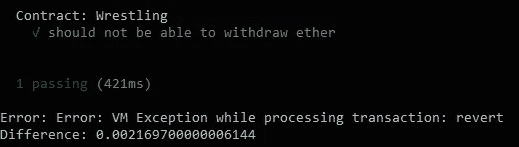

# 以太坊开发演练(第 3 部分:安全性、限制和注意事项)

> 原文：<https://medium.com/hackernoon/ethereum-development-walkthrough-part-3-security-limitations-and-considerations-d482f05278b4>


现在是 2023 年，戴夫是一名管理员，他很快就会丢掉工作，因为现在基本上是一个 SaaS、T2、戴普和 T3 在做这件事，每个人都在他的楼层里。尽管如此，作为一个诚实的工人，他会把工作做好，直到最后一天。戴夫被要求通过电子邮件发送一笔乙醚和一个智能合同的功能地址。

所以我们的人打开了他的以太坊钱包也就是 word 文档。他打开 myWallets.docx，找到 4 个条目:我的密钥、公司的密钥、我的密码、公司的密码。

他打开 Mist，找到他需要发送乙醚的智能合同，将公司账户中的 1000 乙醚输入到智能合同的功能中，返回到他的电子邮件，并将他必须发送的地址复制到该功能中。但是，错误的是，他没有复制整个地址。他注意到了自己的错误，手动填写了地址，但是打错了最后一个字符。现在，这是一个全新的地址。

戴夫按下发送按钮，复制过去的公司密码，确认交易和功能被执行。在执行时，所述函数通过一个[自毁](https://ethereum.stackexchange.com/questions/315/why-are-suicides-used-in-contract-programming)调用，将以太发送到一些预定义的帐户地址，并将剩余的以太发送到戴夫输入的地址，因为编写它的开发人员认为，在执行该函数后，从一个现在无用(剧透:你不能)的智能契约中清除[区块链](https://hackernoon.com/tagged/blockchain)是一个好主意。

巧合的是，输入错误的地址是本教程第一部分的[摔跤契约](https://github.com/devzl/ethereum-walkthrough-1/blob/master/Wrestling.sol)的地址，是有人按照本教程第二部分的[的第二种方法在 mainnet 上错误创建的。](https://hackernoon.com/ethereum-development-walkthrough-part-2-truffle-ganache-geth-and-mist-8d6320e12269)

还有，在同一个时间线里，有人发现*那个*摔跤合同，注册了第二个摔跤手，用摔跤()函数把以太放进去了，但是第一个摔跤手从来没有打过他那一轮，第二个摔跤手的以太就永远被锁定在那个摔跤合同里了。

所以在这种不太可能的情况下(或者是？)，以太由于人为错误和不完整的合同而丢失。

# 关于摔跤合同

虽然我们实现了游戏的基础，但我们没有考虑合同的生命周期。何时创建，何时使用，何时不再使用。

摔跤运动员打了几个回合就再也不打了怎么办？我们应该给玩家在一定的[时间](http://solidity.readthedocs.io/en/develop/units-and-global-variables.html#time-units)后撤回他们的钱的能力，如果他们中的一个没有玩他们的回合。

我们还需要考虑合同何时不再被使用(在我们的例子中是摔跤的结束)。我说过，为了让一个契约接收以太，我们应该将“payable”关键字添加到将接收它的函数中。但是，一个契约仍然可以通过两种方法接收以太(你无法拒绝它)，当一个契约自毁(Solidity 中一个特殊的预定义函数，它将禁用该契约，并将它所有的以太发送到一个指定的地址)到另一个契约的地址时，或者当以太被[开采](https://en.bitcoin.it/wiki/Mining)到那个契约时。所以，如果合同中有多余的部分，你应该想办法从合同中提取。

在我们的例子中，由于获胜者无论如何都会从合同中获得所有乙醚，我们可以让他使用一个替代的撤销函数，如下所示:

这将允许他撤销合同上的任何内容，次数不限。

当一般汇款时，请记住，由于某种原因，该过程可能会失败，您应该更愿意让合同的用户撤回他们的钱，而不是直接汇款(就像我们对摔跤合同所做的那样)。

同样，你会认为这是一个好主意，让一个契约自我毁灭，这样你就可以清理区块链，但是一个被毁灭的契约将留在区块链，并且可以一直接收以太，如上所述。

你还应该考虑一个“b 计划”，如果出于某种原因，你的合同在生产过程中没有按预期进行。因为智能合约一旦部署就不能修改，所以您可能希望保留一种可以触发的锁，它可以暂停合约的事务，或者将其持有的值发送到另一个合约，例如，让合约的用户撤回他们的以太网。通过将权力交给第三方，这种触发减少了合同的分散性，因此这将取决于您的合同的用例，以及是否使用这样的系统。

# 安全性

Solidity 的安全性始于遵循[通用开发模式](https://solidity.readthedocs.io/en/latest/common-patterns.html)，跟上平台的最新发展，通过测试使你的合同没有错误(或至少试图如此)，了解平台的局限性，保持你的合同代码尽可能简单，并记住以太坊本身(区块链、 [Solidity 编译器](https://solidity.readthedocs.io/en/latest/bugs.html)等背后的软件)。)有 bug，每天都在变。

# 试验

测试是任何严肃开发的重要部分，如果你的老方法包括在修复之前等待错误出现，你将很难适应。

[松露](http://truffleframework.com/docs/getting_started/testing)，我们在[最后部分](https://hackernoon.com/ethereum-development-walkthrough-part-2-truffle-ganache-geth-and-mist-8d6320e12269)看到的，让我们以一种简单的方式测试我们的合同。

打开[上一部分的项目](https://github.com/devzl/ethereum-walkthrough-2)，打开几个命令行界面，启动 ganache-cli。

```
ganache-cli -p 7545
```

新建一个名为“test”的文件夹，在里面创建一个名为“TestExample.js”的文件。

在其中粘贴以下内容:

它所做的是，检索摔跤合同，将其部署到我们的测试网络，并尝试使用撤回功能。因为在游戏结束之前，任何人都不能使用取款功能，所以它会返回一个错误，因为我们在合同中的取款功能中使用了“require”指令。

在开发控制台上执行测试:

```
truffle test --network development
```

您应该会得到与此类似的输出:



因为执行契约函数是一个异步的过程，所以您更愿意使用 [async/await](/@angellopozo/testing-solidity-with-truffle-and-async-await-396e81c54f93) 来获得更干净的测试代码。但是为了简单起见，我们的例子完成了这项工作。

对你来说，一个练习是模拟一场摔跤比赛，并确保只有获胜者才能在最后从合同中撤销乙醚(就像我们在最后一部分中对松露控制台所做的那样)。

你可以在这个[教程](/@gus_tavo_guim/testing-your-smart-contracts-with-javascript-40d4edc2abed)中看到另一个测试的例子。而且，不要犹豫，检查松露的[文件](http://truffleframework.com/docs/getting_started/solidity-tests)。

或者，社区提供了一些安全工具，可以在您审计代码时为您提供帮助。他们是这里列出的。

# 业务逻辑

测试契约内部的功能是好的，但是你应该总是后退一步，看看你的契约内部的功能之间的交互，如果你的契约，作为一个整体，正在做它应该做的事情(而不是别的)。

让你的智能契约[保持良好的注释](https://github.com/ethereum/wiki/wiki/Ethereum-Natural-Specification-Format)是迈向清晰、编写良好的代码的第一步(注意我们在第一部分看到的摔跤. sol 契约不是)。第二步是让你的契约尽可能简单，只在智能契约中写你的应用程序中需要去中心化的部分。如果你的智能合约是 dapp 的一部分(简单来说，Dapp 是一个 web 应用，它的一部分是分散的*(即:它的一部分是智能合约，或者它与智能合约交互))，那么在区块链上需要什么，以及什么可以由 UI 或 web 应用的后端处理之间做出区别。

注*:dapp 的[定义比这更广泛，包括所有利用点对点交互的应用程序。薄雾，Bittorrent，Tor 等。都是可以称之为去中心化的应用。参见 Vitalik Buterin 的这篇文章。](https://ethereum.stackexchange.com/questions/383/what-is-a-dapp)

# 了解平台

要真正知道你在做什么，你应该阅读[文档](https://solidity.readthedocs.io/en/develop/)，没有办法绕过它，通过搜索文档中没有涉及的 Solidity 开发方面来完善你的知识。

例如，您应该知道定点变量(也称为浮点型或双精度型)还没有完全实现，使用“uint”类型的[除法](https://consensys.github.io/smart-contract-best-practices/recommendations/#beware-rounding-with-integer-division)将向下舍入到最接近的整数，在本例中为 2。因此，在一个仍在大量开发的平台上，你不应该想当然地做一些事情。

因为区块链是公开的，每个人都可以知道你的变量包含的信息，你只能试图混淆其中的信息，而不能完全隐藏它。对于生成一个随机数或字符串也是一样，任何知道你将如何尝试生成这个数的人都有可能伪造它。实际上有人试图找出产生随机数的最佳方法，如果你感兴趣，你可能想加入这场战斗。我之前说过，一切都还在发展中，很多东西都没有行业标准。

依赖于时间的契约也是一个热点，如果您的契约需要在特定时间运行，您将需要依赖于外部应用程序(请记住，它可能会在特定时间关闭或停止运行)，因为智能契约无法触发自身。如果你的合同依赖于时间来判断某些点，请记住，恶意矿工可以篡改时间的交易将被执行。

还要知道你的合同是公开的，每个人都可以阅读它，每个人都可以与它交互，如果你的合同与其他合同交互或进行外部调用，你必须记住，恶意合同可能会影响你的合同的执行。

所有这些都有点像詹姆斯·邦德，但当涉及到大量金钱时，人们就会变得有创造力。如果你的智能合同是在一家为老年人出售尿布的商店后面运行，你可能不需要关心那么多。

# 平台的局限性

要知道[以太坊](https://hackernoon.com/tagged/ethereum)平台并不意味着繁重的计算，你的交易受到气体的限制。您应该尽可能保持逻辑简单，并小心无限循环、[存储限制、](http://solidity.readthedocs.io/en/develop/introduction-to-smart-contracts.html#storage-memory-and-the-stack)值[溢出](https://ethereum.stackexchange.com/questions/7293/is-it-possible-to-overflow-uints)以及所有这些小细节。因为一旦合同在区块链上，您就不能删除或修改它，所以您应该在部署它之前考虑所有这些方面。

编译器和以太坊区块链背后的软件仍在开发中，并经历不断的变化，所以你应该记住这一点，并保持最新。

# 第三方

有很多优秀的演员试图让用户和开发者的生活更容易，让他们访问以太坊主区块链，而不需要下载到本地。比如 [MEW](https://www.myetherwallet.com/) ，可以让你转移以太并部署智能合约，或者 [INFURA](https://infura.io/) ，可以让你通过 API 访问以太坊区块链，这与 truffle 相结合，是一个可靠的工具。

尽管这些服务的良好意图以及它们背后的开发人员的技能是毋庸置疑的，但是否追求便利而非安全取决于您。像这样的平台总是黑客的目标，因为它们处理的交易数量很多，所以它们总是比你在机器上设置的节点更大的目标。最后，你的选择很大程度上取决于你有多少钱可以动用。

# 一些方向，以及从哪里开始

在离开你之前，这里有一些很棒的资料，你可以从这里开始你的研究:

*   在视频中，一个很好的替代介绍是来自 [@KonstantHacker](https://twitter.com/konstanthacker) 的[这个](https://youtu.be/WIEessi3ntk)。
*   [固化单据的常见模式](https://solidity.readthedocs.io/en/latest/common-patterns.html)。
*   [担保文件上的担保条款](https://solidity.readthedocs.io/en/latest/security-considerations.html)。
*   [一份更详尽的文件，重新组合了更多建议](https://consensys.github.io/smart-contract-best-practices/)。

要记住的一件事是，**当涉及到安全性时，没有一个文档是完整的**，所以您必须自己研究，并使用深思熟虑的良好编程实践。

最重要的是，开始参与，有很多项目需要更多的眼睛来发现他们代码中的错误，并且有很多[奖金](https://bounty.ethereum.org/)要抢。

如果你发现了一个错误，或者发现了一个更好的方法，不要犹豫，分享你的知识。以太坊和区块链世界遵循开源原则，因此无论发现什么或制造什么，整个社区都会受益。

该器件的代码可从 [Github](https://github.com/devzl/ethereum-walkthrough-3) 获得。

[](https://github.com/devzl/ethereum-walkthrough-3) [## devzl/以太坊-演练-3

### 以太坊-演练-3 -以太坊系列教程的第三部分“以太坊开发…

github.com](https://github.com/devzl/ethereum-walkthrough-3) 

# 结论

作为结论，你真的需要获得一个智能合同开发者的心态，并在将你的合同投入使用之前准备做大量的研究和测试。

正如[教授穆迪](http://harrypotter.wikia.com/wiki/Alastor_Moody)所说:


如果你喜欢这第三部，可以找我 [@dev_zl](https://twitter.com/dev_zl) 。

在[的下一部分](https://hackernoon.com/ethereum-development-walkthrough-part-4-tokens-and-ercs-68645cf2f73e)我们将看到代币。