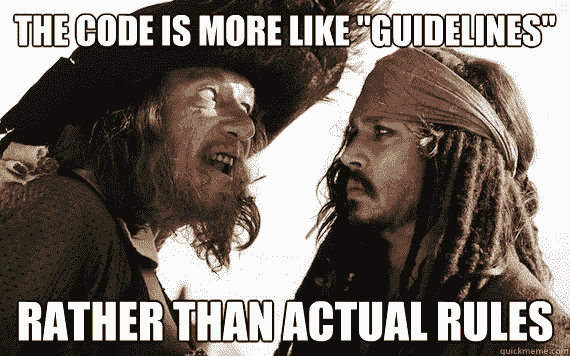

# 以太坊开发演练(第 4 部分:令牌和 ERC)

> 原文：<https://medium.com/hackernoon/ethereum-development-walkthrough-part-4-tokens-and-ercs-68645cf2f73e>

从开发者的角度来看，[以太坊](https://hackernoon.com/tagged/ethereum)上的代币只是智能合约。在饮料的世界里，它们可以是咖啡，任何人都可以做出自己的变体。

你可能听说过 ERC20、ERC721 或其他标准。这些只是开发者社区[同意](https://github.com/ethereum/EIPs)采用的一组基本功能。没有人会阻止你使用你自己的函数，创建一个脚本来管理虚拟货币。

《加勒比海盗》中的一句名言非常适用于这种情况:

但是遵循一个标准有很多你不应该忽视的优势。首先，当你制作一个符合标准令牌时，每个人都会知道你的令牌是做什么的以及如何与之交互，因此，会更加信任它。DApps 和 Mist 一样，会把它识别为 token，会用特殊的 UI 显示出来。此外，您会发现社区已经编写了令牌智能合约的通用实现，例如，在像 [OpenZeppelin 的](https://github.com/OpenZeppelin/zeppelin-solidity)这样的框架中，它已经过许多专家的良好测试，并为您提供了一个坚实的起点。

在本教程中，我们将从 grounds up 编写一个基本的和不完整的 ERC20 令牌，然后我们将它转换为 ERC721(这是根本不同的)，以便我们可以看到两者之间的差异。

这样做的原因是，您将了解令牌是如何工作的，它不是一个封闭的黑盒，并且到目前为止已经工作了两年的公认标准 ERC20 有一些故障点，如果您只运行几个命令来从框架中立即创建令牌，您将看不到这些故障点。

# 让我们做我们的信物

ERC20 的创建是为了标准化可替换的令牌，以便它们可以被其他应用程序重用:从钱包到分散的交易所。

*可互换*是指可以与同类型的代币互换，换句话说，所有的代币都是一样的(就像钱一样，一块钱和其他任何一块钱都是一样的)。*不可替代的*令牌是一种代表独特资产的令牌(如房子、财产、艺术品等)。).虽然可替换令牌本身具有价值，但不可替换令牌只是智能合约中资产的代表。

要制作一个符合 [ERC20](https://theethereum.wiki/w/index.php/ERC20_Token_Standard) 的令牌，我们必须实现以下函数和事件:

标准没有提供这些函数的主体，这是因为你可以随心所欲地编写它们，如果你不想支持某些函数，那么在标准中[返回 null/false 值是完全可以的。](https://github.com/ethereum/EIPs/blob/master/EIPS/eip-20.md)

注意:在本教程中，复制代码并不有趣，你会从理解所发生的事情中受益更多，完整的例子将在本教程的结尾链接。

## 履行

首先，我们想给我们的令牌一个名字，所以我们将使用一个公共变量:

然后给它一个符号:

当然还有小数位数:

由于 Solidity 并不完全支持定点数，所以你必须像表示整数一样表示所有的数。现在，当您使用 2 位小数时，值“123456”将是“1234.56”，例如，如果您使用 4 位小数，则是“12.3456”。当您不想让令牌“可分”时，小数数值为 0。以太坊的加密货币 Ether 使用 18 位小数。

一般来说，你不会为你的令牌使用超过 18 位小数，除非你想让世界另一端的专家告诉你你有多蠢，并问你为什么会使用超过 18 位小数，并告诉你 18 是一个神圣的数字，因为以太使用 18 位小数。

我们将计算代币的总供应量，并记录每个人有多少代币:

当然，您将从 0 个令牌开始，除非您在令牌智能合约的构造函数中生成一些令牌，例如:

“totalSupply()”函数只是“totalSupply”变量的一个 getter:

“balanceOf()”函数也是如此:

现在，真正神奇的事情发生在“transfer()”函数中，在这里一个地址可以向另一个地址发送令牌

这确实是 ERC20 令牌的核心。

“approve()”、“transferFrom()”和“allowance()”函数也是令牌符合 ERC20 的一部分，但是[它们容易受到攻击](https://github.com/ethereum/EIPs/issues/20#issuecomment-263524729)。

当一个地址“approve()”另一个地址时，被批准的地址可以使用“transferFrom()”函数代表它从批准地址余额中花费一些令牌。“allowance()”只是一个 getter 函数，用来查看一个地址可以从另一个地址的余额中“转移”多少。

这些功能实际上代表了安全问题，因为当一个地址批准另一个地址花费 X 个代币，并且由于某种原因决定将该数量增加或减少到 Y 个代币时，被批准的地址可以在执行改变配额的交易之前快速转移第一个配额的 X 个代币，并且在交易执行之后，被批准的地址可以再次转移 Y 个新批准的代币。我在上一部分说过，一个事务在什么时候被挖掘是没有确定性的，在一些事务被执行的时候，挖掘者可以轻微地篡改。

现在，虽然有人提出了一些更安全的“transferFrom()”实现来使该函数更加可靠(如上所述，该标准只是一堆函数和预期行为的原型，由您来编写主体)，但现在正在讨论其他一些提议，因为 ERC20 还有其他缺点。其中两个命题是 [ERC223](https://github.com/ethereum/EIPs/issues/223) 和 [ERC777](https://github.com/ethereum/EIPs/issues/777) 。

ERC223 提案背后的动机是避免将代币发送到错误的地址或不支持使用这些代币的合同，因为正如[第 223 届以太坊征求意见稿](https://github.com/ethereum/EIPs/issues/223)中概述的那样，数百万美元因此而损失。ERC777 尝试通知它将接收的令牌的接收地址，以及其他事情[。ERC777 提案似乎是目前社区中最有动力取代 ERC20 的提案。](https://www.reddit.com/r/ethereum/comments/7qjw6x/everything_you_need_to_know_about_erc777_the_new/)

# ERC721

现在， [ERC721](https://github.com/ethereum/eips/issues/721) 从根本上与 ERC20 及其系列不同。

在 ERC721 中，令牌是唯一的。ERC721 是几个月前提出的，使其闻名的实现是 [**CryptoKitties** ，](https://en.wikipedia.org/wiki/Cryptokitties)一种人们收集虚拟猫的游戏，这些猫在运行游戏的智能合约中用不可替换的令牌表示。

现在，如果我们想将一个 ERC20 合约转换为一个 ERC721 合约，我们需要了解第二个合约如何跟踪令牌。

在 ERC20 中，每个地址都有一个令牌余额。在 ERC721 契约中，每个地址都有一个令牌列表:

由于 [Solidity](https://hackernoon.com/tagged/solidity) 有其局限性，并且数组没有“indexOf()”方法，我们必须手动跟踪所有者数组中的令牌:

我们当然可以实现自己的库来查找元素的索引，但是考虑到可能的长时间循环，最好使用映射。

当然，为了轻松跟踪令牌，我们可以添加一个映射来显示每个令牌的所有者:

这就是这两个提案管理令牌的所有区别。

ERC721 合约中的“transfer()”函数将为令牌设置新的所有者:

代码比较长，但这只是移动令牌的必要步骤。

不要忘记的一点是，ERC721 也有“approve()”和“transferFrom()”方法，因此在我们的传递函数中，我们必须在“transfer()”方法中添加另一个指令，这样令牌的已批准地址在有了新的所有者后就不能再移动令牌，如下所示:

## 铸造

适用于 ERC20 和 ERC721 令牌的一点是，我们可能希望生成更多的可替换令牌，或者创建一个新的不可替换令牌，我们将使用一个通常名为“Mint()”的函数来实现这一点。

下面的代码就是这样一个函数的例子:

我们用一个任意的数字创建一个新的令牌。根据您的使用情况，您可能希望仅授权某些地址能够在您的合同中铸造新令牌。

这里需要注意的重要一点是，虽然“mint()”函数没有出现在标准的接口上，但是我们添加了它，就像我们可以添加其他函数来增强我们的令牌并为其添加更多功能一样。例如，我们可以添加一个买卖一定数量以太令牌的系统，或者一个删除我们不再需要的令牌的功能。

## [计]元数据

现在，我们说不可替换的令牌代表一项资产，因此，在大多数情况下，我们实际上想要描述这项资产。我们可以使用如下的字符串:

看，智能合约是一个证书，而不是包含对象的东西。例如，您不能将汽车存储在智能合约中，但是您完全可以存储它的牌照或其他合法身份。

就虚拟资产而言，目前使用最多的技术之一是使用 [IPFS](/@ConsenSys/an-introduction-to-ipfs-9bba4860abd0) 散列作为元数据。IPFS 散列是存储在 IPFS 上的文件的地址。简单来说，IPFS 就像一个 HTTP 的激流版本。当一个文件被添加到 IPFS 上时，它几乎总是可以在至少一台与 IPFS 网络相连的计算机上找到。

虽然每个人都可以在 IPFS 或 HTTP 链接上访问该文件，但“所有权证明”是在智能合同中注册的。这真的不是编程，而是不可替代令牌的新应用。它有一个名字“秘密收藏品”，现在在 T2 很热门。

现在，回到我们的代码，最初关于 ERC721 提案的讨论现在有点死了，最初的海报已经有一段时间没有更新线程了，所以有一个新的讨论继续[这里](https://github.com/ethereum/EIPs/pull/841)。它叫做 ERC841，他们把不可替代代币的名字改成了“契约”。

还有另一个提案， [ERC821](https://github.com/ethereum/EIPs/issues/821) ，它希望实现受 ERC223 & ERC777 提案启发的更新更好的设计模式。ERC821 和 ERC841 寻求实现相同的目标，但方法略有不同，两者都还不完善，如果您有宝贵的意见，可以加入围绕这两个潜在标准的讨论。

您可以在 [Github 库](https://github.com/devzl/ethereum-walkthrough-4)上找到针对该部件的 ERC20 和 ERC721 的示例实现(不应在生产中使用):

 [## devzl/以太坊-演练-4

### 以太坊-演练-4 -以太坊系列教程的第四部分“以太坊开发…

github.com](https://github.com/devzl/ethereum-walkthrough-4) 

或者，看一看[openzeplin 框架](https://github.com/OpenZeppelin/zeppelin-solidity/)也是一个好主意，他们有优秀的，(大部分)经过审计的模块化智能合同(当然，在决定使用哪个之前，你应该阅读每个合同的内容)。

本系列第四部分到此结束。在下一个中，我们将看到如何[创建一个 DApp](https://hackernoon.com/ethereum-development-walkthrough-part-5-making-a-dapp-4c2a3bbcd5e5) 。

如果你喜欢这个教程，可以找我 [@dev_zl](https://twitter.com/dev_zl) 。

# 奖金:ICOs 和众筹销售

初始硬币发行(ico)有点超出以太坊项目的开发部分，但本质上，它们只是众筹。

如果一家初创公司需要一些资金，他们会创造自己的代币，并在一段时间内出售一些，称为众筹或 ICO。

在智能合同和区块链技术出现之前，初创公司会使用[众筹网站](https://en.wikipedia.org/wiki/Crowdfunding)来筹集资金，但这些网站通常会在这个过程中收取可观的费用。现在有了 ICO，你就省去了中间人，直接把钱提上来。

眼下，骗局比真正的融资项目还多，所以从投资者的角度来看，你应该谨慎投资。从开发者的角度来看，众筹只是一个智能合约，从开始到结束出售一些代币来换取以太。没有标准的方法可以实现这一点，但是你可以在[openzeplin 的 repo 上找到一个很好的实现，例如](https://github.com/OpenZeppelin/zeppelin-solidity/tree/master/contracts/crowdsale)。或者，以太坊的网站上有一个[简易教程](https://ethereum.org/crowdsale)。