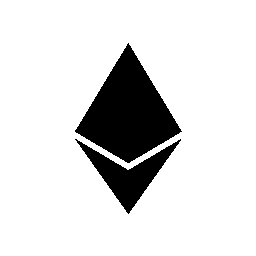
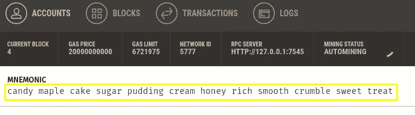
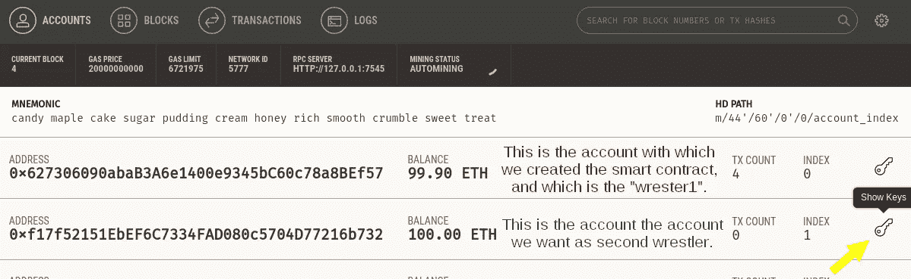
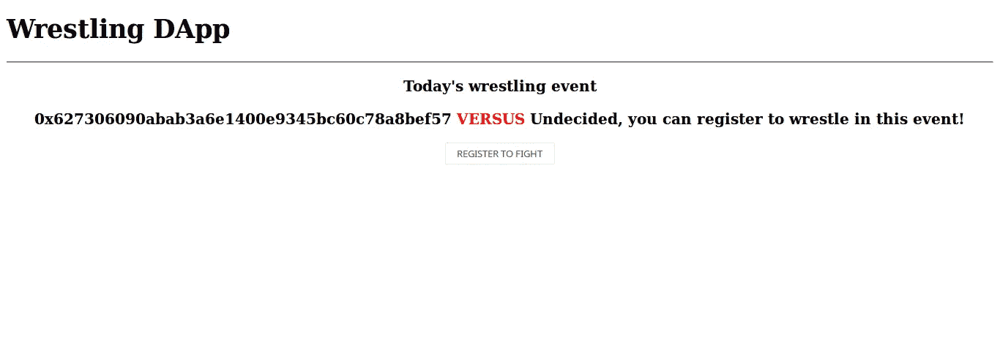
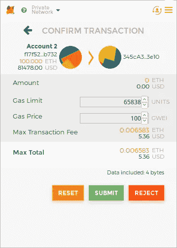

# 以太坊开发演练(第 5 部分:制作 DApp)

> 原文：<https://medium.com/hackernoon/ethereum-development-walkthrough-part-5-making-a-dapp-4c2a3bbcd5e5>



如果你已经阅读了这个教程系列的每一部分，你已经知道如何在以太坊上做一个去中心化的应用，在这个教程中，我只是指导你一起使用这些知识。

在以太坊上，DApp 是一个 web 应用程序，它将与部署在区块链上的智能合约进行交互。您可以使用 python 或其他编程语言来实现，但这些将不在本教程中讨论。我们将只关注 [JavaScript](https://hackernoon.com/tagged/javascript) 。

我们在第一部分的[中看到了如何制定智能合同，以及如何在第二部分](https://hackernoon.com/ethereum-development-walkthrough-part-1-smart-contracts-b3979e6e573e)[的](https://hackernoon.com/ethereum-development-walkthrough-part-2-truffle-ganache-geth-and-mist-8d6320e12269)中部署它。在本教程中，我假设您有 JavaScript 背景，不管您有多高级，也不管您使用哪个框架，我们都将使用普通的 JavaScript 和一点 JQuery 来简化我们的工作。

我们需要的一件事是，一个让我们与部署的智能合同进行交互的工具，为此，我们有一个名为 [Web3.js](https://github.com/ethereum/web3.js/) 的优秀 API。

我们已经看到了 Web3.js，在第 2 部分的[松露控制台](http://truffleframework.com/docs/getting_started/console)上，以及当我们在第 3 部分的[中对我们的合同执行测试时。](https://hackernoon.com/ethereum-development-walkthrough-part-3-security-limitations-and-considerations-d482f05278b4)

# 我们开始吧

为项目创建一个新文件夹，并运行`truffle init`命令。

接下来，创建一个名为“src”的文件夹，我们将在其中存储 web 应用程序文件。在“src”文件夹中，创建一个“index.html”文件。将以下代码粘贴到内部:

创建一个名为“JShelpers”的文件夹，并在其中创建以下三个文件:

```
touch jquery.min.js 
touch truffle-contract.js 
touch web3.min.js
```

你可以在 Github 上的本教程的[源代码中找到它们的内容。](https://github.com/devzl/ethereum-walkthrough-5/tree/master/src/JShelpers)

现在，回到“src”文件夹，创建一个名为“app.js”的新文件。“app.js”将保存我们的 js 逻辑，我们将使用一点带有普通 JavaScript 的 JQuery 来保持它的简单，但是当然在真实的 DApp 中，你可以使用你喜欢的框架，例如 React、Angular、Vue 等等。

现在，打开“app.js”，添加以下代码:

我们首先创建一些必要的变量，并初始化我们的 Web3 provider 变量。我们希望用户有一个 web3 提供者运行。目前大多数用户使用 Chrome 或 Firefox，有一个名为“Metamask”的扩展来与以太坊[区块链](https://hackernoon.com/tagged/blockchain)交互，所以我们期待 Metamask 在页面中注入一个 web3 的实例，如果没有，我们要求用户安装它。

现在，让我们实现必要的函数来与我们的契约进行交互，我们将从初始化对已部署的智能契约的引用开始，创建函数“initWrestlingContract()”:

然后，我们将创建其他函数的主体，这些函数将为我们检索信息:

启动所有这些函数执行的“init()”当然不会自动执行，所以我们需要触发它:

现在我们需要完成我们的 html 页面，修改它，使它看起来像这样:

回到我们的“app.js”脚本，我们需要添加“registerassesecond 摔跤手”，该函数将允许用户注册为第二个摔跤手:

这就是我们的 web 应用程序！我们只需要配置一些东西，就可以开始了。

## 装置

虽然 html 文档可以直接在您的浏览器上打开，但由于您的浏览器安全措施，Metamask 扩展无法与之交互，因此我们将使用一个小型本地 http 服务器来提供我们的文件。为此，我们将使用精简服务器:

```
npm init -y
npm install lite-server --save-dev
```

在项目根文件夹中为 lite-server 创建一个名为“bs-config.json”的配置文件，并将以下内容粘贴到其中:

这指示 lite-server 从文件夹“src”中获取文件，我们的 web 应用程序就在这个文件夹中。/build/contracts ”,其中的 json 文件描述了 truffle 部署的智能契约。

接下来，添加这一行:

```
"dev": "lite-server",
```

到“脚本”节点内的“package.json ”,如下所示:

```
...
  "scripts": {
    "dev": "lite-server",
    "test": "echo \"Error: no test specified\" && exit 1"
  },
...
```

然后在您的控制台中运行以下命令，它应该会在您的浏览器上打开一个页面，位于“ [http://localhost:3000/](http://localhost:3000/) ”:

```
npm run dev
```

现在，在你的浏览器上搜索并安装[元掩码](https://metamask.io/)。

## 智能合同

不要忘记将智能合约部署到您的测试网络中。你可以在本教程第 1 部分找到[摔跤契约](https://github.com/devzl/ethereum-walkthrough-5/blob/master/contracts/Wrestling.sol)，使用本教程系列第[第二部分](https://hackernoon.com/ethereum-development-walkthrough-part-2-truffle-ganache-geth-and-mist-8d6320e12269)所示的方法之一。

这部分我用 [Ganache](http://truffleframework.com/ganache/) ，UI 版本，不过你可以用 ganache-cli 模拟以太坊区块链。

要部署智能合约，请使用 truffle migration 命令:

```
truffle migrate --network development
```

不要忘记检查你的“truffle-config.js”文件是否设置正确。并且您添加了部署它所必需的[迁移脚本](https://github.com/devzl/ethereum-walkthrough-5/blob/master/migrations/2_deploy_contracts.js)。

## 配置元掩码

安装 Metamask 后，单击其图标，然后单击弹出窗口的左上方，您会看到不同网络的列表，选择“http://127.0.0.1:7545”这一个。如果没有这样的选项，单击“Custom RPC”选项，并添加该 url，这样 Metamask 就可以与 Ganache 连接。

现在点击 Metamask 弹出窗口中显示的“从种子短语恢复”选项，在 ganache 上添加 copy-past 助记符的 12 个单词，并编写一个您喜欢的密码。



此过程将解锁第一个帐户，即我们用来部署合同的帐户，但为了进行良好的模拟，我们将使用 Ganache 生成的第二个帐户，因此我们必须手动将其添加到元掩码，单击元掩码右上角的用户图标，并选择“import account”，粘贴您可以从 ganache-cli 复制的私钥，或者如果您使用的是 GUI 版本，则单击 ganache 上的密钥图标。



# 测试 DApp

现在，智能合约已经部署在我们的测试网络上，我们已经设置了 web 应用程序，并且配置了元掩码，我们可以测试 DApp 了。

首先进入 [http://localhost:3000/，](http://localhost:3000/)lite-server 为我们的 web 应用程序提供服务的链接，您将看到 web 应用程序的界面:



The amazing and cutting-edge UI of our DApp

确保账户 2 仍然在 Metamask 上被选中，按下“注册战斗”按钮，通常会出现一个 Metamask 弹出窗口，要求您确认交易(如果没有弹出，您也可以通过单击 Metamask 的图标来查看)。



点击提交按钮后，第二个摔跤手的地址应该被触发调用的帐户的地址所替换(如果没有自动替换，刷新页面。如果事务似乎失败了，请检查您是否正确地遵循了本教程，或者元掩码没有出现错误，因为在我编写本教程时它确实出现了错误。大多数围绕以太坊的工具仍在开发中，我们只能感谢他们背后的开发者在他们身上付出的巨大努力)。

以太坊上的 DApp 就是这个样子，仅此而已。对于那些想要在他们的 DApp 后端与智能合约交互的人来说，你当然可以在 NodeJS 上使用 [Web3.js](https://github.com/ethereum/web3.js/) ，方法是将它与 NPM 一起安装，并使用 Geth 或 [infura.io](https://infura.io/) 作为提供者。这里有一个[的好教程](/@codetractio/try-out-ethereum-using-only-nodejs-and-npm-eabaaaf97c80)，将带你完成这个过程。

以下是本教程源代码的链接:

[](https://github.com/devzl/ethereum-walkthrough-5) [## devzl/以太坊-演练-5

### 以太坊-演练-5 -以太坊系列教程的第 5 部分“以太坊开发…

github.com](https://github.com/devzl/ethereum-walkthrough-5) 

如果你很难跟上这个教程，这里有一个[替代教程](http://truffleframework.com/tutorials/pet-shop)。另一个[在这里](/@merunasgrincalaitis/the-ultimate-end-to-end-tutorial-to-create-and-deploy-a-fully-descentralized-dapp-in-ethereum-18f0cf6d7e0e)。

# 前进

现在，你已经掌握了开发以太坊合约和 dapp 的所有卡片，阅读其他关于你没有很好理解的要点的教程，阅读我们在这个项目中看到的工具的文档，当然，练习，你将通过添加智能合约的其他功能来完成本教程的 web 应用程序。

你可以通过 Reddit 加入[开发者社区](https://www.reddit.com/r/ethdev/)，那里会定期发布好的花絮。你可以在以太坊网站[上](http://www.weekinethereum.com/)阅读以太坊世界正在发生的每周新闻。以太坊论坛[也很有趣，在以太坊的 gitter 上有漂亮的](https://forum.ethereum.org/)[活跃聊天](https://gitter.im/ethereum/home)。

本教程系列到此结束，但我已经是笔和纸，准备另一个教程。不要犹豫，跟着我，这样当它出来的时候你会得到通知！

你也可以在 twitter [@dev_zl](https://twitter.com/dev_zl) 找到我。