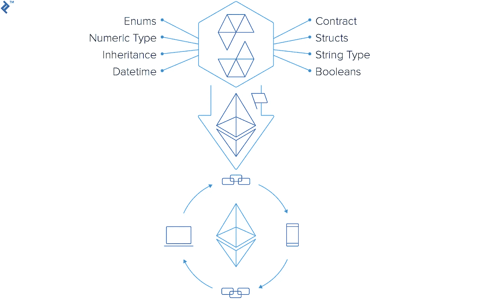
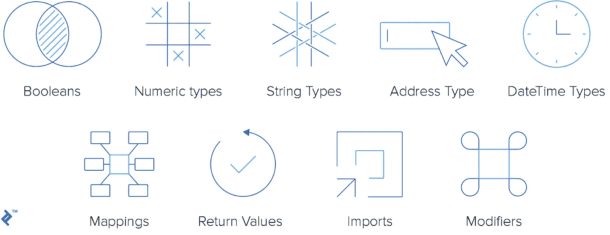
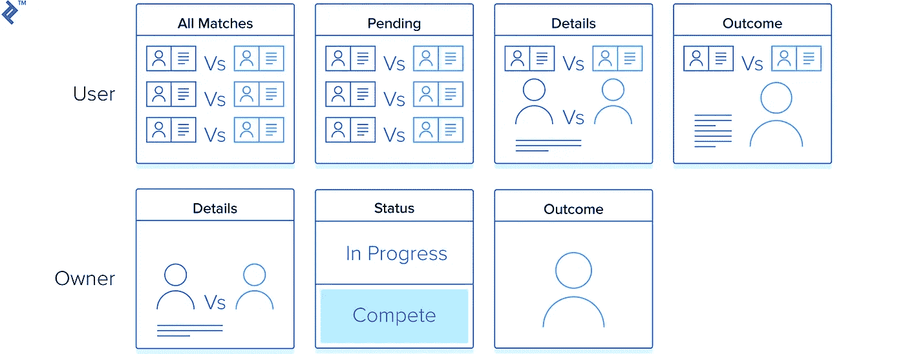

# 以太坊 Oracle 合同:可靠性代码特征

> 原文：<https://medium.com/hackernoon/ethereum-oracle-contracts-solidity-code-features-15d767776e44>

*原载于*[*【www.toptal.com】*](https://www.toptal.com/ethereum/ethereum-solidity-oracle-contracts-pt2)*，作者* [*约翰·r·科辛斯基*](https://www.toptal.com/resume/john-r-kosinski) *。*


*原载于*[*www.toptal.com*](https://www.toptal.com/ethereum/ethereum-solidity-oracle-contracts-pt2)*，作者为* [*约翰·r·科辛斯基*](https://www.toptal.com/resume/john-r-kosinski) *。*

在这个三部分的第一部分中，我们经历了一个[小教程，它为我们提供了一个简单的与 oracle 的合同对](https://www.toptal.com/ethereum/ethereum-oracle-contracts-tutorial-pt1)。描述了设置(使用 truffle)、编译代码、部署到测试网络、运行和调试的机制和过程；然而，代码的许多细节都被掩盖了。现在，正如承诺的那样，我们将开始研究一些语言特性，这些特性是[Solidity smart contract development](https://www.toptal.com/ethereum)所独有的，也是这个特定的 contract-oracle 场景所独有的。虽然我们不可能仔细研究每一个细节(如果你愿意，我会把这个问题留给你以后的研究)，但我们会尽力发现代码中最引人注目、最有趣和最重要的特征。

为了方便起见，我建议您打开项目的您自己的版本(如果您有)，或者将代码放在手边以供参考。

关于这一点的完整代码可以在这里找到:[https://github . com/jrkosinski/Oracle-example/tree/part 2-step 1](https://github.com/jrkosinski/oracle-example/tree/part2-step1)

# 以太坊和坚固

Solidity 不是唯一可用的智能合约开发语言，但我认为它是以太坊智能合约中最常见和最受欢迎的语言。当然，在我写这篇文章的时候，它拥有最受欢迎的支持和信息。



坚固性是面向对象的，是图灵完备的。也就是说，您将很快意识到它的内置(并且完全是有意的)限制，这使得智能合约编程感觉与普通的“让我们做这件事”黑客行为截然不同。

# 坚固性版本

以下是每首 Solidity 代码诗的第一行:

```
pragma solidity ^0.4.17;
```

你看到的版本号将会有所不同，因为 Solidity 还处于年轻阶段，正在快速变化和发展。版本 0.4.17 是我在例子中使用的版本；本出版物发布时的最新版本是 0.4.25。

在你读这篇文章的时候，最新的版本可能是完全不同的。许多好的特性正在为可靠性而工作(或者至少是计划好的),我们将在下面讨论。

下面是不同[实度版本](https://github.com/ethereum/solidity/releases)的概述。

**专业提示:** *你也可以指定一个版本范围(虽然我不常看到这样做)，比如:*

```
pragma solidity >=0.4.16 <0.6.0;
```

# Solidity 编程语言的特点

Solidity 有许多现代程序员熟悉的语言特性，也有一些独特的(至少对我来说)不寻常的特性。据说它的灵感来自 C++、Python 和 JavaScript——所有这些对我个人来说都很熟悉，然而 Solidity 似乎与这些语言中的任何一种都截然不同。

## 合同

的。sol 文件是代码的基本单位。在 [BoxingOracle.sol](https://github.com/jrkosinski/oracle-example/blob/part2-step1/oracle/contracts/BoxingOracle.sol) 中，注意第 9 行:

```
contract BoxingOracle is Ownable {
```

由于类是面向对象语言中逻辑的基本单位，所以契约是固态逻辑的基本单位。现在简单地说，契约是可靠性的“类”就足够了(对于面向对象的程序员来说，这是一个简单的飞跃)。

## 遗产

可靠契约完全支持继承，并且如你所料；私有契约成员不被继承，而受保护的和公共的成员被继承。正如你所期望的，重载和多态是被支持的。

```
contract BoxingOracle is Ownable {
```

在上面的语句中，“is”关键字表示继承。BoxingOracle 继承自 Ownable。Solidity 中也支持多重继承。多重继承由逗号分隔的类名列表表示，如下所示:

```
contract Child is ParentA, ParentB, ParentC { 
…
```

虽然(在我看来)在构建继承模型时过于复杂并不是一个好主意，但这里有一篇关于所谓的[钻石问题](https://ethereum.stackexchange.com/questions/21060/multiple-inheritance-and-linearization)的关于可靠性的有趣文章。

## 枚举

实体支持枚举:

```
enum MatchOutcome { 
     Pending, //match has not been fought to decision 
     Underway, //match has started & is underway 
     Draw, //anything other than a clear winner (e.g., cancelled)
     Decided //index of participant who is the winner }
```

正如您所料(与熟悉的语言没有什么不同)，每个枚举值都被赋予一个整数值，从 0 开始。如 Solidity 文档中所述，枚举值可转换为所有整数类型(例如，uint、uint16、uint32 等)。)，但不允许隐式转换。这意味着它们必须被显式转换(例如转换为 uint)。

> [*实体文档:枚举*](https://solidity.readthedocs.io/en/develop/types.html#enums) [*枚举教程*](https://boostlog.io/@bily809/solidity-tutorial-5-5abf43ed0814730093a2f00e)

## 结构

像枚举一样，结构是创建用户定义的数据类型的另一种方式。结构是所有 C/C++基础程序员和像我这样的老家伙所熟悉的。一个结构的例子，来自 [BoxingOracle.sol](https://github.com/jrkosinski/oracle-example/blob/part2-step1/oracle/contracts/BoxingOracle.sol) 的第 17 行:

```
//defines a match along with its outcome 
     struct Match { 
          bytes32 id; 
          string name; 
          string participants; 
          uint8 participantCount; 
          uint date; 
          MatchOutcome outcome; 
          int8 winner; 
}
```

**所有老 C 程序员注意:***Solidity 中的 Struct“打包”是一个东西，但是有一些规则和注意事项。不一定要假设它的工作原理和 C 中的一样；检查文件，了解你的情况，以确定在特定情况下打包是否有助于你。*

> [*坚固结构包装*](https://solidity.readthedocs.io/en/v0.4.21/miscellaneous.html)

结构一旦创建，就可以在代码中作为本机数据类型进行寻址。下面是上面创建的结构类型的“实例化”语法示例:

```
Match match = Match(id, "A vs. B", "A|B", 2, block.timestamp, MatchOutcome.Pending, 1);
```

# Solidity 中的数据类型

这就把我们带到了 Solidity 中数据类型的最基本的主题。solidity 支持哪些数据类型？Solidity 是静态类型的，在撰写本文时，数据类型必须显式声明并绑定到变量。



> [*实度数据类型*](https://solidity.readthedocs.io/en/v0.4.24/types.html)

## 布尔运算

布尔类型在名称 *bool* 和值 *true* 或 *false* 下受支持

## 数字类型

支持整数类型，无论有符号还是无符号，从 int8/uint8 到 int256/uint256(分别是 8 位整数到 256 位整数)。uint 类型是 uint256 的缩写(同样，int 也是 int256 的缩写)。

值得注意的是，*不支持浮点类型。为什么不呢？首先，在处理货币价值时，众所周知浮点变量是个坏主意(当然是一般情况下)，因为价值可能会消失得无影无踪。乙醚值用 wei 表示，它是乙醚的 1/1，000，000，000，000，000，000，这对于所有目的来说必须足够精确；你不能把以太分解成更小的部分。*

目前部分支持定点值。根据 Solidity 文档:*“Solidity 还不完全支持定点数。它们可以被声明，但不能被赋值给或来自。*

> [*https://hacker noon . com/a-note-on-numbers-in-ether eum-and-JavaScript-3e 6 AC 3 B2 fad 9*](https://hackernoon.com/a-note-on-numbers-in-ethereum-and-javascript-3e6ac3b2fad9)

**注意:** *在大多数情况下，最好只使用 uint，因为减小变量的大小(例如减小到 uint32)，实际上可能会增加汽油成本，而不是像您所期望的那样降低成本。作为一般的经验法则，使用 uint，除非你确定你有一个好的理由不这样做。*

## 字符串类型

Solidity 中的字符串数据类型是一个有趣的主题；根据你和谁交谈，你可能会得到不同的意见。Solidity 中有一个字符串数据类型，这是事实。我的观点，可能也是大多数人的观点，是它没有提供太多的功能。字符串解析、连接、替换、修剪，甚至计算字符串的长度:这些您可能期望从字符串类型中得到的东西都不存在，因此它们是您的责任(如果您需要它们)。有人用 bytes32 代替 string 这也可以做到。

> [*关于坚固琴弦的趣味文章*](https://hackernoon.com/working-with-strings-in-solidity-c4ff6d5f8008)

我的观点是:编写自己的字符串类型并发布供一般使用可能是一个有趣的练习。

## 地址类型

也许对 Solidity 来说是独一无二的，我们有一个*地址*数据类型，专门用于以太坊钱包或合同地址。它是一个 20 字节的值，专门用于存储特定大小的地址。此外，它还有专门针对该类地址的类型成员。

```
address internal boxingOracleAddr = 0x145ca3e014aaf5dca488057592ee45305d9b3a22;
```

> [*地址数据类型*](https://ethereum.stackexchange.com/questions/34024/when-exactly-address-datatype-should-be-used)

例如，在 Solidity 中没有本地日期或日期时间类型，而在 JavaScript 中却有。(哦，不——每一段都越来越不可靠了！？)日期作为 uint (uint256)类型的时间戳进行本机寻址。它们通常作为 Unix 风格的时间戳来处理，单位是秒而不是毫秒，因为块时间戳是 Unix 风格的时间戳。如果您发现自己出于各种原因需要人类可读的日期，可以使用开源库。您可能会注意到我在 BoxingOracle 中使用了一个: [DateLib.sol](https://github.com/jrkosinski/oracle-example/blob/part2-step1/oracle/contracts/DateLib.sol) 。OpenZeppelin 也有日期工具以及许多其他类型的通用工具库(我们很快会谈到 Solidity 的*库*特性)。

**专业提示:**[*OpenZeppelin*](https://openzeppelin.org/)*对于知识和预先编写的通用代码来说都是一个很好的来源(但当然不是唯一的好来源)，可以帮助您建立合同。*

## 映射

注意 [BoxingOracle.sol](https://github.com/jrkosinski/oracle-example/blob/part2-step1/oracle/contracts/BoxingOracle.sol) 的第 11 行定义了一个叫做*映射*的东西:

```
mapping(bytes32 => uint) matchIdToIndex;
```

Solidity 中的映射是用于快速查找的特殊数据类型；本质上是一个查找表或类似的哈希表，其中包含的数据位于区块链本身上(当映射被定义时，就像这里一样，作为类成员)。在契约的执行过程中，我们可以将数据添加到映射中，类似于将数据添加到散列表中，然后查找我们添加的那些值。请再次注意，在这种情况下，我们添加的数据被添加到区块链本身，因此它将持续存在。如果我们今天把它添加到纽约的地图上，一周后伊斯坦布尔的某个人就能看到它。

添加到映射的示例，来自 [BoxingOracle.sol](https://github.com/jrkosinski/oracle-example/blob/part2-step1/oracle/contracts/BoxingOracle.sol) 的第 71 行:

```
matchIdToIndex[id] = newIndex+1
```

从 [BoxingOracle.sol](https://github.com/jrkosinski/oracle-example/blob/part2-step1/oracle/contracts/BoxingOracle.sol) 的第 51 行读取映射的示例:

```
uint index = matchIdToIndex[_matchId];
```

也可以从映射中删除项目。这个项目中没有使用它，但它看起来像这样:

```
delete matchIdToIndex[_matchId];
```

## 返回值

正如您可能已经注意到的，Solidity 可能与 JavaScript 有一点表面上的相似，但它没有继承 Javascript 在类型和定义方面的松散性。契约代码必须以相当严格和受限的方式定义(考虑到用例，这可能是一件好事)。记住这一点，考虑来自 [BoxingOracle.sol](https://github.com/jrkosinski/oracle-example/blob/part2-step1/oracle/contracts/BoxingOracle.sol) 的第 40 行的函数定义

```
function _getMatchIndex(bytes32 _matchId) private view returns (uint) { ... }
```

好，那么，让我们先快速概述一下这里包含的内容。`function`将其标记为函数。`_getMatchIndex`是函数名(下划线是表示私有成员的约定——我们将在后面讨论)。它有一个类型为`bytes32`的参数，名为`_matchId`(这次使用下划线约定来表示函数参数)。关键字`private`实际上是让成员在作用域上私有，`view`告诉编译器这个函数不修改区块链上的任何数据，最后:~~~ solidity 返回(uint) ~~~

这表示函数返回一个 uint(返回 void 的函数在这里没有`returns`子句)。uint 为什么在括号里？这是因为 Solidity 函数能够并且经常返回*元组*。

现在考虑第 166 行的以下定义:

```
function getMostRecentMatch(bool _pending) public view returns (
     bytes32 id, 
     string name, 
     string participants, 
     uint8 participantCount, 
     uint date, 
     MatchOutcome outcome, 
     int8 winner) { ... }
```

看看这个的退货条款！它返回一个，两个…七个不同的东西。这个函数以元组的形式返回这些东西。为什么？在开发过程中，您会经常发现自己需要返回一个 struct(如果是 JavaScript，您可能会希望返回一个 JSON 对象)。好吧，在撰写本文时(尽管将来这可能会改变)，Solidity 不支持从公共函数返回结构。所以你必须返回元组。如果你是一个 Python 爱好者，你可能已经习惯了元组。但是许多语言并不真正支持它们，至少不是以这种方式。

见第 159 行返回一个元组作为返回值的例子:

```
return (_matchId, "", "", 0, 0, MatchOutcome.Pending, -1);
```

我们如何接受这样的东西的返回值呢？我们可以这样做:

```
var (id, name, part, count, date, outcome, winner) = getMostRecentMatch(false);
```

或者，您可以事先用正确的类型显式声明变量:

```
//declare the variables 
bytes32 id; 
string name; 
... etc... 
int8 winner; //assign their values 
(id, name, part, count, date, outcome, winner) = getMostRecentMatch(false); 
```

现在我们已经声明了 7 个变量来保存 7 个返回值，我们现在可以使用它们了。否则，假设我们只需要一两个值，我们可以说:

```
//declare the variables 
bytes32 id; 
uint date; //assign their values 
(id,,,,date,,) = getMostRecentMatch(false);
```

看到我们在那里做了什么吗？我们只得到我们感兴趣的两个。检查所有这些逗号。我们得仔细数一数！

## 进口

[BoxingOracle.sol](https://github.com/jrkosinski/oracle-example/blob/part2-step1/oracle/contracts/BoxingOracle.sol) 的第 3 行和第 4 行是导入:

```
import "./Ownable.sol"; 
import "./DateLib.sol";
```

正如您可能预料的那样，这些是从与 BoxingOracle.sol 位于同一个 contracts 项目文件夹中的代码文件中导入定义。

## 修饰语

请注意，函数定义附带了许多修饰符。首先是可见性:私有、公共、内部和外部— [函数可见性](https://forum.ethereum.org/discussion/3344/function-visibility-whats-the-difference-between-private-and-internal-if-any)。

此外，您会看到关键字`pure`和`view`。这些向编译器表明函数将做出什么样的改变，如果有的话。这很重要，因为这是运行该功能的最终气体成本的一个因素。参见此处解释:[固化文档](https://solidity.readthedocs.io/en/v0.4.24/contracts.html)。

最后，我真正想讨论的是自定义修饰符。看一下 [BoxingOracle.sol](https://github.com/jrkosinski/oracle-example/blob/part2-step1/oracle/contracts/BoxingOracle.sol) 的第 61 行:

```
function addMatch(string _name, string _participants, uint8 _participantCount, uint _date) onlyOwner public returns (bytes32) {
```

注意“公共”关键字前面的`onlyOwner`修饰符。这表明*只有契约的所有者*可以调用这个方法！虽然非常重要，但这并不是坚固性的固有特征(尽管将来可能会是)。实际上，`onlyOwner`是我们自己创建并使用的自定义修饰符的一个例子。让我们看一看。

首先，修改器在文件 [Ownable.sol](https://github.com/jrkosinski/oracle-example/blob/part2-step1/oracle/contracts/Ownable.sol) 中定义，你可以看到我们已经在 [BoxingOracle.sol](https://github.com/jrkosinski/oracle-example/blob/part2-step1/oracle/contracts/BoxingOracle.sol) 的第 3 行导入了它:

```
import "./Ownable.sol"
```

注意，为了使用这个修饰符，我们让`BoxingOracle`继承了`Ownable`。在 [Ownable.sol](https://github.com/jrkosinski/oracle-example/blob/part2-step1/oracle/contracts/Ownable.sol) 的第 25 行，我们可以在“Ownable”契约中找到修饰符的定义:

```
modifier onlyOwner() { 
     require(msg.sender == owner); 
     _; 
}
```

(顺便说一下，这份可拥有的合同来自于 [OpenZeppelin](https://openzeppelin.org/) 的一份公开合同。)

请注意，这个东西被声明为修饰符，表明我们可以像我们所拥有的那样使用它，来修改一个函数。请注意，修饰语的核心是“要求”语句。Require 语句有点像断言，但不用于调试。如果 require 语句的条件失败，那么函数将抛出一个异常。所以，套用这句“要求”的话:

```
require(msg.sender == owner);
```

我们可以说它的意思是:

```
if (msg.send != owner) 
      throw an exception;
```

事实上，在 Solidity 0.4.22 和更高版本中，我们可以向 require 语句添加一条错误消息:

```
require(msg.sender == owner, "Error: this function is callable by the owner of the contract, only");
```

最后，在看起来很奇怪的一行中:

```
_;
```

下划线是“在这里，执行修改后的函数的全部内容”的简写因此实际上，require 语句将首先被执行，然后是实际的函数。这就像在修改后的函数前加上这条逻辑线。

当然，你可以用修改器做更多的事情。查看单据:[单据](https://solidity.readthedocs.io/en/v0.4.24/common-patterns.html)。

# 固体图书馆

有一种语言特性叫做*库*。我们的项目中有一个例子在 [DateLib.sol](https://uploads.toptal.io/blog/image/127425/toptal-blog-image-1540462147637-42133106791559b652ee7f4bb29c2f6e.png) 。



这是一个更好更容易处理日期类型的库。它在第 4 行被导入到 BoxingOracle:

```
import "./DateLib.sol";
```

它用在第 13 行:

```
using DateLib for DateLib.DateTime;
```

`DateLib.DateTime`是从 DateLib 协定中展开的结构(它作为成员公开；参见 [DateLib.sol](https://github.com/jrkosinski/oracle-example/blob/part2-step1/oracle/contracts/DateLib.sol) 的第 4 行)我们在这里声明我们“使用”特定数据类型的 DateLib 库。因此，该库中声明的方法和操作将应用于我们说过应该应用的数据类型。这就是库在 Solidity 中的用法。

更清楚的例子是，查看一些 [OpenZeppelin](https://openzeppelin.org/) 的数字库，比如 [SafeMath](https://github.com/OpenZeppelin/openzeppelin-solidity/blob/master/contracts/math/SafeMath.sol) 。这些可以应用于本地(数字)实体数据类型(而这里我们将一个库应用于自定义数据类型)，并且被广泛使用。

# 接口

和主流面向对象语言一样，支持接口。Solidity 中的接口被定义为契约，但是函数的函数体被省略了。有关接口定义的示例，请参见 [OracleInterface.sol](https://github.com/jrkosinski/oracle-example/blob/part2-step1/client/contracts/OracleInterface.sol) 。在此示例中，接口用作 oracle 契约的替代，其内容驻留在具有单独地址的单独契约中。

# 命名规格

当然，命名约定不是一个全局规则；作为程序员，我们知道我们可以自由地遵循吸引我们的编码和命名惯例。另一方面，我们确实希望其他人能够舒服地阅读和使用我们的代码，所以某种程度的标准化是可取的。

# 项目概述

现在我们已经讨论了代码文件中的一些通用语言特性，我们可以开始更具体地看看这个项目的代码本身。

所以，让我们再一次澄清这个项目的目的。这个项目的目的是提供一个半现实(或伪现实)的示范和使用甲骨文的智能合同的例子。本质上，这只是一个调用另一个单独契约的契约。

该示例的业务案例可以陈述如下:

*   一个用户想要在拳击比赛中下不同大小的赌注，为赌注支付金钱(乙醚),并在他们赢了的时候收取他们的奖金。
*   用户通过智能合约下注。(在现实生活的用例中，这将是一个完整的带有 web3 前端的 DApp；但是我们只检查合同方面。)
*   一个独立的智能合同(oracle)由第三方维护。它的工作是维护一个列表，列出拳击比赛的当前状态(待定、进行中、结束等)。)还有，如果完成了，就是赢家。
*   主合同从 oracle 获得未决匹配的列表，并将这些列表作为“可下注的”匹配呈现给用户。
*   主合同接受赌注，直到比赛开始。
*   比赛结束后，主合同根据一个简单的算法来分配输赢，自己提成，并根据要求支付赢款(输者只是输掉他们的全部股份)。

下注规则:

*   有一个明确的最低赌注(定义在魏)。
*   没有最大赌注；用户可以下注超过最低金额的任意金额。
*   用户可以下注，直到比赛变成“进行中”

分配奖金的算法:

*   收到的所有赌注都放入“彩池”
*   一小部分从锅里拿出来，给房子用。
*   每个赢家都会得到一部分奖金，与他们下注的相对大小成正比。
*   比赛结束后，一旦第一个用户请求结果，就开始计算奖金。
*   根据用户的请求奖励奖品。
*   在平局的情况下，没有人会赢——每个人都拿回他们的赌注，而房子没有提成。

# 甲骨文合同

# 提供的主要功能

oracle 有两个接口，你可以说:一个呈现给合同的“所有者”和维护者，另一个呈现给公众；即消耗神谕的契约。作为维护者，它提供了将数据输入到契约中的功能，本质上是从外部世界获取数据并将其放到区块链上。对公众而言，它提供对所述数据的只读访问。值得注意的是，合同本身限制非所有者编辑任何数据，但是对该数据的只读访问是公开授予的，没有任何限制。

给用户:

*   列出所有匹配项
*   列出待定匹配项
*   获取特定匹配的详细信息
*   获取特定比赛的状态和结果

致所有者:

*   输入匹配项
*   改变比赛状态
*   设定比赛结果

用户故事:

*   一场新的拳击比赛已经宣布并确定于 5 月 9 日举行。
*   我，合同的维护者(也许我是一个知名的体育网络或新的出路)，将即将到来的比赛添加到区块链的甲骨文数据中，状态为“待定”任何人或任何合同现在都可以随意查询和使用这些数据。
*   当比赛开始时，我将比赛的状态设置为“进行中”
*   当比赛结束时，我将比赛的状态设置为“completed ”,并修改比赛数据以表示获胜者。

# 甲骨文代码审查

这篇评论完全基于[boxing Oracle . sol](https://github.com/jrkosinski/oracle-example/blob/part2-step1/oracle/contracts/BoxingOracle.sol)；行号引用该文件。

在第 10 行和第 11 行，我们声明了匹配的存储位置:

```
Match[] matches; mapping(bytes32 => uint) matchIdToIndex;
```

`matches`只是一个简单的数组，用于存储匹配实例，映射只是一个工具，用于将唯一的匹配 ID(一个 bytes32 值)映射到它在数组中的索引，这样如果有人给我们一个匹配的原始 ID，我们就可以使用这个映射来定位它。

在第 17 行，我们的匹配结构被定义和解释:

```
//defines a match along with its outcome 
     struct Match { 
          bytes32 id; //unique id 
          string name; //human-friendly name (e.g., Jones vs. Holloway) 
          string participants; //a delimited string of participant names 
          uint8 participantCount; //number of participants (always 2 for boxing matches!) 
          uint date; //GMT timestamp of date of contest MatchOutcome outcome; //the outcome (if decided) 
          int8 winner; //index of the participant who is the winner
} //possible match outcomes 
     enum MatchOutcome { 
          Pending, //match has not been fought to decision 
          Underway, //match has started & is underway 
          Draw, //anything other than a clear winner (e.g., cancelled) 
          Decided //index of participant who is the winner }
```

第 61 行:函数`addMatch`仅供合同业主使用；它允许向存储的数据添加新的匹配。

第 80 行:函数`declareOutcome`允许合同所有者将一场比赛设置为“已决定”，设置获胜的参与者。

第 102–166 行:下面的函数都可以被公众调用。这是通常向公众开放的只读数据:

*   函数`getPendingMatches`返回当前状态为“待定”的所有匹配的 id 列表
*   函数`getAllMatches`返回所有匹配的 id 列表。
*   函数`getMatch`返回由 ID 指定的单个匹配的完整细节。

第 193–204 行声明了主要用于测试、调试和诊断的函数。

*   函数`testConnection`只是测试我们是否能够调用契约。
*   函数`getAddress`返回这个契约的地址。
*   函数`addTestData`将一组测试匹配添加到匹配列表中。

在进入下一步之前，请随意探索一下代码。我建议在调试模式下再次运行 oracle contract(如本系列第 1 部分所述)，调用不同的函数，并检查结果。

# 装箱数:客户合同

定义客户合同(下注合同)负责什么和不负责什么是很重要的。客户合同*不*负责维护真实拳击比赛的列表或宣布其结果。我们“信任”(是的，我知道，有一个敏感词—哦—我们将在第 3 部分中讨论)该服务的 oracle。客户合同负责接受赌注。它负责分配奖金的算法，并根据比赛结果(从神谕处收到)将奖金转移到赢家的账户。

此外，一切都是基于拉的，没有事件或推。契约从 oracle 获取数据。该契约从 oracle 中提取比赛结果(响应用户请求)，并计算奖金，然后根据用户请求进行转移。

# 提供的主要功能

*   列出所有待定匹配
*   获取特定匹配的详细信息
*   获取特定比赛的状态和结果
*   下注
*   申请/接受奖金

# 客户代码审查

这篇评论完全基于[boxing bets . sol](https://github.com/jrkosinski/oracle-example/blob/part2-step1/client/contracts/BoxingBets.sol)；行号引用该文件。

第 12 行和第 13 行是契约中的第一行代码，定义了一些映射，我们将在其中存储契约的数据。

第 12 行将用户地址映射到 id 列表。这是将用户映射到属于该用户的赌注 id 列表。因此，对于任何给定的用户地址，我们可以快速获得该用户所下的所有赌注的列表。

```
mapping(address => bytes32[]) private userToBets;
```

第 13 行将一个匹配的惟一 ID 映射到一个 bet 实例列表。有了这个，对于任何给定的比赛，我们都可以得到该比赛的所有赌注的列表。

```
mapping(bytes32 => Bet[]) private matchToBets;
```

第 17 行和第 18 行与我们的 oracle 的连接有关。首先，在`boxingOracleAddr`变量中，我们存储 oracle 契约的地址(默认设置为零)。我们可以对先知的地址进行硬编码，但这样我们就永远无法改变它。(不能更改 oracle 的地址可能是一件好事，也可能是一件坏事——我们可以在第 3 部分讨论这个问题)。下一行创建 oracle 接口的实例(在 [OracleInterface.sol](https://github.com/jrkosinski/oracle-example/blob/part2-step1/client/contracts/OracleInterface.sol) 中定义)并将其存储在一个变量中。

```
//boxing results oracle 
address internal boxingOracleAddr = 0; 
OracleInterface internal boxingOracle = OracleInterface(boxingOracleAddr);
```

如果您跳到第 58 行，您将看到`setOracleAddress`函数，在这个函数中，这个 oracle 地址可以被更改，并且在这个函数中，`boxingOracle`实例被用一个新地址重新实例化。

第 21 行定义了我们的最小下注额，单位是 100 威.这当然实际上是很小的量，只有 0.000001 以太。

```
uint internal minimumBet = 1000000000000;
```

分别在第 58 行和第 66 行，我们有`setOracleAddress`和`getOracleAddress`函数。`setOracleAddress`有`onlyOwner`修饰符，因为只有契约的所有者可以用另一个甲骨文替换掉这个甲骨文(可能*不是*一个好主意，但是我们将在第 3 部分详细阐述)。另一方面，`getOracleAddress`函数是可公开调用的；任何人都可以看到使用的是什么 oracle。

```
function setOracleAddress(address _oracleAddress) external onlyOwner returns (bool) {... 
function getOracleAddress() external view returns (address) { ....
```

在第 72 行和第 79 行，我们分别有`getBettableMatches`和`getMatch`函数。请注意，这些只是将调用转发给 oracle，并返回结果。

```
function getBettableMatches() public view returns (bytes32[]) {... function getMatch(bytes32 _matchId) public view returns ( ....
```

`placeBet`函数是一个非常重要的函数(第 108 行)。

```
function placeBet(bytes32 _matchId, uint8 _chosenWinner) public payable { ...
```

这个的一个显著特征是`payable`修改器；我们一直忙于讨论一般的语言特性，以至于我们还没有触及核心的重要特性，即能够随函数调用一起发送资金！这就是它的基本内容——它是一个函数，可以接受一定数量的钱，以及发送的任何其他参数和数据。

我们在这里需要它，因为这是用户同时定义他们要下什么注，他们打算在那个注上押多少钱，并实际发送钱的地方。`payable`修改器可以实现这一点。在接受赌注之前，我们会进行一系列检查，以确保赌注的有效性。第 111 行的第一个检查是:

```
require(msg.value >= minimumBet, "Bet amount must be >= minimum bet");
```

发送的金额存储在`msg.value`中。假设所有检查都通过了，在第 123 行，我们将把该金额转移到 oracle 的所有权中，将该金额的所有权从用户手中夺走，并转移到契约的所有人手中:

```
address(this).transfer(msg.value);
```

最后，在第 136 行，我们有一个测试/调试助手函数，它将帮助我们知道该契约是否连接到有效的 oracle:

```
function testOracleConnection() public view returns (bool) { 
     return boxingOracle.testConnection(); 
}
```

# 包扎

*这个例子实际上已经到此为止了；只是接受赌注。*为了使这个例子足够简单，我们特意省略了划分奖金和支付的功能以及一些其他逻辑，这只是为了演示 oracle 与合同的使用。更完整和复杂的逻辑存在于当前的另一个项目中，它是这个例子的扩展，并且仍在开发中。

所以现在我们对代码库有了更好的理解，并把它作为一个载体和出发点来讨论 Solidity 提供的一些语言特性。这个由三部分组成的系列文章的主要目的是演示和讨论如何使用 oracle 合同。这一部分的目的是更好地理解这个特定的代码，并将其作为理解可靠性和智能契约开发的一些特性的起点。第三部分也是最后一部分的目的是讨论 oracle 使用的策略和理念，以及它如何在概念上融入智能合同模型。

# 其他可选步骤

我强烈建议希望了解更多信息的读者阅读并使用这段代码。实现新功能。修复任何错误。实现未实现的功能(如支付接口)。测试函数调用。修改它们并重新测试，看看会发生什么。添加一个 web3 前端。添加删除匹配或修改其结果的功能(以防出错)。取消的比赛怎么办？实现第二个 oracle。当然，一个契约可以自由地使用尽可能多的神谕，但是这会引发什么问题呢？从中得到乐趣；这是一种很好的学习方式，当你这样做(并从中获得乐趣)时，你肯定会记住更多你所学到的东西。

一个简单的、不全面的尝试清单:

*   在本地 testnet(在 truffle 中，如第 1 部分所述)中运行契约和 oracle，并调用所有可调用函数和所有测试函数。
*   增加计算奖金的功能，并在比赛结束后支付奖金。
*   增加了在抽奖的情况下退还所有赌注的功能。
*   添加一个功能，要求退款或取消赌注，比赛开始前。
*   添加一个功能，以考虑到比赛有时会被取消的事实(在这种情况下，每个人都需要退款)。
*   实现一个功能，以保证用户下注时所在的 oracle 就是将用于确定匹配结果的 oracle。
*   实现另一个(第二个)oracle，它具有一些不同的相关特性，或者可能提供拳击以外的运动(注意，参与者计数和列表允许不同类型的运动，所以我们实际上并不仅限于拳击)。
*   实现`getMostRecentMatch`,以便它实际上返回最近添加的匹配，或者在发生时间方面最接近当前日期的匹配。
*   实现异常处理。

一旦您熟悉了契约和 oracle 之间的关系机制，在这个三部分系列的第 3 部分中，我们将讨论这个例子提出的一些战略、设计和哲学问题。

*最初发表于*[*【www.toptal.com】*](https://www.toptal.com/ethereum/ethereum-solidity-oracle-contracts-pt2)*。*