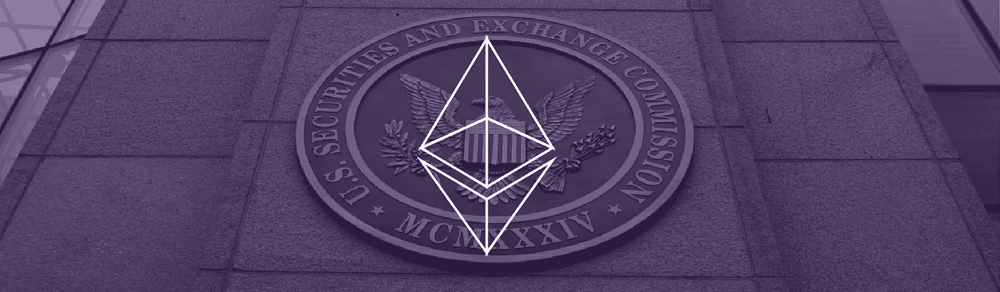
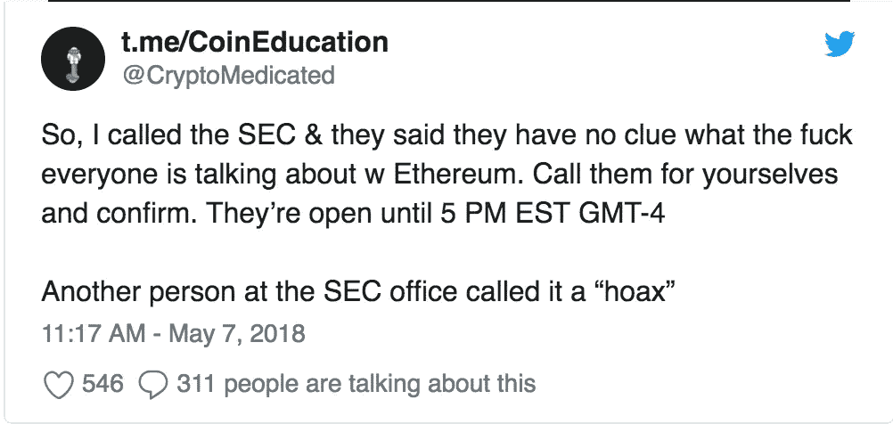
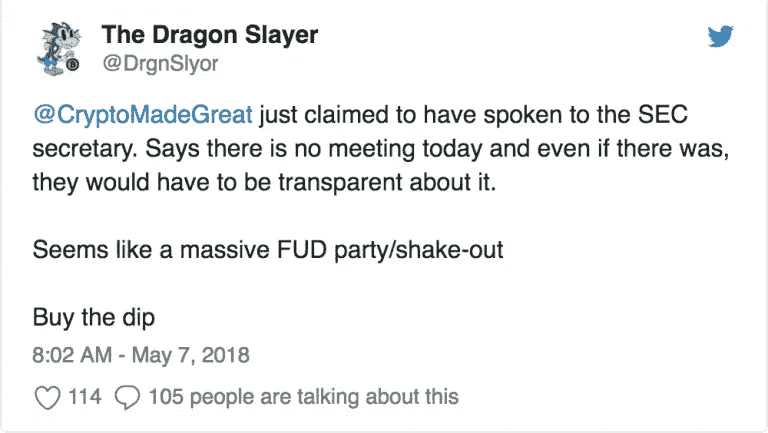

# 以太坊安全 FUD & DYOR 在密码学中的重要性

> 原文：<https://medium.com/hackernoon/ethereum-security-fud-the-importance-of-dyor-in-crypto-22c43f968a34>

过去一周，多家在线新闻媒体(最著名的是《华尔街日报》)报道称，美国证券交易委员会(SEC)和商品期货交易委员会(CFTC)将于 5 月 7 日举行听证会，将以太坊的地位归类为证券或商品。

他们错了。

没有举行听证会。

事实上，证交会或 CFTC 的官方网站上都没有提及此事。一位 Redditor 甚至[亲自打电话给 SEC](/cryptomedication/the-ethereum-sec-cftc-meeting-was-a-hoax-da620a2382a1)，与一位秘书交谈，后者证实 SEC 或 CFTC 之间没有关于以太坊分类的听证会计划。

CryptoMedicated, another crypto blogger also called the SEC to confirm the hearing.

同样，消息来源于《华尔街日报》，标题为“[监管审查下世界第二大最有价值的加密货币](https://www.wsj.com/articles/worlds-second-most-valuable-cryptocurrency-under-regulatory-scrutiny-1525167000)”一些人认为，这是一个精心策划的事件，导致市场内的 FUD，这可能会导致严重的价格波动。幸运的是，到 5 月 7 日，所有主要交易所的 ETH 价格保持相对稳定。

即使证交会和 CFTC 闭门举行了听证会，他们也有法律义务将会议内容公之于众。华尔街日报的文章火了，一个加密播客声称[以太坊处于被宣布为安全的边缘。](https://player.fm/series/the-cryptoverse-2285829/look-out-ethereum-is-on-the-brink-of-being-declared-a-security)

在加密货币空间的背景下，一个人做自己的研究来确认或否认任何说法是至关重要的。甚至像《华尔街日报》这样有声望的新闻来源也可以错误地声称事实，这可能会像滚雪球一样成为其他利基新闻媒体的 FUD。其他新闻媒体的另一个有问题的策略是用耸人听闻的标题(无论真假)来制造更多的流量。

展望未来，这一事件强调了**做自己的研究** (DYOR)的重要性，尤其是在涉及加密货币这样的行业时。明智的做法是查看美国证券交易委员会(SEC)或 CFTC 的网站，仔细检查某一特定加密货币的听证会是否真的会举行。

有一件事是肯定的，本周的事件对《华尔街日报》的声誉或秘密头的可信度没有帮助。

你对整个事件的看法是什么？请在下面评论，我们很想听听你的想法。

如果你喜欢这个内容，请点击订阅[我们的邮件列表。您将获得 Lunar Labs 的早期测试版，这是一套优化您的加密货币交易体验的工具，以及直接发送到您电子邮件的最新加密新闻和市场更新。您也可以通过](http://bit.ly/2ozZ20H)[点击此处](http://bit.ly/2GUSqRl)访问我们的网站，了解更多我们的工作！

*原载于 2018 年 5 月 11 日*[*lunardigitalassets.com*](https://lunardigitalassets.com/news/project-news/ethereum/2018/ethereum-security-fud-importance-dyor-crypto/)*。*