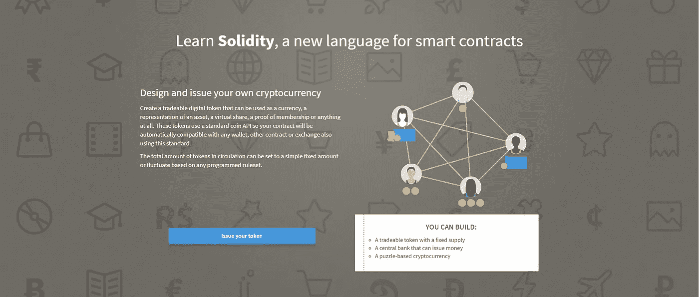

# 证交会错了！以太坊是一种证券。

> 原文：<https://medium.com/hackernoon/ethereum-security-sec-a145d638f5aa>

上个月，美国证券交易委员会公司金融部主任希曼在一次演讲中发表了一些奇怪的言论，震惊了(法律界)区块链世界。他表示，为“世界计算机”提供燃料的加密货币以太坊不是一种证券。相反，他认为以太币在 ICO 之后的某个时候不再是一种证券。我认为他错了。

Mr. Hinman during his speech at Yahoo! Finance

在雅虎的演讲中。财务辛曼先生说:

> “抛开伴随以太创建而来的集资不谈，基于我对以太现状、以太坊网络及其去中心化结构的理解，以太目前的要约和销售都不属于证券交易。”

首先，要注意几件事:

*   证券交易委员会不制定法律。他们给予指导并执行法律。
*   辛曼先生并没有说以太坊从来就不是一种证券。
*   他也没有说 ico 不是证券产品。

他所说的是以太坊不再是*的*安全*。*那么，为什么我认为他是错的呢？

# 豪威测试——一个非常简短的证券介绍。

要回答这个问题，我们必须戴上律师的帽子。我们必须研究一些关于投资合同的案例法，从豪威诉证券交易委员会开始。让我们开始吧。

在 [*Howey-in-the-Hills 诉 SEC*](https://supreme.justia.com/cases/federal/us/328/293/) 一案中，Howey 向其酒店游客出售柑橘园。根据一份服务合同，小树林被租回给豪威，合同规定豪威将照管土地，收割并出售产品。房地产的购买者将从柑橘收成的销售中获利。

尽管从技术上讲，这不是一份投资合同，但最高法院认为，鉴于经济现实，双方之间的关系形式应不予考虑。最终，投资者投资豪威，期望获得利润。

因此，开发了*豪威测试*。根据这个测试，任何满足以下 4 个标准的情况都被认为是投资合同，因此也是证券:

*   有一笔*资金的投入*
*   在一家*普通企业*
*   有了*预期利润*
*   *完全由于第三方的努力*

你可能会想:这有什么关系？

嗯，投资者想从他们的投资中获利。作为投资者，你投资的成功取决于发行人的努力。因此，为了做出明智的投资决策，你需要获得关于你投资的任何重要信息。法律承认这一点。因此，证券法确保如果一份合同符合豪威测试的四个标准，发行人必须提交一份所谓的招股说明书。

简单地说，在招股说明书中，发行人必须提供有关信息，例如，其背景、融资、计划、财务股份和风险。

# 为什么以太坊不是证券，根据美国证券交易委员会

毫无疑问，在以太坊的 ICO 时代，以太坊的投资绝对符合豪威测试的所有四个方面。每个参与 ICO 的人都投资了他们的比特币，希望从以太坊的发展中获得利润，或者换句话说，从代币发行者的努力中获得利润。那么，为什么 SEC 现在会说以太坊不再是一种证券呢？

The Logo of the SEC

Hinman 先生详细阐述了。他把这个论点表述如下:

> “如果代币或硬币发挥作用的网络足够分散——购买者不再合理地期望一个人或一个团体进行基本的管理或创业努力——资产可能不代表投资合同。此外，当第三方的努力不再是决定企业成功的关键因素时，实质性的信息不对称就会消退。随着网络变得真正分散，确定发行人或发起人以进行必要披露的能力变得困难，也变得不那么有意义。”

当然，他的推理是有道理的。

为什么投资者需要披露对被收购投资不再有任何影响的一方的信息？从豪威公司购买柑橘(而不是小树林)的人对豪威公司本身的经营、财务和管理风险一无所知。

同样地，如果以太坊基金会对以太坊的未来不再有影响力，购买以太的人就没有使用关于以太坊基金会的信息。豪威测试的第四个标准(*由第三方的单独努力产生的利润)*将不被满足，因此，以太坊不是证券。

如果以太坊的未来价值不再取决于基金会的努力，那么投资者就不需要证券法来保护他。

# 为什么以太坊实际上是一种证券

尽管 SEC 的论点本身是合理的，但我认为它忽略了以太坊治理的现实以及代币发行者以太坊基金会对以太价值的影响。

> 为了让证交会的论点有效，以太坊必须去中心化。

SEC 论文的应用需要对以太坊的去中心化进行二元决策(是/否)。然而在实践中，这是非常困难的。以太坊的治理流程、发展和生态系统的确存在一定程度的去中心化。然而与此同时，以太坊基金会仍然扮演着重要的角色。集中式令牌和分散式令牌之间的界限在哪里？我们如何衡量分权？而以太坊是否去中心化到足以穿越？最重要的是:

> 以太坊的价格还仅仅依靠以太坊基金会和以太坊创始人的努力吗？

首先，我们从过去的案例法中知道,“单独”一词不能从字面上理解。事实上，该术语也被解释为包括投资成功所必需的重要或必要的管理或其他努力。因此，如果以太坊的成功需要以太坊基金会的重大或必要努力，它仍然是一种保障。

我们还知道，*‘转售价值的可能增加不在《证券法》的范围内，在《证券法》中，不存在依赖他人的管理、运营或发展努力的基本要素。’*在大多数情况下，检验标准是投资者以外的人所做的努力是否是不可否认的重要努力——那些影响企业成败的基本管理努力。因此，问题变成如下:

> 以太坊基金会和以太坊创始人的努力是以太坊成功最重要的努力吗？

让我们检查几个相关因素。

## **以太坊的治理**

一个需要考虑的明显因素是[以太坊基金会](https://www.ethereum.org/foundation)对以太坊管理的影响。理论上，这里有很大程度的分权。实际上，任何人都可以提议和贡献代码，任何这样的新代码都将由分散的矿工投票决定。

然而，在实践中，我认为，更仔细的研究将表明，其发行者仍具有重大影响力。虽然实证分析更适合证明这一点，但我们知道，以太坊网络最重要的变化(作为共识模型的 Casper PoS 的实施、链上治理结构的拒绝和 DAO 硬分叉)都是以太坊核心开发人员努力的直接结果。

所有这些变化都对以太坊的价值产生了直接的、可衡量的影响。事实上，由于 Vitalik Buterin 的努力，DAO hard fork 决定甚至导致以太坊分裂为两种不同的资产:以太坊和以太坊经典。

说以太坊基金会在以太坊的治理中没有实质性的作用，因为社区参与了决策过程，所以他们不能自己做出最终决定，这就像说公司的董事会对公司的未来没有影响力，因为股东在治理中也有作用…

事实上，以太坊的成功很大程度上可以归功于对其创始人维塔利·布特林的狂热崇拜。他被以太坊社区的所有人视为天才儿童，是他成就了以太坊的今天。直到今天，他在营销、开发和形成以太坊生态系统方面的努力才使得以太坊在同类项目中独树一帜。正是这些努力已经并将继续让以太坊拥有相对于其他智能签约平台的竞争优势。

Vitalik Buterin on TechCrunch Disrupt

## **以太坊对原始代码库和成果的依赖**

在一个名为 SEC 诉 MBC 的案例中，我们了解到，虽然“完全取决于发起人或第三方的努力”这一观点可能更容易通过购买后活动得到满足，但*没有理由将购买前管理活动排除在分析之外*。⁴

因此，我们必须检查未来利润对原始代码库的依赖程度，以及在投资时由于未来“分散”努力而产生的利润。要做到这一点，我们必须知道是什么赋予以太坊价值。

自成立以来，以太坊主要作为一个平台，允许开发者通过最初的硬币发行为其他代币筹集资金。毫无疑问，这是以太坊的主要用例，因此也是价值的主要来源。

现在有人可能会说，因为这些 ico 都是由不同的人开发的，以太坊的价值来自第三方的努力。然而，现实是以太坊基金会及其核心开发者在这里有着巨大的影响力。他们不仅使其他开发者在以太坊上推出代币成为可能，他们还积极地将此作为以太坊的主要目标。从一开始，以太坊背后的整个设计理念就是尽可能容易地在网络上推出令牌。学习 Solidity(以太坊的智能契约编码语言)的第一件事是如何创建令牌。第二件要学的事是如何向大众推销。

Caption taken from Ethereum.org — The focus is, to this day, to teach people how to do an ICO.

你可能会想:“当然，但是 ICO 是由第三方开发者完成的，而不是以太坊的开发者自己。”

除了这些 ico 是以太坊基金会最初努力的直接结果之外，这是有一定道理的。

然而，自 2014 年以来，以太坊基金会开始通过以太坊基金会的赠款，将资金投资于旨在在以太坊之上建造或发行代币的项目。2015 年，以太坊的创始人之一约瑟夫·卢宾成立了一家名为 [Consensys](https://new.consensys.net/) 的风险工作室和种子投资基金。Consensys 将继续成为希望在以太坊上做 ICO 的早期开发团队的主要资助者。另一个大基金是[以太坊社区基金](https://ecf.network/)，基金会在其中扮演顾问角色。

以太坊生态系统中的许多其他基金和初创公司都以某种方式与以太坊基金会及其创始人有着非正式的联系。尽管基金会在资金方面发挥了巨大作用，但以太坊背后的主要人物一直在以太坊上为最成功的 ico 提供建议。他们一直在扮演正式和非正式的角色，以换取一定比例的代币。正因为如此，他们在许多 ico 的成功中直接或间接地发挥了很大作用，这一直是以太坊价值的主要驱动力。

## **企业以太坊联盟**

有些人会认为以太坊的价值根本不是来自 ico，而是来自全球各地公司的采用。毕竟，[企业以太坊联盟](https://entethalliance.org/) (EEA)由世界上许多最著名的银行和科技公司组成，包括瑞银、桑坦德银行、摩根大通、英斯特尔、微软等等。

An overview of some of the Members of the EEA

首先，重要的是要认识到私有以太坊链是完全不同于公共以太坊链的另一个主体(因此也是 ETH 令牌)。此外，除了飞行员之外，我不知道任何实际的、相关的采用来自 EEA 成员。

猜猜是谁建立了 EEA？事实上以太坊基金会。

现在，我不打算拿走以太坊创始人在构建以太坊及其生态系统方面取得的巨大成就，也不想贬低任何人。虽然我可能不同意以太坊过去采取的每一项策略，但我非常尊重其创始人为以太坊所做的努力。然而，没有人可以说以太坊基金会及其创始人的努力没有为以太坊的成功做出贡献，并且还在继续做出贡献。

# **总之**

豪威测试的第四个方面是投资者的利润预期是否完全依赖于第三方的努力。就以太坊而言，以太坊代币的价值确实是由许多因素、各方和决策决定的——而不仅仅是*以太坊基金会。*

然而，进一步的判例法表明，这个词可以非常宽松地解释。毕竟，豪威测试关注的是产品的经济现实。这里的经济现实是以太坊基金会仍然在以太坊生态系统中扮演着非常重要的角色。因此，以太坊基金会的信息披露对于保护投资者具有重要意义。就我个人而言，我认为散户投资者和“内部人士”之间的信息不对称在加密领域比任何传统业务都要严重，尽管部分原因是区块链技术的复杂性。消除这种信息不对称是证券法最初存在的原因，我相信，如果由一个称职的法官/陪审团来决定，唯一的结论将是以太坊过去是*，现在仍然是*，一种证券。

> ***证交会错了，我想他们知道。***

本周，证交会主席杰伊·克莱顿就证交会工作人员的观点发表了一份声明。他指出:

> *"* 委员会的一贯立场是，所有员工声明都不具有约束力，不会对委员会或其他方产生可强制执行的法律权利或义务。在我们履行市场监管职能时，我认为我们欧盟委员会应该牢记这一重要区别。”

他接着说:

> “更一般地说，我们的部门和办公室，包括但不限于**公司财务部、** *(coincedence？)*已经并将继续审查之前的员工声明和员工文件是否应根据市场或其他发展情况进行修改、撤销或补充。”

是的……如果在未来几周的某个时候，辛曼导演重新审视他的声明，我一点也不会感到惊讶。

> 如果你一路走到这里，请鼓掌。握着拍手键很满足。

## 关于作者:

*Thijs Maas 是一名荷兰 LLM 学生，他对分布式账本技术带来的创新浪潮所带来的法律挑战有着浓厚的兴趣。他创办了*[*www . lawandblockschain . eu*](http://www.lawandblockchain.eu)*并通过他的咨询业务帮助区块链的初创公司解决 ico 和 sto 的法律问题。*

[1]为了这一分析，我简化了证券法中过去判例的许多方面。我在分析中也抄了很多近路。完整的分析需要半本书或一篇好的法学硕士/博士论文。出于可读性的目的，我还决定完全忽略分散化对豪威测试第二方面的影响，因为对“共同企业要求”的解释在地区之间是有分歧的(横向&宽/窄纵向共同性), Hinman 先生的陈述清楚地表明他的论文围绕第四方面。

[2]见 SEC 诉国际矿业交易所案，也见上文第 1069 页，Crowley 诉 Montgomery Ward & Co .，570 F.2d 877(第 10 巡回法庭)。1978);赫克托诉威恩斯，载于《联邦判例汇编》第二集第 533 卷第 429 页和第 433 页(第九巡回法庭，1976 年)；

[3]例如，见 SEC 诉 Glenn W. Turner 进入。，474 F.2d 476，482–83(第九巡回法庭。1973);最高法院诉科斯科特星际有限公司案,《联邦判例汇编》第二辑，第 497 卷，第 473 页(第五巡回法庭)。(1974 年)或(麦康纳特诉达尔麦克商业房地产有限公司，545 S.W.2d 871 (1977 年))

[4]参见证券交易委员会诉互惠公司等案，04-60573-CIV-莫雷诺案(第 11 巡回法庭)。2004)