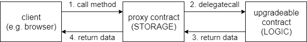

# 以太坊智能合约可升级性:动手操作

> 原文：<https://medium.com/hackernoon/ethereum-smart-contract-upgradeability-hands-on-ceaf98be070f>


就像每一种新材料一样，理解智能合同的可升级性需要花费大量时间。让我们试着缩短这个学习曲线:)

最近有很多关于这个主题的文章和资源发表， [Zeppelin](https://zeppelin.solutions/) 团队( [OpenZeppelin](https://openzeppelin.org/) 和 [zeppelinOS](https://zeppelinos.org/) )真正推动了可升级智能合同的概念。

然而，我感觉在这些讨论中缺少一个简单的例子，这就是我想与你分享的。

我不打算在这里总结或概述可升级性模式。正如我所说，我认为互联网上已经有足够多的惊人资源，无论如何*你都需要花时间学习和研究* ( [这是一个很好的起点](https://blog.zeppelinos.org/proxy-patterns/))。尽管如此，我还是想为你提供一个简单的开始。一个简单的可升级智能合同。

但在此之前，让我们总结一些要点:

1.  [可升级性](https://hackernoon.com/tagged/upgradeability)依赖于[坚固性方法](http://solidity.readthedocs.io/en/v0.4.21/introduction-to-smart-contracts.html#delegatecall-callcode-and-libraries) `delegatecall`。
2.  最基本的解决方案依赖于两个契约。一个 [**代理契约**](https://hackernoon.com/tagged/proxy-contract) (用于存储)，将调用委托给一个**逻辑契约**(逻辑契约可以升级。不是代理)。
3.  `delegatecall`将从接收调用的合同中加载代码。**在调用合同**上完成存储。同样，存储是在调用契约上完成的！因此，代理合同将保持我们的可升级合同的状态。
4.  调用一个不存在的智能合约函数会触发其 [**回退函数**](http://solidity.readthedocs.io/en/v0.4.21/contracts.html#fallback-function) (当然前提是回退函数实现了)。代理契约使用这种机制。

**注意**:在这个例子中，我使用了从 zeppelinos 继承的存储模式。代码改编自他们的[回购](https://github.com/zeppelinos/labs/tree/master/upgradeability_using_inherited_storage)。

# 1.概观

让我们考虑下面的智能合约和这个场景:`TokenVersion1`已经部署，但是突然你意识到它包含一个 bug…太糟糕了。bug 在`mint`函数里。

```
pragma solidity ^0.4.21;

contract TokenVersion1 {
    mapping (address => uint) balances;

    event Transfer(address _from, address _to, uint256 _value);

    function balanceOf(address _address) public view returns (uint) {
        return balances[_address];
    }

    function transfer(address _to, uint256 _value) public {
        require(balances[msg.sender] >= _value);
        balances[msg.sender] -= _value;
        balances[_to] += _value;
        emit Transfer(msg.sender, _to, _value);
    }

    // there is a bug in this function: value should not
    // be multiplied by 2
    function mint(address _to, uint256 _value) public {
        balances[_to] += _value * 2;
        emit Transfer(0x0, _to, _value);
    }
}

contract TokenVersion2 is TokenVersion1 {

    // bug corrected here: multiplication by 2 removed
    function mint(address _to, uint256 _value) public {
        balances[_to] += _value;
        emit Transfer(0x0, _to, _value);
    }
}
```

你不想铸造双倍的权利？(或者也许你做^^).如果您的系统被设计为支持可升级的智能合约，被窃听的合约`TokenVersion1`可以通过部署合约`TokenVersion2`来修复。但是要实现这一点，您需要一个所谓的代理契约，用于将调用委托给您的令牌契约:

```
pragma solidity ^0.4.21;

/**
 * @title Proxy
 * @dev Gives the possibility to delegate any call to a foreign implementation.
 */
contract Proxy {

    address public implementation;

    function upgradeTo(address _address) public {
        implementation = _address;
    }

    /**
    * @dev Fallback function allowing to perform a delegatecall to the given implementation.
    * This function will return whatever the implementation call returns
    */
    function () payable public {
        address _impl = implementation;
        require(_impl != address(0));

        assembly {
            let ptr := mload(0x40)
            calldatacopy(ptr, 0, calldatasize)
            let result := delegatecall(gas, _impl, ptr, calldatasize, 0, 0)
            let size := returndatasize
            returndatacopy(ptr, 0, size)

            switch result
            case 0 { revert(ptr, size) }
            default { return(ptr, size) }
        }
    }
}
```

交易流程如下:



transaction flow

# 2.亲自动手

让我们浏览一下交易流程(上图)以及如何使用可升级性:

1.  你开始部署你的代理合同`Proxy`。
2.  然后部署您的逻辑契约。这就是`TokenVersion1`
3.  您通过调用函数`upgradeTo(address of TokenVersion1)`告诉您的代理契约指向`TokenVersion1`
4.  棘手的部分来了:让我们试着铸造一些代币。但是我们不会直接调用`TokenVersion1`契约上的`mint`函数(我们这样做会绕过代理，破坏可升级性模式)。相反，我们将直接在代理上调用`mint(address, value)`,因为这个函数不存在，它将触发回退函数，向保存在`implementation`变量中的`TokenVersion1`契约的地址触发一个`deletagecall`。
5.  代理契约**将从** `tokenVersion1`加载`mint`函数的代码(感谢 [delegatecall](http://solidity.readthedocs.io/en/v0.4.21/introduction-to-smart-contracts.html#delegatecall-callcode-and-libraries) ) **并执行。执行`mint`函数的`balances`映射和`Transfer`事件，并存储在代理契约中。`TokenVersion1` **不会存储任何数据，也不会触发任何事件**！代理合同有。这也正是你可以升级这个合同的原因:)**
6.  如果成功执行了`mint`函数，通过代理调用`balanceOf(luckyAddress)`将返回正确的余额(乘以 2)。但是，直接调用`balanceOf(luckyAddress)`到`TokenVersion1`契约会返回 0(是零)。记住，`token`合同没有执行任何代码…
7.  此时，您注意到您的`mint`函数有一个 bug :( `luckyAddress`得到了两倍于您预期的金额。因此，您创建了一个从`TokenVersion1`继承([继承存储](https://blog.zeppelinos.org/proxy-patterns/))的`TokenVersion2`契约，并更正了`mint`函数。
8.  然后你部署你的令人敬畏的和无错误的`TokenVersion2`合同。
9.  您通过调用`upgradeTo(address of TokenVersion2)`告诉代理指向这个新合同
10.  瞧啊！:)您的代理现在正在将呼叫委托给新版本的令牌合约。因为状态存储在代理契约中，所以没有数据丢失！(是的`luckyAddress`仍然有来自`tokenVersion1`中 bug 的双倍硬币——状态在你的更新中是持久的，这是重点。)

# 3.密码

您将在我的 github repo 中找到一个完整的工作示例:

[](https://github.com/salanfe/ethereum_contract_upgradeablitiy_simple_example) [## sa lanfe/ether eum _ contract _ upgrade ablity _ simple _ example

### 以太坊 _ contract _ upgradability _ simple _ example-智能合约可升级性机制的死简单例子…

github.com](https://github.com/salanfe/ethereum_contract_upgradeablitiy_simple_example) 

在`/python`文件夹中有一个独立的 **python** 脚本。关于如何运行它，请参见文件头。在坚果壳中启动 ganache 并运行它:)。

如果你更喜欢 **javascript** ，你会在`/test`中找到一个测试文件。同样，说明在它的标题里。

# 4.资源

不要就此打住:)这个“虚拟”例子只是为了让你入门。继承存储是其中的一种模式。该社区已经提出了至少 2 种其他模式:[永久存储](https://blog.zeppelinos.org/smart-contract-upgradeability-using-eternal-storage/)和[非结构化存储](https://blog.zeppelinos.org/upgradeability-using-unstructured-storage/)。这里有一些很棒的资源(排序如下):

1.  [https://blog.zeppelinos.org/proxy-patterns/](https://blog.zeppelinos.org/proxy-patterns/)
2.  [https://github.com/zeppelinos/labs](https://github.com/zeppelinos/labs)
3.  [https://blog . zeppelin . solutions/proxy-libraries-in-solidity-79 FBE 4b 970 FD](https://blog.zeppelin.solutions/proxy-libraries-in-solidity-79fbe4b970fd)
4.  [https://blog . colony . io/writing-upgradable-contracts-in-solidity-6743 f 0 eecc 88](https://blog.colony.io/writing-upgradeable-contracts-in-solidity-6743f0eecc88)
5.  [https://vomtom.at/upgrade-smart-contracts-on-chain/](https://vomtom.at/upgrade-smart-contracts-on-chain/)
6.  [https://medium . com/aigang-network/upgradable-smart-contracts-what-we-ve-learn-at-aigang-b 181d 3d 4b 668](/aigang-network/upgradable-smart-contracts-what-weve-learned-at-aigang-b181d3d4b668)
7.  [https://blog . indorse . io/ether eum-upgradable-smart-contract-strategies-456350d 0557 c](https://blog.indorse.io/ethereum-upgradeable-smart-contract-strategies-456350d0557c)