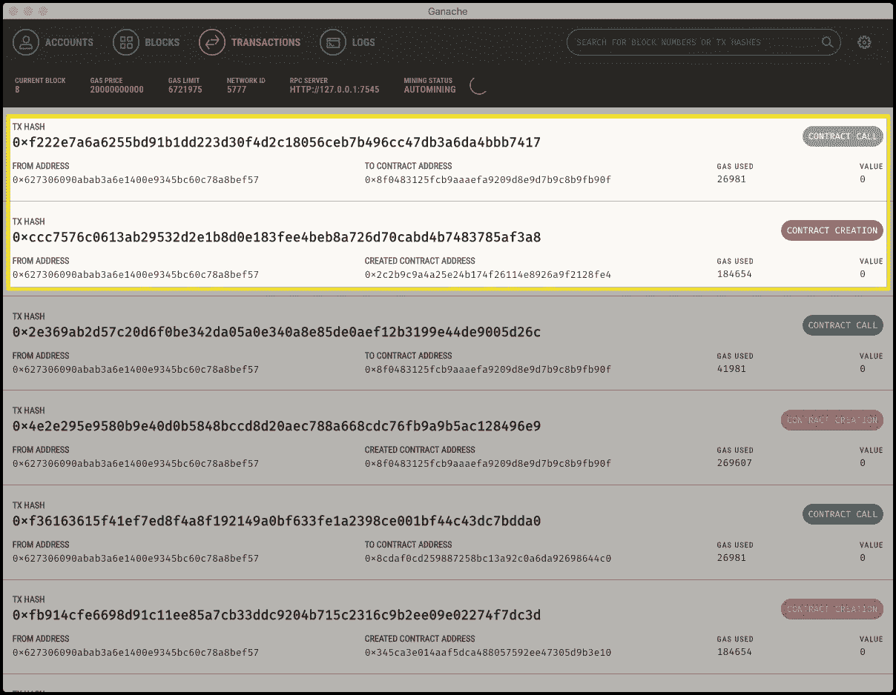

# 初学者以太坊智能合约:从零到端到端 DApp

> 原文：<https://medium.com/hackernoon/ethereum-smart-contracts-from-zero-to-end-to-end-dapp-ebae43cdf859>


48 小时前，我走进 [ETHDenver](https://ethdenver.com/) ，对以太坊智能合约开发几乎一无所知，带着一个端到端的 DApp 离开。

我有很多关于智能合约的问题——它是什么/创建智能合约的过程/标准构建工具/与智能合约交互的方式。我想在这里分享我的一些心得，希望它能对其他想了解这个过程的开发人员有所帮助。

# 在开始之前

确保在您的机器上安装了[节点≥ 8](https://nodejs.org/en/blog/release/v8.0.0/) 。这将使将来编写我们的 async/await 功能更加容易。

如果你愿意跟随完整的代码:[https://github.com/qimingfang/shares-contract](https://github.com/qimingfang/shares-contract)

# 什么是智能合同？

如果你有面向对象的编程背景，可以这样想:

*   智能合同==类
*   当您向公众[区块链](https://hackernoon.com/tagged/blockchain)“部署”智能合约时，您将获得智能合约的一个地址(在区块链)，类似于`new Object()`的返回值是一个地址(在内存中)
*   我们可以编写代码，通过调用方法来与“活”智能合约的特定实例进行交互。读取方法是快速的；写方法需要一段时间，因为我们需要等待下一个块被挖掘。
*   契约可以遵循标准(比如 OO 接口)，比如 ERC-20 标准。遵循该标准的契约必须实现所需的方法。

# 设置松露

[Truffle](https://github.com/trufflesuite/truffle) 是一个开发[以太坊](https://hackernoon.com/tagged/ethereum)智能合约的框架。它提供了一个很好的文件结构布局、测试、控制台、调试和一些工具。

```
npm install -g truffle
```

启动一个新的松露项目简单明了。

```
$ mkdir shares
$ cd shares
$ truffle init
```

您会注意到 truffle 为您设置了 3 个目录:

*   **合同—** 这是智能合同的发展方向。您会注意到已经有了一个`Migrations.sol`文件。这是稍后运行迁移(部署您的智能合同)所必需的。
*   **迁移** —这是您编写迁移的地方。迁移用于部署您的智能合同。
*   **测试** —合同的摩卡风格测试

还有一个 truffle.config 文件。这用于配置环境(使用哪个 RPC 节点)。是的，您可以使用 Truffle 将您的智能合约部署到 mainnet 和 testnet。

# 在 Solidity 中编写智能合同

这里是一个裸骨 *hello world* 风格的智能合约。这是无耻地从 [uport-demo](https://github.com/uport-project/demo/blob/9e030e70bafb363cac720fbc26b97faec941f69a/src/contract/Shares.sol) repo 中摘取的。

contracts/shares.sol

这个契约是对一个`mapping (address => uint)`对象的包装。你可以把 Solidity 中的一个`mapping`想象成一个 Map <地址，Java 中的 Int >，Swift 中的 NSDictionary。

这个契约公开了两个公共方法:一个 getter 和一个 setter。很简单，对吧？

# 测试智能合约

将合同部署到 mainnet / testnet 进行测试不仅很慢，而且它是不可变的，可能会花费您相当多的钱。因此，在开发智能合同时采用 TDD 非常重要。

我们将使用 [chai](http://chaijs.com/) 来测试这个联系，因为 chai 为我们提供了很多很好的语法来断言事物是相等的。我们可以利用可读性更好的 hamcrest 风格`a.should.be.equal(b)`，而不是直接从 node.js 导入`assert`，并断言与 junit 风格`assert.equal(a, b)`相等。

首先，让我们安装一些依赖项

```
$ npm init
$ npm install --save-dev --save-exact chai chai-as-promised chai-bignumber
```

然后我们创建两个测试

*   测试合同创建是否正确
*   测试 updateShares 和 getShares 是否按预期工作

test/shares.test.js

运行`truffle test`以确保您看到测试通过。

# 部署到当地区块链

智能合同已经编写并经过测试。我们对其业务逻辑和正确性充满信心。现在是时候将它部署到本地区块链上进行测试了。

首先，让我们用 [ganache](http://truffleframework.com/ganache/) 设置一个本地区块链(下载并安装)。Ganache 预装了 10 个测试帐户(每个帐户有 100 个 ETH)。还要注意 RPC 服务器 URL。我们很快就会需要它。


Ganache

接下来，我们需要创建一个迁移

migrations/2_deploy_contracts.js

最后，我们需要将 ganache 添加到我们的块菌配置中。`port`应该对应来自 ganache 的端口号。

truffle.js

准备好将合同部署到您的加纳切当地区块链了吗？

```
$ truffle migrate --network development
```

您应该开始看到合同出现在`Transactions`选项卡下。



Ganache showing contract deployment

# 部署到 Rinkeby 测试网上

当您可以将合同部署到公共区块链时，它们会更有用。为了连接到一个测试网，我们需要运行另一个指向以太坊测试网的 RPC 客户端(我们将使用 Rinkeby，但是还有一些测试网可用)。

首先，你需要[和](https://github.com/ethereum/go-ethereum/wiki/Installation-Instructions-for-Mac)。

接下来，您需要使用 geth 创建一些 Rinkeby 帐户

```
geth --rinkeby account new
```

列出您的 Rinkeby geth 帐户，以确保您能够创建一个帐户。

```
geth --rinkeby account list
```

一旦完成，你将需要一些测试。你可以按照这个水龙头上的说明，去找 ETH 做一些测试。

一旦交易被确认，您应该能够在 rinkeby etherscan UI 上看到它。

```
[https://rinkeby.etherscan.io/address/](https://rinkeby.etherscan.io/address/)<your address here>
```

要在 Rinkeby 上部署契约，您需要启动 geth 并将其指向 rinkeby 网络。你需要打开你刚刚创建的钱包(用水龙头里的 ETH ),这样松露就可以和它互动了。

```
./build/bin/geth --rinkeby --rpc --rpcapi db,eth,net,web3,personal --unlock="<your address here>"
```

例如，对我来说，它看起来像这样

```
./build/bin/geth --rinkeby --rpc --rpcapi db,eth,net,web3,personal --unlock="0xcfd31d9ffb5bc1b1f4b7af99cd4792f2b11da185"
```

你需要等待 geth 在网络上同步块。在同步的同时，让我们为 Rinkeby 设置另一个松露环境。

确保将`from`字段替换为您帐户的公钥。气体的选择有点武断。只要选择一个足够高的数字，不超过块气体限制。

truffle.js

这里是你如何找出什么是块气体极限


您的 geth 可能仍在同步。与此同时，我们可以看看松露控制台，并获得对 web3 的介绍。

web3 是一个 js 库(通常嵌入 HTML 的客户端),用于与智能合约接口。

```
$ truffle console --network rinkeby
$ truffle(rinkeby)> truffle(rinkeby)> web3.eth.getBlock('latest')
```

在这里，您将看到 geth 客户端报告的最新块。它有很多我们听说过的内容，比如 gasLimit、nonce(用于挖掘)、括号(用于形成链)等。很棒的东西。

点击这里，你可以在 web3 [上找到更多文档。](https://github.com/ethereum/wiki/wiki/JavaScript-API)

# 等待 geth 同步

…缓冲…

# Geth 完成同步—部署！🎉

好了，是时候在 Rinkeby 上运行迁移了！

```
$ truffle migrate --network rinkeby
```

随着契约的部署，您会注意到在幕后，它实际上在 Rinkeby testnet 上生成契约创建事务。


当您运行迁移时，您应该在 terminal 中看到一个契约地址，它指向我们的 shares 契约实例。您也可以在 [etherscan](https://rinkeby.etherscan.io/address/0xa8cfeebf26c6a04483b047aeff7b9da99d9d31ff#code) 上查看这份合同。


# Web3.js —前端

既然我们的合同已经部署，我们现在可以使用一个简单的 web DApp 与它进行交互:

1.  在中包含 web3.js 脚本
2.  用本地 geth 实例化 web3 实例
3.  用 abi 文件实例化契约(这是编译契约时出现的接口文件。您可以通过查看`/build/contracts/shares.json`中编译的 json 来找到这一点
4.  使用(3)中的接口找到特定的已部署契约
5.  相应地调用契约接口的函数

每次你点击购买按钮，交易的 url 将被发送到控制台。您可以点击网址观看您的交易完成。完成后，您可以刷新页面，并看到共享数量增加。

此处完成代码:【https://github.com/qimingfang/shares-contract 

# 结论/学习

在我看来，尽管被广泛采用，但是在 solidity 开发空间中仍然缺少很多工具。我注意到的一些(技术性和非技术性的)事情:

1.  调试很困难— `truffle debug`对我来说并不奏效。
2.  除了通过`truffle console`之外，在本地测试网上测试合同并不容易。这类似于通过进入 node 而不是使用 Postman 或其他 HTTP 客户端来测试 node.js 应用程序。
3.  没有简单的方法来保证你的合同是正确的。您可以编写测试并测试每一条代码路径，但这在开发领域很少发生。用契约界面测试 web 用户界面更加棘手。现在的标准是使用审计过的合同作为基础。Open-Zeppelin 的设置非常简单。
4.  除了坚固性，还有各种其他的[框架](https://github.com/iurimatias/embark-framework/)(和[语言](https://github.com/ethereum/vyper))可供选择。这进一步增加了风险；你不仅要编写正确的智能契约，框架还要将它们正确地编译成以太坊字节码。
5.  合同是不可改变的。关于如何升级这些合同，我从专家那里得到了各种各样的意见。[代理](https://blog.zeppelin.solutions/proxy-libraries-in-solidity-79fbe4b970fd)似乎是现在做这件事的标准方式，它需要和开发合同本身一样多的审计/严格性。想象一下每次部署 rest-api 服务器时都要进行完整的代码审计。那太疯狂了！
6.  目前，许多工作都是在协议层面上完成的。我不认为这是巧合。由于其他协议将建立在基础协议之上，目前协议正在产生巨大的网络效应。在区块链工作的一个很酷的事情是，没有人知道基于*正确*协议的激励模型(通货膨胀、参与等)，这将导致巨大的网络效应。当然，如果你最终为一个杀手级用例构建了一个杀手级应用，你可能会回头为这个杀手级应用定义一个协议。