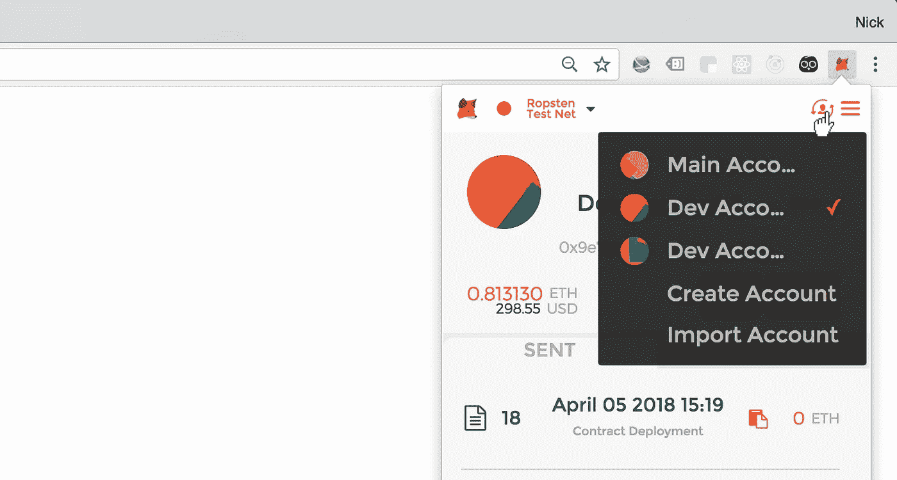

# Python 中的以太坊智能合约:综合(ish)指南

> 原文：<https://medium.com/hackernoon/ethereum-smart-contracts-in-python-a-comprehensive-ish-guide-771b03990988>


在以太坊上获得一个基本的智能合约是一回事——只需谷歌“ERC20 令牌教程”你就会找到大量关于如何做的信息。以编程方式与契约交互完全是另一回事，如果你是 Python 程序员，那么教程就很少。


One, by my count, and it’s soooo 2017.

对我们来说幸运的是，Web3.py 的第 4 版刚刚发布，这意味着现在运行 python 脚本并观察区块链上发生的神奇事情比以往任何时候都更容易。*阴森森的。*

大声喊出[派珀·梅里亚姆](https://medium.com/u/8bb8b999b3b8?source=post_page-----771b03990988--------------------------------)、[杰森·卡弗](https://medium.com/u/d9a8ea9bbef6?source=post_page-----771b03990988--------------------------------)和所有其他在 Web3.py 上努力工作让我们其他人的生活变得轻松的人——在 [Sempo](https://sempo.ai) 上，我们正在使用以太坊让灾难响应更加透明，多亏了 Web3.py，这才真正成为可能

# 正在设置

首先，我们进行设置，确保安装了相关的 python 库等等。

## Python 库无处不在，但它们有什么用呢？

有很多与以太坊相关的 python 库，但是当人们谈论以太坊时，有两个出现得很多: *Web3.py* 和 *Pyethereum* 。乍一看，您应该使用哪一个来做什么并不明显。

**肾盂**

以太坊虚拟机(EVM)的 Python 实现。反过来，EVM 是以太坊协议的一部分，它实际运行智能合约中的代码，并确定它们的输出。因此，如果您想在 Python 中运行以太坊节点，Pyethereum 是一个不错的起点。

即使你非常乐意在不运行自己的节点的情况下运行智能合约，Pyethereum 仍然是一个很好的库——它包含了许多有用的功能，比如根据用户的私钥计算用户的地址等等。

**Web3.py**

一个用于实际与以太坊区块链交互的库。我们正在谈论的事情包括在账户之间转移以太网、发布智能合约以及触发现有智能合约附带的功能。它的灵感来自流行的 javascript 库 Web3.js，它将是我们在本教程中使用的主要库。

## 好了，少说多做！

起初我尝试使用 Python 3.5 版本，但是在运行时我遇到了问题，显然是由 Python 的类型暗示引起的。基于 Python 3.6 创建一个[虚拟环境](https://docs.python.org/3/tutorial/venv.html)解决了这个问题，所以我建议也这么做。

继续 pip-install [web3](https://pypi.python.org/pypi/web3/4.0.0) (确保你得到版本 4)。

除非你喜欢为了花钱而花钱，否则你需要在以太坊测试网上放一个钱包，比如 Ropsten，里面有很多以太可以玩。一个简单的方法是下载 Chrome 的 [Metamask](https://metamask.io/) 扩展，并在那里创建一个新账户。



Make sure you also select the ‘Ropsten Test Net’ on the left

即使你已经有一个装有乙醚的钱包，我也强烈建议你为开发目的创建一个新的。我们将要用私钥做一些相对鲁莽的事情，所以如果它们意外地变成了公钥(公私钥？)

为你新创建的钱包获取测试乙醚很容易:只需进入[水龙头。metamask.io](https://faucet.metamask.io/) 并点击“从水龙头请求 1 乙醚”。这对我们将要做的事情来说应该足够了。

最后，因为我们将在没有托管我们自己的节点的情况下使用 Ropsten TestNet，所以我们需要一个可以连接区块链的提供商。Infura.io 在这方面做得很好，所以去那里创建一个免费账户吧。记下 Ropsten TestNet 的提供者 url(类似于 https://Ropsten . in fura . io/Fe 2g fedc m3 tfed 3)。

# 部署智能合同

在不运行自己的节点的情况下使用 Python 来部署智能合约是相当困难的，因此我们将在这一步作弊。对于许多智能契约用例，你只需要做一次。

正如我前面提到的，关于如何部署 ERC20 合同有上百万个指南，所以我们将部署一个稍微不同的(并且方便地更短)。

**问:**谁喜欢在网上分享自己的观点？

*大家？*

回答得好。下面这个被我命名为“肥皂盒”的智能合约允许任何人向区块链广播任何他们想要的观点，在那里它将永远可见(给予或接受)。

不过有一个条件:只有支付了必要的 0.02 以太费的地址才能广播他们的观点。听起来不太公平，但事实就是如此。

[Remix](https://remix.ethereum.org/) ，以太坊的在线代码编辑器很优秀，所以在那边新建一个文件，粘贴下面的代码。是用 Solidity(智能合约的编程语言)写的。如果代码没有太多意义也没关系——我们稍后将更详细地讨论相关部分，但归根结底这是一个 *Python* 教程。

```
pragma solidity ^0.4.0;
contract SoapBox {// Our 'dict' of addresses that are approved to share opinions
    mapping (address => bool) approvedSoapboxer;
    string opinion;

    // Our event to announce an opinion on the blockchain
    event OpinionBroadcast(address _soapboxer, string _opinion);// This is a constructor function, so its name has to match the contract
    function SoapBox() public {
    }

    // Because this function is 'payable' it will be called when ether is sent to the contract address.
    function() public payable{
        // msg is a special variable that contains information about the transaction
        if (msg.value > 20000000000000000) {  
            //if the value sent greater than 0.02 ether (in Wei)
            // then add the sender's address to approvedSoapboxer 
            approvedSoapboxer[msg.sender] =  true;
        }
    }

    // Our read-only function that checks whether the specified address is approved to post opinions.
    function isApproved(address _soapboxer) public view returns (bool approved) {
        return approvedSoapboxer[_soapboxer];
    } 

    // Read-only function that returns the current opinion
    function getCurrentOpinion() public view returns(string) {
        return opinion;
    }//Our function that modifies the state on the blockchain
    function broadcastOpinion(string _opinion) public returns (bool success) { // Looking up the address of the sender will return false if the sender isn't approved
        if (approvedSoapboxer[msg.sender]) {

            opinion = _opinion;
            emit OpinionBroadcast(msg.sender, opinion);
            return true;

        } else {
            return false;
        }

    }}
```

这就是 Metamask 变得非常有用的地方:如果你点击 remix 窗口右上角的“运行”标签，并在“环境”下拉菜单下选择“注入的 Web3”,“帐户”下拉菜单应该会填充你之前在 MetaMask 中创建的帐户的地址。如果没有，就刷新浏览器。


接下来点击“创建”。Metamask 将弹出一个窗口，要求您确认交易。如果没有，只需打开元掩码扩展并在那里执行:


您将在 Remix 控制台的底部收到一条消息，让您知道合同的创建正在进行中。点击链接查看其在 Etherscan 上的状态。如果您刷新并且“至”字段中填充了合同地址，则合同已成功部署。

一旦你记下了合同地址，我们就该开始通过 Web3.py 与合同互动了

在我看来，你可以用四种半方式与以太坊智能合约互动。最后两个(半个)经常被混为一谈，但是区别是很重要的。我们已经看到了第一个——在区块链上部署智能合约。现在我们将讨论 python 的其余部分:

*   **向合同发送以太:**自解释真— 从钱包向智能合同的地址发送以太。希望能换来一些有用的东西
*   **调用函数:**执行智能合约的只读函数，获取一些信息(如地址余额)
*   **使用函数进行交易:**执行智能合约的函数，该函数对区块链的状态进行更改。
*   **查看事件:**查看因之前与函数的交易而发布到区块链上的信息。

# **发送以太合同**

一些(但不是全部)智能合约包含“可支付”功能。如果您将以太网发送到合同地址，将触发这些功能。这方面的一个经典用例是 ICO:向一个合同发送以太，然后返回您将获得的令牌。

首先，我们将从导入开始，创建一个新的 web3 对象，它通过 Infura.io 连接到 Ropsten TestNet。

```
**import** time
**from** web3 **import** Web3, HTTPProvider

contract_address     = [YOUR CONTRACT ADDRESS]wallet_private_key   = [YOUR TEST WALLET PRIVATE KEY]wallet_address       = [YOUR WALLET ADDRESS]w3 = Web3(HTTPProvider([YOUR INFURA URL]))

w3.eth.enable_unaudited_features()
```

您可以在 Metamask 中您的帐户名称旁边的菜单中找到您的钱包私钥。因为我们使用的 Web3.py 的一些特性还没有经过完全的安全性审计，所以我们需要调用*w3 . eth . enable _ unaudited _ features()*来确认我们已经意识到可能会发生不好的事情*。我告诉过你我们正在用私钥做一些冒险的事情！*

现在，我们将编写一个函数，将我们钱包中的以太网发送到合同:

```
**def** send_ether_to_contract(amount_in_ether):

    amount_in_wei = w3.toWei(amount_in_ether,**'ether'**);

    nonce = w3.eth.getTransactionCount(wallet_address)

    txn_dict = {
            **'to'**: contract_address,
            **'value'**: amount_in_wei,
            **'gas'**: 2000000,
            **'gasPrice'**: w3.toWei(**'40'**, **'gwei'**),
            **'nonce'**: nonce,
            **'chainId'**: 3
    }

    signed_txn = w3.eth.account.signTransaction(txn_dict, wallet_private_key)

    txn_hash = w3.eth.sendRawTransaction(signed_txn.rawTransaction)

    txn_receipt = **None** count = 0
    **while** txn_receipt **is None and** (count < 30):

        txn_receipt = w3.eth.getTransactionReceipt(txn_hash)

        print(txn_receipt)

        time.sleep(10)

    **if** txn_receipt **is None**:
        **return** {**'status'**: **'failed'**, **'error'**: **'timeout'**}

    **return** {**'status'**: **'added'**, **'txn_receipt'**: txn_receipt}
```

首先让我们看一下事务字典 *txn_dict* —它包含了定义我们发送给智能契约的事务所需的大部分信息。

*   **到**:我们发送以太网的目的地(在本例中是智能合约)
*   **Value:** 我们在魏送多少
*   **Gas:** Gas 是对以太坊上执行一个交易所花费的计算量的一种度量。在这种情况下，我们指定了执行该事务所需的气体量的上限。*
*   **汽油价格:**每单位汽油我们愿意付多少钱(单位:魏)。
*   这是一个地址随机数，而不是通常所说的工作证明。它只是对发送地址之前进行了多少次交易的计数，用于防止重复消费。
*   **链 ID:** 每个以太坊网络都有自己的链 ID——主网的 ID 是 1，而 Ropsten 的是 3。你可以在这里找到一个更长的列表。

**关于汽油限制的快速说明:有一些函数允许您估计一个交易将使用多少汽油。然而，我发现选择限额的最好方法是，在你宁愿交易失败之前，计算出你愿意支付多少，然后继续。*

一旦我们定义了交易的重要部分，我们将使用钱包的私钥来签名。然后它准备好被发送到网络，我们将用 *sendRawTransaction* 方法来完成。

我们的事务实际上不会完成，直到一个矿工决定将它包括在一个区块中。一般而言，您为每单位天然气支付的价格(请记住我们的天然气价格参数)决定了节点决定将您的交易包括在一个块中的速度(如果有的话)。


[https://ethgasstation.info/](https://ethgasstation.info/) is good place to work out how long you’ll be waiting for your transaction to be included in a block.

这种时间延迟意味着事务是异步的。当我们调用 *sendRawTransaction 时，*我们会立即得到事务的惟一散列。您可以在任何时候使用这个散列来查询您的事务是否已经包含在一个块中。当且仅当我们能够获得交易收据时，我们才知道交易已经被添加到区块链中(因为所有好的购买都有收据，对吗？).这就是为什么我们创建循环来定期检查我们是否有收据:

```
 txn_receipt = **None** count = 0 **while** txn_receipt **is None and** (count < 30):

        txn_receipt = w3.eth.getTransactionReceipt(txn_hash)

        print(txn_receipt)

        time.sleep(10)
```

值得注意的是，可以将一个事务添加到区块链中，但仍然会因为许多原因而失败，比如没有足够的汽油。

这就是将以太发送到契约的 Python 代码。让我们快速回顾一下我们在 Solidity 中编写的应付款函数:

```
function() public payable{
        if (msg.value >= 20000000000000000) {  
            approvedSoapboxer[msg.sender] =  true;
        }
    }
```

*Msg* 是智能合约中的一个特殊变量，包含发送到智能合约的交易信息。在本例中，我们使用的是 *msg.value* ，它给出了事务中发送的乙醚量(单位为 Wei，而不是原始乙醚)。同样， *msg.sender* 给出进行交易的钱包的地址——如果已经发送了足够的以太网，我们将把它添加到批准帐户的字典中。

继续安润的*发送以太合同*功能。希望你能拿回收据。你也可以通过在以太网扫描的 Ropsten 网络部分查找你的钱包地址来检查交易是否成功。在下一节中，我们将能够获得更多关于 Python 的信息。

# **调用函数**

我们刚刚向我们的智能合约发送了一些以太网，因此我们有必要检查我们的钱包地址现在是否已被批准共享意见。为此，我们在智能合约中定义了以下功能:

```
function isApproved(address _soapboxer) public view returns (bool approved) {
        return approvedSoapboxer[_soapboxer];
    }
```

与 python 相比，围绕这个函数有很多额外的东西，比如声明类型(*地址*和*布尔值* ) *。*这个函数的核心只是获取一个地址( *_soapboxer* 参数)，在实际上(但不完全)是哈希表/python 字典中查找相应的批准布尔值，并返回该值。

当你调用一个智能合约函数时，以太坊节点会计算出结果，并返回给你。这里事情变得有点复杂:调用是*只读的，*意味着它们不对区块链做任何改变。如果上面的函数包含一行代码来记录地址被检查批准的次数:

```
approvedCheckedCount[_soapboxer] = approvedCheckedCount[_soapboxer] + 1
```

然后，当调用该函数时，节点将计算新的值 *approvedCheckedCount，*，但是一旦返回结果，就将其丢弃。

作为只读的交换，函数调用不会花费你任何运行成本，所以你可以愉快地检查一个帐户是否被批准，而不用担心成本。

让我们跳回到 python 文件的顶部，添加更多的设置代码。

```
**import** contract_abicontract = w3.eth.contract(address = contract_address, abi = contract_abi.abi)
```

您需要创建另一个名为 contract_abi 的 python 文件。这将包含一大串 JSON 信息，Python 需要这些信息与我们在智能契约中定义的函数进行交互，称为应用程序二进制接口(ABI)。您可以在 Remix 中找到智能合约的 ABI JSON 字符串:

*   点击“编译”选项卡
*   点击“详细信息”——应该会出现一个包含大量信息的模式
*   向下滚动到 ABI 部分，然后单击“复制到剪贴板”图标。

将复制的字符串粘贴到“contract_abi.py”文件中，该文件应如下所示:

```
abi = """[
 {
   A BIG LIST OF ABI INFO SPREAD ACROSS MULTIPLE DICTS
 }
]"""
```

我们添加到主 python 文件中的另一行现在接受这个 ABI JSON 字符串，并使用它来设置一个*契约*对象。如果您研究*契约*，您会注意到它包含一个*函数*属性，该属性包含我们在智能契约中创建的三个函数。

现在我们将创建一个 python 函数，**调用智能合约的 *isApproved* 函数来检查指定地址是否被批准共享意见。**

```
**def** check_whether_address_is_approved(address): **return** contract.functions.isApproved(address).call()
```

嗯，这是短暂的。

你现在可以用它来检查你的钱包地址是否被批准。如果您之前运行了 *send_ether_to_contract* 函数并发送了足够量的乙醚，希望您会返回“true”。

# **使用功能进行交易**

我们正在进行智能合约的最后一个主要交互——传播观点。让我们再一次回顾我们的可靠性代码:

```
function broadcastOpinion(string _opinion) public returns (bool success) {
        if (approvedSoapboxer[msg.sender]) { 

            opinion = _opinion;
            emit OpinionBroadcast(msg.sender, opinion);
            return true; } else {
            return false;
        }
    }
```

这里没有什么太新的东西:我们接受传入的 *_opinion* 参数，并使用它来设置全局变量 *opinion。*(如果需要，可以通过 getter 函数查询)。有一行有点不同:

```
emit OpinionBroadcast(msg.sender, opinion)
```

我们很快会谈到这一点。
当您通过交易与智能合约的功能进行交互时，该功能对智能合约状态所做的任何更改都会在区块链上发布。作为这一特权的交换，你必须向矿工支付一些(希望很少)乙醚。Python 时间:

```
**def** broadcast_an_opinion(covfefe):

    nonce = w3.eth.getTransactionCount(wallet_address)

    txn_dict = contract.functions.broadcastOpinion(covfefe).buildTransaction({
        **'chainId'**: 3,
        **'gas'**: 140000,
        **'gasPrice'**: w3.toWei(**'40'**, **'gwei'**),
        **'nonce'**: nonce,
    })

    signed_txn = w3.eth.account.signTransaction(txn_dict, private_key=wallet_private_key)

    result = w3.eth.sendRawTransaction(signed_txn.rawTransaction)

    tx_receipt = w3.eth.getTransactionReceipt(result)

    count = 0
    **while** tx_receipt **is None and** (count < 30):

        time.sleep(10)

        tx_receipt = w3.eth.getTransactionReceipt(result)

        print(tx_receipt)

    **if** tx_receipt **is None**:
        **return** {**'status'**: **'failed'**, **'error'**: **'timeout'**}

    processed_receipt = contract.events.OpinionBroadcast().processReceipt(tx_receipt)

    print(processed_receipt)

    output = **"Address {} broadcasted the opinion: {}"**\
        .format(processed_receipt[0].args._soapboxer, processed_receipt[0].args._opinion)
    print(output)

    **return** {**'status'**: **'added'**, **'processed_receipt'**: processed_receipt}
```

这实际上与向智能合约发送以太网时使用的过程相同。我们将创建并签署一个交易，然后将其发送到网络。同样，事务是异步的，这意味着不管 Solidity 代码中告诉函数返回什么，您实际得到的总是事务的散列。

考虑到事务本身不会返回任何有用的信息，我们需要一些别的东西。这就把我们带到了与智能合约交互的最后(一半)方法。

**事件**

我将事件称为与智能合约交互的“半”方式，因为从技术上讲，它们是由事务发出的。事件是智能合约以一种易于阅读的形式在区块链上记录事情的方式，它们基本上只是一组值，可以使用特定交易的收据来查找。我们在智能合约的顶部定义了一个:

```
event OpinionBroadcast(address _soapboxer, string _opinion);
```

然后，当我们使用 *broadcastOpinion* 函数时，我们用它向区块链发送信息。

将事务添加到块中后，可以使用事务哈希查询区块链，以获取由 OpinionBroadcast 事件发出的特定值。这是函数 *broadcast_an_opinion 中 python 代码的最后一部分。*您会注意到，我们要求事件发出的信息存储在‘args’属性中。

这个事件是非常公开的。事实上，任何人都可以很容易地使用 Etherscan 或类似工具来查看您的智能合约发出的所有事件的日志。


Etherscan automatically detects ‘Transfer’ events a lists them all. Nifty

如果你做到了这一步，你就赢得了发表意见的权利。继续运行 *broadcast_an_opinion* 和你选择的意见。

如果一切运行顺利，您应该很快就会收到一张经过处理的收据，以及一份已经放在区块链上的 OpinionBroadcast 事件的打印件。

很好。

以下是完整的 python 代码:

```
**import** time
**from** web3 **import** Web3, HTTPProvider

contract_address     = [YOUR CONTRACT ADDRESS]wallet_private_key   = [YOUR TEST WALLET PRIVATE KEY]wallet_address       = [YOUR WALLET ADDRESS]w3 = Web3(HTTPProvider([YOUR INFURA URL]))

w3.eth.enable_unaudited_features()

contract = w3.eth.contract(address = contract_address, abi = contract_abi.abi)

**def** send_ether_to_contract(amount_in_ether):

    amount_in_wei = w3.toWei(amount_in_ether,**'ether'**);

    nonce = w3.eth.getTransactionCount(wallet_address)

    txn_dict = {
            **'to'**: contract_address,
            **'value'**: amount_in_wei,
            **'gas'**: 2000000,
            **'gasPrice'**: w3.toWei(**'40'**, **'gwei'**),
            **'nonce'**: nonce,
            **'chainId'**: 3
    }

    signed_txn = w3.eth.account.signTransaction(txn_dict, wallet_private_key)

    txn_hash = w3.eth.sendRawTransaction(signed_txn.rawTransaction)

    txn_receipt = **None** count = 0
    **while** txn_receipt **is None and** (count < 30):

        txn_receipt = w3.eth.getTransactionReceipt(txn_hash)

        print(txn_receipt)

        time.sleep(10)

    **if** txn_receipt **is None**:
        **return** {**'status'**: **'failed'**, **'error'**: **'timeout'**}

    **return** {**'status'**: **'added'**, **'txn_receipt'**: txn_receipt}

**def** check_whether_address_is_approved(address):

    **return** contract.functions.isApproved(address).call()

**def** broadcast_an_opinion(covfefe):

    nonce = w3.eth.getTransactionCount(wallet_address)

    txn_dict = contract.functions.broadcastOpinion(covfefe).buildTransaction({
        **'chainId'**: 3,
        **'gas'**: 140000,
        **'gasPrice'**: w3.toWei(**'40'**, **'gwei'**),
        **'nonce'**: nonce,
    })

    signed_txn = w3.eth.account.signTransaction(txn_dict, private_key=wallet_private_key)

    result = w3.eth.sendRawTransaction(signed_txn.rawTransaction)

    tx_receipt = w3.eth.getTransactionReceipt(result)

    count = 0
    **while** tx_receipt **is None and** (count < 30):

        time.sleep(10)

        tx_receipt = w3.eth.getTransactionReceipt(result)

        print(tx_receipt)

    **if** tx_receipt **is None**:
        **return** {**'status'**: **'failed'**, **'error'**: **'timeout'**}

    processed_receipt = contract.events.OpinionBroadcast().processReceipt(tx_receipt)

    print(processed_receipt)

    output = **"Address {} broadcasted the opinion: {}"**\
        .format(processed_receipt[0].args._soapboxer, processed_receipt[0].args._opinion)
    print(output)

    **return** {**'status'**: **'added'**, **'processed_receipt'**: processed_receipt}

**if** __name__ == **"__main__"**:

    send_ether_to_contract(0.03)

    is_approved = check_whether_address_is_approved(wallet_address)

    print(is_approved)

    broadcast_an_opinion(**'Despite the Constant Negative Press'**)
```

# 包扎

这样就差不多了。正如我提到的，我们还没有达到使用 python 实际部署智能合约的地步，但其他一切都在那里。在 [Sempo](https://sempo.ai) ，我们正在使用我上面提到的所有技术来使灾难响应更加透明。

如果你有任何想法或建议，请在评论中留下，我会尽快回复你！

编辑:感谢 [Sebastian Dirman](https://medium.com/u/6771b8406a1c?source=post_page-----771b03990988--------------------------------) 指出 w3.toWei(value，' ether ')是一种在 ether 和 Wei 之间转换的更好的方法——简单地将你在 Ether 中的数量乘以 1000000000000000 会导致类型错误！

