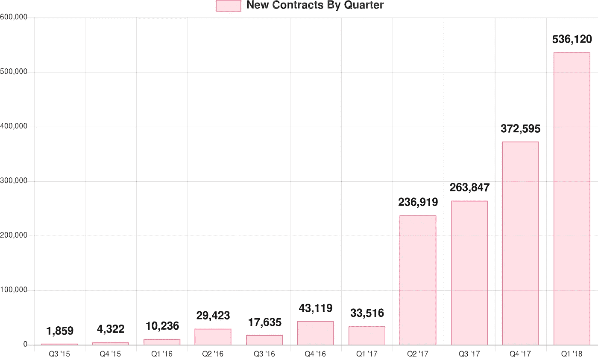
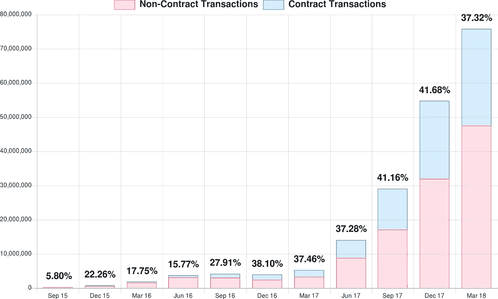
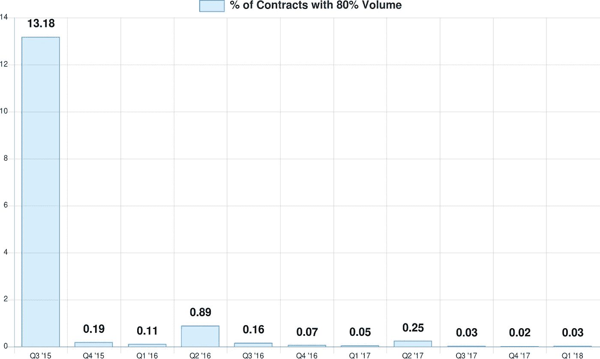
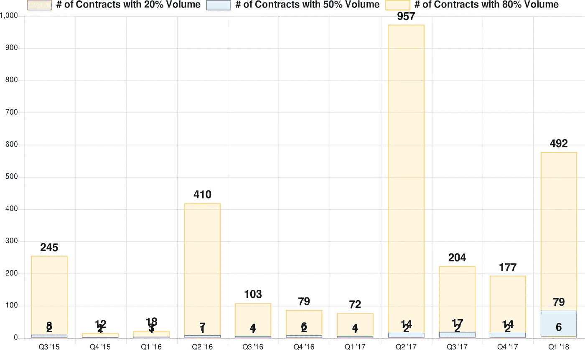
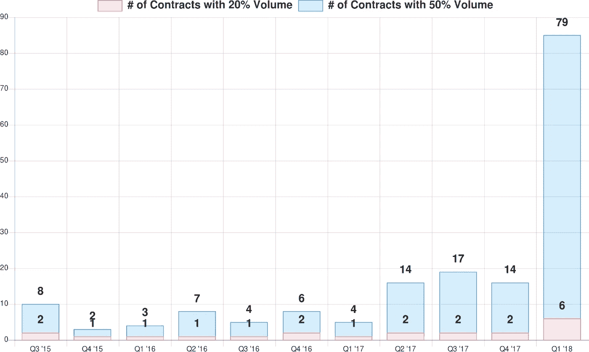

# 以太坊智能合约:大部分很少用！

> 原文：<https://medium.com/hackernoon/ethereum-smart-contracts-most-of-them-are-rarely-used-f45749730d3e>

以太坊风格的智能合同被普遍认为是区块链技术的未来。由于以太坊已经运行了近 3 年，其数据是公开的，我决定查看原始数据，看看可以收集到哪些关于智能合约使用的见解。

我发现的衡量标准很有趣，当你从高层次看事情时，它们看起来很好，但当你深入挖掘时，数字变得非常扭曲。大多数智能合约似乎很少被使用——94%的智能合约被调用的次数少于 10 次。

让我们从基础开始。这张图表显示了每个季度新签订的智能合同的数量。

尽管以太网价格的上涨增加了创建新智能合同的成本，但智能合同的创建速度实际上是在增加的，因此显然开发人员社区对此很感兴趣。

智能合约交易与常规以太网支付的比例如何？这是一个堆积图，显示了一段时间内的比率。条形图上的数字给出了每个季度调用智能合约的交易数量占总交易数量的百分比。

我原本预计这一比例会继续上升，但现在保持在 40%左右的健康水平。

但是当你挖掘得更深时，它会变得更加迷人。

我想看看交易量是如何在智能合约中分布的。我期待 80/20 规则的一些变化，即 20%的智能合同占交易量的 80%。但事情远不止如此。

如你所见，当试图做比较时，百分比是没有意义的，因为它们太低了。

这里有一个图表，显示了占智能合约交易 20%、50%和 80%的合约的**数量(而不是百分比】**。

深入研究智能合约的数量，它们分别占智能合约交易量的 20%和 50%。

你可以看到事情是多么扭曲，大多数时候只有 1 或 2 份合同占交易量的 20%，除了最后一个季度，不到 20 份合同占交易量的 50%。

这让我想知道大多数合同的数量。以下是从 2015 年第三季度到 2018 年 Q1 的一些有趣的统计数据。

**94%的**合约被叫牌**次数少于 10 次**

5%的合约被叫价 10 到 100 次

所以只有 1%的智能合约被调用超过 100 次。看起来大多数智能合同实际上只是人们在尝试。

这些数字没有正确涵盖智能合约的一个方面。在以太坊中，你可以用相同的代码创建数以千计的智能合约，虽然它们在概念上是相关的，但在以太坊中，它们被视为具有不同合约地址的不同智能合约。

我正致力于重复上述分析，将每段不同的代码视为一个单独的契约，也许这样交易的数量会分布得更均匀。

我计划在后续文章中追踪一些其他数据点。

1.  有哪些顶级合同？
2.  除了交易所和 ico 之外还有什么合约的交易量很大吗？
3.  当我们在 Y 轴上绘制发送给一个合同的乙醚总量而不是该合同的交易数量时，事情看起来如何？

想法？

# **关于数据**

我启动了一个 geth 节点，等待它完全同步，然后使用一些定制的 geth 代码，转储事务。每个事务的时间被假定为包含该事务的块的处理时间。