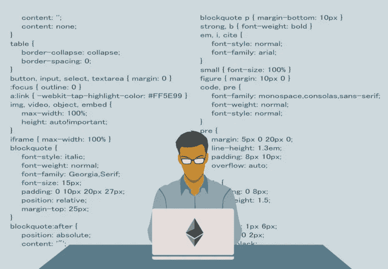
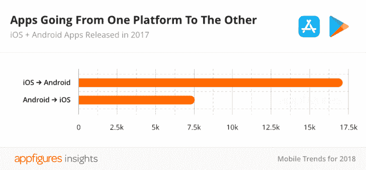

# 以太坊将主导 DApp 市场，因为它的开发者

> 原文：<https://medium.com/hackernoon/ethereum-will-dominate-the-dapp-market-because-of-its-developers-2deb812226>

Photo Credit: MIMIR Blockchain Solutions; Mustafa Inamullah

技术领域成功的最佳指标是支持它的技术专家的数量和质量。在软件领域，这意味着拥有最多和最好的开发人员的项目几乎总能胜出。

[区块链](https://hackernoon.com/tagged/blockchain)开发作为一种技能正在迅速普及。在过去的一年里，它增长了 [6000%](https://www.computerworld.com/article/3235972/it-careers/blockchain-moves-into-top-spot-for-hottest-job-skills.html) ,现在是流行的自由职业网站上增长最快的技能，比如 Upwork。但是这些开发者中有多少专注于以太坊呢？ConsenSys 给了我们两个独特的见解，让我们了解区块链开发者是如何不成比例地关注以太坊的。他们估计“开发者社区”有 25 万人。虽然这个数字看起来相当大，但它伴随着[一些支持数字](https://media.consensys.net/the-state-of-the-ethereum-network-949332cb6895)。Truffle 有近 550，000 次下载，Github 上有 14，000 个存储库和 220，000 次关于以太坊的提交，MetaMask 现在有超过 100 万用户。虽然可能有也可能没有 25 万以太坊开发者，但我们可以使用这些统计数据来验证 ConsenSys 的 Andrew Keys 的另一个说法。他声称以太坊拥有“比下一个区块链社区多 30 倍的开发者”

这些压倒性的数字显示了以太坊开发社区的发展是多么令人印象深刻。根据加密货币研究人员 Kevin Rooke 的说法，区块链 100 大项目[中有 94 个是在以太坊网络上启动的，这是有道理的。](https://www.ccn.com/94-out-of-top-100-blockchain-projects-are-built-on-ethereum/)

历史会证明，拥有最多最好的开发者的人会赢，但我们不需要太过回到过去。如果以太坊拥有最多最好的开发者，我们可以假设以太坊最终将会盛行。我们可以通过研究其他科技巨头来做出这一假设。

哪些公司专注于雇佣最多的开发人员？查看雇佣工程师最多的前十大公司名单，你会发现甲骨文、苹果、IBM、谷歌、英特尔、脸书和亚马逊等公司。这些公司知道开发人员的价值。我们预计其他科技巨头可能会效仿。

但了解以太坊将如何主导 DApp 市场的最佳方式是考察当前的应用市场。

# 来自应用市场的教训

回到 2010 年，你很难证明 Android 应用程序开发优于 iOS 应用程序。这场战斗是一边倒的，因为苹果是第一个上市的。看看 2010 年iOS 和 Android 的开发者数量就知道了:

这在过去几年里发生了很大的变化。iOS 开发更具排他性，进入门槛也更高，而 Android 应用开发则是一个简单得多的过程。请记住，苹果的开发者数量是安卓的 4 倍。在区块链方面，人们认为以太坊的开发者比下一个区块链多 30 倍。

今天，[的应用开发者数量](https://www.statista.com/statistics/276437/developers-per-appstore/)(以千计)看起来非常不同:

Android 现在的开发者人数几乎是苹果的两倍。但是这如何改变生态系统呢？考虑一下在过去的 5 年里[每年发布多少新应用](https://www.androidpolice.com/2018/04/05/interesting-stats-google-play-store-vs-apple-app-store-apps-development/):

正如人们所料，随着 iOS 和苹果开发人员的差距继续扩大，每个平台上发布的应用程序数量也在增加。只要以太坊的开发者缺口继续扩大，DApp 的数量也会增加。但不仅仅是正在开发的应用数量。Android 对苹果应用程序的蚕食速度远高于苹果对 Android 应用程序的侵蚀速度:

最好的应用程序可以跨平台复制(如果可能的话)。当有更多的开发者时，就会有更多的应用被开发出来。这很容易让人认为以太坊将在它的平台上拥有未来 DApp 制造的大部分产品。

但是一些伟大的想法将会在以太坊之外发生。事实上，DApp 的软件是开源的，这意味着任何在以太坊之外产生的绝妙想法，都有可能被其众多天才开发者之一在以太坊上重现。仅仅分析项目是不够的。任何软件平台的核心资产都是其人力资本。

但是开发者的数量并不代表一切。经济激励也很重要。Android 很容易拥有更高比例的免费应用，但像游戏这样的高档奢侈应用呢？传统上，iOS 支付给开发者的报酬高于 android。事实上，2016 年他们向应用开发者支付了大约 500 亿美元。这意味着应用程序倾向于首先出现在 iOS 中，尽管很明显开发者们[越来越多地瞄准 android。](https://www.digitaltrends.com/mobile/android-vs-ios/)你会发现一些在 iOS 上更流行的编程密集型应用。事实上，按销量计算，最受欢迎的 iOS 应用类别是[游戏(25%)](http://www.businessofapps.com/data/app-statistics/) 。这与最受欢迎的 Android 类别(按渗透率)形成鲜明对比，后者是工具 [(99.8%)](http://www.businessofapps.com/data/app-statistics/) 。通过财务激励，苹果正试图瞄准更密集的“奢侈应用”。

这种趋势可能也适用于 DApps。很有可能有强大的财政激励让开发者在以太坊之外建造辉煌的东西。金钱是一个巨大的动力。但当你在考察长期可持续性时，你必须首先确定开发者数量的优先次序。在开源平台上尤其如此。

但是，即使苹果支付给他们的开发者更多的钱，哪里有更多的应用被下载呢？

2016 年 iOS app 下载总量约为[250 亿](http://www.businessofapps.com/data/app-statistics/)。2016 年安卓应用下载总量约为[900 亿](http://www.businessofapps.com/data/app-statistics/)。想一想这有多戏剧化。在应用下载方面，Android 现在正在把苹果打得落花流水，而且这种趋势似乎还会继续。即使是苹果强大的财务激励也无法克服 Android 的剪切开发能力。

以太坊也可以这么说。除非出现一个平台来吸引更多的核心开发者，否则我们可以预期以太坊将主导去中心化的应用市场。

以太坊有几个开发者工具，让开发者更容易构建成功的 DApps。此外，以太坊的编程语言 [Solidity](https://solidity.readthedocs.io/en/v0.4.21/) 已经创建了大量现有的智能合约，可供开发者参考。自创建以来，以太坊已经推出了很多项目。它的开发者所做的工作为滚雪球效应奠定了基础，将越来越多的开发者带到了这个平台。

在分析[技术](https://hackernoon.com/tagged/technology)和趋势时，你可能听过这句格言:跟随开发者。今天，很明显开发者选择了以太坊。

还在想成功需要什么技术？问问微软前 CEO[就知道了。](https://www.youtube.com/watch?v=Vhh_GeBPOhs)

**作者:**这篇文章由 MIMIR 区块链解决方案创意总监 [Mustafa Inamullah](https://www.linkedin.com/in/mustafainamullah/) 撰写。

## 请通过以下方式联系我们:

[电报](https://t.me/mimirblockchain) || [推特](https://twitter.com/MimirBlockchain) || [网站](http://mimirblockchain.solutions) || [脸书](https://www.facebook.com/MimirBlockchain/)

免责声明:本网站提供的内容是关于区块链世界相关主题的观点和评论。出于任何原因，您不打算也不应该依赖它，它是按“原样”提供的，没有任何类型的保证。您对自己的决定负责，并对任何内容进行正确的分析和验证。