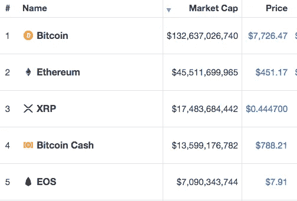
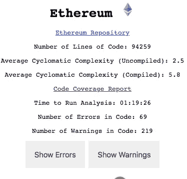
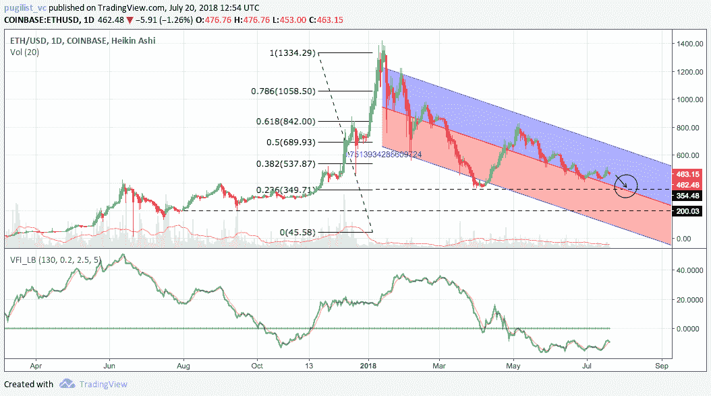
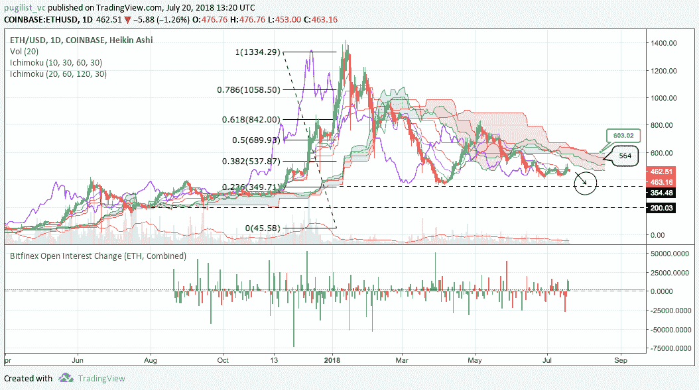
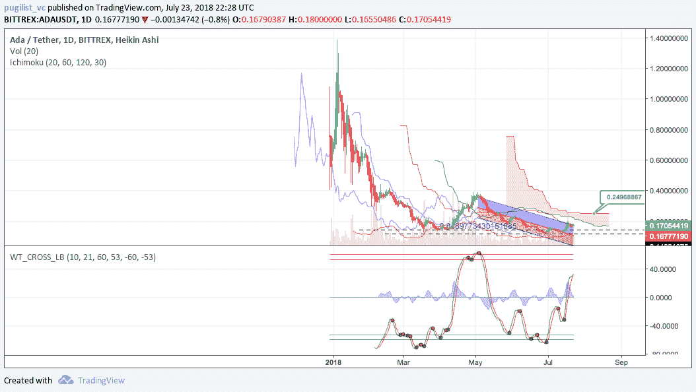
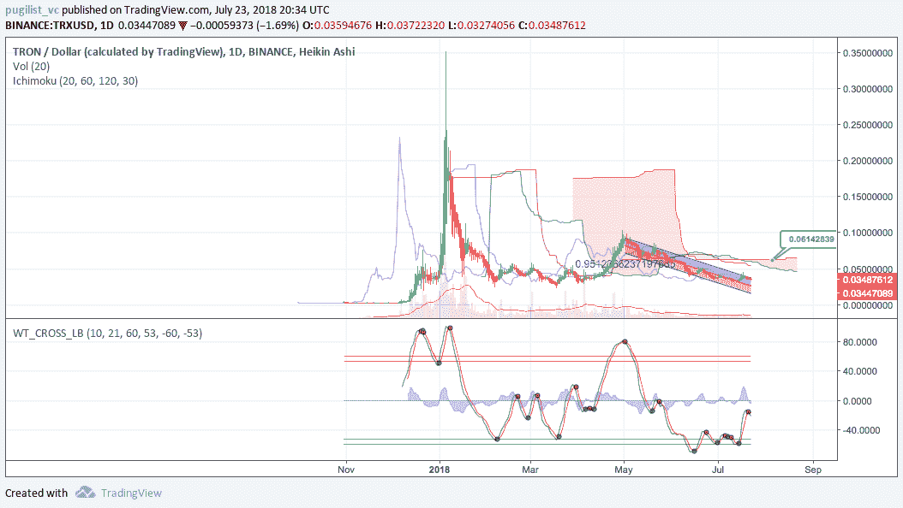
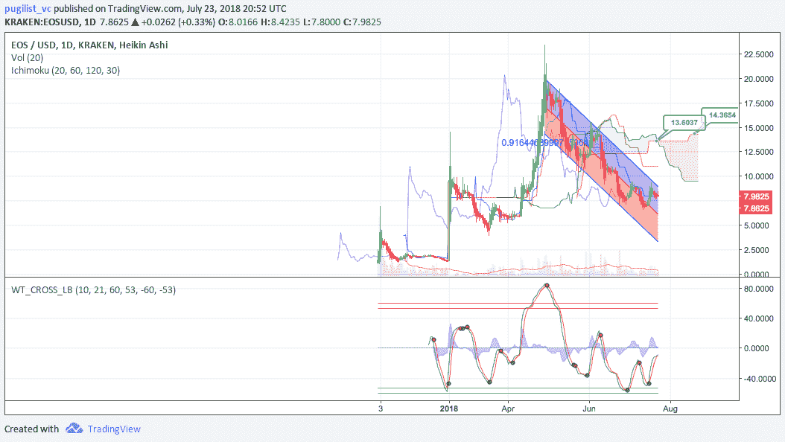
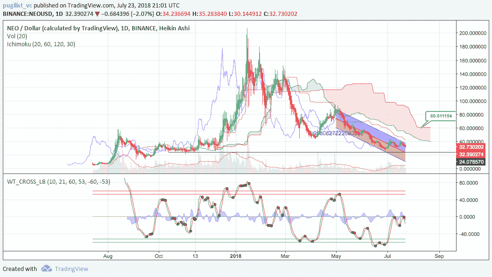
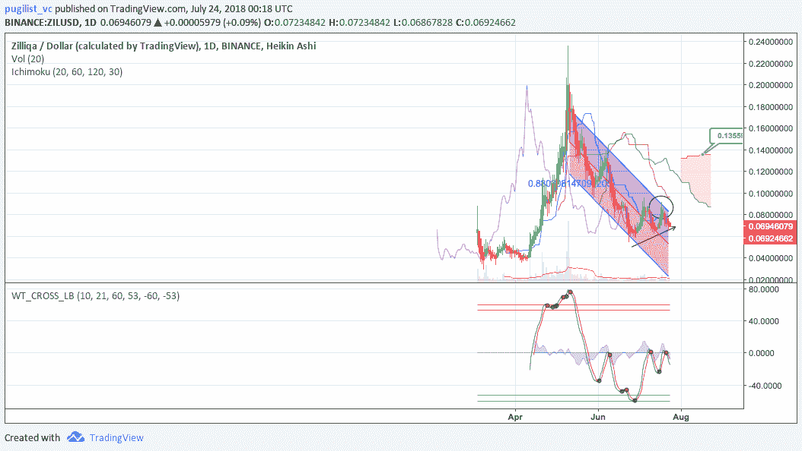
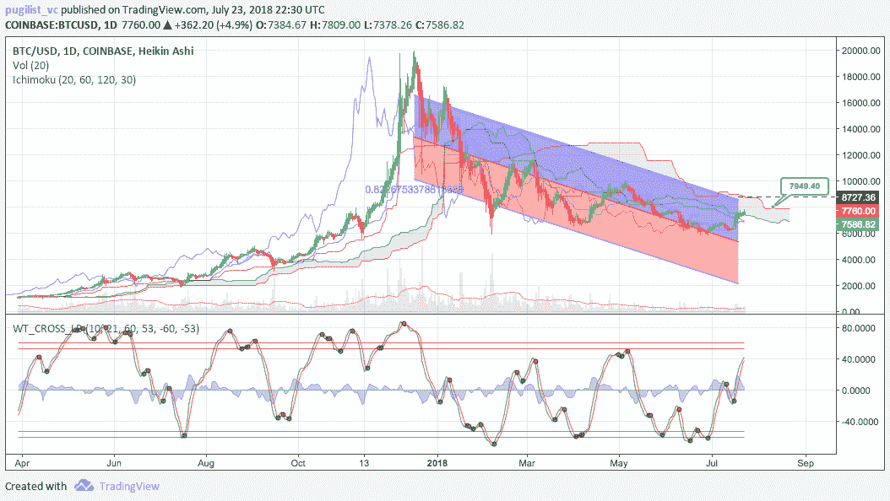

# 以太坊(ETH)深度分析

> 原文：<https://medium.com/hackernoon/ethereums-eth-in-depth-analysis-dcc471a0292c>

# 快速概述

以太坊是最大和最受欢迎的区块链平台之一，它利用图灵完整的脚本语言 Solidity，使开发人员能够编写智能合同和分散应用程序(Dapps)。

Source: coinmarketcap.com

以太网(ETH)是以太坊网络中使用的本地资产，用于向矿工和开发商支付验证区块、执行智能合同和开发 Dapps 所需的计算成本(gas)。

# 技术评估

EVM(以太坊虚拟机)是一个古怪但坚实的技术发展。此外，以太坊的开发者正在用这项技术解决真实的商业用例，例如假人和奥格。此外，Vitalik 和团队似乎是可靠的领导者和高度专注的人。

**但是，有几个问题需要注意:**

1.  **Solidity**—Solidity 编程语言对于智能合约来说并不太好，这对于以太坊来说是一个很大的用例。这个评论有点老了，但还是与[相关](https://news.ycombinator.com/item?id=14691212)。本质上，Solidity 是一个很好的尝试，但社区已经意识到了它的问题。然而，同样的事情发生在 JavaScript 上，看看它有多流行！也就是说，有人试图开发与 EVM 集成的更好的语言，如 [Vyper](http://( https://github.com/ethereum/vyper )) ，但它仍处于测试阶段。
2.  **垃圾邮件攻击** —以太坊容易受到垃圾邮件攻击，以推高天然气价格(EOS 谣言)，甚至只是被流行的应用程序或 ico 堵塞(还记得 CryptoKitties 吗？).有几个项目试图通过分片和链外交易来解决这个问题，例如[雷电网络](http://pugilistvc.com/wp-content/uploads/2018/03/RDN_analysis1447.pdf)和等离子体。不幸的是，这些解决方案很难得到正确的解决，而且很耗时(这些项目已经尝试了一段时间)，因此不能保证成功。

# 代码评估

Source: [Quality Analysis of Cryptocurrency Codebases (QUACC)](http://104.131.70.60/)

**如何读取统计数据:**

1.  **——圈复杂度是组成程序的各个方法/函数复杂程度的一种度量。一个具有*高* *平均圈复杂度*的程序或者一个具有*高最大圈复杂度*的程序将很难测试其质量。 ***注:*** 你不能真的说一个“低圈复杂度”是好的，而是说一个真的高数是坏的。例如，这类似于问“一个人的合适体重是多少？”嗯，也许 100 磅对一个孩子来说是好的，但对于一个 6 英尺 2 英寸高的人来说，这是危险的瘦，但每个人都会同意，如果一个人体重 650 磅，这将是次优的。*通常，低于 10 的值被认为是低风险*。未编译版本是代码本身复杂性的度量，而编译版本是代码转换成可执行文件(机器码)后的度量； ***两个指标都在 10 以下，风险低。*****
2.  ****代码中的错误数量** —这些是自动静态分析已经确定为*相对严重的代码问题，例如可能的空指针取消引用或者打开了一个资源而从未关闭它。 ***注意:*** 代码中的错误数量和警告数量有时都容易出现误报，因此度量可能被夸大。测试时，以太坊的代码中有 69 个错误。***
3.  *****代码中的警告数量** —这些是我们的静态分析确定为*不太严重的代码问题。纵观以太坊的警告，这些警告大多来自于将一个无符号(即，仅非负)整数强制转换为一个有符号整数，多余的代码，或者没有在构造函数中初始化变量。测试时，以太坊的代码中有 219 个警告。****

# ****网络分析****

****目前，以太坊是 Dapp 开发者最大和最有声望的平台之一。尽管存在上述缺点，再加上众多资金雄厚的竞争对手，以太坊仍因其先行者地位而享有强大的网络效应。****

****考虑到开发者在平台间的转换成本很高，但并非不可逾越，先发优势对持续增长越来越重要；尤其是以太坊的“杀手级应用”，即融资。以太坊在融资或 ICO 市场的持续主导地位表明，尽管一些 ICO 被竞争对手(如 EOS 和 NEO)用来筹集大量资金与以太坊竞争，但开发商和公司目前对生态系统充满信心。****

# ****监管分析****

****最近，美国证券交易委员会宣布，比特币和以太不是证券，这意味着它们不像股票或期货那样受证券和交易规则的约束，而是商品。这是积极的，因为它(暂时)摆脱了 SEC 的潜在愤怒，并为以太坊衍生品的创造(额外的需求来源)铺平了道路。****

****然而，该公告并没有推高 ETH 的价格。对这种缺乏价格行动的可能解释是，政府对整个加密货币空间的态度仍然不够明朗。****

# ****社区评论****

# ****Github 仓库****

****Github 上有 161 个存储库，有超过 40 个贡献者，并为开发者支持多种语言和 API。此外，以太坊在降低采用门槛以吸引新用户方面做得很好。例如，除了可靠性之外，他们还提供 Python 和 Javascript 插件，这样不同的语言开发者可以很容易地集成和构建这些技术。****

# ****贡献者****

****从一开始，社区就有了大量分散的参与者，为几个不同的存储库做出了贡献。例如，更新流行存储库的频率可以少于每次更新 10 分钟。另一个例子是 Go-Ethereum，它有 104 个拉请求和 5，986 个分支，但 Solidity 是迄今为止最受欢迎的存储库，有超过 3000 个提交，不断的拉请求和活跃用户。****

# ****矿工和计算节点****

****矿工和以太坊节点的数量表明了平台的持续火爆。通过 ethereumpool.co 大约有 150 名活跃的矿工。另外，下图中的计算节点显示了以太坊网络的全球性质。此外，矿商是利润驱动的行为者，因此持续增长的矿商数量表明，相对于他们的采矿费用，他们对 ETH 未来的价格升值持持续乐观态度。****

********

****Source: Peter Szilagyi, Google Earth, ethernodes.org****

# ****技术分析****

# ****具有长期趋势的均线****

****在 1D 图上，看涨的均线交叉(未显示)或[黄金交叉](https://www.investopedia.com/terms/g/goldencross.asp)尚未出现，这证实了 ETH 的负面 2018 年线性价格趋势(时间和价格之间的皮尔森 R 相关性为 0.75)。在撰写本文时，价格接近平均值，下降趋势滞后。如果现有的线性趋势保持不变，那么短期内可能会继续下跌至关键支撑位和 0.236 斐波纳契回撤位(黑色虚线)约 350 美元。 ***这一关非常关键。*** 如果价格未能守住 350 美元左右，那么继续下跌至 200 美元或以下就成为可能。****

********

****Source: tradingview.com****

****此外，[成交量流动指标](http://www.precisiontradingsystems.com/VOLUME_FLOW.htm) (VFI)一直保持在 0 以下，这可能表明购买量停滞，这支持了价格“蜿蜒”下行的理论。VFI 的解释是，高于 0 是看涨，低于 0 是看跌，价格和振荡指标之间的背离是大概率信号。****

# ****市云****

****Ichimoku Cloud 使用四个指标来确定趋势是否存在；与云相关的当前价格，云的颜色(红色代表看跌，绿色代表看涨)，Tenkan (T)和 Kijun (K)交叉，滞后跨度(Chikou)和寇森跨度(A & B)。****

****1D 图表上当前的云指标状况，无论是单间设置(10/30/60/30)还是双间设置(20/60/120/30)都是看跌的；价格在云之下，云看跌，TK 交叉看跌，滞后跨度在云和价格之下。****

****传统的多头入场会发生在云上方的价格突破，称为 [Kumo 突破](http://ichimokustrategy.com/tag/kumo-breakout/)，价格保持在云上方。从那里开始，交易者可以用天价、基准价或寇森价作为他们的跟踪止损点。****

****使用(10/30/60/30)，价格将需要突破平坦的寇森 B 水平约 564 美元，为库莫突破和新的牛市趋势。使用(20/60/120/30)，价格需要突破平的寇森 B 的水平约 603 美元的库莫突破。如果成功，目标价格将是 617 美元和 700 美元。下跌时要注意的支撑位是 430 美元、380 美元和 350 美元(持有的关键)。****

********

****Source: tradingview.com****

# ****竞争分析****

# ****阿达(卡尔达诺)****

****卡尔达诺是一个应该让 Vitalik 和团队感到担忧的竞争对手，特别是从技术角度来看。Cardano 更关注正确性，可以做正式验证的智能合同，并有一些聪明的头脑在工作。然而，尽管市值相对较高，从开发商的角度来看，似乎仍然没有太多的活动发生。以太坊仍然是开发者使用方面的王者，这意味着这可能成为一个技术上优越的产品得不到市场支持的例子。一个潜在的原因是 Cardano 使用了一种叫做普路托斯的 ML 衍生编程语言，它看起来非常像 Haskell，让人们看这样的语言是很困难的！****

****然而，Cardano 的管理层似乎已经注意到了开发人员的短缺，并采取了积极的措施来解决这个问题。例如，Cardano 的首席执行官最近开展了一项全球营销活动，以推广网络和技术，并吸引开发者和用户。简而言之，从长远来看，Cardano 有可能对以太坊造成相当大的破坏，但它需要在语言友好性和吸引开发者在网络上构建“真正的”应用程序方面取得显著进步。****

****自 5 月初以来，价格持续下降，时间和价格之间的皮尔逊相关系数为 0.85。使用缓慢的市云设置(20/60/120/30)，价格需要突破 0.25 美元才能重新点燃新的积极上升趋势。M *矿石基本面及技术分析 ADA*[此处](https://bravenewcoin.com/news/cardano-price-analysis-the-intellectuals-blockchain/) *。*****

********

****Source: tradingview.com****

# ******TRX(创)******

****Tron 是区块链的一项技术，最初是建立在以太坊上的，但是现在正在向它自己的 mainnet 过渡。Tron 是一种极具争议的数字资产，原因包括其社交型首席执行官，以及据称从其他项目中抄袭大量代码而不注明出处。理论上，TRX 将支持更高的交易速度和更好的可伸缩性。Tron 的目标包括分布式网络上的免费和不受控制的数据存储、ico 以及由它们的分散式基础设施支持的数字资产。如果 TRX 能够兑现他们的部分承诺，他们可能会成为以太坊的合法威胁，但这不是在短期内。****

****自 5 月初以来，价格持续下降，时间和价格之间的皮尔逊相关系数为 0.95。使用缓慢的市云设置(20/60/120/30)，价格需要突破 0.06 美元才能重新点燃新的积极上升趋势。M *矿石基本面及技术分析 TRX*[此处](https://bravenewcoin.com/news/tron-price-analysis-mainet-switch-driving-bullish-sentiment/) *。*****

********

****Source: tradingview.com****

# ******EOS******

****EOS 是最近最热门的区块链项目之一，与 Tronix 相似，因为 EOS 目前正在过渡到自己的 mainnet，并寻求攻击以太坊的缺点。理论上讲，EOS 将提供更好的可扩展性，更快的交易速度，并且是免费的。然而，与以太坊的分散化不同，EOS 将更加集中，只有 21 个验证器节点，这通常是更好的速度和性能的折衷。****

****此外，与要求用户为交易支付“汽油”的以太坊不同，EOS 是免费的，费用由通货膨胀的发行计划支付。这种“免费”服务加上该项目的著名投资者，使 EOS 成为一个现象级公司，其市值飙升至前 5 名，交易量排名前 4 名，仅略高于一张白皮书。EOS 社区似乎对首席开发人员 Dan Larimer 很有信心，他有着可靠的记录，其编程能力得到了广泛的认可。****

****自 5 月初以来，价格持续下降，时间和价格之间的皮尔逊相关系数为 0.91。使用缓慢的市云设置(20/60/120/30)，价格需要突破 13.60 美元到 14.40 美元才能重新点燃积极的上升趋势。****

********

****Source: tradingview.com****

# ******尼奥******

****NEO 被称为中国以太坊，并提出了一种“智能经济”，其中包括数字资产、数字身份和智能合同。NEO 的拜占庭一致性或委托拜占庭容错是 NEO 通过选择代表(簿记员)达成一致并批准新块来验证块创建的协议。理论上，拜占庭一致通过减少相关节点的数量来提供更快的交易速度，这也降低了成本。此外，NEO 的智能合约支持流行的编程语言，这可能会吸引开发人员。****

****自 5 月初以来，价格持续下降，时间和价格之间的皮尔逊相关系数为 0.91。使用缓慢的市云设置(20/60/120/30)，价格需要突破 60 美元才能重新点燃积极的上升趋势。M *矿基本面与技术面分析 NEO* [*此处*](http://pugilistvc.com/wp-content/uploads/2018/06/NEO-Analysis-BNC-Pugilist-Ventures-20180613.pdf) *。*****

********

****Source: tradingview.com****

# ****ZIL(齐利卡)****

****Zilliqa 是一个年轻的区块链项目，最近获得了关注和用户。该令牌基于以太坊的 [ERC-20](https://globalcoinreport.com/ethereums-erc-20-tokens-are-soon-going-to-be-a-big-deal-and-heres-why/) 技术，但它独立于以太坊网络，因为它的建立正是为了解决以太坊的一些缺点，如可扩展性和不断上涨的油价。此外，Zilliqa 智能合约是使用他们专有的编程语言 [Scilla](https://www.forbes.com/sites/quora/2014/07/10/what-do-you-think-about-the-scala-programming-language/#1b5e07132064) 编写的，并且使用了分片技术。鉴于上述改进，Zilliqa 显然已经悄悄地吸引以太坊开发者到它的平台上来。****

****尽管目前处于熊市(黑箭头)，但自 2018 年 6 月底以来，ZIL 的价格一直在缓慢上行。然而，使用时间和价格之间的皮尔森 R 相关系数得出的负的线性价格趋势为 0.88。此外，价格已经从上面的 2 标准差水平(黑色圆圈)反弹，并再次开始下降。使用缓慢的市云设置(20/60/120/30)，价格需要突破 0.135 美元才能重新点燃积极的上升趋势。****

********

****Source: tradingview.com****

# ****BTC(比特币)****

****尽管数字资产和网络解决不同的问题，但鉴于比特币具有先发优势、最高的交易量、价格和市值，它们仍然以微妙的方式竞争。这种市场主导地位，加上在吸引更好的比特币智能合约开发者支持方面正在进行的一些工作，可能会给以太坊带来严重的未来风险，即比特币最大化。与双金属主义最终转向金本位类似，区块链似乎拥有自然垄断，因此我们可能会看到所有非比特币加密货币逐渐消失，或者至少大幅减少。[凯尔·萨马尼](https://medium.com/u/2e8de4ec5cc0?source=post_page-----dcc471a0292c--------------------------------)对区块链系统内网络效应的细微差别进行了深入的观察，这为比特币最大化理论[提供了支持和反驳。](https://hackernoon.com/on-the-network-effects-of-stores-of-value-4286f6c98cdc)****

****自 5 月初以来，价格持续下跌，时间和价格之间的皮尔逊相关系数为 0.82。使用缓慢的市云设置(20/60/120/30)，价格需要突破 7900 美元——8700 美元才能重新点燃积极的上升趋势。****

********

****Source: tradingview.com****

# ****结论****

****目前，ETH 2018 年的看跌趋势仍然存在，因此投资者应该在进入多头头寸之前等待强烈的买入信号。然而，从长远来看，我们仍然相信 ETH 有很大的可能性非常成功，因为该社区是健康和活跃的，拥有“杀手级应用”的领导地位，并且其可扩展性问题正在得到解决。****

****尽管竞争网络的威胁越来越大，但我们确实相信以太坊有几个保护护城河，包括先发优势、强大的社区和不断增长的网络效应。然而，在开源竞争的世界里，以太坊需要不断地在创新上超越竞争对手，同时留住高质量的开发者，以保持市场领先地位。****

****值得注意的一点是，从技术上讲，乙醚应该用于在网络上购买天然气，这意味着它最终可能被视为一种商品，而不是一种货币，因此会根据开发商的需求而波动。如果这种逻辑展开，那么 ETH 的价格可能会在未来持平甚至下降，因为 ETH 的价值储存前提将会减少，这将增加速度。****

## ****特别感谢 William Laboon 和 Szuyu Chu 的贡献！****

*****免责声明:本分析仅用于信息和教育目的。建议读者在做出购买决定之前，对个人资产进行独立研究。*****